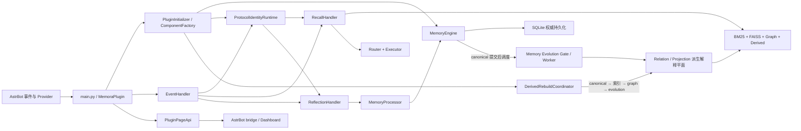

# Memora — AI 协作入口

**最后更新：** 2026-07-23

## 项目定位

Memora 是 AstrBot 的长期记忆插件。`main.py` 注册 `MemoraPlugin`；后端以 Python 3.12、SQLite/FTS5、FAISS、Quart 与 Pydantic 为主，`pages/dashboard/` 是 React 18 + TypeScript + Vite 管理面板。源码、配置模型与可执行测试高于文档；冲突时核对当前实现。

## 架构与入口



- `main.py`：插件注册、hooks、生命周期与工具注册。
- `core/plugin_initializer.py`：Provider 等待、组件构建、失败回滚与关停。
- `core/event_handler.py`：消息捕获、召回、反思与维护任务协调。
- `core/page_api.py`：Page API mixin 组合与 `/astrbot_plugin_memora/page/*` 路由。
- `pages/dashboard/src/main.tsx`、`App.tsx`：前端入口与 Hash 导航。

## 模块导航

| 模块 | 职责 | 上下文 |
|---|---|---|
| `core/` | 后端总览 | [AGENTS.md](./core/AGENTS.md) |
| `core/base/` | 配置、异常、基础约束 | [AGENTS.md](./core/base/AGENTS.md) |
| `core/initializer/` | Provider、数据库与组件构造 | [AGENTS.md](./core/initializer/AGENTS.md) |
| `core/identity/` | 协议稳定身份、名称目录、会话同步与只读召回增强 | [AGENTS.md](./core/identity/AGENTS.md) |
| `core/handlers/` | 召回与反思编排 | [AGENTS.md](./core/handlers/AGENTS.md) |
| `core/injection/` | 注入路由、选择、执行与记录 | [AGENTS.md](./core/injection/AGENTS.md) |
| `core/managers/` | 生命周期与领域管理器 | [AGENTS.md](./core/managers/AGENTS.md) |
| `core/processors/` | 抽取、分类、格式化与话题处理 | [AGENTS.md](./core/processors/AGENTS.md) |
| `core/retrieval/` | 多路检索、融合与重排 | [AGENTS.md](./core/retrieval/AGENTS.md) |
| `core/storage/` | SQLite、FTS、图与决策持久化 | [AGENTS.md](./core/storage/AGENTS.md) |
| `core/api/` | Page API 与响应契约 | [AGENTS.md](./core/api/AGENTS.md) |
| `core/security/` | Prompt 保护与输出护栏 | [AGENTS.md](./core/security/AGENTS.md) |
| `core/review/` | 复核检测、队列与动作历史 | [AGENTS.md](./core/review/AGENTS.md) |
| `core/models/` | 共享领域模型 | [AGENTS.md](./core/models/AGENTS.md) |
| `core/tools/` | AstrBot Agent 工具 | [AGENTS.md](./core/tools/AGENTS.md) |
| `core/commands/` | `/memora` 查询与维护命令 | [AGENTS.md](./core/commands/AGENTS.md) |
| `core/cleaners/` | 历史注入清理 | [AGENTS.md](./core/cleaners/AGENTS.md) |
| `core/extractors/` | 消息内容提取 | [AGENTS.md](./core/extractors/AGENTS.md) |
| `core/dedup/` | 消息去重 | [AGENTS.md](./core/dedup/AGENTS.md) |
| `core/validators/` | 索引/持久化校验与重建 | [AGENTS.md](./core/validators/AGENTS.md) |
| `core/schedulers/` | 衰减与回填调度 | [AGENTS.md](./core/schedulers/AGENTS.md) |
| `core/monitoring/` | 指标、追踪与质量评分 | [AGENTS.md](./core/monitoring/AGENTS.md) |
| `core/diagnostics/` | 诊断事件与健康评分 | [AGENTS.md](./core/diagnostics/AGENTS.md) |
| `core/evaluation/` | 离线检索评测 | [AGENTS.md](./core/evaluation/AGENTS.md) |
| `core/affection/` | 好感度与 Bot 情绪 | [AGENTS.md](./core/affection/AGENTS.md) |
| `core/expression/` | 表达模式学习 | [AGENTS.md](./core/expression/AGENTS.md) |
| `core/jargon/` | 黑话挖掘、存储与查询 | [AGENTS.md](./core/jargon/AGENTS.md) |
| `core/social/` | 社交关系 | [AGENTS.md](./core/social/AGENTS.md) |
| `core/utils/` | 通用工具与降级实现 | [AGENTS.md](./core/utils/AGENTS.md) |
| `pages/dashboard/` | React 管理面板 | [AGENTS.md](./pages/dashboard/AGENTS.md) |
| `tests/` | pytest 测试体系 | [AGENTS.md](./tests/AGENTS.md) |
| `scripts/` | 门禁、smoke 与 benchmark | [AGENTS.md](./scripts/AGENTS.md) |
| `docs/` | 开发、设计与计划维护边界 | [AGENTS.md](./docs/AGENTS.md) |

## 跨模块契约

- 写入链：AstrBot 消息 → `EventHandler` → `ConversationManager`/`MemoryProcessor` → `MemoryEngine` → SQLite。FTS、FAISS 与图索引是可重建派生数据。
- 身份链：协议事件 → 固定适配器 `ProtocolIdentityResolver` → `ResolvedIdentity` → 身份目录/会话名称同步 → 召回与反思。OneBot 11 只把规范化 QQ 号作为 canonical user ID；名称是可更新辅助数据，匿名、冲突和非法事件不得写用户目录。
- 稳定身份 metadata 由可信来源消息确定并锚定长期记忆参与者；legacy 别名只在原会话作用域且唯一匹配时附着到召回候选副本，不改 canonical memory、分数、排序、ID、revision 或 System Prompt。
- 演化链：canonical memory 成功写入后 → `MemoryEvolutionGate` → job queue/worker → relation/projection 派生解释平面。canonical SQLite 记录及其整数 ID 始终是唯一权威身份；Projection 只能作为有 source/revision 证据的读时注解，不能形成第二套 canonical memory 或 `doc_id`。
- 派生重建链：`DerivedRebuildCoordinator` 只读确认 canonical 后按 canonical → FTS5/FAISS → graph → relation/projection 顺序执行；阶段失败只报告降级，不删除 canonical，Evolution worker 在启动期重建完成或安全降级后再启动。
- `MemoryEngine` 在 canonical add/语义 metadata update 提交后统一重载 source 并调度演化；`ReflectionHandler` 的历史调度入口仍保留用于反思链兼容，依靠稳定 idempotency key 去重，不改变 canonical 提交边界。
- 召回链：请求 → 改写/隔离过滤 → direct/graph 合并 → relation expansion → projection attachment → reranker → privacy filter → `InjectionStrategyRouter` → `InjectionExecutor`。动态记忆不得进入 System Prompt；请求变更须先完整构建再原子应用。
- `memory_evolution.enabled=false` 强制等价于 `disabled`；`disabled` 不启动 worker。当前实现中 `shadow`、`readonly`、`active` 都会启动 worker 并可持久化派生对象，但只有 `readonly`/`active` 装配 relation/projection 读取器；不要从 mode 名称推断 canonical 写权限。任何模式都不得绕过 source revision、scope、privacy、validity 与 role 校验。
- 注入观测只持久化 allowlist 标量；不得记录 query、prompt、记忆正文或 ID 列表、原始身份、Provider 密钥/请求头/API 地址或堆栈。
- 模型可见的 Projection metadata 只允许 `type`、`summary`、`confidence`；source mapping、revision、scope、privacy、role、内部 ID 与 job 信息不得进入 prompt、fake tool call 或 DeepSeek V4 转录。
- 模型可见身份说明只允许当前名称、单个历史名称和适配器确定的稳定标签；身份表内部 ID、候选列表、查询过程、时间戳和歧义过程不得进入 prompt、日志、指标或 trace。
- `PluginPageApi` 与 `src/lib/bridge.ts` 是后端/前端边界。写回保留 revision、字段校验、冲突处理和显式错误 envelope；不得伪造客户端分页。
- 配置叶变更同步 `_conf_schema.json`、Pydantic 模型、运行时读取、Dashboard 类型/默认值与契约测试。

## 实施约束

- 先阅读目标目录 `AGENTS.md`；复用既有路径，不创建兼容双轨或重复抽象。
- 新行为与 bug 修复遵循 RED → GREEN → REFACTOR；不顺手修改无关代码或用户本地改动。
- `asyncio.CancelledError` 必须传播；普通可恢复失败不得破坏聊天主链路。
- SQL 值参数绑定；动态标识符只允许固定 allowlist。
- Dashboard 复用 Base UI-backed shadcn、`PageFrame`、语义 token、Lucide 与三语言 key；桌面/移动端均需可访问、可滚动、无重叠和页面级横向溢出。

## 文件长度与拆分规范

- 新增或本轮负责修改的源码、测试文件以 **800 行为硬上限**，新增文件建议控制在 600 行以内；Markdown 设计/计划文件以 400 行为上限。行数按物理行统计，不能通过把一条语句或文档段落压成超长行规避。
- 已有超过 800 行的历史文件视为遗留债务：本轮不得继续堆加同一职责；需要新增行为时拆到职责明确的新模块、mixin 或辅助文件，并保持原导入路径和公开契约兼容。除非用户明确要求，不进行无关的大规模重构。
- 拆分按单一职责、生命周期边界或存储/编排边界进行；禁止复制两套实现、循环导入和用仅转发的空壳文件规避上限。公共类型与稳定导出应留在原模块，内部实现通过明确的依赖方向组合。
- 完成实现前必须检查本轮新增/修改文件行数；超过上限先拆分再提交。验证至少包含 `git diff --check`、受影响模块测试和相对 Markdown 链接检查。

## 语言规范

- 生产代码中的注释、docstring、日志消息和可观测性 reason 文本统一使用中文。
- 测试、脚本和文档中的解释性注释也使用中文；Python/SQLite/API 的固定标识符、枚举值、协议字段和第三方原始错误信息可保留英文。
- 新增或修改代码时，先把已有英文注释、docstring 和日志改为中文，再继续扩展行为；不要只为新增代码遵守而留下同一文件中可避免的英文解释文本。

## 代码注释与函数说明

- 每个函数和方法都必须编写符合对应语言惯例的函数说明（例如 Python docstring、TypeScript TSDoc），准确描述用途、参数、返回值；存在异常、重要副作用、前置条件或边界条件时也必须明确说明。
- 复杂函数必须提供详细注释，说明关键算法、非显然分支、状态变化、约束条件及设计原因；注释应解释“为什么”和关键控制流程，不得仅逐行复述代码。
- 函数说明和复杂逻辑注释必须随实现同步更新，禁止保留与当前行为不一致、含糊或过期的说明。

## 管理命令

以下命令由 `core/command_endpoints.py` 注册；修改命令名或行为时，必须同步 README、CHANGELOG、测试与本页：

`/memora status`、`/memora health`、`/memora diagnostics`、`/memora search <query>`、`/memora trace <query> [k]`、`/memora forget <id>`、`/memora rebuild-index`、`/memora rebuild-graph`、`/memora webui`、`/memora summarize`、`/memora reset`、`/memora cleanup`、`/memora help`。

## 验证入口

按范围选择最窄命令；完整门禁由 `scripts/check_all.py` 编排，schema validator 仅在对应脚本存在时执行：

```powershell
python -m pytest tests -q
python scripts/run_smoke.py -q
python scripts/check_all.py
python scripts/benchmark_recall_cost.py --all
python scripts/benchmark_injection_decisions.py

Set-Location pages/dashboard
npm test
npm run build
npm run check:artifacts
npm run smoke:runtime
npm run smoke:browser
```

浏览器 smoke 后必须人工检查截图；日志不能替代视觉确认。

## 代码探索与降级

需要理解代码上下文或进行自然语言定位时，优先使用
`mcp__fast-context__fast_context_search`。如果服务不可用或返回资源错误，使用
`rg`、PowerShell `Select-String` 和定向文件读取降级，并记录失败原因；不要把
`node_modules/`、`dist/`、`build/`、运行时数据或工作树当作架构事实来源。

## 扫描边界

跳过 `node_modules/`、`dist/`、`build/`、覆盖率输出、缓存、二进制、运行时数据、工作树和 Dashboard 生成物；这些路径不是架构事实来源。
