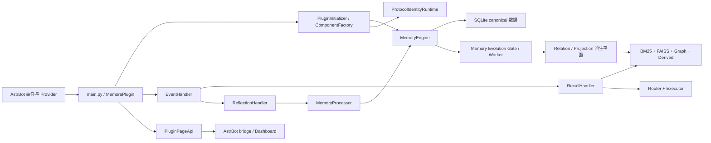

# Memora AI 协作入口

**最后更新：** 2026-09-09
**适用范围：** 全仓库；进入子目录后必须继续阅读最近的 `AGENTS.md`。

## 规则优先级与事实来源

1. 安全、隐私、数据权威与宿主平台约束优先于其他协作规则。
2. 根级 `AGENTS.md` 提供全局基线；最近目录的 `AGENTS.md` 可增加或收紧要求，但不得放宽本页的安全、质量和验证要求。
3. 对运行时行为，生产代码、Schema/迁移、可执行测试和构建脚本是事实来源。文档与实现冲突时先核对事实，不得用改文档掩盖缺陷。
4. 任务说明只限定本次范围，不能推翻已发布的公开契约。需求、实现或验收标准不明确时先查询代码、调用方和测试；仍有关键歧义时再向人确认。

## 协作底线

以下规则是所有任务的最高优先级：

1. 以暗猜接口为耻，以认真查阅为荣。
2. 以模糊执行为耻，以寻求确认为荣。
3. 以盲想业务为耻，以人类确认为荣。
4. 以创造接口为耻，以复用现有为荣。
5. 以跳过验证为耻，以主动测试为荣。
6. 以破坏架构为耻，以遵循规范为荣。
7. 以假装理解为耻，以诚实无知为荣。
8. 以盲目修改为耻，以谨慎重构为荣。

## 项目与入口

Memora 是 AstrBot 的长期记忆插件。后端使用 Python 3.12、SQLite/FTS5、FAISS、Quart 和 Pydantic；`pages/dashboard/` 是 React 18、TypeScript 和 Vite 管理面板。



| 入口 | 职责 |
|---|---|
| `main.py` | 插件注册、生命周期、hooks 与工具注册 |
| `core/platform/composition/plugin_initializer.py` | Provider 等待、组件构建、失败回滚与关停 |
| `core/event_handler.py` | 消息捕获、召回、反思与维护任务协调 |
| `core/platform/transport/page_api/page_api.py` | Page API 聚合与 `/astrbot_plugin_memora/page/*` 路由 |
| `core/platform/transport/commands/command_endpoints.py` | `/memora` 命令端点注册 |
| `pages/dashboard/src/main.tsx`、`App.tsx` | Dashboard 入口、全局壳与 Hash 导航 |

## 模块导航

先阅读目标模块的上下文；根文件只定义跨模块约束，不复制模块内部实现细节。

| 模块 | 详细上下文 |
|---|---|
| Python 运行时与装配 | [`core/AGENTS.md`](./core/AGENTS.md)、[`core/platform/AGENTS.md`](./core/platform/AGENTS.md) |
| 记忆、会话、反思与演化 | [`core/features/memory/AGENTS.md`](./core/features/memory/AGENTS.md)、[`core/features/conversation/AGENTS.md`](./core/features/conversation/AGENTS.md)、[`core/features/reflection/AGENTS.md`](./core/features/reflection/AGENTS.md)、[`core/features/evolution/AGENTS.md`](./core/features/evolution/AGENTS.md) |
| 检索、召回、注入与质量 | [`core/features/retrieval/AGENTS.md`](./core/features/retrieval/AGENTS.md)、[`core/features/recall/AGENTS.md`](./core/features/recall/AGENTS.md)、[`core/features/injection/AGENTS.md`](./core/features/injection/AGENTS.md)、[`core/features/quality/AGENTS.md`](./core/features/quality/AGENTS.md) |
| 身份、配置、安全与共享契约 | [`core/features/identity/AGENTS.md`](./core/features/identity/AGENTS.md)、[`core/platform/config/AGENTS.md`](./core/platform/config/AGENTS.md)、[`core/platform/security/AGENTS.md`](./core/platform/security/AGENTS.md)、[`core/shared/AGENTS.md`](./core/shared/AGENTS.md) |
| Dashboard | [`pages/dashboard/AGENTS.md`](./pages/dashboard/AGENTS.md) |
| 测试、脚本与文档 | [`tests/AGENTS.md`](./tests/AGENTS.md)、[`scripts/AGENTS.md`](./scripts/AGENTS.md)、[`docs/AGENTS.md`](./docs/AGENTS.md)、[`website/AGENTS.md`](./website/AGENTS.md) |

## 不可破坏的跨模块契约

- **权威数据：** SQLite canonical memory 及其整数 ID 是唯一权威身份。FTS、FAISS、图、relation 和 projection 都是带 source/revision 证据、可失效且可重建的派生数据，不能形成第二套 canonical memory 或 `doc_id`。
- **写入与演化：** `EventHandler` 经 `ConversationManager`/`MemoryProcessor`、质量门和 `MemoryEngine` 写 canonical。只有 canonical 成功提交并重读 source 后才能调度演化；派生失败只能降级报告，不能回滚或删除 canonical。
- **重建顺序：** `DerivedRebuildCoordinator` 必须按 canonical → FTS5/FAISS → graph → relation/projection 工作。启动期重建成功或安全降级后，才启动 Evolution worker。
- **质量门：** profile 按绑定顺序首个精确匹配解析，未命中使用 `default_profile`；处置优先级是规则 `force_disposition`、原因码 override、profile 默认。`discard` 不落库，`quarantine` 经人工批准重取证，`mark_write` 默认不进入召回、注入和演化。
- **身份：** 协议事件必须先经固定 `ProtocolIdentityResolver` 解析为 `ResolvedIdentity`。OneBot 11 使用规范化 QQ 号；QQ 官方使用带平台实例边界的 OpenID，`union_openid` 不参与主键。名称是可更新辅助数据，匿名、冲突和非法事件不得写目录。
- **召回与模型可见内容：** 固定顺序为请求过滤 → direct/graph 合并 → relation expansion → projection attachment → reranker → privacy filter → 注入。动态记忆不得进入 System Prompt；Projection 只允许向模型暴露 `type`、`summary`、`confidence`。
- **安全与隐私：** query、prompt、记忆正文、ID 列表、原始身份、source mapping、revision、scope、privacy、role、Provider 密钥、请求头、内部地址和堆栈不得进入模型输入、观测、日志、trace 或示例，除非局部规范明确了受控人工复核权限。
- **生命周期与异步：** 初始化器单点发布共享运行时实例；请求路径不得新建数据库、索引或模型。`asyncio.CancelledError` 必须传播；所有后台任务必须可观察、可收束，普通可恢复失败不得中断聊天主链路。
- **页面边界：** `PluginPageApi` 与 `pages/dashboard/src/lib/bridge.ts` 是稳定边界。写回必须保留 revision、字段校验、冲突处理和显式错误 envelope；不得伪造客户端分页或静默 last-write-wins。
- **配置联动：** 配置叶变更同步 `_conf_schema.json`、Pydantic 模型、运行时读取、Dashboard 类型/默认值、i18n 与契约测试。请求级状态先完整构造，再原子替换。

## 工程质量基线

本节借鉴 Google、Microsoft 和 Airbnb 的可读性、单一职责、显式契约、小批量评审和自动化验证实践；以仓库已配置的工具和最近模块规范为准。

### 设计与实现

- 先定位现有公开接口、调用方、数据所有者和测试，再修改。优先复用已有类型、服务和边界；不要创建兼容双轨、镜像状态或只转发的空壳抽象。
- 每个模块、类和函数只承担一个可清楚命名的职责。按生命周期、存储、编排或领域边界拆分，保持单向依赖，避免循环导入；稳定导出和公共类型留在其既有所有者处。
- 新行为与缺陷修复遵循 RED → GREEN → REFACTOR。重构不得顺带改变行为；行为、API、Schema 或持久化变化必须提供可观察测试。
- 边界处验证不可信输入。SQL 值使用参数绑定，动态标识符只允许固定 allowlist；不要吞掉异常、返回伪成功或以宽泛 fallback 掩盖失败。
- Python 使用明确类型、`pathlib`、结构化数据和标准库能力；TypeScript 不使用 `any` 绕过类型系统。格式、导入和静态检查交给项目工具，不手工制造等价规则。
- Python 代码遵循 [PEP 8](https://peps.python.org/pep-0008/) 的可读性原则：使用 4 个空格缩进、清晰命名并保持合理行宽；项目及模块既有约定优先，不为机械风格一致性破坏兼容性。
- 新增或修改的生产注释、docstring、日志和 reason 文本使用中文；协议字段、枚举值、第三方原始错误和固定 API 标识符可保留英文。为公开接口、复杂算法、关键副作用、异常边界和非显然决策写说明，不为显而易见的私有实现复制代码含义。
- Dashboard 复用 Base UI-backed shadcn、`PageFrame`、语义 token、Lucide 和三语言 key。桌面与移动端必须可访问、可滚动、无重叠及页面级横向溢出；详情、冲突、加载、空态和失败态都是完整功能的一部分。

### 可审查的代码规模

行数按物理行统计，空行和注释也计入；不得用超长行、压缩表达式、复制代码或无意义转发规避限制。下列为代码评审基线，局部模块可更严格。

| 对象 | 默认目标 | 必须评估拆分 | 硬上限 |
|---|---:|---:|---:|
| 生产源码、React 页面/组件、hook | 400 行 | 超过 600 行 | 700 行 |
| 测试、fixture、开发脚本 | 500 行 | 超过 700 行 | 800 行 |
| 单个生产函数/方法 | 40 行 | 超过 80 行 | 120 行 |
| 单个测试函数 | 60 行 | 超过 100 行 | 150 行 |

- 超过“必须评估拆分”阈值时，在评审说明中写明职责边界、未拆分原因和后续拆分点。超过硬上限前必须拆分；例外仅限生成代码、第三方镜像、不可切分的协议表或测试数据，并应在文件顶部说明来源、生成方式和豁免原因。
- 既有超限文件是技术债：不得继续增加同一职责。修复时将新增行为放入职责明确的协作对象、模块或测试文件，并保持公开导入路径和行为兼容；未经明确要求不进行无关的大规模迁移。
- 正常函数圈复杂度不超过 10；11 至 15 必须用 guard clause、数据驱动表或提取分支降低复杂度；超过 15 仅允许有限状态机、解析器或安全策略等必要场景，并要求分支覆盖、设计理由和评审确认。嵌套通常不超过 3 层，优先提前返回和提取意图明确的辅助函数。
- 单次变更应聚焦一个可独立验证的目的。逻辑改动建议不超过 400 行，超过 800 行或同时跨三个以上所有权边界时，应先拆成可独立回滚、可独立测试的变更，或记录无法拆分的原因与风险。

### 文档规模与信息架构

文档的目标是让读者能快速定位权威事实，而不是复制源码、测试或其他文档。一个事实只保留一个详细说明，其余位置使用相对链接和必要摘要。

| 文档类型 | 默认目标 | 拆分评审线 | 硬上限 |
|---|---:|---:|---:|
| `AGENTS.md` 与模块导航 | 180 行 | 250 行 | 300 行 |
| README、开发指南、接口说明 | 350 行 | 500 行 | 600 行 |
| 设计文档 | 400 行 | 500 行 | 600 行 |
| 计划、决策记录与验收记录 | 300 行 | 400 行 | 500 行 |

- `AGENTS.md` 只保留职责、边界、不变量、关键入口、联动和精确验证；类、字段、SQL、长命令清单和实现过程下沉到最近模块或正式文档。根级文件只保留跨模块不变量。
- 超过拆分评审线时按读者、生命周期或主题拆成独立文档并建立双向链接。超过硬上限必须拆分，不得通过巨型表格、长段落、折叠区或复制内容规避。
- `CHANGELOG.md`、受工具生成的 API 参考、许可证和数据集说明可不受行数硬上限约束，但仍须避免重复和手工编辑生成内容。局部 `AGENTS.md` 的更严格文档上限仍然生效。
- 文档中的命令必须标明工作目录、前置条件、重要副作用和成功判定。计划必须区分现状、目标、非目标与验证证据；未实现内容必须明确标注为提案。

## 验证与交付

按影响面选择最窄、最有证明力的检查，再逐级扩大。不得把未执行的门禁描述为通过。

### 测试与验证

- 不要为可逆、影响小且只是复述现有实现的改动新增测试。
- 运行与本次改动相称的测试，并完成必要检查。通过后，只有发生新的改动、出现新的失败或仍有未解决疑点时，才扩大或重复测试；否则继续完成任务。
- 收尾时删除本次产生且后续不再使用的临时文件。

1. 每次修改源码后，对本轮文件运行已安装语言服务的 error 级诊断；服务不可用时记录原因，并执行等效的类型检查、lint 或构建。Python 导入诊断先在锁定 uv 环境复现，不能以关闭规则或宽泛路径配置掩盖环境问题。
2. Python 环境以 `pyproject.toml`、`.python-version` 和 `uv.lock` 为准。新增直接运行时依赖时同步 `requirements.txt` 与锁文件；不要只修改本地 `.venv`。
3. 本轮 Python 文件依次执行 `uv run --locked ruff check --fix`、`uv run --locked ruff format`、`uv run --locked ruff check`，审阅自动修复差异；不要运行会改写无关文件的全仓自动修复。
4. 为本轮全部受影响文件运行 `uv run --locked pre-commit run --files <files>`。禁止使用 `--no-verify`、`SKIP`、批量 `# noqa`、宽泛 ignore/exclude 或删除规则绕过质量门。
5. 运行对应单元、契约或集成测试。Python 命令使用 `uv run --locked python -m pytest ...`；Dashboard 改动至少运行相关 Vitest 与 `npm run build`，涉及交互、布局或可视化时继续运行对应 smoke 并人工检查截图。
6. 文档变更至少运行 `git diff --check`，统计本轮 Markdown 物理行数，并逐一验证新增或修改的相对链接。仅文档变更不要求运行后端、Dashboard 或全仓门禁，除非文档同步了可执行契约。

常用完整门禁仅在影响跨域契约或准备合并时执行：

```bash
uv run --locked python -m pytest tests -q
uv run --locked python scripts/run_smoke.py -q
uv run --locked python scripts/check_all.py

cd pages/dashboard
npm test
npm run build
npm run check:artifacts
npm run smoke:runtime
npm run smoke:browser
```

## 代码探索与扫描边界

- 扫描和架构判断跳过 `node_modules/`、`dist/`、`build/`、覆盖率输出、缓存、二进制、运行时数据、临时工作树和 Dashboard 生成物。这些路径不是实现或架构事实来源。
- 修改管理命令、公开 API、配置叶、存储/隐私边界、质量门或构建入口时，同步最近模块上下文、面向用户文档、调用方和契约测试；只在根级不变量或导航实际变化时更新本页。
