# Memora -- AstrBot 长期记忆插件

## 项目愿景

Memora 为 AstrBot 聊天机器人框架提供完整的长期记忆能力，实现从消息捕获、内容抽取、向量化存储到 BM25+向量双路混合检索、记忆衰减与遗忘调度、图记忆、知识库、笔记系统、用户画像等全生命周期管理。以 MemoryAtom（记忆原子）为核心数据单元，让 Bot 真正"记住"每一次对话。

## 架构总览

```
AstrBot 框架 --> main.py (MemoraPlugin / Star)
                    |
                    +--> PluginInitializer (初始化编排)
                    |       |
                    |       +--> ProviderLoader/ProviderWaiter (LLM + Embedding)
                    |       +--> DatabaseSetup (SQLite + FAISS + Graph DB)
                    |       +--> ComponentFactory --> MemoryEngine, MemoryProcessor, ... 
                    |
                    +--> EventHandler (消息事件协调)
                    |       |
                    |       +--> ConversationManager (会话生命周期)
                    |       +--> MemoryProcessor (记忆抽取、存储)
                    |       +--> RecallHandler (双路混合检索 + 注入)
                    |       +--> ReflectionHandler (反思与主动学习)
                    |
                    +--> CommandHandler (命令处理)
                    |       +--> MaintenanceCommands (维护操作)
                    |       +--> QueryCommands (查询操作)
                    |
                    +--> CommandEndpointsMixin (/memora 命令注册)
                    |
                    +--> PageApi (REST API, 24+ mixin)
                    |       +--> memory_read/write/batch/stats_recall
                    |       +--> graph/jargon/knowledge/note/profile/affection/...
                    |
                    +--> FeatureDelegation (伴侣插件检测与委托)
                    |
                    +--> core/security/ (Prompt 防护 + 输出护栏)
                    |
                    +--> core/tools/ (15+ Agent 工具: 记忆搜索/写入/笔记/...)
```

## 模块结构图

```mermaid
graph TD
    A["(根) Memora 项目"] --> B["main.py"];
    A --> C["core/"];
    A --> D["pages/dashboard"];
    A --> E["tests/"];
    A --> F["scripts/"];
    A --> AH["docs/ (项目文档)"];
    C --> G["base/ (配置/异常/常量)"];
    C --> H["managers/ (核心管理器 40 文件)"];
    C --> I["processors/ (处理器 21 文件)"];
    C --> J["retrieval/ (检索系统 25 文件)"];
    C --> K["storage/ (持久化 16 文件)"];
    C --> L["api/ (REST API 24 mixin)"];
    C --> M["security/ (安全防护)"];
    C --> N["tools/ (Agent 工具 15+ 实现)"];
    C --> P["models/ (数据模型 9 文件)"];
    C --> Q["schedulers/ (衰减/回填调度)"];
    C --> R["diagnostics/ (诊断与健康评分)"];
    C --> S["evaluation/ (检索质量评测)"];
    C --> T["affection/ (好感度系统)"];
    C --> U["expression/ (表达模式学习)"];
    C --> V["jargon/ (黑话挖掘)"];
    C --> W["social/ (社交关系)"];
    C --> X["initializer/ (初始化编排)"];
    C --> Y["handlers/ (事件处理)"];
    C --> Z["utils/ (工具函数 13 模块)"];
    C --> AA["monitoring/ (可观测性)"];
    C --> AB["validators/ (索引校验重建)"];
    C --> AC["extractors/ (消息抽取)"];
    C --> AD["cleaners/ (注入清洗)"];
    C --> AE["dedup/ (去重管理)"];
    C --> AF["commands/ (命令处理 Mixin)"];

    click A "./CLAUDE.md" "根文档"
    click C "./core/CLAUDE.md" "core 模块文档"
    click D "./pages/dashboard/CLAUDE.md" "dashboard 模块文档"
    click E "./tests/CLAUDE.md" "tests 模块文档"
    click F "./scripts/CLAUDE.md" "scripts 模块文档"
    click G "./core/base/CLAUDE.md" "base 模块文档"
    click H "./core/managers/CLAUDE.md" "managers 模块文档"
    click I "./core/processors/CLAUDE.md" "processors 模块文档"
    click J "./core/retrieval/CLAUDE.md" "retrieval 模块文档"
    click K "./core/storage/CLAUDE.md" "storage 模块文档"
    click L "./core/api/CLAUDE.md" "api 模块文档"
    click M "./core/security/CLAUDE.md" "security 模块文档"
    click N "./core/tools/CLAUDE.md" "tools 模块文档"
    click P "./core/models/CLAUDE.md" "models 模块文档"
    click Q "./core/schedulers/CLAUDE.md" "schedulers 模块文档"
    click R "./core/diagnostics/CLAUDE.md" "diagnostics 模块文档"
    click S "./core/evaluation/CLAUDE.md" "evaluation 模块文档"
    click T "./core/affection/CLAUDE.md" "affection 模块文档"
    click U "./core/expression/CLAUDE.md" "expression 模块文档"
    click V "./core/jargon/CLAUDE.md" "jargon 模块文档"
    click W "./core/social/CLAUDE.md" "social 模块文档"
    click X "./core/initializer/CLAUDE.md" "initializer 模块文档"
    click Y "./core/handlers/CLAUDE.md" "handlers 模块文档"
    click Z "./core/utils/CLAUDE.md" "utils 模块文档"
    click AA "./core/monitoring/CLAUDE.md" "monitoring 模块文档"
    click AB "./core/validators/CLAUDE.md" "validators 模块文档"
    click AC "./core/extractors/CLAUDE.md" "extractors 模块文档"
    click AD "./core/cleaners/CLAUDE.md" "cleaners 模块文档"
    click AE "./core/dedup/CLAUDE.md" "dedup 模块文档"
    click AF "./core/commands/CLAUDE.md" "commands 模块文档"
    click AH "./docs/CLAUDE.md" "docs 模块文档"
```



## 模块索引

| 模块路径 | 职责 | 语言 | 入口文件 | 测试目录 | CLAUDE.md |
|---------|------|------|---------|---------|-----------|
| `main.py` | 插件注册入口 | Python | `main.py` | -- | -- |
| `core/` | 核心业务引擎 | Python | `core/__init__.py` | `tests/` | `core/CLAUDE.md` |
| `core/base/` | 配置管理、异常层次、常量 | Python | `core/base/__init__.py` | `tests/test_base.py` | [`core/base/CLAUDE.md`](./core/base/CLAUDE.md) |
| `core/managers/` | 核心管理器(40 文件) | Python | `core/managers/__init__.py` | `tests/test_managers_*.py` | [`core/managers/CLAUDE.md`](./core/managers/CLAUDE.md) |
| `core/processors/` | 对话处理、抽取、格式化(21 文件) | Python | `core/processors/__init__.py` | `tests/test_*.py` | [`core/processors/CLAUDE.md`](./core/processors/CLAUDE.md) |
| `core/retrieval/` | 检索、重排序、融合(25 文件) | Python | `core/retrieval/__init__.py` | `tests/test_*_retriever*.py` | [`core/retrieval/CLAUDE.md`](./core/retrieval/CLAUDE.md) |
| `core/storage/` | SQLite/FAISS 持久化(16 文件) | Python | `core/storage/__init__.py` | `tests/test_*_store.py` | [`core/storage/CLAUDE.md`](./core/storage/CLAUDE.md) |
| `core/api/` | REST API 24 mixin | Python | `core/api/__init__.py` | `tests/test_api_*.py` | [`core/api/CLAUDE.md`](./core/api/CLAUDE.md) |
| `core/commands/` | 命令 handler Mixin | Python | `core/commands/__init__.py` | `tests/test_commands.py` | [`core/commands/CLAUDE.md`](./core/commands/CLAUDE.md) |
| `core/security/` | Prompt 保护 + 输出护栏 | Python | `core/security/__init__.py` | `tests/test_guardrails.py` | [`core/security/CLAUDE.md`](./core/security/CLAUDE.md) |
| `core/tools/` | Agent LLM 工具(15+) | Python | `core/tools/__init__.py` | -- | [`core/tools/CLAUDE.md`](./core/tools/CLAUDE.md) |
| `core/models/` | 数据模型定义(9 文件) | Python | `core/models/__init__.py` | -- | [`core/models/CLAUDE.md`](./core/models/CLAUDE.md) |
| `core/schedulers/` | 衰减/回填调度器(3 文件) | Python | `core/schedulers/__init__.py` | -- | [`core/schedulers/CLAUDE.md`](./core/schedulers/CLAUDE.md) |
| `core/diagnostics/` | 诊断与健康评分(3 文件) | Python | `core/diagnostics/__init__.py` | -- | [`core/diagnostics/CLAUDE.md`](./core/diagnostics/CLAUDE.md) |
| `core/evaluation/` | 检索质量评测(4 文件) | Python | `core/evaluation/__init__.py` | `tests/evaluation/` | [`core/evaluation/CLAUDE.md`](./core/evaluation/CLAUDE.md) |
| `core/initializer/` | 初始化编排(5 文件) | Python | `core/initializer/__init__.py` | -- | [`core/initializer/CLAUDE.md`](./core/initializer/CLAUDE.md) |
| `core/affection/` | 好感度系统 | Python | `core/affection/__init__.py` | `tests/test_affection_manager.py` | [`core/affection/CLAUDE.md`](./core/affection/CLAUDE.md) |
| `core/expression/` | 表达模式学习 | Python | `core/expression/__init__.py` | `tests/test_expression_*.py` | [`core/expression/CLAUDE.md`](./core/expression/CLAUDE.md) |
| `core/jargon/` | 黑话/圈内用语挖掘 | Python | `core/jargon/__init__.py` | `tests/test_jargon_*.py` | [`core/jargon/CLAUDE.md`](./core/jargon/CLAUDE.md) |
| `core/social/` | 社交关系追踪 | Python | `core/social/__init__.py` | `tests/test_api_social.py` | [`core/social/CLAUDE.md`](./core/social/CLAUDE.md) |
| `core/monitoring/` | 可观测性(指标/追踪/质量评分) | Python | `core/monitoring/__init__.py` | -- | [`core/monitoring/CLAUDE.md`](./core/monitoring/CLAUDE.md) |
| `core/validators/` | 索引校验与重建(7 文件) | Python | `core/validators/__init__.py` | -- | [`core/validators/CLAUDE.md`](./core/validators/CLAUDE.md) |
| `core/utils/` | 工具函数(12 文件) | Python | `core/utils/__init__.py` | -- | [`core/utils/CLAUDE.md`](./core/utils/CLAUDE.md) |
| `core/extractors/` | 消息内容抽取 | Python | `core/extractors/__init__.py` | `tests/test_extractors.py` | [`core/extractors/CLAUDE.md`](./core/extractors/CLAUDE.md) |
| `core/handlers/` | 召回/反思处理器 | Python | `core/handlers/__init__.py` | `tests/test_handlers.py` | [`core/handlers/CLAUDE.md`](./core/handlers/CLAUDE.md) |
| `core/cleaners/` | 注入清洗器 | Python | `core/cleaners/__init__.py` | `tests/test_cleaners.py` | [`core/cleaners/CLAUDE.md`](./core/cleaners/CLAUDE.md) |
| `core/dedup/` | 去重管理器 | Python | `core/dedup/__init__.py` | `tests/test_dedup.py` | [`core/dedup/CLAUDE.md`](./core/dedup/CLAUDE.md) |
| `pages/dashboard/` | React Web 管理面板 | TypeScript | `pages/dashboard/src/main.tsx` | `pages/dashboard/src/**/` | [`pages/dashboard/CLAUDE.md`](./pages/dashboard/CLAUDE.md) |
| `tests/` | 全量测试(167+ 文件) | Python | `tests/conftest.py` | -- | [`tests/CLAUDE.md`](./tests/CLAUDE.md) |
| `scripts/` | CI/质量门禁脚本 | Python | `scripts/check_all.py` | -- | [`scripts/CLAUDE.md`](./scripts/CLAUDE.md) |
| `docs/` | 项目文档(3 文件) | Markdown | `docs/DEV_SETUP.md` | -- | [`docs/CLAUDE.md`](./docs/CLAUDE.md) |

## 运行与开发

### 环境要求
- Python 3.12+
- AstrBot >= 4.24.2
- Node.js 20 (Dashboard 前端)
- FAISS 向量索引

### 安装
```bash
pip install -r requirements.txt
cd pages/dashboard && npm ci
```

### 质量门禁
```bash
python scripts/check_all.py     # 统一本地门禁: pytest + smoke + dashboard build + 前端测试
python -m pytest tests -q       # 后端回归测试
python scripts/run_smoke.py -q  # 集成 smoke 测试
cd pages/dashboard && npm run build && npm run test  # Dashboard 构建与前端测试
```

### 关键命令
- `/memora status` -- 管理员查看记忆系统状态
- `/memora search <query>` -- 管理员搜索记忆
- `/memora rebuild-index` -- 重建向量索引
- `/memora cleanup` -- 清理历史中注入的记忆片段
- `/memora rebuild-graph` -- 重建图记忆索引
- `/memora forget <id>` -- 按 ID 删除记忆
- `/memora summarize` -- 手动触发记忆总结
- `/memora reset` -- 清除当前会话上下文
- `/memora webui` -- 显示 WebUI 指引

## 测试策略

- **单元测试**: `tests/` 目录下 167+ 个 Python 测试文件，使用 pytest + mock 覆盖各模块
- **集成测试**: `tests/integration/` 包含 5 个 pipeline smoke (event/graph/ingest/lifecycle/retrieval)
- **检索评测**: `tests/evaluation/` 包含离线评测 baseline (Recall@K, MRR, nDCG, latency)
- **压力测试**: `tests/stress/test_concurrent_writes.py`
- **Dashboard 测试**: Vitest + React Testing Library, Playwright browser smoke
- **覆盖率目标**: 80%+

测试通过 `tests/conftest.py` 提供统一的 mock fixture，mock AstrBot 框架以避免运行时依赖。

## 编码规范

- 遵循 PEP 8 规范，使用 Type Annotations
- 格式化: black + isort + ruff
- 不可变性优先: frozen dataclass / NamedTuple
- 错误处理: 显式异常类层次 (`core/base/exceptions.py`)
- 文档字符串: 模块级 docstring，公共 API 使用 Google-style docstring
- 配置合并策略: AstrBot config -> persisted config -> 默认值 (三层)
- SQL 安全: 动态表名/列名通过 allowlist 校验后才拼接

## AI 使用指引

- 代码探索: 优先使用 `mcp__fast_context__fast_context_search` 进行语义搜索
- 架构理解: 阅读本 `CLAUDE.md` 和各模块级 `CLAUDE.md`（已就绪: [storage](./core/storage/CLAUDE.md), [api](./core/api/CLAUDE.md), [tools](./core/tools/CLAUDE.md), [managers](./core/managers/CLAUDE.md), [security](./core/security/CLAUDE.md), [processors](./core/processors/CLAUDE.md), [retrieval](./core/retrieval/CLAUDE.md), [models](./core/models/CLAUDE.md), [schedulers](./core/schedulers/CLAUDE.md), [diagnostics](./core/diagnostics/CLAUDE.md), [evaluation](./core/evaluation/CLAUDE.md), [affection](./core/affection/CLAUDE.md), [expression](./core/expression/CLAUDE.md), [jargon](./core/jargon/CLAUDE.md), [social](./core/social/CLAUDE.md), [initializer](./core/initializer/CLAUDE.md), [handlers](./core/handlers/CLAUDE.md), [utils](./core/utils/CLAUDE.md), [monitoring](./core/monitoring/CLAUDE.md), [validators](./core/validators/CLAUDE.md), [extractors](./core/extractors/CLAUDE.md), [cleaners](./core/cleaners/CLAUDE.md), [dedup](./core/dedup/CLAUDE.md), [base](./core/base/CLAUDE.md), [commands](./core/commands/CLAUDE.md), [docs](./docs/CLAUDE.md)）
- 安全相关变更: 使用 `/verify-security` 命令扫描
- 代码变更 >30 行: 使用 `/verify-change` + `/verify-quality`
- 新功能开发: 使用 `/gen-docs <path>` 生成骨架文档

## 变更记录 (Changelog)

| 日期 | 变更 | 描述 |
|------|------|------|
| 2026-07-07 | 最后一轮辅助模块扫描 (base + commands + docs) | 完整读取 `core/base/` 6 文件 + `core/commands/` 3 文件 + `docs/` 3 文档，生成 3 个 CLAUDE.md；更新根 Mermaid 添加 base/commands/docs 可点击链接 + 更新模块索引表；更新 /memora 关键命令列表 |
| 2026-07-07 | 辅助模块全面扫描 (initializer + handlers + utils + monitoring + validators + extractors + cleaners + dedup) | 完整读取 8 个模块共 40+ 源文件，生成 8 个模块级 CLAUDE.md，根级 Mermaid 新增 8 个节点 + 点击链接，更新模块索引表 |
| 2026-07-07 | affection + expression + jargon + social + scripts 扫描 | 完整读取 `core/affection/` 4 文件, `core/expression/` 4 文件, `core/jargon/` 6 文件, `core/social/` 4 文件, `scripts/` 3 文件; 生成 5 个模块级 CLAUDE.md；更新根 Mermaid 添加 affection/expression/jargon/social 可点击链接 + scripts 链接 |
| 2026-07-07 | models + schedulers + diagnostics + evaluation 扫描 | 完整读取 `core/models/` 9 文件 + `core/schedulers/` 3 文件 + `core/diagnostics/` 3 文件 + `core/evaluation/` 4 文件，生成 4 个模块级 CLAUDE.md；更新根 Mermaid 添加 models/schedulers/diagnostics/evaluation 可点击链接 |
| 2026-07-07 | storage + tools + api 扫描 | 完整读取 `core/storage/` 16 文件 + `core/tools/` 10 文件 + `core/api/` (page_api.py 1020+ 行), 生成 `core/storage/CLAUDE.md` + `core/tools/CLAUDE.md` + `core/api/CLAUDE.md`；更新根 Mermaid 添加 api 可点击链接 |
| 2026-07-07 | processors 深度扫描 | 完整扫描 core/processors/ 21 文件，生成 `core/processors/CLAUDE.md`，含 Mermaid 处理管道图、数据流、21 个处理器详解 |
| 2026-07-07 | retrieval 深度扫描 | 完整扫描 core/retrieval/ 25 文件，生成 `core/retrieval/CLAUDE.md`，含 Mermaid 检索架构图、评分融合算法、25 个检索器详解 |
| 2026-07-07 | 深度扫描 managers + security | 完整读取 core/managers/ 40 文件 + core/security/ 3 文件，生成 `core/managers/CLAUDE.md` + `core/security/CLAUDE.md` |
| 2026-07-07 | 架构初始化 | 生成根级与模块级 CLAUDE.md，建立索引与覆盖率基线 |
