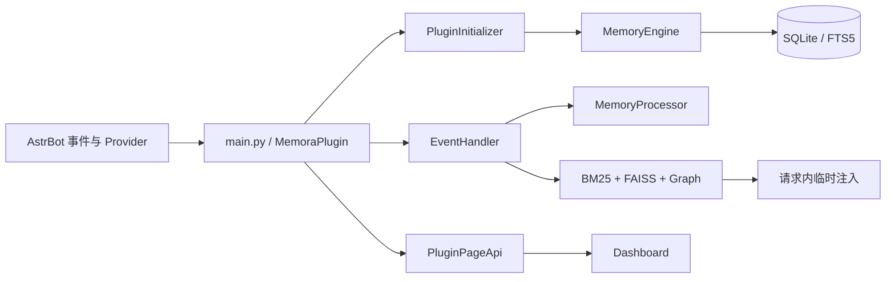

<div align="center">


# Memora

### 为 AstrBot 提供可检索、可管理的长期记忆

[](LICENSE)
[](https://www.python.org/)
[](metadata.yaml)
[](https://github.com/Soulter/AstrBot)

</div>

Memora 是 [AstrBot](https://github.com/Soulter/AstrBot) 的长期记忆插件：它从对话中提取有价值的信息，持久化保存，并在合适的后续请求中安全地召回。插件面向希望让 Bot 记住偏好、事实、关系与对话上下文的使用者，也为维护和扩展记忆系统的开发者提供 Dashboard、命令、工具与 Page API。

## 目录

- [核心能力](#核心能力)
- [快速开始](#快速开始)
- [常用命令](#常用命令)
- [Dashboard、工具与 API](#dashboard工具与-api)
- [开发者说明](#开发者说明)
- [许可证](#许可证)

## 核心能力

### 记忆生命周期

- 从对话中抽取、分类并保存记忆原子（MemoryAtom）。
- 支持记忆衰减、遗忘调度、会话总结与反思，帮助记忆库保持可用。
- 使用 SQLite 作为权威持久化；全文、向量和图索引均可校验或重建。

### 稳定协议用户身份

- 内置 OneBot 11 与 [QQ 官方机器人 API v2](https://bot.q.qq.com/wiki/develop/api-v2/) 严格身份适配器。OneBot 11 使用规范化 QQ 号；QQ 官方按 C2C、QQ 群、频道场景分别使用 `user_openid`、`member_openid`、`author.id`，绝不把 OpenID 猜成真实 QQ 号。
- QQ 官方同时支持 AstrBot 的 `qq_official`（WebSocket）与 `qq_official_webhook`。canonical ID 加入协议和平台实例摘要，隔离 OneBot、不同机器人应用及同文本 OpenID；可选 `union_openid` 不参与无迁移主键切换。
- 群名片、频道昵称和全局昵称只作为当前显示名称。新名称按群聊或私聊作用域更新身份目录并同步已保存会话消息；旧名称只保留为作用域别名，改名不会创建第二个用户。
- 长期记忆参与者使用 `QQ:10001` 或 `QQ官方:<实例摘要>:<OpenID>` 稳定标签。新记忆额外保存通用内部来源证据，使同群其他协议参与者改名后也能安全更新只读身份说明；内部来源不会直接进入 Prompt。
- 身份目录只幂等创建独立表，不执行 `ALTER TABLE`、历史扫描、迁移或回填；目录不可用时保留严格解析并关闭名称持久化增强，不阻断聊天。匿名、冲突或非法事件不得写入用户目录。

### 混合检索

- 结合 BM25 全文检索、FAISS 语义检索、图关系检索与 RRF 融合。
- 支持重排序、隐私过滤和按会话/用户范围隔离的召回。
- 通过关系与 Projection 派生解释平面补充召回；它们不替代原始记忆的权威身份。

### 记忆注入

- 在每个 LLM 请求内按策略选择并临时注入召回结果。
- 支持 manual、auto 和 hybrid 路由，以及 Tool First、Low Cost、Balanced、Quality 预设。
- 动态记忆不会写入 System Prompt，并始终受到硬预算、隐私和角色约束。

### 组织与管理

- 提供知识库、笔记、用户画像、图谱、时间线与记忆召回调试入口。
- Dashboard 支持三语言界面（中文、English、Русский）和系统维护操作。
- AstrBot Agent 可使用记忆搜索、主动记忆、笔记、知识库与用户画像工具。

### 可靠性与安全

- Provider 未就绪时后台等待和重试，不阻塞 AstrBot 主聊天链路。
- 注入决策只记录 allowlist 观测字段，不保存查询、提示词、记忆正文、记忆 ID 列表或原始身份。
- 写入、检索与派生数据都遵守 scope、privacy、validity 和 revision 等边界。

### 用户问题报告调试模式

需要提交问题报告时，可在 Dashboard 配置页开启“调试模式（问题报告）”。复现问题后，可以从 AstrBot 日志筛选 `[MemoraDebug]` 行，或提交插件数据目录下的相对路径 `diagnostics/memora-debug.jsonl`；文件按大小轮转，包含当前文件和两个备份文件，每个文件最大 `5 MB`。诊断记录只包含阶段、状态、耗时、计数、路由和安全异常摘要，不记录对话、查询、Prompt、模型回复、记忆正文、用户/群组/会话身份或 Provider 凭据。问题复现并收集日志后，请关闭该开关。

## 快速开始

### 环境要求

- Python `3.12+`
- AstrBot `>= 4.24.2`
- 已在 AstrBot 中配置可用的 Embedding Provider（向量化）和 LLM Provider（记忆抽取）
- Node.js `20`（仅 Dashboard 开发需要）

### 安装

1. 将插件克隆到 AstrBot 的插件目录：

```bash
cd <astrbot-root>/data/plugins/
git clone https://github.com/INSide-734/astrbot_plugin_memora.git
```

2. 安装 Python 依赖：

```bash
cd astrbot_plugin_memora
pip install -r requirements.txt
```

3. 重启 AstrBot。插件会注册并在 Provider 就绪后完成初始化。

### 首次验证

在 AstrBot 日志中确认 Memora 已完成初始化，然后以管理员身份发送：

```text
/memora status
```

如果 Provider 尚未就绪，Memora 会等待并在后台重试；这表示插件尚未可用，而不是安装失败。完整配置字段和默认值以 [_conf_schema.json](_conf_schema.json) 为准。

### 注入配置要点

注入配置位于 `recall_engine`：

- `injection_routing_mode` 默认 `manual`；`injection_manual_preset` 默认 `balanced`。
- 新安装默认使用 `manual + balanced`，普通记忆的注入预算和条数仍受预设硬上限约束。
- `injection_delivery_override` 默认 `auto`，由预设和 Provider 能力选择临时传输方式。
- 普通记忆受全局硬预算限制，且不会被写入 System Prompt。
- 注入决策默认保留 `30 天`、最多 `100,000` 行；只持久化脱敏的 allowlist 标量，不保存查询、提示词、记忆正文或 ID 列表。
- 已移除 `recall_engine.injection_method`，没有兼容迁移；升级后请使用新的策略字段重新配置。

## 常用命令

以下 `/memora` 命令均要求 AstrBot 管理员权限：

| 命令 | 说明 |
| --- | --- |
| `/memora status` | 查看插件初始化与核心组件状态。 |
| `/memora health` | 查看运行时健康评分、异常领域与固定排障建议。 |
| `/memora diagnostics` | 查看 Provider、召回、任务、索引和写入的实时诊断快照。 |
| `/memora search <query> [k]` | 搜索记忆；`k` 默认是 `5`。 |
| `/memora trace <query> [k]` | 追踪当前会话召回阶段与评分；`k` 默认是 `5`，聊天中不回显记忆正文。 |
| `/memora forget <doc_id>` | 删除指定记忆。 |
| `/memora rebuild-index` | 重建向量和 BM25 索引。 |
| `/memora rebuild-graph` | 重建图记忆索引。 |
| `/memora webui` | 输出 WebUI 访问信息。 |
| `/memora summarize` | 立即触发当前会话的记忆总结。 |
| `/memora reset` | 重置当前会话的长期记忆上下文。 |
| `/memora cleanup [preview|exec]` | 清理历史消息中的记忆注入片段；默认 `preview` 为预演。 |
| `/memora help` | 查看帮助。 |

例如：

```text
/memora status
/memora health
/memora diagnostics
/memora search 喜欢的音乐 5
/memora trace 喜欢的音乐 5
```

## Dashboard、工具与 API

### Dashboard

Dashboard 使用 React、Vite、Tailwind CSS 和 Base UI-backed shadcn 组件构建，提供以下任务入口：

- **Memory / Graph / Timeline / Recall**：浏览、检索、编辑记忆，查看关系与调试召回。
- **Profiles / Knowledge / Notes**：维护用户画像、知识库和笔记。
- **Learning / Intelligence / Jargon**：观察学习、评测、诊断、复核与黑话候选。
- **Affection / Social**：查看好感度、Bot 情绪与社交关系。
- **Injection / System / Config / Preview**：配置注入策略、查看运行状态、编辑配置和预览数据。

测评页不读取仓库测试夹具。安装后会自动选择“当前记忆”，从当前库中最近最多 20 条活跃记忆临时生成自身召回样本，点击“运行”即可直接评测且不会落盘保存样本正文。该模式衡量现有记忆能否召回自身；若要评测真实业务问句的相关性，可点击“导入数据集”选择人工标注 `.jsonl`。每行至少包含 `case_id`、`query` 和 `relevant_doc_ids`，相关 ID 必须是当前记忆库中存在的 canonical 整数 ID：

```json
{"case_id":"coffee-preference","query":"用户喜欢哪种咖啡","relevant_doc_ids":["17"],"metadata":{"session_id":"private:example","chat_type":"private"}}
```

正确负例使用唯一相关标记 `"__no_relevant__"`。导入成功后数据集立即出现在选择区域，并保存在插件数据目录的 `evaluation_datasets/` 中。

开发 Dashboard：

```bash
cd pages/dashboard
npm ci
npm run dev
npm run build
npm run check:artifacts
npm run test
```

### 插件打包

仓库根目录提供自动打包脚本。默认生成可直接安装的精简运行时包：

```powershell
python scripts/package_plugin.py
```

需要源码包时使用 `--mode source`；需要一次生成两种包时使用 `--mode both`：

```powershell
python scripts/package_plugin.py --mode source
python scripts/package_plugin.py --mode both --from-git
```

`runtime` 模式会在 `pages/dashboard/` 执行 `npm run build`，不会自动执行 `npm ci`。如果 Dashboard 依赖尚未安装，请先在该目录执行 `npm ci`，再重新运行打包脚本。`--from-git` 只影响源码包，使其使用当前 Git `HEAD`；不带该参数时源码包使用当前工作树。

默认产物写入 `dist/`，文件名从 `metadata.yaml` 读取版本：

```text
dist/astrbot_plugin_memora-1.0.0-runtime.zip
dist/astrbot_plugin_memora-1.0.0-source.zip
```

可用 `--output-dir releases` 将产物写入仓库根目录下的 `releases/`。

### LLM Tools

Memora 为 AstrBot Agent 提供五类工具能力：

- 搜索已有记忆；
- 主动记住新的信息；
- 创建和查询笔记；
- 检索和维护知识库；
- 查询和更新用户画像。

### Page API

Dashboard 通过 AstrBot Page API 访问 Memora。API 覆盖以下功能域：

- memory、graph、knowledge、notes 与 profiles 的读取、编辑和查询；
- backup、learning 与 maintenance 的运行维护；
- realtime 的事件流；
- injection、诊断、评测和配置等管理能力。

前端与后端的边界分别是 [`src/lib/bridge.ts`](pages/dashboard/src/lib/bridge.ts) 和 [`core/page_api.py`](core/page_api.py)。调用方应保留其响应 envelope、revision 和冲突处理，不应伪造客户端分页。

## 开发者说明

### 架构概览



数据流可概括为：AstrBot 消息先被捕获和去重，再由处理器抽取并写入权威 SQLite 记忆；请求前，检索器合并全文、语义与图结果，经过重排序和隐私过滤后，由注入策略在当前请求中临时使用。FTS、FAISS、图及派生关系数据都是可重建或可失效的派生层。

### 项目结构

```text
astrbot_plugin_memora/
├── main.py              # AstrBot 插件入口
├── metadata.yaml        # 插件元数据
├── _conf_schema.json    # 配置 Schema
├── core/                # Python 运行时、存储、检索、处理和 API
├── pages/dashboard/     # React 管理面板
├── tests/               # pytest 测试
├── scripts/             # 校验、smoke 与 benchmark 脚本
└── docs/                # 开发与设计文档
```

详细协作和模块导航见 [AGENTS.md](AGENTS.md)、[core/AGENTS.md](core/AGENTS.md) 与 [pages/dashboard/AGENTS.md](pages/dashboard/AGENTS.md)。项目级设计约定另见 [DESIGN.md](DESIGN.md)。

### 开发与验证

环境准备、完整质量门禁和 Dashboard smoke 流程见 [docs/DEV_SETUP.md](docs/DEV_SETUP.md)。根据改动范围选择最窄的验证命令：

```bash
# 后端
python -m pytest tests -q
python scripts/run_smoke.py -q

# Dashboard
cd pages/dashboard
npm run build
npm run check:artifacts
npm run test

# 仓库级质量门禁（在仓库根目录执行）
python scripts/check_all.py
```

Dashboard 的 `npm run smoke:runtime` 与 `npm run smoke:browser` 属于完整门禁；浏览器 smoke 完成后还需要人工检查生成的截图。

### 代码探索

仓库优先使用 `mcp__fast_context__fast_context_search` 做语义代码搜索。若当前环境未配置 fast-context，可使用 fallback 方式退回 `Select-String`、定向文件读取等本地方法；不要自动读取 Windsurf 凭证。若使用 fast-context，请仅在已自行配置 `WINDSURF_API_KEY` 时使用，不要把本机凭证写入代码或文档。

## 技术栈

- 后端：Python、SQLite、FTS5、FAISS、NetworkX、jieba、Quart、Pydantic。
- 前端：React 18、TypeScript、Vite、Tailwind CSS、Base UI-backed shadcn、TanStack React Table、Recharts。

## 许可证

本项目基于 [GNU Affero General Public License v3.0 (AGPL-3.0)](LICENSE) 开源。

> 您可以自由使用、修改和分发本项目；如果通过网络提供服务，必须公开修改后的源代码。

## 致谢

- [AstrBot](https://github.com/Soulter/AstrBot)
- [faiss](https://github.com/facebookresearch/faiss)
- [shadcn/ui](https://ui.shadcn.com/)
