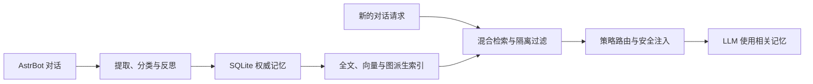

<div align="center">


# Memora

### 为 AstrBot 提供从对话理解、长期存储到安全召回与可视化管理的完整记忆系统

[](LICENSE)
[](https://www.python.org/)
[](metadata.yaml)
[](https://github.com/Soulter/AstrBot)

</div>

Memora 是 [AstrBot](https://github.com/Soulter/AstrBot) 的长期记忆插件。它从日常对话中提取值得长期保留的事实、偏好、关系和经历，将其安全持久化，并在后续请求真正需要时按身份、会话、隐私和预算约束召回。

Memora 不只是给向量数据库套一层搜索接口。它覆盖记忆形成、身份解析、混合检索、请求级注入、反思、衰减、遗忘、评测、诊断和恢复，并提供 Dashboard、管理员命令、Agent 工具与 Page API。

## 你可以用 Memora 做什么

| 使用场景 | Memora 提供的能力 |
| --- | --- |
| 长期陪伴 | 让 Bot 记住用户偏好、重要经历、人物关系和持续变化的信息。 |
| 多人群聊 | 按用户、群组、会话和角色隔离记忆，减少串人、串群和错误归属。 |
| QQ 多协议接入 | 严格区分 OneBot 11 QQ 号、QQ 官方 OpenID、机器人实例和使用场景，并安全处理改名。 |
| 准确召回 | 组合全文、向量和图检索，经融合、重排序、隐私过滤后找到相关记忆。 |
| 知识与个性化 | 管理知识库、笔记、用户画像、社交关系、好感度、Bot 情绪、表达模式和群聊黑话。 |
| 可视化管理 | 在 Dashboard 浏览、编辑、筛选、调试、评测和维护记忆系统。 |
| 长期运维 | 使用健康诊断、索引重建、备份恢复、导出和安全更新维护数据。 |

## 目录

- [核心亮点](#核心亮点)
- [功能全景](#功能全景)
- [为什么选择 Memora](#为什么选择-memora)
- [工作原理](#工作原理)
- [快速开始](#快速开始)
- [Dashboard 功能地图](#dashboard-功能地图)
- [管理命令](#管理命令)
- [Agent 工具](#agent-工具)
- [配置要点](#配置要点)
- [运维、安全与可靠性](#运维安全与可靠性)
- [开发者说明](#开发者说明)

## 核心亮点

| 能力 | 说明 |
| --- | --- |
| 完整记忆生命周期 | 从消息捕获、抽取、分类和反思，到存储、召回、注入、衰减、遗忘与重建。 |
| 多路混合检索 | BM25、FAISS、图关系、RRF 融合、关系扩展、重排序和隔离过滤协同工作。 |
| 稳定协议身份 | QQ 号与 OpenID 不混用，不同协议和机器人实例不串号，改名不创建第二个用户。 |
| 请求级安全注入 | 动态记忆只在当前请求内临时使用，不写入 System Prompt，并受硬预算与隐私边界约束。 |
| 可视化与可扩展 | 16 个 Dashboard 入口、完整管理命令、15 个可配置 Agent 工具和 Page API。 |
| 可诊断、可恢复 | canonical 数据独立于派生索引，支持健康检查、召回追踪、索引重建、备份恢复和更新回滚。 |

## 功能全景

### 对话理解与记忆形成

- 捕获 AstrBot 对话消息，提取文本内容并进行消息去重。
- 通过话题分割、结构化抽取和 MemoryAtom 分类识别事实、偏好、关系、经历等长期信息。
- 支持会话总结、请求后反思和群聊环境消息处理。
- 使用重要度、有效期和访问状态参与记忆保留决策。
- 支持记忆衰减、归档、遗忘，以及高重要度“闪光灯记忆”保护。
- 新记忆携带可信参与者来源证据，为后续身份说明和安全召回提供依据。
- SQLite 中的 canonical memory 是唯一权威记录；索引或派生数据不能建立第二套记忆身份。

### 稳定协议身份

- OneBot 11 只使用规范化 QQ 号作为 canonical user ID。
- QQ 官方机器人按 C2C、QQ群和频道场景分别处理 `user_openid`、`member_openid` 和 `author.id`，不会把 OpenID 猜成真实 QQ 号。
- 同时支持 AstrBot 的 `qq_official` 与 `qq_official_webhook` 接入。
- canonical ID 纳入协议、平台实例和身份命名空间，不同机器人应用及同文本 OpenID 彼此隔离。
- 群名片、频道昵称和全局昵称只作为可更新显示名称；改名更新作用域别名，不改变稳定身份。
- 历史别名只在原会话作用域且唯一匹配时用于只读召回增强，不回写原始记忆。
- 匿名、冲突和非法身份事件不会写入身份目录；目录增强失败时安全降级，不阻断聊天。

### 混合检索与安全召回

- BM25/FTS5 全文检索：适合名称、关键词和精确文本。
- FAISS 语义检索：处理不同表达方式下的语义相关性。
- 图关系检索：沿人物、实体和记忆关系发现关联信息。
- RRF 融合与混合评分：合并不同检索器的候选结果。
- 关系扩展与可选重排序：补充关联候选，并按策略优化最终顺序。
- 按会话、用户、群组、角色、隐私级别和有效期过滤召回结果。
- 可选记忆演化管线生成带 source revision 证据的 Relation 和 Projection；它们只解释 canonical memory，不替代原始记录。
- 离线评测支持 Recall@K、MRR、nDCG@K、p95 延迟、消融对比和安全反馈排序 shadow。

### 请求级记忆注入

- 支持 `manual`、`auto` 和 `hybrid` 三种注入路由模式。
- 提供 Tool First、Low Cost、Balanced 和 Quality 四档预设。
- 根据 Provider 能力和当前请求选择临时交付方式。
- 普通记忆受条数、字符数和全局硬预算共同限制。
- 动态记忆不会写入 System Prompt，也不会永久改写会话请求模板。
- 注入前继续校验 scope、privacy、validity、role 和 revision。
- 提供策略预览、脱敏决策历史和可解释召回 trace。

### 知识、关系与个性化

- **知识库**：维护独立知识条目，并参与检索与 Agent 查询。
- **笔记**：创建、读取、搜索和管理长期笔记。
- **用户画像**：维护结构化用户信息，并用于个性化检索排序。
- **社交关系**：记录用户之间的关系边和群组关系图。
- **好感度与情绪**：查看关系好感度和 Bot 当前情绪状态。
- **表达模式**：从对话中学习表达模式，并在召回阶段提供适用表达。
- **群聊黑话**：发现、复核、查询和解释群内特有表达。

### 学习与智能增强

Memora 的主记忆链路不依赖所有增强模块同时开启。以下能力按配置和依赖装配，关闭时不会改变 canonical memory 的权威边界：

- 自动学习统计、反馈记录和检索参数优化。
- 可选对话连续性追踪与关系阶段追踪。
- 可选记忆再巩固，在受控时间窗口内更新记忆状态。
- 可选异常检测，用于识别写入与访问行为中的异常信号。
- 可选 MAB 检索权重学习，用反馈探索不同融合权重。
- 可选记忆演化 worker，用有界后台任务生成关系与 Projection。

### 管理、评测与集成

- Dashboard 统一管理记忆、图谱、时间线、召回、注入、知识、笔记、画像、学习、黑话、关系、系统和配置。
- 管理命令覆盖状态、诊断、搜索、删除、总结、清理、索引重建和更新。
- Agent 工具允许模型按配置搜索或写入记忆、读写笔记，并查询其他个性化数据。
- Page API 提供标准错误 envelope、revision 冲突处理、维护操作和 SSE 实时事件。
- Dashboard 支持中文、English、Русский 三种界面语言。
- 检索评测既可从当前记忆临时生成自召回样本，也可导入人工标注 JSONL 数据集。

## 为什么选择 Memora

许多基础型长期记忆插件主要解决“保存内容并再次搜到”。Memora 更关注长期运行中的完整闭环：记忆怎样形成、属于谁、如何检索、怎样安全交给模型，以及索引损坏、身份变化、配置冲突或恢复失败时如何保持数据可信。

| 能力维度 | 常见基础型方案的关注点 | Memora 的设计重点 |
| --- | --- | --- |
| 记忆生命周期 | 主要覆盖保存与召回 | 抽取、分类、反思、存储、召回、注入、衰减、遗忘和重建 |
| 检索策略 | 关键词或向量检索 | BM25、FAISS、图检索、RRF、关系扩展、重排序和隔离过滤 |
| 数据权威边界 | 原始记录与索引关系由具体实现决定 | SQLite canonical memory 唯一权威，全文、向量、图和 Projection 均可重建 |
| 用户身份 | 直接使用平台事件提供的用户标识 | 区分 QQ 号、OpenID、协议、平台实例和会话作用域，并安全处理改名 |
| 上下文注入 | 固定拼接或直接加入提示上下文 | 请求级路由、Provider 能力适配、硬预算、隐私和角色约束 |
| 管理入口 | 命令或基础列表即可满足轻量需求 | Dashboard、管理命令、Agent 工具和 Page API 共同覆盖使用与维护 |
| 质量验证 | 依赖人工体验或日志观察 | 召回 trace、决策历史、标准检索指标、数据集和消融对比 |
| 运维恢复 | 手动处理索引或数据目录 | 健康诊断、索引重建、事务式备份恢复、安全更新和失败回滚 |
| 隐私观测 | 日志边界由具体实现决定 | 字段 allowlist，不记录查询、Prompt、正文、原始身份或 Provider 凭据 |
| 适用场景 | 轻量、低维护成本的记忆需求 | 需要长期运行、身份隔离、可观测性和可维护性的 AstrBot 实例 |

> 上述对比描述的是常见设计取向，不代表所有其他插件都采用相同实现。轻量方案在安装成本和资源占用方面可能更有优势；Memora 的取舍是使用更多组件与管理能力，换取更完整的生命周期、可解释性和长期可维护性。

## 工作原理



这条链路有三个不变量：

1. SQLite canonical memory 及其整数 ID 始终是唯一权威身份。
2. FTS5、FAISS、图关系、Relation 和 Projection 都是可校验、可失效、可重建的派生层。
3. 召回结果只在当前请求中临时提供给模型，动态记忆不进入 System Prompt。

更完整的初始化、身份、演化与重建边界见 [DESIGN.md](DESIGN.md)。

## 快速开始

### 环境要求

- Python `>=3.12,<3.13`
- AstrBot `>=4.24.2`
- 可用的 Embedding Provider，用于向量化与语义检索
- 可用的 LLM Provider，用于记忆抽取、反思等智能处理
- Node.js `20`，仅 Dashboard 开发和重新构建前端产物时需要

### 安装

Memora 支持以下两种安装方式，任选其一即可。

#### 方式一：从 AstrBot 插件市场安装（推荐）

1. 打开 AstrBot 管理面板，进入“插件市场”页面。
2. 搜索 `Memora`，打开插件详情并点击“安装”。

#### 方式二：从发行版安装包安装

1. 打开本仓库的 [Releases 页面](https://github.com/INSide-734/astrbot_plugin_memora/releases/latest)。
2. 下载最新版本的 `astrbot_plugin_memora-<version>-runtime.zip` 安装包。
3. 返回 AstrBot 插件管理页面，选择从安装包安装并上传该 ZIP 文件；安装前无需解压。

### 安装后配置与验证

1. 在 AstrBot 中配置 Embedding Provider 和 LLM Provider，然后重启 AstrBot。

2. 以管理员身份验证插件状态：

```text
/memora status
```

3. 使用 AstrBot 插件页面或以下命令进入 Dashboard：

```text
/memora webui
```

如果 Provider 尚未就绪，Memora 会在后台等待并重试，不阻塞 AstrBot 主聊天链路。这表示插件尚未完成运行时初始化，并不等同于安装文件损坏。

完整配置字段和默认值以 [_conf_schema.json](_conf_schema.json) 为准。

## Dashboard 功能地图

Dashboard 由 React、Vite、Tailwind CSS 和 Base UI-backed shadcn 组件构建，共提供 16 个功能入口：

| 分组 | 页面 | 主要任务 |
| --- | --- | --- |
| 概览 | Preview | 查看核心指标、运行摘要和快捷入口。 |
| 记忆 | Graph、Memory、Timeline、Recall、Injection | 浏览和编辑记忆，查看关系与时间线，调试召回并配置注入策略。 |
| 内容 | Knowledge、Notes | 维护知识库与长期笔记。 |
| 智能 | Intelligence、Learning、Jargon | 运行诊断与评测，查看学习状态，复核和解释群聊黑话。 |
| 关系 | Profiles、Affection、Social | 管理用户画像，查看好感度、Bot 情绪和社交关系。 |
| 系统 | System、Config | 查看健康、任务、备份和更新状态，校验并写回配置。 |

Dashboard 的数据表支持排序、筛选、分页、列视图和批量操作；实体编辑保留 revision 冲突检测、脏状态保护与显式错误反馈。桌面端和移动端共用同一 Page API 契约。

## 管理命令

以下 `/memora` 命令均要求 AstrBot 管理员权限：

| 命令 | 说明 |
| --- | --- |
| `/memora status` | 查看插件初始化与核心组件状态。 |
| `/memora health` | 查看运行时健康评分、异常领域与固定排障建议。 |
| `/memora diagnostics` | 查看 Provider、召回、任务、索引和写入的实时诊断快照。 |
| `/memora search <query> [k]` | 搜索记忆；`k` 默认是 `5`。 |
| `/memora trace <query> [k]` | 追踪当前会话的召回阶段与评分；聊天中不回显记忆正文。 |
| `/memora forget <doc_id>` | 删除指定 canonical 记忆。 |
| `/memora rebuild-index` | 重建向量与 BM25/FTS 索引。 |
| `/memora rebuild-graph` | 重建图记忆索引。 |
| `/memora webui` | 输出 Dashboard 访问信息。 |
| `/memora summarize` | 立即触发当前会话的记忆总结。 |
| `/memora reset` | 重置当前会话的长期记忆上下文。 |
| `/memora cleanup [preview 或 exec]` | 清理历史消息中的记忆注入片段；默认 `preview` 为预演。 |
| `/memora update [check、download 或 apply]` | 检查、下载或安装经校验的 runtime 更新包；默认执行 `check`。 |
| `/memora help` | 查看命令帮助。 |

示例：

```text
/memora health
/memora search 喜欢的音乐 5
/memora trace 喜欢的音乐 5
/memora cleanup preview
/memora update check
```

## Agent 工具

核心组件就绪后，Memora 可按 `agent_tools` 配置向 AstrBot Agent 注册最多 15 个工具：

| 能力 | 工具 | 默认与边界 |
| --- | --- | --- |
| 记忆 | `recall_long_term_memory`、`memorize_long_term_memory` | 召回默认开启；主动写入默认关闭，只应在用户明确要求长期记忆时启用和调用。 |
| 笔记 | `note_search`、`note_read`、`note_write` | 读取默认开启；写入默认关闭。 |
| 知识库 | `knowledge_search`、`knowledge_read` | 对应知识库组件可用时注册。 |
| 用户画像 | `profile_lookup` | self lookup 使用可信发送者身份；查询其他用户需要授权。 |
| 好感度与情绪 | `check_affection`、`check_bot_mood` | 对应组件可用且未委托给伴侣插件时注册。 |
| 群聊黑话 | `explain_jargon`、`list_group_jargon` | 按当前群组作用域查询。 |
| 表达模式 | `recall_expressions` | 返回当前场景适用的已学习表达。 |
| 社交关系 | `lookup_relations`、`list_group_relations` | 查询用户关系和群组关系图。 |

工具结果会进入模型上下文，因此只返回完成任务所需的稳定字段，不包含 Provider 配置、凭据、数据库路径或异常堆栈。工具开关在插件初始化时读取，运行中修改后需要重载插件。

## 配置要点

### Provider

- Embedding Provider 负责向量化和 FAISS 语义检索。
- LLM Provider 负责记忆抽取、反思及启用后的智能增强。
- Provider 未就绪时 Memora 后台等待，不阻塞 AstrBot 启动后的聊天主链路。

### 注入策略

注入配置位于 `recall_engine`：

- `injection_routing_mode` 默认 `manual`。
- `injection_manual_preset` 默认 `balanced`。
- `injection_delivery_override` 默认 `auto`。
- 新安装默认使用 `manual + balanced + auto delivery`。
- 已移除 `recall_engine.injection_method`，不提供旧字段兼容迁移；升级后需要改用上述策略字段。

### 记忆演化

- `memory_evolution.enabled` 默认关闭。
- 未启用时不启动演化 worker，也不影响 canonical 记忆写入、检索和注入主链路。
- 启用后，worker 只生成带 source revision 证据的 Relation 与 Projection 派生对象。
- 派生对象不能覆盖 canonical memory，也不能绕过 scope、privacy、validity 和 role 校验。

### 其他常用配置域

| 配置域 | 用途 |
| --- | --- |
| `reflection_engine`、`topic_segmentation` | 控制反思、总结与话题处理。 |
| `filtering_settings`、`reranker` | 控制召回隔离过滤与重排序。 |
| `knowledge_base`、`notes`、`user_profile` | 控制知识、笔记和画像能力。 |
| `backup_settings`、`update_settings` | 控制备份保留、在线检查与下载。 |
| `auto_learning`、`continuity_tracking`、`relationship_tracking` | 控制学习、连续性和关系阶段增强。 |
| `anomaly_detection`、`weight_learning`、`reconsolidation` | 控制可选异常检测、权重学习与再巩固。 |
| `security`、`dashboard`、`agent_tools` | 控制安全策略、管理面板和 Agent 工具。 |

## 运维、安全与可靠性

### 数据权威与重建

- SQLite canonical memory 是唯一权威持久化。
- FTS5、FAISS、图索引、Relation 和 Projection 都是派生数据。
- 派生重建按 canonical、全文/向量索引、图、关系/Projection 的顺序执行。
- 阶段失败只报告降级，不删除 canonical 数据。
- `/memora rebuild-index` 和 `/memora rebuild-graph` 提供管理员维护入口。

### 备份、恢复与导出

- 支持校验后的备份快照、定时备份和安全保留策略。
- 恢复流程包含预检、维护锁、事务式切换、运行时重载和失败回滚。
- 路径和归档内容经过校验，拒绝路径穿越、绝对路径及非法目标。
- 可将当前记忆导出为 JSONL 或 Markdown，便于审阅和外部归档。

### 在线更新

系统概览可以检查 GitHub Release、查看发布说明和忽略指定版本。下载时优先使用配置镜像，失败后回退 GitHub，并复用 AstrBot 的 HTTP、HTTPS 或 SOCKS5 代理。

runtime 包只有通过 `SHA256SUMS.txt` 校验后才会进入插件数据目录。宿主支持单插件重载时，可确认自动安装、原子切换目录并重载；重载失败会恢复旧目录。宿主不支持时安全降级为仅下载。

### 隐私与观测

- 写入、检索、编辑和派生流程校验 scope、privacy、validity、role 与 revision。
- 注入决策只持久化 allowlist 标量，不记录 query、Prompt、模型回复、记忆正文、记忆 ID 列表或原始身份。
- 模型可见 Projection 只包含 `type`、`summary` 和 `confidence`。
- 模型可见身份说明只包含当前名称、单个历史名称和适配器确定的稳定标签。
- Provider 密钥、请求头、API 地址、数据库路径和异常堆栈不会进入模型上下文或问题报告记录。
- 普通可恢复故障不会破坏聊天主链路；取消信号和关闭流程继续传播。

<details>
<summary>问题报告调试模式</summary>

在 Dashboard 配置页开启“调试模式（问题报告）”后，开关会立即作用于当前插件进程。复现问题后，可以从 AstrBot 日志筛选 `[MemoraDebug]`，或提交插件数据目录中的 `diagnostics/memora-debug.jsonl`。

诊断记录只包含阶段、状态、耗时、计数、路由和安全异常摘要，不包含对话、查询、Prompt、模型回复、记忆正文、用户/群组/会话身份或 Provider 凭据。文件按大小轮转，当前文件和两个备份文件各自最大 `5 MB`。收集完成后请关闭该开关。

</details>

### 检索质量评测

Dashboard 评测页不会读取仓库测试夹具。安装后可以从当前库最近最多 20 条活跃记忆临时生成自召回样本；样本正文不会落盘。该模式衡量现有记忆能否召回自身。

<details>
<summary>导入人工标注评测集</summary>

真实业务问句评测可导入 `.jsonl`。每行至少包含 `case_id`、`query` 和 `relevant_doc_ids`，相关 ID 必须是当前记忆库中存在的 canonical 整数 ID：

```json
{"case_id":"coffee-preference","query":"用户喜欢哪种咖啡","relevant_doc_ids":["17"],"metadata":{"session_id":"private:example","chat_type":"private"}}
```

正确负例使用唯一相关标记 `"__no_relevant__"`。导入成功的数据集保存在插件数据目录的 `evaluation_datasets/` 中。

</details>

## Page API

Dashboard 通过 AstrBot Page API 访问 Memora。API 覆盖：

- memory、graph、knowledge、notes、profiles 和 relationships 的读取、编辑与查询；
- backup、learning、maintenance、更新和恢复等运行维护；
- injection、诊断、评测、配置和数据预览；
- realtime SSE 事件流。

前后端边界分别是 [`pages/dashboard/src/lib/bridge.ts`](pages/dashboard/src/lib/bridge.ts) 和 [`core/page_api.py`](core/page_api.py)。调用方应保留响应 envelope、revision 和冲突处理，不应伪造客户端分页。

## 开发者说明

项目结构、环境准备、质量门禁、Dashboard 开发和插件打包说明见 [开发说明](docs/DEV_SETUP.md)。

## 技术栈

- 后端：Python 3.12、SQLite、FTS5、FAISS、NetworkX、jieba、Quart、Pydantic。
- 前端：React 18、TypeScript、Vite、Tailwind CSS、Base UI-backed shadcn、TanStack React Table、Recharts。
- 质量体系：pytest、Vitest、Ruff、pre-commit、smoke、benchmark 和构建产物检查。

## 许可证

本项目基于 [GNU Affero General Public License v3.0 (AGPL-3.0)](LICENSE) 开源。

> 您可以自由使用、修改和分发本项目；如果通过网络提供服务，必须公开修改后的源代码。

## 致谢

- [AstrBot](https://github.com/Soulter/AstrBot)
- [astrbot_plugin_livingmemory](https://github.com/lxfight-s-Astrbot-Plugins/astrbot_plugin_livingmemory)
- [faiss](https://github.com/facebookresearch/faiss)
- [shadcn/ui](https://ui.shadcn.com/)
