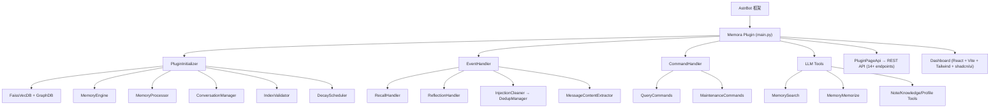

<div align="center">


# Memora

### 为 AstrBot 打造的智能长期记忆插件

[](LICENSE)
[](https://www.python.org/)
[](metadata.yaml)
[](https://github.com/Soulter/AstrBot)

</div>

---

## 简介

**Memora** 是一个为 [AstrBot](https://github.com/Soulter/AstrBot) 打造的完整长期记忆插件，提供从消息捕获、内容抽取、向量化存储，到 BM25+向量双路混合检索、记忆衰减与遗忘调度、图记忆、知识库、笔记系统、用户画像等全生命周期管理能力。

以 **MemoryAtom（记忆原子）** 为核心数据单元，Memora 实现细粒度的记忆存取与演化，让 Bot 真正「记住」每一次对话。

## 核心特性

### 记忆生命周期管理
- **自动抽取** — LLM 驱动，从对话中自动识别并提取有价值的信息
- **智能分类** — 多维度分类（事实/偏好/经验/关系等），支持自定义分类体系
- **TTL 衰减** — 记忆随时间自然衰减，支持线性/指数/对数等多种衰减策略
- **遗忘调度** — 自动遗忘低价值/过期记忆，保持记忆库清爽
- **情感评分** — 对记忆附加情感强度，影响记忆权重和召回优先级

### 多路混合检索
- **BM25 全文检索** — 基于 jieba 分词的中文全文搜索
- **FAISS 向量检索** — 基于 Embedding 的语义相似度搜索
- **RRF 融合** — Reciprocal Rank Fusion 融合 BM25 + 向量两路排序
- **图检索** — 基于 networkx 的知识图谱检索（关键词 + 向量双路 → 融合）
- **双路路由** — 文档路 + 图路 → DualRouteRetriever，双路并行召回
- **重排序** — CrossEncoder / LLM 重排序，提升结果精度
- **个性化排序** — 基于用户画像和交互历史的个性化结果排序

### 图记忆 (Graph Memory)
- 自动构建实体关系图谱
- 支持知识推理和关联发现
- 可视化图谱浏览（Dashboard 支持）

### 知识库 & 笔记
- **知识库** — 自动从对话中提取知识点，结构化存储
- **笔记系统** — LLM 驱动的对话总结和笔记生成
- **标签管理** — 灵活的标签体系，支持多维度归类

### 用户画像
- 对话中自动构建用户画像
- 追踪用户偏好、习惯、兴趣
- 支持个性化对话策略

### 智能特性
- **主动提醒** — 基于记忆的主动提醒和建议
- **反思机制** — Reflection 机制，周期性回顾和整合记忆
- **自动学习** — 从交互中持续学习和优化
- **异常检测** — 检测记忆质量异常，自动触发维护
- **季节性召回** — 时间敏感的周期性记忆召回
- **隐私过滤** — 敏感信息自动过滤

### 工程特性
- **多语言支持** — 中文 / English / Русский 三语界面
- **Web Dashboard** — React + shadcn/ui 管理面板，10 个功能页面
- **REST API** — 完整的 RESTful API，14+ 端点
- **自动备份** — 版本升级自动备份数据
- **索引校验** — 索引一致性验证与自动重建
- **回退容错** — Provider 不可用时后台重试（最多 60 次）

## 架构总览

### 系统架构



### 数据流

```
User Message → EventHandler → MessageContentExtractor → ConversationManager.store
                                                            │
                         ┌──────────────────────────────────┘
                         ▼
              MemoryProcessor (LLM 抽取) → MemoryEngine
                         │                    │
                         │    ┌───────────────┼───────────────┐
                         │    ▼               ▼               ▼
                         │  AtomStore    GraphStore     NoteStore
                         │  (SQLite)     (SQLite+FAISS) (SQLite)
                         │    │               │
                         │    ▼               ▼
                         │  BM25Retriever   GraphRetriever
                         │  VectorRetriever  (keyword+vector)
                         │    │               │
                         │    └───────┬───────┘
                         │            ▼
                         │       HybridRetriever (RRF)
                         │            │
                         │            ▼
                         └─── DualRouteRetriever (文档+图双路)
                                      │
                                      ▼
                              Reranker (CrossEncoder/LLM)
                                      │
                                      ▼
                              PersonalizedRanker
                                      │
                                      ▼
                              Recall Results → injection into LLM context
```

### 模块结构

| 模块 | 文件数 | 职责 |
|------|--------|------|
| `core/base/` | 5 | 配置管理、常量、异常定义 |
| `core/initializer/` | 6 | 插件初始化编排、Provider 加载、DB 建立 |
| `core/managers/` | 40+ | 核心业务逻辑：记忆引擎、会话、衰减、备份等 |
| `core/processors/` | 20 | LLM 驱动的记忆抽取、分类、格式化 |
| `core/retrieval/` | 22 | 多路检索：BM25、向量、混合、图检索、重排序 |
| `core/storage/` | 16 | SQLite 持久化层：原子、会话、图、笔记、知识库 |
| `core/api/` | 15 | REST API 端点：读写、批量、统计、备份等 |
| `core/validators/` | 5 | 索引一致性验证与重建 |
| `core/schedulers/` | 2 | 记忆衰减与备份调度 |
| `core/models/` | 8 | 数据模型定义 |
| `core/tools/` | 5 | AstrBot LLM Agent 工具集成 |
| `core/commands/` | 3 | 用户命令：查询与维护 |
| `core/handlers/` | 3 | 回忆与反思事件处理器 |
| `core/cleaners/` | 2 | 注入清理 |
| `core/dedup/` | 2 | 消息去重 |
| `core/extractors/` | 2 | 消息内容提取 |
| `pages/dashboard/` | — | React Web 管理面板（10 页面） |
| `tests/` | 19 | pytest 测试套件 |

## 快速开始

### 环境要求

- **Python** 3.12+
- **AstrBot** ≥ 4.24.2
- **Embedding Provider** 已在 AstrBot 中配置（用于向量化）
- **LLM Provider** 已在 AstrBot 中配置（用于记忆抽取）

### 安装

1. 将插件目录放入 AstrBot 的 `data/plugins/` 路径下：

```bash
cd <astrbot-root>/data/plugins/
git clone https://github.com/INSide-734/astrbot_plugin_memora.git
```

2. 安装依赖：

```bash
cd astrbot_plugin_memora
pip install -r requirements.txt
```

3. 重启 AstrBot，插件会自动注册并开始后台初始化。

4. 初始化需要 Embedding Provider 和 LLM Provider 在 AstrBot 中正确配置。若 Provider 暂不可用，插件会进入后台重试模式（最多 60 次）。

### fast-context

根级 `AGENTS.md` 要求在探索性代码搜索时优先使用 `mcp__fast_context__fast_context_search`。

- 若已配置 `WINDSURF_API_KEY`，可直接使用 fast-context 进行语义搜索。
- 不要尝试自动读取本机 Windsurf 凭证。
- 若当前环境未配置 fast-context 或不可用，允许退回 `rg`、PowerShell `Select-String`、直接读文件，并在工作记录中说明 fallback 原因。

### 开发校验

开发环境准备和统一质量门见 `docs/DEV_SETUP.md`；最近一次门禁结果记录在 `docs/QUALITY_GATE_STATUS.md`。

```bash
python scripts/check_all.py
```

### 配置

插件使用 AstrBot 的标准配置系统。所有可配置项及其默认值定义在 `core/base/config_defaults.py` 中，通过 `_conf_schema.json` 暴露给 AstrBot 的配置界面。

主要配置项：

| 配置项 | 说明 | 默认值 |
|--------|------|--------|
| `bot_language` | 界面语言 | `zh` |
| 详见 `_conf_schema.json` | 完整配置列表 | — |

## 自适应记忆注入

- 注入路由可选择 Manual、Auto 或 Hybrid；新安装默认使用 `manual + balanced + auto delivery`。
- 四种预设分别为 Tool First、Low Cost、Balanced 和 Quality；普通记忆的字符预算依次为 `0/800/1200/2400`，最大条数依次为 `0/2/4/6`。
- 动态记忆绝不写入 System Prompt。注入载荷只在当前请求中临时存在，并始终受全局硬预算约束。
- Dashboard 提供完整的 Injection Strategy 工作台，包含 Overview、Strategy Configuration 和 Decision History。
- 决策元数据全量持久化到 SQLite 的 `injection_decisions` 表，但不会保存查询文本、记忆正文/ID 或原始身份标识。默认保留期为 30 天、上限为 100,000 行，两者均可配置。
- 正常关闭时最多等待 5 秒刷新待写批次；进程崩溃时可能丢失最后一个尚未刷新的批次。
- 这是破坏性配置变更：`recall_engine.injection_method` 已移除且不提供兼容迁移，管理员必须使用新的策略字段重新配置。

## 命令

| 命令 | 说明 |
|------|------|
| `/lmem status` | 查看插件初始化状态与核心组件状态 |
| `/lmem search <query> [k]` | 搜索记忆，`k` 默认为 5 |
| `/lmem forget <doc_id>` | 删除指定记忆 |
| `/lmem rebuild-index` | 重建向量/BM25 索引 |
| `/lmem rebuild-graph` | 重建图记忆索引 |
| `/lmem webui` | 输出 WebUI 访问信息 |
| `/lmem summarize` | 立即触发当前会话总结 |
| `/lmem reset` | 重置当前会话长期记忆上下文 |
| `/lmem cleanup [preview|exec]` | 清理历史消息中的记忆注入片段 |
| `/lmem help` | 查看帮助信息 |

## LLM Tools

Memora 为 AstrBot Agent 系统提供以下工具：

| 工具 | 说明 |
|------|------|
| `MemorySearchTool` | 搜索记忆库，支持语义和关键词查询 |
| `MemoryMemorizeTool` | 主动记忆，将信息存入记忆库 |
| `NoteTools` | 笔记管理：创建、查询、更新、删除 |
| `KnowledgeTools` | 知识库管理：检索、录入、更新 |
| `ProfileTools` | 用户画像管理：查询、更新 |

## Dashboard

Memora 提供完整的 Web 管理面板，基于 React + Vite + Tailwind CSS + shadcn/ui 构建。数据密集页面统一使用基于 TanStack React Table 的 DataTable，支持服务端排序、真实分页、列显隐/顺序/固定和密度偏好；实体详情与编辑统一使用可滚动、可访问的 EntityEditorSheet。

### 启动开发服务器

```bash
cd pages/dashboard
npm install
npm run dev       # 开发模式 (http://localhost:5173)
npm run build     # 生产构建 → 输出到 assets/
npm run check:artifacts  # 检查 AstrBot 兼容产物
npm run test      # Vitest: bridge + hooks
```

### 功能页面

| 页面 | 说明 |
|------|------|
| **Memory** | 记忆原子浏览、搜索、管理 |
| **Graph** | 知识图谱可视化 |
| **Recall** | 记忆召回测试与调试 |
| **Timeline** | 记忆时间线浏览 |
| **Profiles** | 用户画像管理 |
| **Knowledge** | 知识库管理 |
| **Notes** | 笔记管理 |
| **Learning** | 自动学习状态监控 |
| **System** | 系统状态与维护工具 |
| **Preview** | 数据预览 |

## REST API

插件自动注册 14+ 个 REST API 端点，完整列表如下：

| 端点 | 方法 | 说明 |
|------|------|------|
| `/api/plugin/memora/memory/read` | GET | 读取记忆原子 |
| `/api/plugin/memora/memory/write` | POST | 写入记忆原子 |
| `/api/plugin/memora/memory/batch` | POST | 批量操作 |
| `/api/plugin/memora/memory/stats` | GET | 记忆统计 |
| `/api/plugin/memora/memory/recall` | POST | 记忆召回 |
| `/api/plugin/memora/graph/*` | GET/POST | 图记忆操作 |
| `/api/plugin/memora/knowledge/*` | GET/POST | 知识库操作 |
| `/api/plugin/memora/notes/*` | GET/POST | 笔记操作 |
| `/api/plugin/memora/profiles/*` | GET/POST | 用户画像操作 |
| `/api/plugin/memora/backup/*` | GET/POST | 备份管理 |
| `/api/plugin/memora/learning/*` | GET | 学习状态 |
| `/api/plugin/memora/maintenance/*` | POST | 维护操作 |
| `/api/plugin/memora/realtime/*` | SSE | 实时事件流 |

## 技术栈

### 后端
- **向量存储**: faiss-cpu
- **结构化存储**: aiosqlite + FTS5 全文检索
- **图计算**: networkx
- **分词**: jieba
- **跨平台**: pytz
- **异步 I/O**: aiofiles

### 前端 (Dashboard)
- **框架**: React 18 + TypeScript
- **构建**: Vite
- **样式**: Tailwind CSS
- **组件**: shadcn/ui
- **数据表格**: TanStack React Table（DataTable 共享封装）
- **状态管理**: React Context + Hooks
- **图表**: Recharts

## 测试

Memora 使用 pytest + Vitest 作为最小质量门禁：

- 后端：`tests/` 下的 pytest 回归测试
- 前端：Dashboard 的 `bridge` / `useRealtimeStream` 单测
- 契约：Python 侧 Page API contract test，校验前端端点与后端注册一致

```bash
# 运行全部测试
pytest tests/ -v

# 运行特定测试
pytest tests/test_memory_atom.py -v

# 带覆盖率报告
pytest tests/ -v --cov=core --cov-report=term-missing
```

Mock 策略：`tests/conftest.py` 提供完整的 AstrBot 框架 Mock，无需真实 AstrBot 环境即可运行测试。

测试覆盖：
- 记忆原子模型
- BM25 检索
- 衰减调度
- 情绪评分
- 混合检索
- RRF 融合
- 知识抽取
- 笔记生成
- 隐私过滤
- 查询重写
- 季节性召回
- 主动提醒
- 用户画像
- SSE 端点

## 项目结构

```
astrbot_plugin_memora/
├── main.py                    # 插件入口，MemoraPlugin 主类
├── metadata.yaml              # 插件元数据
├── requirements.txt           # Python 依赖
├── _conf_schema.json          # AstrBot 配置 Schema
├── LICENSE                    # AGPL-3.0 许可证
├── logo.png                   # 插件 Logo
├── AGENTS.md                  # 根级协作入口与项目总览
├── DESIGN.md                  # 项目级设计约定与版本策略
├── CLAUDE.md                  # 根级架构补充说明
│
├── core/                      # 核心代码
│   ├── base/                  # 配置管理、常量、异常
│   ├── initializer/           # 插件初始化编排
│   ├── managers/              # 核心业务逻辑（40+ 文件）
│   ├── processors/            # LLM 记忆抽取（20 文件）
│   ├── retrieval/             # 多路检索系统（22 文件）
│   ├── storage/               # SQLite 持久化（16 文件）
│   ├── api/                   # REST API（15 文件）
│   ├── validators/            # 索引验证与重建（5 文件）
│   ├── schedulers/            # 衰减与备份调度
│   ├── models/                # 数据模型定义（8 文件）
│   ├── tools/                 # LLM Agent 工具（5 文件）
│   ├── commands/              # 用户命令
│   ├── handlers/              # 事件处理器
│   ├── cleaners/              # 注入清理
│   ├── dedup/                 # 消息去重
│   ├── extractors/            # 内容提取
│   └── i18n/                  # 国际化（zh / en / ru）
│
├── pages/dashboard/           # Web 管理面板
│   └── src/pages/             # 10 个功能页面
│
├── tests/                     # pytest 测试套件（19 文件）
├── scripts/                   # 工具脚本
├── docs/                      # 文档
└── .ccg/                      # CCG 任务追踪
```

## 许可证

本项目基于 [GNU Affero General Public License v3.0 (AGPL-3.0)](LICENSE) 开源。

> 简而言之：您可以自由使用、修改和分发本项目，但如果您通过网络提供服务，必须公开修改后的源代码。

## 致谢

- [AstrBot](https://github.com/Soulter/AstrBot) — 优秀的 QQ 机器人框架
- [faiss](https://github.com/facebookresearch/faiss) — 高效的向量相似度搜索
- [shadcn/ui](https://ui.shadcn.com/) — 精美的 React 组件库
