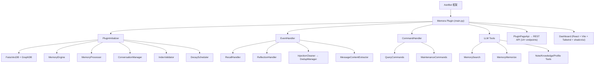

<div align="center">


# Memora

### 面向 AstrBot 的可配置长期记忆插件

Memora 将对话中的重要信息抽取为可检索、可衰减、可维护的记忆，并在当前请求中按策略提供给 AstrBot。它适合希望让 Bot 保留用户偏好、事实、关系和知识，同时仍能控制成本与隐私边界的部署。

[](LICENSE)
[](https://www.python.org/)
[](metadata.yaml)
[](https://github.com/Soulter/AstrBot)

</div>

---

## 目录

- [核心能力](#核心能力)
- [快速开始](#快速开始)
- [自适应记忆注入](#自适应记忆注入)
- [常用命令](#常用命令)
- [LLM Tools](#llm-tools)
- [Dashboard](#dashboard)
- [REST API](#rest-api)
- [架构总览](#架构总览)
- [开发与测试](#开发与测试)
- [项目结构](#项目结构)
- [许可证](#许可证)

## 核心特性

### 记忆生命周期
- 从对话中自动抽取事实、偏好、经验和关系，并按记忆原子（`MemoryAtom`）保存。
- 支持分类、重要性与情感评分；记忆可按 TTL 衰减并由维护任务清理低价值或过期内容。
- 支持会话总结、知识点和笔记等结构化信息，便于长期回顾与编辑。

### 混合检索
- BM25 全文检索与 FAISS 向量检索并行工作，使用 RRF 等策略融合结果。
- 图记忆提供实体关系和关联发现；文档路与图路可合并召回。
- 可选重排序、查询改写和个性化排序，在准确率与成本之间调整。

### 记忆注入
- 通过 Manual、Auto 或 Hybrid 路由选择 Tool First、Low Cost、Balanced、Quality 等预设。
- 动态记忆只在当前请求中临时注入，受全局预算、隐私和角色约束；不会写入 System Prompt。
- 决策观测仅保存允许的标量字段，不记录查询文本、记忆正文、记忆 ID 或 Provider 凭证。

### 组织与管理
- Dashboard 用于浏览和编辑记忆、图谱、时间线、用户画像、知识库、笔记及系统状态。
- AstrBot Agent 可调用记忆搜索、主动记忆、笔记、知识库和用户画像工具。
- 提供 `/memora` 查询、总结、索引重建、图重建和清理命令。

### 可靠性与安全
- SQLite 是 canonical memory 的权威持久化；BM25、FAISS 和图索引均可重建。
- Provider 暂不可用时，初始化在后台等待并重试，不阻断插件加载流程。
- 写回保留 revision 并进行字段校验；注入内容经过隐私过滤和历史注入清理。

## 架构总览

### 系统架构



### 数据流

```
User Message → EventHandler → MessageContentExtractor → ConversationManager.store
                                                            │
                         ┌──────────────────────────────────┘
                         ▼
              MemoryProcessor (LLM 抽取) → MemoryEngine
                         │                    │
                         │    ┌───────────────┼───────────────┐
                         │    ▼               ▼               ▼
                         │  AtomStore    GraphStore     NoteStore
                         │  (SQLite)     (SQLite+FAISS) (SQLite)
                         │    │               │
                         │    ▼               ▼
                         │  BM25Retriever   GraphRetriever
                         │  VectorRetriever  (keyword+vector)
                         │    │               │
                         │    └───────┬───────┘
                         │            ▼
                         │       HybridRetriever (RRF)
                         │            │
                         │            ▼
                         └─── DualRouteRetriever (文档+图双路)
                                      │
                                      ▼
                              Reranker (CrossEncoder/LLM)
                                      │
                                      ▼
                              PersonalizedRanker
                                      │
                                      ▼
                              Recall Results → injection into LLM context
```

### 模块结构

| 模块 | 职责 |
|------|------|
| `core/` | 后端核心：初始化、事件处理、记忆处理、检索、存储、安全与 Page API |
| `pages/dashboard/` | React Web 管理面板 |
| `tests/` | pytest、契约和回归测试 |
| `scripts/` | smoke、门禁与维护脚本 |
| `docs/` | 开发、设计与发布文档 |

## 快速开始

### 环境要求

- **Python** 3.12+
- **Node.js** 20（仅在开发或构建 Dashboard 时需要）
- **AstrBot** ≥ 4.24.2
- **Embedding Provider** 已在 AstrBot 中配置（用于向量化）
- **LLM Provider** 已在 AstrBot 中配置（用于记忆抽取）

### 安装

1. 将插件目录放入 AstrBot 的 `data/plugins/` 路径下：

```bash
cd <astrbot-root>/data/plugins/
git clone https://github.com/INSide-734/astrbot_plugin_memora.git
```

2. 安装依赖：

```bash
cd astrbot_plugin_memora
pip install -r requirements.txt
```

3. 重启 AstrBot，插件会自动注册并开始后台初始化。

4. 初始化需要 Embedding Provider 和 LLM Provider 在 AstrBot 中正确配置。若 Provider 暂不可用，插件会在后台等待并重试，不视为安装失败。

### 首次验证

1. 在 AstrBot 日志中确认 Memora 初始化完成，或确认它正在等待 Provider。
2. 以管理员身份发送 `/memora status`，检查核心组件状态。
3. 发送一段包含稳定偏好或事实的对话，再用 `/memora search <query>` 验证召回。

### 开发校验

开发环境准备和统一质量门见 [`docs/DEV_SETUP.md`](docs/DEV_SETUP.md)。

```bash
python scripts/check_all.py
```

### 配置

插件使用 AstrBot 的标准配置系统。所有可配置项及其默认值定义在 `core/base/config_defaults.py` 中，通过 `_conf_schema.json` 暴露给 AstrBot 的配置界面。

主要配置项：

| 配置项 | 说明 | 默认值 |
|--------|------|--------|
| `bot_language` | 界面语言 | `zh` |
| `provider_settings` | Embedding 与 LLM Provider ID | 留空使用 AstrBot 默认 |
| 详见 `_conf_schema.json` | 完整配置列表与默认值 | — |

## 自适应记忆注入

默认策略由以下字段控制：

| 配置项 | 默认值 | 作用 |
|--------|--------|------|
| `injection_routing_mode` | `manual` | 选择手动、自动或混合路由 |
| `injection_manual_preset` | `balanced` | 手动模式使用的策略预设 |
| `injection_delivery_override` | `auto` | 根据预设和 Provider 能力选择临时传输方式 |

普通记忆受字符预算和条数上限约束；动态记忆不会进入 System Prompt。决策观测只保存允许的标量字段，不记录查询文本、记忆正文、记忆 ID 或原始身份标识。

`recall_engine.injection_method` 已移除且不提供兼容迁移。升级后请在新的注入字段中重新配置，不要继续写入旧字段。

## 命令

以下命令均要求管理员权限：

| 命令 | 说明 |
|------|------|
| `/memora status` | 查看插件初始化状态与核心组件状态 |
| `/memora search <query> [k]` | 搜索记忆，`k` 默认为 5 |
| `/memora forget <doc_id>` | 删除指定记忆 |
| `/memora rebuild-index` | 重建向量/BM25 索引 |
| `/memora rebuild-graph` | 重建图记忆索引 |
| `/memora webui` | 输出 WebUI 访问信息 |
| `/memora summarize` | 立即触发当前会话总结 |
| `/memora reset` | 重置当前会话长期记忆上下文 |
| `/memora cleanup [preview|exec]` | 清理历史消息中的记忆注入片段 |
| `/memora help` | 查看帮助信息 |

示例：

```text
/memora status
/memora search 喜欢的音乐 5
```

## LLM Tools

Memora 为 AstrBot Agent 系统提供以下工具：

| 工具 | 说明 |
|------|------|
| `MemorySearchTool` | 搜索记忆库，支持语义和关键词查询 |
| `MemoryMemorizeTool` | 主动记忆，将信息存入记忆库 |
| `NoteTools` | 笔记管理：创建、查询、更新、删除 |
| `KnowledgeTools` | 知识库管理：检索、录入、更新 |
| `ProfileTools` | 用户画像管理：查询、更新 |

## Dashboard

Memora 提供完整的 Web 管理面板，基于 React + Vite + Tailwind CSS + shadcn/ui 构建。数据密集页面统一使用基于 TanStack React Table 的 DataTable，支持服务端排序、真实分页、列显隐/顺序/固定和密度偏好；实体详情与编辑统一使用可滚动、可访问的 EntityEditorSheet。

### 启动开发服务器

```bash
cd pages/dashboard
npm install
npm run dev       # 开发模式 (http://localhost:5173)
npm run build     # 生产构建 → 输出到 assets/
npm run check:artifacts  # 检查 AstrBot 兼容产物
npm run test      # Vitest: bridge + hooks
```

### 功能页面

| 页面 | 说明 |
|------|------|
| **Memory** | 记忆原子浏览、搜索、管理 |
| **Graph** | 知识图谱可视化 |
| **Recall** | 记忆召回测试与调试 |
| **Timeline** | 记忆时间线浏览 |
| **Profiles** | 用户画像管理 |
| **Knowledge** | 知识库管理 |
| **Notes** | 笔记管理 |
| **Learning** | 自动学习状态监控 |
| **System** | 系统状态与维护工具 |
| **Preview** | 数据预览 |

## REST API

插件自动注册 14+ 个 REST API 端点，完整列表如下：

| 端点 | 方法 | 说明 |
|------|------|------|
| `/api/plugin/memora/memory/read` | GET | 读取记忆原子 |
| `/api/plugin/memora/memory/write` | POST | 写入记忆原子 |
| `/api/plugin/memora/memory/batch` | POST | 批量操作 |
| `/api/plugin/memora/memory/stats` | GET | 记忆统计 |
| `/api/plugin/memora/memory/recall` | POST | 记忆召回 |
| `/api/plugin/memora/graph/*` | GET/POST | 图记忆操作 |
| `/api/plugin/memora/knowledge/*` | GET/POST | 知识库操作 |
| `/api/plugin/memora/notes/*` | GET/POST | 笔记操作 |
| `/api/plugin/memora/profiles/*` | GET/POST | 用户画像操作 |
| `/api/plugin/memora/backup/*` | GET/POST | 备份管理 |
| `/api/plugin/memora/learning/*` | GET | 学习状态 |
| `/api/plugin/memora/maintenance/*` | POST | 维护操作 |
| `/api/plugin/memora/realtime/*` | SSE | 实时事件流 |

## 技术栈

### 后端
- **向量存储**: faiss-cpu
- **结构化存储**: aiosqlite + FTS5 全文检索
- **图计算**: networkx
- **分词**: jieba
- **跨平台**: pytz
- **异步 I/O**: aiofiles

### 前端 (Dashboard)
- **框架**: React 18 + TypeScript
- **构建**: Vite
- **样式**: Tailwind CSS
- **组件**: shadcn/ui
- **数据表格**: TanStack React Table（DataTable 共享封装）
- **状态管理**: React Context + Hooks
- **图表**: Recharts

## 测试

Memora 使用 pytest + Vitest 作为最小质量门禁：

- 后端：`tests/` 下的 pytest 回归测试
- 前端：Dashboard 的 `bridge` / `useRealtimeStream` 单测
- 契约：Python 侧 Page API contract test，校验前端端点与后端注册一致

```bash
# 运行全部测试
pytest tests/ -v

# 运行特定测试
pytest tests/test_memory_atom.py -v

# 带覆盖率报告
pytest tests/ -v --cov=core --cov-report=term-missing
```

Mock 策略：`tests/conftest.py` 提供完整的 AstrBot 框架 Mock，无需真实 AstrBot 环境即可运行测试。

测试覆盖：
- 记忆原子模型
- BM25 检索
- 衰减调度
- 情绪评分
- 混合检索
- RRF 融合
- 知识抽取
- 笔记生成
- 隐私过滤
- 查询重写
- 季节性召回
- 主动提醒
- 用户画像
- SSE 端点

## 项目结构

```
astrbot_plugin_memora/
├── main.py                    # 插件入口，MemoraPlugin 主类
├── metadata.yaml              # 插件元数据
├── requirements.txt           # Python 依赖
├── _conf_schema.json          # AstrBot 配置 Schema
├── LICENSE                    # AGPL-3.0 许可证
├── logo.png                   # 插件 Logo
├── AGENTS.md                  # 根级协作入口与项目总览
├── DESIGN.md                  # 项目级设计约定与版本策略
├── CLAUDE.md                  # 根级架构补充说明
│
├── core/                      # 核心代码
│   ├── base/                  # 配置管理、常量、异常
│   ├── initializer/           # 插件初始化编排
│   ├── managers/              # 核心业务逻辑（40+ 文件）
│   ├── processors/            # LLM 记忆抽取（20 文件）
│   ├── retrieval/             # 多路检索系统（22 文件）
│   ├── storage/               # SQLite 持久化（16 文件）
│   ├── api/                   # REST API（15 文件）
│   ├── validators/            # 索引验证与重建（5 文件）
│   ├── schedulers/            # 衰减与备份调度
│   ├── models/                # 数据模型定义（8 文件）
│   ├── tools/                 # LLM Agent 工具（5 文件）
│   ├── commands/              # 用户命令
│   ├── handlers/              # 事件处理器
│   ├── cleaners/              # 注入清理
│   ├── dedup/                 # 消息去重
│   ├── extractors/            # 内容提取
│   └── i18n/                  # 国际化（zh / en / ru）
│
├── pages/dashboard/           # Web 管理面板
│   └── src/pages/             # 10 个功能页面
│
├── tests/                     # pytest 测试套件（19 文件）
├── scripts/                   # 工具脚本
├── docs/                      # 文档
└── .ccg/                      # CCG 任务追踪
```

## 许可证

本项目基于 [GNU Affero General Public License v3.0 (AGPL-3.0)](LICENSE) 开源。

> 简而言之：您可以自由使用、修改和分发本项目，但如果您通过网络提供服务，必须公开修改后的源代码。

## 致谢

- [AstrBot](https://github.com/Soulter/AstrBot) — 优秀的 QQ 机器人框架
- [faiss](https://github.com/facebookresearch/faiss) — 高效的向量相似度搜索
- [shadcn/ui](https://ui.shadcn.com/) — 精美的 React 组件库
