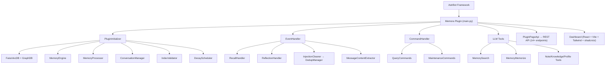

<div align="center">


# Memora

### An Intelligent Long-Term Memory Plugin for AstrBot

[](LICENSE)
[](https://www.python.org/)
[](metadata.yaml)
[](https://github.com/Soulter/AstrBot)

</div>

---

## Overview

**Memora** is a comprehensive long-term memory plugin for [AstrBot](https://github.com/Soulter/AstrBot), providing end-to-end memory lifecycle management: from message capture, content extraction, and vector storage, to BM25+vector hybrid retrieval, memory decay & forgetting scheduling, graph memory, knowledge base, note system, user profiling, and more.

With **MemoryAtom** as the core data unit, Memora enables fine-grained memory storage, retrieval, and evolution — allowing your Bot to truly "remember" every conversation.

## Core Features

### Memory Lifecycle Management
- **Auto Extraction** — LLM-driven, automatically identifies and extracts valuable information from conversations
- **Smart Classification** — Multi-dimensional classification (facts/preferences/experiences/relationships), extensible taxonomy
- **TTL Decay** — Memories naturally decay over time, supporting linear/exponential/logarithmic decay strategies
- **Forgetting Scheduler** — Automatically forgets low-value/expired memories, keeping the memory store clean
- **Emotion Scoring** — Attaches emotional intensity to memories, influencing memory weight and recall priority

### Multi-Path Hybrid Retrieval
- **BM25 Full-Text Search** — Chinese full-text search based on jieba tokenization
- **FAISS Vector Search** — Semantic similarity search based on embeddings
- **RRF Fusion** — Reciprocal Rank Fusion merging BM25 + vector ranking
- **Graph Retrieval** — Knowledge graph retrieval via networkx (keyword + vector dual-path → fusion)
- **Dual-Route Retrieval** — Document path + Graph path → DualRouteRetriever, parallel recall
- **Reranking** — CrossEncoder / LLM reranking for improved result precision
- **Personalized Ranking** — Personalized result ranking based on user profiles and interaction history

### Graph Memory
- Automatic entity relationship graph construction
- Knowledge reasoning and association discovery
- Visual graph browsing (Dashboard support)

### Knowledge Base & Notes
- **Knowledge Base** — Automatically extracts knowledge points from conversations, structured storage
- **Note System** — LLM-driven conversation summarization and note generation
- **Tag Management** — Flexible tagging system with multi-dimensional categorization

### User Profiles
- Automatically builds user profiles from conversations
- Tracks user preferences, habits, and interests
- Supports personalized conversation strategies

### Intelligent Features
- **Proactive Reminders** — Memory-based proactive reminders and suggestions
- **Reflection Mechanism** — Periodic review and integration of memories
- **Auto Learning** — Continuous learning and optimization from interactions
- **Anomaly Detection** — Detects memory quality anomalies, triggers automatic maintenance
- **Seasonal Recall** — Time-sensitive periodic memory recall
- **Privacy Filtering** — Automatic filtering of sensitive information

### Engineering Features
- **Multi-Language Support** — 中文 / English / Русский interface
- **Web Dashboard** — React + shadcn/ui admin panel with 10 feature pages
- **REST API** — Complete RESTful API with 14+ endpoints
- **Auto Backup** — Automatic data backup on version upgrades
- **Index Validation** — Index consistency verification and automatic rebuild
- **Fault Tolerance** — Background retry when Provider is unavailable (up to 60 attempts)

## Architecture Overview

### System Architecture



### Data Flow

```
User Message → EventHandler → MessageContentExtractor → ConversationManager.store
                                                            │
                         ┌──────────────────────────────────┘
                         ▼
              MemoryProcessor (LLM Extraction) → MemoryEngine
                         │                    │
                         │    ┌───────────────┼───────────────┐
                         │    ▼               ▼               ▼
                         │  AtomStore    GraphStore     NoteStore
                         │  (SQLite)     (SQLite+FAISS) (SQLite)
                         │    │               │
                         │    ▼               ▼
                         │  BM25Retriever   GraphRetriever
                         │  VectorRetriever  (keyword+vector)
                         │    │               │
                         │    └───────┬───────┘
                         │            ▼
                         │       HybridRetriever (RRF)
                         │            │
                         │            ▼
                         └─── DualRouteRetriever (Doc+Graph)
                                      │
                                      ▼
                              Reranker (CrossEncoder/LLM)
                                      │
                                      ▼
                              PersonalizedRanker
                                      │
                                      ▼
                              Recall Results → injected into LLM context
```

### Module Overview

| Module | Files | Responsibility |
|--------|-------|----------------|
| `core/base/` | 5 | Configuration, constants, exception definitions |
| `core/initializer/` | 6 | Plugin initialization orchestration, Provider loading, DB setup |
| `core/managers/` | 40+ | Core business logic: memory engine, conversation, decay, backup |
| `core/processors/` | 20 | LLM-driven memory extraction, classification, formatting |
| `core/retrieval/` | 22 | Multi-path retrieval: BM25, vector, hybrid, graph, reranking |
| `core/storage/` | 16 | SQLite persistence: atoms, conversations, graphs, notes, knowledge |
| `core/api/` | 15 | REST API endpoints: CRUD, batch, stats, backup |
| `core/validators/` | 5 | Index consistency verification and rebuild |
| `core/schedulers/` | 2 | Memory decay and backup scheduling |
| `core/models/` | 8 | Data model definitions |
| `core/tools/` | 5 | AstrBot LLM Agent tool integration |
| `core/commands/` | 3 | User commands: query and maintenance |
| `core/handlers/` | 3 | Recall and reflection event handlers |
| `core/cleaners/` | 2 | Injection cleaning |
| `core/dedup/` | 2 | Message deduplication |
| `core/extractors/` | 2 | Message content extraction |
| `pages/dashboard/` | — | React web admin panel (10 pages) |
| `tests/` | 19 | pytest test suite |

## Quick Start

### Requirements

- **Python** 3.12+
- **AstrBot** ≥ 4.24.2
- **Embedding Provider** configured in AstrBot (for vectorization)
- **LLM Provider** configured in AstrBot (for memory extraction)

### Installation

1. Place the plugin directory into AstrBot's `data/plugins/` path:

```bash
cd <astrbot-root>/data/plugins/
git clone https://github.com/INSide-734/astrbot_plugin_memora.git
```

2. Install dependencies:

```bash
cd astrbot_plugin_memora
pip install -r requirements.txt
```

3. Restart AstrBot — the plugin will automatically register and begin background initialization.

4. Initialization requires both Embedding Provider and LLM Provider to be properly configured in AstrBot. If Providers are temporarily unavailable, the plugin enters background retry mode (up to 60 attempts).
## Developer Validation

Developer setup and the unified quality gate are documented in `docs/DEV_SETUP.md`. The locked uv environment is the reproducible source for development and CI; `requirements.txt` remains the AstrBot plugin installation entrypoint.
Run `uv sync --locked --dev`, then `uv run --locked python scripts/check_all.py`.

## Adaptive memory injection

- Injection routing is selectable as Manual, Auto, or Hybrid. New installations default to `manual + balanced + auto delivery`.
- The four presets are Tool First, Low Cost, Balanced, and Quality. Their ordinary-memory character budgets are `0/800/1200/2400`, with maximum counts of `0/2/4/6`.
- Dynamic memory never uses the System Prompt. Its payload is temporary to the current request and always constrained by a global hard budget.
- The Dashboard provides a complete Injection Strategy workbench with Overview, Strategy Configuration, and Decision History.
- Decision metadata is fully persisted in the SQLite `injection_decisions` table without query text, memory bodies/IDs, or raw identity values. Retention defaults to 30 days and 100,000 rows; both limits are configurable.
- Normal shutdown waits up to five seconds to flush pending writes. A process crash may lose the final unflushed batch.
- This is a breaking configuration change: `recall_engine.injection_method` has been removed with no compatibility migration, so administrators must reconfigure the new strategy fields.

## Commands

| Command | Description |
|---------|-------------|
| `/memora status` | Show plugin readiness and core component status |
| `/memora health` | Show the runtime health score, affected domains, and fixed troubleshooting suggestions |
| `/memora diagnostics` | Show the live Provider, recall, task, index, and write diagnostics snapshot |
| `/memora search <query> [k]` | Search memories, with `k=5` by default |
| `/memora trace <query> [k]` | Trace recall stages and scores for the current session without echoing memory bodies in chat |
| `/memora forget <doc_id>` | Delete a specific memory |
| `/memora rebuild-index` | Rebuild vector/BM25 indexes |
| `/memora rebuild-graph` | Rebuild graph-memory indexes |
| `/memora webui` | Show WebUI access information |
| `/memora summarize` | Trigger immediate session summarization |
| `/memora reset` | Reset long-term memory context for the current session |
| `/memora cleanup [preview|exec]` | Clean memory injection fragments from historical messages |
| `/memora update [check|download|apply]` | Check, download, or install a SHA-256-verified runtime update; `apply` reloads and rolls back when supported |
| `/memora help` | Show command help |

## LLM Tools

Memora provides the following tools for the AstrBot Agent system:

| Tool | Description |
|------|-------------|
| `MemorySearchTool` | Search memory store with semantic and keyword queries |
| `MemoryMemorizeTool` | Actively memorize — store information into memory |
| `NoteTools` | Note management: create, query, update, delete |
| `KnowledgeTools` | Knowledge base management: search, ingest, update |
| `ProfileTools` | User profile management: query, update |

## Dashboard

Memora includes a full web admin panel built with React + Vite + Tailwind CSS + shadcn/ui.

### Start Dev Server

```bash
cd pages/dashboard
npm install
npm run dev       # Dev mode (http://localhost:5173)
npm run build     # Production build → output to assets/
npm run check:artifacts  # Check AstrBot-compatible build artifacts
npm run test      # Vitest: bridge + hooks
```

### Pages

| Page | Description |
|------|-------------|
| **Memory** | Browse, search, and manage memory atoms |
| **Graph** | Knowledge graph visualization |
| **Recall** | Memory recall testing and debugging |
| **Timeline** | Memory timeline browsing |
| **Profiles** | User profile management |
| **Knowledge** | Knowledge base management |
| **Notes** | Note management |
| **Learning** | Auto-learning status monitoring |
| **System** | System status and maintenance tools |
| **Preview** | Data preview |

The Evaluation page never reads repository test fixtures. After installation it automatically selects **Current memories** and builds an in-memory self-retrieval sample from up to 20 recent active memories, so **Run** works without an upload and no sample text is persisted. This mode measures whether stored memories can retrieve themselves. To measure relevance for real business questions, choose **Import dataset** and provide a labeled `.jsonl`; every line must contain `case_id`, `query`, and `relevant_doc_ids`, whose values are canonical integer IDs in the current memory database:

```json
{"case_id":"coffee-preference","query":"Which coffee does the user prefer?","relevant_doc_ids":["17"],"metadata":{"session_id":"private:example","chat_type":"private"}}
```

Use `"__no_relevant__"` as the sole relevant marker for a correct negative case. Imported datasets appear immediately in the selector and are stored under `evaluation_datasets/` in the plugin data directory.

## REST API

The plugin automatically registers 14+ REST API endpoints:

| Endpoint | Method | Description |
|----------|--------|-------------|
| `/api/plugin/memora/memory/read` | GET | Read memory atoms |
| `/api/plugin/memora/memory/write` | POST | Write memory atoms |
| `/api/plugin/memora/memory/batch` | POST | Batch operations |
| `/api/plugin/memora/memory/stats` | GET | Memory statistics |
| `/api/plugin/memora/memory/recall` | POST | Memory recall |
| `/api/plugin/memora/graph/*` | GET/POST | Graph memory operations |
| `/api/plugin/memora/knowledge/*` | GET/POST | Knowledge base operations |
| `/api/plugin/memora/notes/*` | GET/POST | Note operations |
| `/api/plugin/memora/profiles/*` | GET/POST | User profile operations |
| `/api/plugin/memora/backup/*` | GET/POST | Backup management |
| `/api/plugin/memora/learning/*` | GET | Learning status |
| `/api/plugin/memora/maintenance/*` | POST | Maintenance operations |
| `/api/plugin/memora/realtime/*` | SSE | Real-time event stream |

## Tech Stack

### Backend
- **Vector Store**: faiss-cpu
- **Structured Store**: aiosqlite + FTS5 full-text search
- **Graph Computing**: networkx
- **Tokenization**: jieba
- **Timezone**: pytz
- **Async I/O**: aiofiles

### Frontend (Dashboard)
- **Framework**: React 18 + TypeScript
- **Builder**: Vite
- **Styling**: Tailwind CSS
- **Components**: shadcn/ui
- **State**: React Context + Hooks
- **Charts**: Recharts

## Testing

Memora uses the pytest framework with 19 test files covering core functionality.

```bash
# Run all tests
pytest tests/ -v

# Run specific test
pytest tests/test_memory_atom.py -v

# With coverage report
pytest tests/ -v --cov=core --cov-report=term-missing
```

Mock strategy: `tests/conftest.py` provides a complete AstrBot framework mock — tests run without a real AstrBot environment.

Test coverage includes:
- Memory atom models
- BM25 retrieval
- Decay scheduling
- Emotion scoring
- Hybrid retrieval
- RRF fusion
- Knowledge extraction
- Note generation
- Privacy filtering
- Query rewriting
- Seasonal recall
- Proactive reminders
- User profiles
- SSE endpoints

## Project Structure

```
astrbot_plugin_memora/
├── main.py                    # Plugin entry point, MemoraPlugin class
├── metadata.yaml              # Plugin metadata
├── requirements.txt           # Python dependencies
├── _conf_schema.json          # AstrBot config schema
├── LICENSE                    # AGPL-3.0 license
├── logo.png                   # Plugin logo
├── AGENTS.md                  # Root collaboration entry and project overview
├── DESIGN.md                  # Project-level design conventions and version policy
├── CLAUDE.md                  # Root architecture supplement
│
├── core/                      # Core source code
│   ├── base/                  # Config, constants, exceptions
│   ├── initializer/           # Plugin initialization orchestration
│   ├── managers/              # Core business logic (40+ files)
│   ├── processors/            # LLM memory extraction (20 files)
│   ├── retrieval/             # Multi-path retrieval (22 files)
│   ├── storage/               # SQLite persistence (16 files)
│   ├── api/                   # REST API (15 files)
│   ├── validators/            # Index validation & rebuild (5 files)
│   ├── schedulers/            # Decay & backup scheduling
│   ├── models/                # Data model definitions (8 files)
│   ├── tools/                 # LLM Agent tools (5 files)
│   ├── commands/              # User commands
│   ├── handlers/              # Event handlers
│   ├── cleaners/              # Injection cleaning
│   ├── dedup/                 # Message deduplication
│   ├── extractors/            # Content extraction
│   └── i18n/                  # Internationalization (zh / en / ru)
│
├── pages/dashboard/           # Web admin panel
│   └── src/pages/             # 10 feature pages
│
├── tests/                     # pytest test suite (19 files)
├── scripts/                   # Utility scripts
├── docs/                      # Documentation
└── .ccg/                      # CCG task tracking
```

## License

This project is open-sourced under the [GNU Affero General Public License v3.0 (AGPL-3.0)](LICENSE).

> In short: you are free to use, modify, and distribute this project, but if you provide it as a network service, you must disclose the modified source code.

## Acknowledgements

- [AstrBot](https://github.com/Soulter/AstrBot) — Excellent QQ bot framework
- [faiss](https://github.com/facebookresearch/faiss) — Efficient vector similarity search
- [shadcn/ui](https://ui.shadcn.com/) — Beautiful React component library
