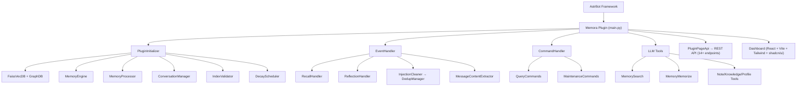

<div align="center">


# Memora

### Интеллектуальный плагин долговременной памяти для AstrBot

[](LICENSE)
[](https://www.python.org/)
[](metadata.yaml)
[](https://github.com/Soulter/AstrBot)

</div>

---

## Обзор

**Memora** — это комплексный плагин долговременной памяти для [AstrBot](https://github.com/Soulter/AstrBot), обеспечивающий полный жизненный цикл памяти: от захвата сообщений, извлечения контента и векторного хранения до BM25+векторного гибридного поиска, планирования затухания и забывания, графовой памяти, базы знаний, системы заметок, профилирования пользователей и многого другого.

С **MemoryAtom (Атомом Памяти)** в качестве основной единицы данных, Memora обеспечивает детальное хранение, извлечение и эволюцию памяти — позволяя вашему боту по-настоящему «помнить» каждый разговор.

## Ключевые возможности

### Управление жизненным циклом памяти
- **Автоматическое извлечение** — На основе LLM, автоматически выявляет и извлекает ценную информацию из разговоров
- **Умная классификация** — Многомерная классификация (факты/предпочтения/опыт/отношения), расширяемая таксономия
- **TTL затухание** — Память естественно затухает со временем, поддерживаются линейная/экспоненциальная/логарифмическая стратегии
- **Планировщик забывания** — Автоматически забывает малоценные/устаревшие воспоминания, поддерживая чистоту хранилища
- **Эмоциональная оценка** — Прикрепляет эмоциональную интенсивность к воспоминаниям, влияя на их вес и приоритет при вызове

### Многопутевой гибридный поиск
- **BM25 полнотекстовый поиск** — Китайский полнотекстовый поиск на основе токенизации jieba
- **FAISS векторный поиск** — Семантический поиск по сходству на основе эмбеддингов
- **RRF слияние** — Reciprocal Rank Fusion, объединяющее BM25 + векторное ранжирование
- **Графовый поиск** — Поиск по графу знаний через networkx (ключевые слова + векторный двойной путь → слияние)
- **Двухмаршрутный поиск** — Путь документов + путь графа → DualRouteRetriever, параллельный вызов
- **Ранжирование** — ранжирование по сходству Embedding / LLM для повышения точности результатов
- **Персонализированное ранжирование** — Ранжирование на основе профилей пользователей и истории взаимодействий

### Графовая память
- Автоматическое построение графа отношений сущностей
- Логический вывод знаний и обнаружение ассоциаций
- Визуальный просмотр графа (поддержка Dashboard)

### База знаний и заметки
- **База знаний** — Автоматически извлекает знания из разговоров, структурированное хранение
- **Система заметок** — Суммаризация разговоров и генерация заметок на основе LLM
- **Управление тегами** — Гибкая система тегов с многомерной категоризацией

### Профили пользователей
- Автоматическое построение профилей пользователей из разговоров
- Отслеживание предпочтений, привычек и интересов пользователей
- Поддержка персонализированных стратегий общения

### Интеллектуальные функции
- **Проактивные напоминания** — Напоминания и предложения на основе памяти
- **Механизм рефлексии** — Периодический обзор и интеграция воспоминаний
- **Автообучение** — Непрерывное обучение и оптимизация на основе взаимодействий
- **Обнаружение аномалий** — Выявление аномалий качества памяти, автоматическое обслуживание
- **Сезонный вызов** — Чувствительный ко времени периодический вызов памяти
- **Фильтрация конфиденциальности** — Автоматическая фильтрация чувствительной информации

### Инженерные возможности
- **Многоязычная поддержка** — 中文 / English / Русский интерфейс
- **Веб-панель управления** — React + shadcn/ui админ-панель с 10 страницами
- **REST API** — Полный RESTful API с 14+ конечными точками
- **Авторезервное копирование** — Автоматическое резервное копирование данных при обновлении версии
- **Валидация индексов** — Проверка согласованности индексов и автоматическое перестроение
- **Отказоустойчивость** — Фоновые повторные попытки при недоступности Provider (до 60 попыток)

## Обзор архитектуры

### Системная архитектура



### Поток данных

```
User Message → EventHandler → MessageContentExtractor → ConversationManager.store
                                                            │
                         ┌──────────────────────────────────┘
                         ▼
              MemoryProcessor (LLM извлечение) → MemoryEngine
                         │                    │
                         │    ┌───────────────┼───────────────┐
                         │    ▼               ▼               ▼
                         │  AtomStore    GraphStore     NoteStore
                         │  (SQLite)     (SQLite+FAISS) (SQLite)
                         │    │               │
                         │    ▼               ▼
                         │  BM25Retriever   GraphRetriever
                         │  VectorRetriever  (keyword+vector)
                         │    │               │
                         │    └───────┬───────┘
                         │            ▼
                         │       HybridRetriever (RRF)
                         │            │
                         │            ▼
                         └─── DualRouteRetriever (Doc+Graph)
                                      │
                                      ▼
                         Reranker (Embedding similarity/LLM)
                                      │
                                      ▼
                              PersonalizedRanker
                                      │
                                      ▼
                              Recall Results → инъекция в контекст LLM
```

### Обзор модулей

| Модуль | Файлов | Ответственность |
|--------|--------|-----------------|
| `core/base/` | 5 | Конфигурация, константы, исключения |
| `core/initializer/` | 6 | Оркестрация инициализации, загрузка Provider, настройка БД |
| `core/managers/` | 40+ | Основная бизнес-логика: движок памяти, разговоры, затухание, бэкап |
| `core/processors/` | 20 | Извлечение памяти на основе LLM, классификация, форматирование |
| `core/retrieval/` | 22 | Многопутевой поиск: BM25, векторный, гибридный, графовый, ранжирование |
| `core/storage/` | 16 | SQLite хранение: атомы, разговоры, графы, заметки, знания |
| `core/api/` | 15 | Конечные точки REST API: CRUD, пакетные операции, статистика, бэкап |
| `core/validators/` | 5 | Проверка согласованности индексов и перестроение |
| `core/schedulers/` | 2 | Планирование затухания памяти и резервного копирования |
| `core/models/` | 8 | Определения моделей данных |
| `core/tools/` | 5 | Интеграция инструментов LLM Agent AstrBot |
| `core/commands/` | 3 | Пользовательские команды: запрос и обслуживание |
| `core/handlers/` | 3 | Обработчики событий вызова и рефлексии |
| `core/cleaners/` | 2 | Очистка инъекций |
| `core/dedup/` | 2 | Дедупликация сообщений |
| `core/extractors/` | 2 | Извлечение содержимого сообщений |
| `pages/dashboard/` | — | React веб-панель администратора (10 страниц) |
| `tests/` | 19 | Набор тестов pytest |

## Быстрый старт

### Требования

- **Python** 3.12+
- **AstrBot** ≥ 4.24.2
- **Embedding Provider** настроен в AstrBot (для векторизации)
- **LLM Provider** настроен в AstrBot (для извлечения памяти)

### Установка

1. Поместите директорию плагина в путь AstrBot `data/plugins/`:

```bash
cd <astrbot-root>/data/plugins/
git clone https://github.com/INSide-734/astrbot_plugin_memora.git
```

2. Установите зависимости:

```bash
cd astrbot_plugin_memora
pip install -r requirements.txt
```

3. Перезапустите AstrBot — плагин автоматически зарегистрируется и начнет фоновую инициализацию.

4. Для инициализации требуются правильно настроенные Embedding Provider и LLM Provider в AstrBot. Если Providers временно недоступны, плагин переходит в режим фоновых повторных попыток (до 60 попыток).
## Проверка разработки

Подготовка окружения разработчика и единый quality gate описаны в `docs/DEV_SETUP.md`. За воспроизводимое окружение разработки и CI отвечает lock-файл uv; `requirements.txt` остаётся точкой установки плагина AstrBot.
Выполните `uv sync --locked --dev`, затем `uv run --locked python scripts/check_all.py`.

## Адаптивная инъекция памяти

- Для маршрутизации инъекции можно выбрать Manual, Auto или Hybrid. Для новых установок по умолчанию используется `manual + balanced + auto delivery`.
- Доступны четыре предустановки: Tool First, Low Cost, Balanced и Quality. Их бюджеты символов для обычной памяти составляют `0/800/1200/2400`, а максимальное количество записей — `0/2/4/6`.
- Динамическая память никогда не помещается в System Prompt. Полезная нагрузка существует только в рамках текущего запроса и всегда ограничена глобальным жёстким бюджетом.
- Dashboard предоставляет полноценную рабочую область Injection Strategy с разделами Overview, Strategy Configuration и Decision History.
- Метаданные решений полностью сохраняются в таблице SQLite `injection_decisions`, но без текста запроса, содержимого/ID памяти и исходных идентификаторов. По умолчанию срок хранения составляет 30 дней, а лимит — 100 000 строк; оба параметра настраиваются.
- При штатном завершении система ожидает сброса отложенных записей до пяти секунд. При аварийном завершении процесса последняя несброшенная пачка может быть потеряна.
- Это несовместимое изменение конфигурации: `recall_engine.injection_method` удалён без миграции совместимости, поэтому администраторы должны заново настроить новые поля стратегии.

## Команды

| Команда | Описание |
|---------|----------|
| `/memora status` | Показать статус готовности плагина и основных компонентов |
| `/memora health` | Показать оценку состояния, затронутые области и фиксированные рекомендации |
| `/memora diagnostics` | Показать текущий снимок Provider, поиска, задач, индекса и записи |
| `/memora search <query> [k]` | Поиск памяти, `k=5` по умолчанию |
| `/memora trace <query> [k]` | Трассировать этапы и оценки поиска текущей сессии без вывода содержимого памяти в чат |
| `/memora forget <doc_id>` | Удалить конкретную запись памяти |
| `/memora rebuild-index` | Перестроить векторные/BM25 индексы |
| `/memora rebuild-graph` | Перестроить индексы графовой памяти |
| `/memora webui` | Показать информацию о доступе к WebUI |
| `/memora summarize` | Немедленно запустить суммаризацию текущей сессии |
| `/memora reset` | Сбросить контекст долговременной памяти текущей сессии |
| `/memora cleanup [preview\|exec]` | Очистить фрагменты инъекций памяти из исторических сообщений |
| `/memora update [check\|download\|apply]` | Проверить, скачать или установить обновление runtime с проверкой SHA-256; `apply` перезагружает и откатывает версию при поддержке хоста |
| `/memora help` | Показать справку по командам |

## Инструменты LLM

Memora предоставляет следующие инструменты для системы AstrBot Agent:

| Инструмент | Описание |
|------------|----------|
| `MemorySearchTool` | Поиск в хранилище памяти с семантическими и ключевыми запросами |
| `MemoryMemorizeTool` | Активное запоминание — сохранение информации в память |
| `NoteTools` | Управление заметками: создание, запрос, обновление, удаление |
| `KnowledgeTools` | Управление базой знаний: поиск, добавление, обновление |
| `ProfileTools` | Управление профилями пользователей: запрос, обновление |

## Панель управления (Dashboard)

Memora включает полную веб-панель администратора, построенную на React + Vite + Tailwind CSS + shadcn/ui.

### Запуск сервера разработки

```bash
cd pages/dashboard
npm install
npm run dev       # Режим разработки (http://localhost:5173)
npm run build     # Продакшн-сборка → вывод в assets/
npm run check:artifacts  # Проверка артефактов сборки для AstrBot
npm run test      # Vitest: bridge + hooks
```

### Страницы

| Страница | Описание |
|----------|----------|
| **Memory** | Просмотр, поиск и управление атомами памяти |
| **Graph** | Визуализация графа знаний |
| **Recall** | Тестирование и отладка вызова памяти |
| **Timeline** | Просмотр временной шкалы памяти |
| **Profiles** | Управление профилями пользователей |
| **Knowledge** | Управление базой знаний |
| **Notes** | Управление заметками |
| **Learning** | Мониторинг состояния автообучения |
| **System** | Состояние системы и инструменты обслуживания |
| **Preview** | Предварительный просмотр данных |

Страница оценки не читает тестовые фикстуры репозитория. После установки она автоматически выбирает **Текущие воспоминания** и создаёт в памяти выборку самопоиска максимум из 20 последних активных записей, поэтому оценку можно запустить без загрузки файла, а текст выборки не сохраняется. Этот режим проверяет, может ли память находить саму себя. Для проверки релевантности реальных вопросов импортируйте размеченный `.jsonl`; каждая строка должна содержать `case_id`, `query` и `relevant_doc_ids`, а идентификаторы должны быть существующими каноническими целыми ID памяти:

```json
{"case_id":"coffee-preference","query":"Какой кофе предпочитает пользователь?","relevant_doc_ids":["17"],"metadata":{"session_id":"private:example","chat_type":"private"}}
```

Для корректного отрицательного примера используйте единственную метку `"__no_relevant__"`. После импорта набор сразу появляется в селекторе и сохраняется в `evaluation_datasets/` каталога данных плагина.

## REST API

Плагин автоматически регистрирует 14+ конечных точек REST API:

| Конечная точка | Метод | Описание |
|---------------|--------|----------|
| `/api/plugin/memora/memory/read` | GET | Чтение атомов памяти |
| `/api/plugin/memora/memory/write` | POST | Запись атомов памяти |
| `/api/plugin/memora/memory/batch` | POST | Пакетные операции |
| `/api/plugin/memora/memory/stats` | GET | Статистика памяти |
| `/api/plugin/memora/memory/recall` | POST | Вызов памяти |
| `/api/plugin/memora/graph/*` | GET/POST | Операции с графовой памятью |
| `/api/plugin/memora/knowledge/*` | GET/POST | Операции с базой знаний |
| `/api/plugin/memora/notes/*` | GET/POST | Операции с заметками |
| `/api/plugin/memora/profiles/*` | GET/POST | Операции с профилями |
| `/api/plugin/memora/backup/*` | GET/POST | Управление бэкапами |
| `/api/plugin/memora/learning/*` | GET | Статус обучения |
| `/api/plugin/memora/maintenance/*` | POST | Операции обслуживания |
| `/api/plugin/memora/realtime/*` | SSE | Поток событий в реальном времени |

## Технологический стек

### Бэкенд
- **Векторное хранилище**: faiss-cpu
- **Структурированное хранилище**: aiosqlite + FTS5 полнотекстовый поиск
- **Графовые вычисления**: networkx
- **Токенизация**: jieba
- **Часовые пояса**: pytz
- **Асинхронный I/O**: aiofiles

### Фронтенд (Dashboard)
- **Фреймворк**: React 18 + TypeScript
- **Сборщик**: Vite
- **Стилизация**: Tailwind CSS
- **Компоненты**: shadcn/ui
- **Состояние**: React Context + Hooks
- **Графики**: Recharts

## Тестирование

Memora использует фреймворк pytest с 19 тестовыми файлами, охватывающими основную функциональность.

```bash
# Запуск всех тестов
pytest tests/ -v

# Запуск конкретного теста
pytest tests/test_memory_atom.py -v

# С отчетом о покрытии
pytest tests/ -v --cov=core --cov-report=term-missing
```

Стратегия мокирования: `tests/conftest.py` предоставляет полный мок фреймворка AstrBot — тесты работают без реального окружения AstrBot.

Тестовое покрытие включает:
- Модели атомов памяти
- BM25 поиск
- Планирование затухания
- Эмоциональная оценка
- Гибридный поиск
- RRF слияние
- Извлечение знаний
- Генерация заметок
- Фильтрация конфиденциальности
- Переписывание запросов
- Сезонный вызов
- Проактивные напоминания
- Профили пользователей
- SSE конечные точки

## Структура проекта

```
astrbot_plugin_memora/
├── main.py                    # Точка входа плагина, класс MemoraPlugin
├── metadata.yaml              # Метаданные плагина
├── requirements.txt           # Зависимости Python
├── _conf_schema.json          # Схема конфигурации AstrBot
├── LICENSE                    # Лицензия AGPL-3.0
├── logo.png                   # Логотип плагина
├── AGENTS.md                  # Корневой вход для совместной работы и обзор проекта
├── DESIGN.md                  # Проектные дизайн-правила и политика версий
├── CLAUDE.md                  # Дополнительная архитектурная документация
│
├── core/                      # Исходный код ядра
│   ├── base/                  # Конфигурация, константы, исключения
│   ├── initializer/           # Оркестрация инициализации плагина
│   ├── managers/              # Основная бизнес-логика (40+ файлов)
│   ├── processors/            # Извлечение памяти LLM (20 файлов)
│   ├── retrieval/             # Многопутевой поиск (22 файла)
│   ├── storage/               # SQLite хранение (16 файлов)
│   ├── api/                   # REST API (15 файлов)
│   ├── validators/            # Валидация и перестроение индексов (5 файлов)
│   ├── schedulers/            # Планирование затухания и бэкапов
│   ├── models/                # Определения моделей данных (8 файлов)
│   ├── tools/                 # Инструменты LLM Agent (5 файлов)
│   ├── commands/              # Пользовательские команды
│   ├── handlers/              # Обработчики событий
│   ├── cleaners/              # Очистка инъекций
│   ├── dedup/                 # Дедупликация сообщений
│   ├── extractors/            # Извлечение контента
│   └── i18n/                  # Интернационализация (zh / en / ru)
│
├── pages/dashboard/           # Веб-панель администратора
│   └── src/pages/             # 10 функциональных страниц
│
├── tests/                     # Набор тестов pytest (19 файлов)
├── scripts/                   # Вспомогательные скрипты
├── docs/                      # Документация
└── .ccg/                      # Отслеживание задач CCG
```

## Лицензия

Этот проект распространяется под лицензией [GNU Affero General Public License v3.0 (AGPL-3.0)](LICENSE).

> Кратко: вы можете свободно использовать, изменять и распространять этот проект, но если вы предоставляете его как сетевой сервис, вы должны раскрыть измененный исходный код.

## Благодарности

- [AstrBot](https://github.com/Soulter/AstrBot) — Отличный фреймворк для QQ ботов
- [faiss](https://github.com/facebookresearch/faiss) — Эффективный поиск векторного сходства
- [shadcn/ui](https://ui.shadcn.com/) — Красивая библиотека React компонентов
