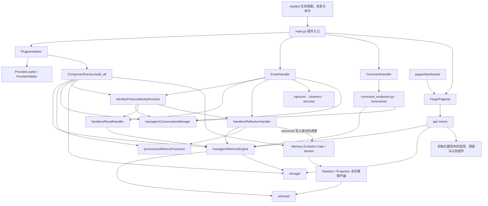

# `core` 运行时总览

**最后更新：** 2026-07-23
**导航：** [项目根级 `AGENTS.md`](../AGENTS.md) / `core`

## 职责边界

`core` 是 Memora 的 Python 运行时：承接 `main.py` 暴露给 AstrBot 的插件生命周期、消息钩子、命令与管理页面请求，集中装配共享组件，再把算法、数据访问和领域行为委托给子模块。

- 顶层文件负责平台适配、初始化、事件/命令分派、页面 API 聚合、功能委托、国际化入口与版本检查。
- `MemoryEngine` 的实际门面位于 `managers/memory_engine.py`；不要在 `core` 顶层另建同名实现。
- 检索、存储、处理、安全、监控等实现必须留在对应子模块；页面 API 和命令层不得维护第二份业务状态。
- 依赖主方向为 `main.py` → `core` 顶层编排器 → `core/<子模块>`。子模块不得反向导入 `main.py`，跨模块协作优先通过构造注入或公开接口。

## 关键入口与接口

| 入口 | 公开职责 | 主要下游 |
|---|---|---|
| `../main.py` | AstrBot 插件入口；创建并持有初始化器、事件处理器、命令处理器、页面 API 与功能委托 | 本表其余入口 |
| `plugin_initializer.py` · `PluginInitializer` | 提供商等待、数据库/FAISS 准备、组件装配、认知组件初始化与有序关闭 | `initializer/`、`managers/`、`processors/`、`storage/`、`schedulers/` |
| `initializer/component_factory.py` · `ComponentFactory` | 在 `build_all(...)` 中构造共享数据库、`MemoryEngine`、`MemoryProcessor`、`ConversationManager`、协议身份 Runtime、验证器、调度器、注入记录与 Memory Evolution 组件 | `base/`、`identity/`、`storage/`、`retrieval/`、`managers/`、`processors/` |
| `shared/adapter_capabilities.py` / `platform/provider/adapters.py` | 定义不可变能力快照，并在构建时冻结 LLM/Embedding Provider 调用入口；顶层旧路径只保留恒等导出 | `initializer/`、`processors/`、`validators/`、`retrieval/`、`utils/` |
| `event_handler.py` · `EventHandler` | 处理全量群消息、LLM 请求前召回注入、LLM 响应后反思、会话重置与维护任务关闭 | `handlers/`、`injection/`、`cleaners/`、`dedup/`、`extractors/` |
| `managers/memory_engine.py` · `MemoryEngine` | 长期记忆的统一运行时门面；组合 managers 中的生命周期、CRUD、召回、统计等能力 | `storage/`、`retrieval/`、`processors/`、`models/` |
| `page_api.py` · `PluginPageApi` | 以 `PAGE_API_PREFIX` 为主前缀聚合 `api/` mixin，注册仪表盘读写、维护、诊断与评估端点 | `api/`、初始化器发布的共享组件 |
| `command_handler.py` · `CommandHandler` | AstrBot 命令适配；解析命令后委托 `command_endpoints.py` 与 `commands/` | `command_endpoints.py`、`commands/`、共享 manager |
| `feature_delegation.py` · `FeatureDelegation` | 探测伴侣插件并决定相关能力由 Memora 本地处理还是委托 | AstrBot 插件上下文、`api/delegation_api.py` |
| `i18n_backend.py` | 读取 `i18n/*.json` 并提供运行时翻译接口 | `i18n/` 资源 |
| `version_check.py` | 版本比较与更新检查辅助 | 外部版本元数据 |
| `__init__.py` | 轻量导出与延迟加载，避免导入 `core` 时提前加载重依赖 | 顶层公开类型 |

`prompts/` 与 `i18n/` 是运行时资源目录，不是独立 Python 包；提示词模板和翻译键的消费者分别位于处理/安全链与 `i18n_backend.py`。

## 初始化与关闭链

1. `main.py` 建立配置、插件级 `BackupManager` 与 `PluginInitializer(context, config_manager, data_dir)`；`_initialize_plugin()` 先执行按需自动备份和 `apply_pending_restores()`，再调用 `initialize()`，避免在恢复事务未应用时发布运行时。
2. `PluginInitializer` 使用 `ProviderLoader` 与 `ProviderWaiter` 非阻塞等待 embedding/LLM provider；`ComponentFactory` 在索引或数据库 I/O 前验证文本生成和 Embedding 入口并冻结调用方式，能力不足时不发布半初始化运行时。
3. provider 就绪后，`_run_full_init()` 调用 `ComponentFactory.build_all(...)`，完成数据库、图存储、`MemoryEngine`、`MemoryProcessor`、`ConversationManager`、`ProtocolIdentityRuntime`、索引验证器、衰减调度器、注入决策组件以及 Memory Evolution Store/Gate/Consolidator/Manager 的装配；身份目录普通初始化失败降级为仅解析模式，仅 `enabled=true` 且 mode 为 `readonly`/`active` 时向引擎注入派生 relation/projection 读取器。
4. 初始化器再通过 `platform/security/prompt_protection.py` 建立共享提示词保护服务，并由 `platform/security/lifecycle.py` 负责关停清理；affection、expression、jargon、social 等可选认知组件失败按现有路径记录并隔离，不得伪装为已就绪。
5. `main.py` 仅使用初始化器发布的实例创建 `EventHandler`、`CommandHandler` 和 `PluginPageApi`，保证消息、命令和页面请求共享同一存储与引擎。
6. 关闭阶段由 `platform/composition/shutdown_lifecycle.py` 先收敛调度器、引擎任务等生产者，再关闭 Memory Evolution、注入组件和后续 manager/store/数据库；`CancelledError` 必须继续传播，清理失败不能覆盖原始初始化失败。

恢复事务在初始化器和 `_ensure_runtime_components()` 均成功后才标记为 `succeeded`；任一阶段失败都由 `BackupManager` 保留失败/回滚状态。支持 AstrBot 插件重载时，`platform/composition/reload_lifecycle.py` 通过延迟重载安排热恢复，`plugin_reload_lifecycle.py` 仅保留旧路径恒等导出；重载能力不可用或调度失败时，事务保持 `staged`/可手动重启状态，不能伪造已应用成功。

## 架构与数据流



### 消息事件

- `handle_all_group_messages(...)` 仅捕获有效群消息：排除自身消息，提取内容，按会话去重，在写保护允许时交给 `ConversationManager`，并登记受跟踪的清理任务。
- 每条支持协议的事件先由 `ProtocolIdentityRuntime.prepare(...)` 严格解析；可信身份按作用域尽力保存当前名称并同步历史会话，普通目录失败不阻断消息主链，取消必须传播。OneBot 11 使用 canonical QQ；QQ 官方使用带平台实例边界的 canonical OpenID，并同时接管 WebSocket/Webhook。名称只作显示和 legacy 别名证据，`union_openid` 不得动态替换主键。
- `handle_memory_recall(...)` 在 LLM 请求前委托 `RecallHandler` 检索和注入；`handle_memory_reflection(...)` 在响应后委托 `ReflectionHandler` 反思与持久化。
- `ReflectionHandler` 只有在 canonical memory 成功写入并从 Store 重读 source 后才调用 Memory Evolution manager；普通调度失败只降级记录，取消信号必须传播，不能回滚已经成功的 canonical 写入。
- `/reset`、`/new` 通过 `handle_session_reset(...)` 清理插件会话上下文；关闭必须等待 reflection 与维护任务，不能遗留无所有者的 `asyncio.Task`。
- affection、expression、jargon、social 等可选认知投喂是尽力而为的旁路，失败不得阻断主消息链。

### MemoryEngine

`MemoryEngine` 位于 `managers/` 并以 mixin/协作对象组合记忆生命周期、CRUD、召回和统计能力。调用方使用门面，不应直接拼接其内部 store 与 retriever。持久化标识、事务、软删除、FTS/图/向量一致性属于 `storage/`；排序、融合与可解释召回属于 `retrieval/`；抽取和结构化转换属于 `processors/`。

Memory Evolution 只在 canonical 写入之后生成可失效、可重建的 relation/projection 解释平面。在线召回顺序固定为 direct/graph 合并 → relation expansion → projection attachment → reranker → privacy filter；Projection 只附着到命中 primary source 的 canonical candidate，不增加候选数、不改变 canonical `doc_id`/正文/分数，也不得成为第二套权威记忆。

### Page API

`PluginPageApi` 聚合 `api/` mixin，并通过插件/初始化器取得共享运行时组件。端点负责 readiness/write guard、参数校验、稳定响应形状和安全错误映射；不得返回凭据、原始数据库对象、未清洗提示词或内部异常。备份恢复端点只返回脱敏摘要、稳定错误码和恢复状态；恢复进度与取消通过 `/backup/status`、`/backup/restore/cancel` 观察和控制。修改路由、方法或响应字段时，同时核对 `pages/dashboard/` 调用方、`tests/test_page_api.py` 与 `tests/test_page_api_contract.py`。

AstrBot 4.27.2 只提供公开 Page 路由注册接口，未提供公开反注册接口；`platform/transport/route_lifecycle.py` 仅隔离 Context 能力探针，并在关停时原地移除当前 `PluginPageApi` 实例拥有的登记，不作为稳定宿主契约向 feature 暴露。

## 依赖与安全约束

- **共享实例：** 消息、命令和页面路径必须复用初始化器发布的 provider、store、manager 和 engine；禁止在请求内重新创建数据库、索引或模型。
- **就绪边界：** provider 后台等待完成前，调用方必须走现有 readiness 检查；`_initialization_complete` 与失败状态由初始化器单点维护。
- **Adapter 能力：** 只有显式 `AdapterCapabilityContract` 能声明 `native` 或 `caller_enforced`；未知对象默认 `unsupported`。unsupported filter/reference-time 必须跳过路由或稳定失败，禁止移除隔离条件后继续查询。
- **写保护：** 备份恢复、维护和关闭期间遵循现有 write guard；pending restore 的维护状态必须同时阻止页面 API、事件旁路、命令和 Agent 写入，只有状态/列表等只读路径可继续工作，任何入口都不得绕过。
- **不可信输入：** 平台消息、页面 JSON/query、模型输出、导入数据及伴侣插件状态均需按其边界校验；模型上下文使用共享 prompt protection。
- **异步纪律：** 捕获普通异常时记录足够上下文；不要吞掉取消信号。所有后台任务必须登记、可观察并在关闭时收束。
- **演化模式：** `enabled=false` 强制禁用；`disabled` 不启动 worker。当前 `shadow`、`readonly`、`active` 都会启动 worker 并可写派生解释平面，只有 `readonly`/`active` 向检索器注入读取器；mode 不授予修改 canonical memory 的权限。读取侧仍须逐条验证 active state、primary/source role、revision、scope、privacy 与有效期。
- **派生数据安全：** canonical 整数 ID 是唯一检索身份；模型可见 Projection 仅含 `type/summary/confidence`。source mapping、revision、scope、privacy、内部 ID、job 信息、query、prompt 和正文不得进入日志或注入记录。
- **协议身份安全：** 身份目录不迁移或回填历史业务表；legacy 别名只读增强必须复制候选、精确匹配且拒绝同名歧义。模型只可见当前名称、必要的历史名称和适配器稳定标签，身份查询细节不得进入日志、指标或 trace。
- **导入成本：** `core/__init__.py` 的延迟导出用于避免重依赖和循环导入；新增包级导出时保持轻量，并验证无 AstrBot 运行时也可完成测试导入。
- **依赖下沉：** 顶层编排器可以依赖子模块；store、retriever、processor 和领域 manager 不得依赖页面/命令适配层。

## 子模块导航

以下 28 个 Python 子模块维护各自的详细上下文：

- [`affection/AGENTS.md`](affection/AGENTS.md)
- [`api/AGENTS.md`](api/AGENTS.md)
- [`base/AGENTS.md`](base/AGENTS.md)
- [`cleaners/AGENTS.md`](cleaners/AGENTS.md)
- [`commands/AGENTS.md`](commands/AGENTS.md)
- [`dedup/AGENTS.md`](dedup/AGENTS.md)
- [`diagnostics/AGENTS.md`](diagnostics/AGENTS.md)
- [`evaluation/AGENTS.md`](evaluation/AGENTS.md)
- [`expression/AGENTS.md`](expression/AGENTS.md)
- [`extractors/AGENTS.md`](extractors/AGENTS.md)
- [`handlers/AGENTS.md`](handlers/AGENTS.md)
- [`identity/AGENTS.md`](identity/AGENTS.md)
- [`injection/AGENTS.md`](injection/AGENTS.md)
- [`initializer/AGENTS.md`](initializer/AGENTS.md)
- [`jargon/AGENTS.md`](jargon/AGENTS.md)
- [`managers/AGENTS.md`](managers/AGENTS.md)
- [`models/AGENTS.md`](models/AGENTS.md)
- [`monitoring/AGENTS.md`](monitoring/AGENTS.md)
- [`processors/AGENTS.md`](processors/AGENTS.md)
- [`retrieval/AGENTS.md`](retrieval/AGENTS.md)
- [`review/AGENTS.md`](review/AGENTS.md)
- [`schedulers/AGENTS.md`](schedulers/AGENTS.md)
- [`security/AGENTS.md`](security/AGENTS.md)
- [`social/AGENTS.md`](social/AGENTS.md)
- [`storage/AGENTS.md`](storage/AGENTS.md)
- [`tools/AGENTS.md`](tools/AGENTS.md)
- [`utils/AGENTS.md`](utils/AGENTS.md)
- [`validators/AGENTS.md`](validators/AGENTS.md)

相关调用方与工程上下文：

- [`pages/dashboard/AGENTS.md`](../pages/dashboard/AGENTS.md)
- [`tests/AGENTS.md`](../tests/AGENTS.md)
- [`scripts/AGENTS.md`](../scripts/AGENTS.md)
- [`docs/AGENTS.md`](../docs/AGENTS.md)

实现细节、字段表和算法约束以下沉文档为准；本页只维护运行时边界和依赖方向。

## 测试定位与精确验证

本文件是纯文档变更，不运行项目级测试。修改对应运行时代码时使用最窄契约：

```bash
python -m pytest tests/test_plugin_package_imports.py
python -m pytest tests/test_plugin_init.py
python -m pytest tests/test_protocol_identity_resolver.py tests/test_protocol_identity_store.py tests/test_protocol_identity_service.py tests/test_memory_identity_enricher.py tests/integration/test_pipeline_identity.py
python -m pytest tests/test_memory_evolution_gate.py tests/test_memory_evolution_manager.py tests/test_memory_evolution_store.py
python -m pytest tests/test_derived_relation_expander.py tests/test_projection_reader.py tests/test_dual_route_retriever.py
python -m pytest tests/test_adapter_capabilities.py tests/test_llm_client.py tests/test_validators.py
python -m pytest tests/test_page_api.py tests/test_page_api_contract.py
```

事件流变化还应定位 `EventHandler`、`RecallHandler`、`ReflectionHandler` 或 `tests/integration/test_pipeline_event.py` 的对应用例；命令变化定位顶层 command handler/endpoints 与 `commands/` 用例。初始化问题必须覆盖 provider 未就绪、完整成功、部分失败清理和关闭；页面变化必须同时覆盖处理逻辑与 API 契约。

## 维护规则

- 顶层新增共享组件时，在 `ComponentFactory`/`PluginInitializer` 集中装配，并更新本图中的真实依赖边。
- 新增 Python 子模块时补充导航；若只是模板或翻译资源，不创建虚假的代码模块边界。
- `MemoryEngine`、事件顺序、页面响应契约、包级延迟导出或关闭顺序变化时，同步更新本页与精确验证命令。
- 保持本页简明；模块内部类、数据模型、SQL、评分公式和字段约束写入对应子模块 `AGENTS.md`。
