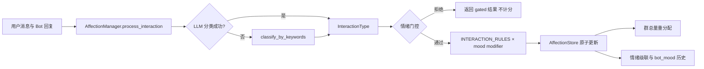

[根目录](../../AGENTS.md) > [core](../AGENTS.md) > **affection**

# 好感度与 Bot 情绪模块

**Last Updated:** 2026-07-17

## 职责与边界

`core/affection/` 负责按 `(group_id, user_id)` 维护用户对 Bot 的好感度、按群维护 Bot 情绪，以及把一次交互分类为 `InteractionType` 后应用情绪门控、分数变化、群总量重分配和情绪级联。它不负责消息路由、提示词注入或控制台鉴权；组件由 `core/plugin_initializer.py` 创建，控制台写操作由 `core/api/affection_api.py` 做请求边界校验，Agent 只通过 `core/tools/affection_tools.py` 查询。

## 架构与数据流



## 关键入口与模型

- `AffectionManager.process_interaction(user_id, group_id, message, bot_response="")`：主业务入口；内部异常转换为不含原始内容的稳定失败结果。
- `get_mood`、`set_mood`、`reset_mood`、`get_mood_history`：群情绪读取、追加和缓存同步。强度裁剪到 `0.1..1.0`，持续时间裁剪到 `0.25..168.0` 小时。
- `get_user_affection`、`get_group_affection_status`、`list_user_affections`：查询用户或群概览。
- `create_user_affection_manual`、`update_user_affection_manual`、`delete_user_affection_manual`：管理员严格 CRUD；更新和删除要求 `expected_revision`，只允许修改分数。
- `LLMAdapter.chat_completion(prompt, temperature)`：管理器要求的最小异步协议；缺失、失败或返回未知枚举时回退关键词分类，最终回退 `CHAT`。
- `AffectionLevel`：从 `HOSTILE` 到 `INTIMATE` 的离散分层。
- `MoodType` / `BotMood`：十种情绪、强度、描述、起始时间与持续时间；`get_mood_modifier()` 给出计分乘数。
- `InteractionType` / `INTERACTION_RULES`：17 种交互及基础变化、情绪敏感性、门控要求和级联标志。
- `UserAffection`：用户、群、分数、交互次数和最后交互时间的领域视图。

## 持久化与一致性

`AffectionStore` 继承共享 `BaseStore`，使用同一 SQLite 数据库的两张表：

- `user_affection`：复合主键 `(user_id, group_id)`；`upsert_affection` 在 `BEGIN IMMEDIATE` 事务内累加并裁剪到配置上下限，同时递增 `interaction_count`。
- `bot_mood`：追加式情绪历史；活动情绪按 `start_time DESC, id DESC` 查找，损坏的最新行由管理器跳过并继续扫描旧行。

单连接写入通过 `_write_lock` 串行化；取消期间仍等待提交或回滚到终态。管理员写入使用完整持久化形状计算 revision，冲突必须返回 `EditConflictError`，不得改成静默覆盖。群总好感度只在正向增量后检查，超出 `max_total_affection` 时排除当前用户并以 revision 条件削减其他正分用户。

## 依赖方向

- 上游：`core/plugin_initializer.py`、`core/api/affection_api.py`、`core/tools/affection_tools.py`。
- 本模块：`affection_manager.py -> models.py + affection_store.py + mood_cascade.py`；`mood_cascade.py -> models.py`。
- 下游：`core/shared/entity_editing.py`、`core/storage/base_store.py`、`aiosqlite`、可选 LLM 适配器。
- 相关上下文：[存储模块](../storage/AGENTS.md)、[基础领域能力](../base/AGENTS.md)。

## 隐私、安全与修改约束

- 分类提示词包含用户消息、Bot 回复和当前情绪描述；接入真实 LLM 前必须遵循上层提示词保护与 Provider 数据策略，日志中不得新增原文、用户标识或完整提示词。
- `user_id`、`group_id`、分数和情绪历史属于用户关系数据；查询工具应从当前事件解析作用域，不能跨群回退或把空群 ID 当作全局查询。
- 关键词分类是可用性回退，不是安全分类器；不得据此执行封禁、权限或其他高风险决策。
- 保持分数裁剪、情绪门控、写事务、revision 冲突和取消安全语义。新增交互类型时必须同步枚举、规则、分类提示词、关键词回退和测试。
- 不要从 API 层绕过管理器直接写表；人工编辑不得伪造自动互动次数或最后交互时间。

## 测试定位与验证

`tests/test_affection_manager.py` 覆盖模型阈值、关键词与 LLM 分类、门控、分数与情绪级联、存储 CRUD、管理员 revision、并发、损坏情绪行、重分配、取消与关闭生命周期。
`tests/test_affection_interaction_boundary.py` 覆盖自动交互身份的写前校验、零副作用失败与日志脱敏。

精确验证命令：

```bash
python -m pytest -q tests/test_affection_manager.py
```

修改控制台契约时再运行：

```bash
python -m pytest -q tests/test_page_api.py -k affection
```
