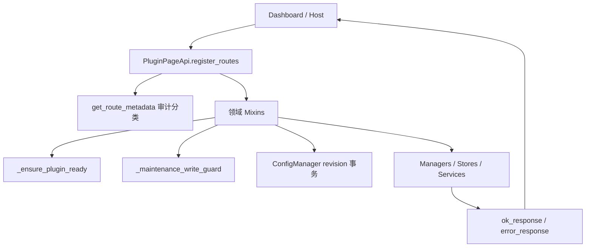

[根级 AGENTS.md](../../AGENTS.md) / core / api

# Page API 混入层

**最后核对：** 2026-08-01
**组合入口：** `core/page_api.py::PluginPageApi`  
**主前缀：** `/astrbot_plugin_memora/page`  
**兼容前缀：** `/Memora/page`

## 职责边界

本目录按领域拆分 Quart/AstrBot Page API handler、输入规范化、稳定响应和编辑冲突处理。`PluginPageApi` 通过多继承组合 mixin，并在 `register_routes()` 中注册主路径及每条 `/Memora/page` 别名。领域存储和业务规则仍属于 manager/store/service；这里不应复制 SQL 模型或绕开其并发控制。



## 路由与响应公共契约

- 成功：`{"status": "ok", "data": ...}`。
- 失败：`{"status": "error", "message": "..."}`，可附 `code`、`field_errors`、`data`。
- `register_routes()` 是实际路由清单的唯一事实来源；主前缀下注册后，包装器同步注册兼容前缀。兼容别名不会额外进入 `_route_metadata`。
- `get_route_metadata()` 返回主路由的 `path`、handler、methods、risk、auth、`requires_ready` 和 `write_guard` 审计元数据副本。
- 元数据把含 POST 的路由标记为 `admin`，纯 GET 标记为 `host`；这是插件侧审计分类。handler 本身没有权限装饰器，实际认证仍由 AstrBot `register_web_api` 承载层负责，不能把元数据当成独立鉴权实现。
- 除 delegation、通用 config 三个端点和只读更新检查外，元数据默认 `requires_ready=True`；具体 handler 仍应显式调用 `_ensure_plugin_ready()`，元数据不会自动门控。

## 功能域与稳定入口

| 领域 | Mixin / 辅助 | 代表性主路径 |
|---|---|---|
| 记忆 | `MemoryReadApiMixin`、`MemoryWriteApiMixin`、`MemoryBatchApiMixin`、`MemoryStatsRecallApiMixin` | `/memories`、`/memories/detail`、`/memories/update`、`/memories/batch*`、`/stats`、`/recall/test`；另有 `/memory/*` 单数兼容路径 |
| 可解释召回/注入 | `RecallTraceApiMixin`、`InjectionStrategyApiMixin` | `/recall/trace`、`/recall/trace/detail`、`/injection-strategy/catalog|summary|decisions|decisions/detail` |
| 图谱 | `GraphApiMixin` 与 `PluginPageApi` 图视图辅助 | `/graph/overview`、POST `/graph/query`、GET `/graph/search` |
| 画像/知识/笔记 | `ProfileApiMixin`、`KnowledgeApiMixin`、`NoteApiMixin` | 各领域 list/detail/create/update/delete/batch；笔记另有 versions/archive |
| 情感与社交 | `AffectionApiMixin`、`SocialApiMixin`、`ExpressionApiMixin`、`JargonApiMixin` | `/affection/*`、`/social/*`、`/expression/patterns`、`/jargon/*` |
| 质量与审查 | `QualityApiMixin`、`ReviewApiMixin`、`QuarantineApiMixin`、`MemoryEvolutionReviewApiMixin` | `/quality/*`、`/review/items*`、`/review/refresh`、`/review/action`、`/review/quarantine*`、`/review/derived*` |
| 诊断/评测/指标 | `DiagnosticsApiMixin`、`EvaluationApiMixin`、`MetricsApiMixin` | `/diagnostics/*`、`/evaluation/*`、`/metrics/summary` |
| 运维/备份 | `MaintenanceApiMixin`、`BackupApiMixin` | `/maintenance/*`、`/health/persistence*`、`/backup/list|create|restore|status|restore/cancel|delete|batch-delete`、`/system/*` 兼容路径、`/dashboard/install|build` |
| 配置/回填 | `ConfigApiMixin`、`TopicSegmentationApiMixin` | `/config/schema`、`/config/state`、`/config/apply`、`/config/topic-segmentation`、`/backfill/*` |
| 插件更新 | `UpdateApiMixin` | `/update/check`、`/update/ignore`、`/update/download`、`/update/apply`、`/update/status` |
| 运行状态 | `DelegationApiMixin`、SSE、群组聚合 | `/delegation/*`、`/realtime/stream`、`/groups`、`/export/memories` |

`core/api/__init__.py` 仅公开常用 mixin、`HistoryTracker` 与响应函数，并非 `PluginPageApi` 的完整基类清单；调用方通常应使用 `PluginPageApi` 而不是自己重组 mixin。

## 配置合并、修订与冲突

`ConfigApiMixin` 不依赖引擎即可读取 AstrBot 注入 Schema、Provider 选项与隔离的配置快照。`GET /config/state?revision=...` 总是返回当前 `revision`、`instance_id`、`changed`，仅在修订不同才附完整 config。

`POST /config/apply` 请求体字段必须严格为 `base_revision` 与点号路径 `changes`。流程为：写保护 → 异步锁内对齐外部 AstrBotConfig → revision 比对 → Schema 叶子/选项检查 → Pydantic 全候选校验 → 替换并原子保存 → 重新读取源状态校验 revision。错误码稳定为 `invalid_request`、`config_conflict`、`validation_failed`、`persist_failed`；冲突响应附当前 revision。涉及注入记录保留配置时调度 recorder 清理；存在变更时尝试安排插件重载。

启动读取配置时由 `ConfigManager` 将 Pydantic 默认值与用户映射深合并；Page API 不维护第二份持久化 JSON，也不得对 `config_manager._config` 原地写入。

## 编辑与持久化冲突

`editing_utils.py` 提供 JSON 对象要求、未知字段拒绝、有限数值/有界整数/文本/字符串列表规范化，以及 revisioned entity 的成功/冲突响应。画像、社交、好感度和黑话人工编辑使用不透明 revision、允许字段集合、批量上限与安全审计；知识、笔记、记忆各自保持领域兼容契约。布尔值不能悄悄当作整数/浮点 ID 或评分。

`HistoryTracker` 只把最近 20 条记忆更新历史写入 metadata；复杂值先 JSON 序列化，不能用于安全审计或全局事务日志。

## 安全与运维边界

- 写 handler 必须先调用 `_maintenance_write_guard()`；存在待恢复备份时返回 `maintenance_blocked`。守卫查询异常采用 fail-closed，返回 `maintenance_guard_failed`。
- 备份接口只通过 `BackupApiMixin` 暴露事务操作：创建、列表、暂存恢复、状态查询、取消暂存、删除和批量删除均返回统一 envelope。列表和创建摘要只允许名称、类型、时间、manifest 状态、完整性、文件计数、大小、warning code 与恢复能力字段；不得返回 `data_dir`、`directory`、绝对路径、异常正文或恢复 payload。
- `/backup/status` 是只读状态端点；`/backup/restore/cancel` 是恢复事务的唯一取消入口，取消不会绕过 manager 状态机或执行任意文件删除。恢复请求的 `apply_mode` 只能是 `reload` 或 `restart`；热重载安排失败时保留 `staged` 状态并明确 `requires_manual_restart`。
- 恢复错误使用稳定 code（例如 `backup_invalid`、`canonical_file_missing`、`restore_conflict`、`restore_not_found`、`restore_cancel_not_allowed`、`restore_rollback_pending`），日志只记录操作名和异常类型，不记录路径、备份正文或身份。
- `_infer_route_risk()` 只分类：dashboard install/build 为 `runtime_exec`；delete/purge/restore/reset 为 `destructive`；maintenance/backup/backfill/config/system 等为 `maintenance`。新增写路由要核对分类 token，并在 handler 中真实调用守卫。
- Dashboard install/build 会启动外部进程，必须继续受运行期开关、超时、输出上限和单锁限制；不要把客户端命令或路径拼入 shell。
- SQL 读取使用参数绑定；外部 ID、分页、枚举、字段必须先规范化。返回异常时不要泄露 SQL、绝对路径、正文或凭据。
- `/review/quarantine/action` 只接受 `approve`/`reject`、整数 `expected_revision` 和可选修正正文；批准由 `MemoryQualityGate` 重新取证，不得由 API 直接调用 `MemoryEngine`。canonical 已写入但状态收口失败时只返回候选 revision 与 opaque repair token，不回显正文或内部身份。
- `/review/quarantine/repair` 是 approving 的唯一管理员收口入口：`approve` 必须提交正整数 canonical ID、token、revision 并由 Gate 重读 canonical 校验正文/状态；`block` 必须显式确认 canonical 未写入。错误 ID、token、revision 和状态均 fail-closed，响应不返回 candidate key、session/persona、消息指纹或 token 之外的内部字段。
- `/review/derived/action` 只接受 `candidate_id`、`approve|reject|replay` 和正整数候选 `expected_revision`；写操作受维护守卫保护。列表/详情/动作响应只允许 candidate ID/revision、relation type、状态、confidence、动作前后状态、reason code 和时间，不得返回 canonical source ID/revision、scope、privacy、正文、身份或 origin job。
- 注入策略目录与决策 API 是只读的：目录来自不可变 registry，不查询 SQLite；列表/详情只返回 allowlist 脱敏字段，绝不返回 query、记忆内容或会话身份。`InjectionStrategyApiMixin` 的决策列表只接受 `offset>=0`、`1<=limit<=100`、固定筛选枚举与 allowlist `sort_by`，`sort_order` 只能是小写 `asc/desc`。
- `InjectionDecisionStore.list_decisions()` 返回稳定的 `{items,total,offset,limit}` 页面；`total` 是筛选后的未分页总数，排序列来自固定 SQL allowlist，并以 `decision_id ASC` 作为确定性并列键。列表/详情均不得把 `reason_codes_json` 原文、内部 query/prompt、正文、ID 列表、身份或堆栈带出响应。
- 召回 trace 只预览路由/检索，不执行 `InjectionExecutor`、不写决策记录；空白 `session_id`、`persona_id`、`user_id` 必须规范化为未提供，不能下传为空字符串过滤器。创建和详情端点只返回 `sanitize_trace_payload()` 的安全 DTO，不得返回 query、正文/preview、canonical ID、候选 ID、request metadata、source/revision/scope/privacy/role/job 信息。
- trace metadata 中 `debug_reporting_enabled` 表示插件问题报告记录器是否开启，`debug_trace_available` 只表示本次候选评分明细是否存在；零候选时后者为 `false` 不代表配置开关失效。控制台追踪完成或失败时也要写入脱敏问题报告事件，普通 INFO 日志仅包含候选计数和两个布尔状态。
- Diagnostics 事件列表/详情只能返回 Store 标量 allowlist；历史行也必须在读取时重新脱敏。Diagnostics 与 Recall Trace 普通失败只返回稳定错误码，日志只记录异常类型，不得回显 action 输入、`str(exc)`、异常 `repr` 或 traceback。
- 动态记忆传输不提供 `system_prompt`，API catalog 的 deliveries 也不得出现该值；详见 [注入模块 AGENTS.md](../injection/AGENTS.md)。
- SSE 每客户端队列上限 256；满队列客户端被移除，30 秒心跳，断开时注销。

## 依赖方向

`core/page_api.py` → 本目录 mixin → managers/stores/services/config/injection。Dashboard 通过已注册路径消费接口；可对照 [Dashboard AGENTS.md](../../pages/dashboard/AGENTS.md)。领域层不得反向导入 Page API。

## 测试定位与精确验证

```powershell
python -m pytest tests/test_page_api.py tests/test_page_api_contract.py -q
python -m pytest tests/test_api_backup.py tests/test_maintenance_api.py -q
python -m pytest tests/test_api_config.py tests/test_api_response_utils.py -q
python -m pytest tests/test_api_injection_strategy.py tests/test_api_recall_trace.py tests/test_api_diagnostics.py tests/test_p0_observability_privacy.py -q
python -m pytest tests/test_api_memory.py tests/test_api_profile.py tests/test_api_knowledge.py tests/test_api_note.py -q
python -m pytest tests/test_api_affection.py tests/test_api_social.py tests/test_api_jargon.py tests/test_api_review.py tests/test_api_quarantine.py -q
python -m pytest tests/test_api_memory_evolution_review.py tests/test_page_api_contract.py -q
```

修改单一领域时优先跑对应 `tests/test_api_<domain>.py`；路由、别名、方法或前端契约变化必须同时跑 `test_page_api_contract.py`。

## 相关上下文

- [根级 AGENTS.md](../../AGENTS.md)
- [注入模块 AGENTS.md](../injection/AGENTS.md)
- [Dashboard AGENTS.md](../../pages/dashboard/AGENTS.md)
- `core/page_api.py`
- `core/base/config_manager.py`
