[根目录](../../CLAUDE.md) > [core](../) > **api**

## 模块职责

`core/api/` 是 Memora 的 REST API 层, 采用**多层混入(Mixin)架构**。每个 API 功能域定义为一个独立的 Mixin 类, 最终由 `core/page_api.py` 中的 `PluginPageApi` 类组合 23 个 Mixin, 并通过 `register_routes()` 统一注册到 AstrBot 页面接口系统。

## API 架构图

```mermaid
graph TD
    subgraph "AstrBot 插件框架"
        PAPI["PluginPageApi<br/>(core/page_api.py)"]
        REG["register_web_api()"]
    end

    subgraph "CRUD Mixins"
        MR["MemoryReadApiMixin"]
        MW["MemoryWriteApiMixin"]
        MB["MemoryBatchApiMixin"]
        MSR["MemoryStatsRecallApiMixin"]
    end

    subgraph "实体 Mixins"
        PM["ProfileApiMixin"]
        KM["KnowledgeApiMixin"]
        NM["NoteApiMixin"]
    end

    subgraph "智能 Mixins"
        GM["GraphApiMixin"]
        AM["AffectionApiMixin"]
        SM["SocialApiMixin"]
        EM["ExpressionApiMixin"]
        JM["JargonApiMixin"]
    end

    subgraph "运维 Mixins"
        DIM["DiagnosticsApiMixin"]
        MAM["MaintenanceApiMixin"]
        BM["BackupApiMixin"]
        MTM["MetricsApiMixin"]
    end

    subgraph "评测与质量 Mixins"
        EVM["EvaluationApiMixin"]
        QM["QualityApiMixin"]
        RVM["ReviewApiMixin"]
    end

    subgraph "其他 Mixins"
        LM["LearningApiMixin"]
        DM["DelegationApiMixin"]
        RTM["RecallTraceApiMixin"]
        TSM["TopicSegmentationApiMixin"]
        HT["HistoryTracker"]
    end

    PAPI --> MR
    PAPI --> MW
    PAPI --> MB
    PAPI --> MSR
    PAPI --> PM
    PAPI --> KM
    PAPI --> NM
    PAPI --> GM
    PAPI --> AM
    PAPI --> SM
    PAPI --> EM
    PAPI --> JM
    PAPI --> DIM
    PAPI --> MAM
    PAPI --> BM
    PAPI --> MTM
    PAPI --> EVM
    PAPI --> QM
    PAPI --> RVM
    PAPI --> LM
    PAPI --> DM
    PAPI --> RTM
    PAPI --> TSM

    REG --> PAPI
    REG --> HT

    style PAPI fill:#e8eaf6
```



## 统一响应格式

所有 API 端点使用统一的 JSON 响应格式 (`response_utils.py`):

```python
# 成功
{"status": "ok", "data": <任意数据>}

# 错误
{"status": "error", "message": "<错误描述>"}
```

## 完整端点路由表

路由前缀: `/astrbot_plugin_memora/page` (别名: `/Memora/page`, `/astrbot_plugin_livingmemory/page`)

### 记忆 (Memory) -- MemoryReadApiMixin / MemoryWriteApiMixin / MemoryBatchApiMixin / MemoryStatsRecallApiMixin

| 方法 | 路径 | 功能 | 认证 |
|------|------|------|------|
| GET | `/memories` | 记忆列表(分页+关键词+状态过滤) | host |
| GET | `/memories/detail` | 记忆详情 | host |
| POST | `/memories/update` | 更新记忆字段 | admin |
| POST | `/memories/batch-delete` | 批量删除记忆 | admin |
| POST | `/memories/batch-update` | 批量更新记忆 | admin |
| POST | `/memories/batch` | 统一批量操作 | admin |
| POST | `/recall/test` | 召回测试 | admin |
| POST | `/recall/trace` | 可解释召回跟踪 | admin |
| GET | `/recall/trace/detail` | 召回跟踪详情 | host |
| GET | `/memory/detail` | 记忆详情(前端别名) | host |
| POST | `/memory/update` | 更新记忆(前端别名) | admin |

### 图谱 (Graph) -- GraphApiMixin

| 方法 | 路径 | 功能 | 认证 |
|------|------|------|------|
| GET | `/graph/overview` | 图谱概览(子图快照) | host |
| POST | `/graph/query` | 图谱查询(多模式) | admin |
| GET | `/graph/search` | 图谱搜索(GET 别名) | host |

### 用户画像 (Profile) -- ProfileApiMixin

| 方法 | 路径 | 功能 | 认证 |
|------|------|------|------|
| GET | `/profiles` | 画像列表(分页) | host |
| GET | `/profiles/detail` | 画像详情 | host |
| POST | `/profiles/update` | 更新画像 | admin |
| POST | `/profiles/delete` | 删除画像 | admin |
| POST | `/profiles/tags` | 管理画像标签 | admin |
| POST | `/profiles/batch` | 批量画像操作 | admin |

### 知识库 (Knowledge) -- KnowledgeApiMixin

| 方法 | 路径 | 功能 | 认证 |
|------|------|------|------|
| GET | `/knowledge` | 知识列表(分页) | host |
| GET | `/knowledge/search` | 搜索知识 | host |
| GET | `/knowledge/detail` | 知识详情 | host |
| POST | `/knowledge/create` | 创建知识条目 | admin |
| POST | `/knowledge/update` | 更新知识条目 | admin |
| POST | `/knowledge/delete` | 删除知识条目 | admin |
| POST | `/knowledge/batch-delete` | 批量删除知识 | admin |
| POST | `/knowledge/batch-update` | 批量更新知识 | admin |
| POST | `/knowledge/batch` | 统一批量操作 | admin |

### 笔记 (Note) -- NoteApiMixin

| 方法 | 路径 | 功能 | 认证 |
|------|------|------|------|
| GET | `/notes` | 笔记列表(分页) | host |
| GET | `/notes/search` | 搜索笔记 | host |
| GET | `/notes/detail` | 笔记详情 | host |
| POST | `/notes/create` | 创建笔记 | admin |
| POST | `/notes/update` | 更新笔记 | admin |
| POST | `/notes/delete` | 删除笔记 | admin |
| GET | `/notes/versions` | 笔记版本历史 | host |
| POST | `/notes/batch-delete` | 批量删除笔记 | admin |
| POST | `/notes/batch-update` | 批量更新笔记 | admin |
| POST | `/notes/batch` | 统一批量操作 | admin |
| POST | `/notes/archive` | 归档笔记 | admin |

### 自主学习 (Learning) -- LearningApiMixin

| 方法 | 路径 | 功能 | 认证 |
|------|------|------|------|
| GET | `/learning/status` | 学习状态 | host |
| GET | `/learning/history` | 学习历史 | host |
| POST | `/learning/reset` | 重置学习 | admin |

### 好感度 (Affection) -- AffectionApiMixin

| 方法 | 路径 | 功能 | 认证 |
|------|------|------|------|
| GET | `/affection/status` | 好感度状态 | host |

### 社交关系 (Social) -- SocialApiMixin

| 方法 | 路径 | 功能 | 认证 |
|------|------|------|------|
| GET | `/social/relations` | 社交关系列表 | host |

### 表达模式 (Expression) -- ExpressionApiMixin

| 方法 | 路径 | 功能 | 认证 |
|------|------|------|------|
| GET | `/expression/patterns` | 表达模式列表 | host |

### 黑话 (Jargon) -- JargonApiMixin

| 方法 | 路径 | 功能 | 认证 |
|------|------|------|------|
| GET | `/jargon/candidates` | 黑话候选词 | host |
| GET | `/jargon/meanings` | 黑话释义 | host |
| GET | `/jargon/stats` | 黑话统计 | host |
| POST | `/jargon/confirm` | 确认黑话 | admin |
| POST | `/jargon/mine` | 挖掘黑话 | admin |

### 诊断 (Diagnostics) -- DiagnosticsApiMixin

| 方法 | 路径 | 功能 | 认证 |
|------|------|------|------|
| GET | `/diagnostics/health` | 诊断健康评分 | host |
| GET | `/diagnostics/events` | 诊断事件列表 | host |
| GET | `/diagnostics/events/detail` | 诊断事件详情 | host |
| POST | `/diagnostics/actions/run` | 执行诊断恢复动作 | admin |

### 评测 (Evaluation) -- EvaluationApiMixin

| 方法 | 路径 | 功能 | 认证 |
|------|------|------|------|
| GET | `/evaluation/datasets` | 评测数据集 | host |
| POST | `/evaluation/run` | 运行检索评测 | admin |
| GET | `/evaluation/reports` | 评测报告列表 | host |
| GET | `/evaluation/reports/detail` | 评测报告详情 | host |
| GET/POST | `/evaluation/reports/compare` | 评测报告对比 | host |

### 质量 (Quality) -- QualityApiMixin

| 方法 | 路径 | 功能 | 认证 |
|------|------|------|------|
| GET | `/quality/stats` | 质量统计 | host |
| GET | `/quality/recent` | 最近质量评分 | host |
| GET | `/quality/alerts` | 质量告警 | host |
| POST | `/quality/reset` | 重置质量评分器 | admin |

### 审查 (Review) -- ReviewApiMixin

| 方法 | 路径 | 功能 | 认证 |
|------|------|------|------|
| GET | `/review/items` | 记忆审查队列 | host |
| GET | `/review/items/detail` | 记忆审查详情 | host |
| POST | `/review/refresh` | 刷新记忆审查队列 | admin |
| POST | `/review/action` | 执行记忆审查动作 | admin |

### 维护 (Maintenance) -- MaintenanceApiMixin

| 方法 | 路径 | 功能 | 认证 |
|------|------|------|------|
| POST | `/maintenance/rebuild-index` | 重建 FAISS 索引 | admin |
| POST | `/maintenance/rebuild-graph` | 重建图索引 | admin |
| GET | `/health/persistence` | 持久化健康检查 | host |
| POST | `/health/persistence/repair` | 持久化健康修复 | admin |
| POST | `/maintenance/purge-deleted` | 清理已删除记忆 | admin |
| POST | `/maintenance/compact-db` | 压缩数据库(VACUUM) | admin |

### 备份 (Backup) -- BackupApiMixin

| 方法 | 路径 | 功能 | 认证 |
|------|------|------|------|
| GET | `/backups` | 备份列表 | host |
| POST | `/maintenance/create-backup` | 创建备份 | admin |
| GET | `/backup/list` | 列出备份 | host |
| POST | `/backup/create` | 创建备份(别名) | admin |
| POST | `/backup/restore` | 恢复备份 | admin |
| POST | `/backup/delete` | 删除备份 | admin |
| POST | `/backup/batch-delete` | 批量删除备份 | admin |

### 可观测性 (Metrics) + 统计

| 方法 | 路径 | 功能 | 认证 |
|------|------|------|------|
| GET | `/stats` | 统计信息 | host |
| GET | `/metrics/summary` | 运行观测摘要 | host |

### 实时流 (Realtime)

| 方法 | 路径 | 功能 | 认证 |
|------|------|------|------|
| GET | `/realtime/stream` | SSE 实时记忆流 | host |

### 功能委托 (Delegation) -- DelegationApiMixin

| 方法 | 路径 | 功能 | 认证 |
|------|------|------|------|
| GET | `/delegation/status` | 功能委托状态(检查伴侣插件) | host |

### 话题分割 (Topic Segmentation) -- TopicSegmentationApiMixin

| 方法 | 路径 | 功能 | 认证 |
|------|------|------|------|
| GET | `/config/topic-segmentation` | 话题分割配置 | host |
| POST | `/config/topic-segmentation` | 更新话题分割配置 | admin |

### 存量回填 (Backfill)

| 方法 | 路径 | 功能 | 认证 |
|------|------|------|------|
| POST | `/backfill/start` | 启动存量回填 | admin |
| GET | `/backfill/status` | 回填进度 | host |

### 导出 (Export)

| 方法 | 路径 | 功能 | 认证 |
|------|------|------|------|
| POST | `/export/memories` | 导出记忆 | admin |

### 控制台页面管理 (Dashboard)

| 方法 | 路径 | 功能 | 认证 |
|------|------|------|------|
| POST | `/dashboard/install` | 安装控制台页面依赖 | admin |
| POST | `/dashboard/build` | 构建控制台页面 | admin |

### 群组 (Groups)

| 方法 | 路径 | 功能 | 认证 |
|------|------|------|------|
| GET | `/groups` | 可用群组列表(聚合多数据源) | host |

### 兼容别名

| 方法 | 路径 | 映射到 | 说明 |
|------|------|------|------|
| POST | `/system/rebuild` | `/maintenance/rebuild-index` | 短路径别名 |
| POST | `/system/purge` | `/maintenance/purge-deleted` | 短路径别名 |
| POST | `/system/compact` | `/maintenance/compact-db` | 短路径别名 |

## 安全策略

| 维度 | 说明 |
|------|------|
| 认证分级 | GET 端点使用 `host` 级别认证, POST 端点使用 `admin` 级别(通过 `_infer_route_risk` 自动推断) |
| 写入守卫 | `/maintenance/write_guard` -- 备份恢复待处理时拒绝所有写入操作 |
| 路由元数据 | `get_route_metadata()` 返回所有路由的 handler_name/methods/risk/auth/requires_ready/write_guard |
| 操作分类 | `_infer_route_risk()` 自动分类: read/write/maintenance/destructive/runtime_exec |
| 插件就绪检查 | `_ensure_plugin_ready()` 在所有需要引擎的端点中调用, 未就绪时返回 503 级错误 |

## API Mixin 类完整清单

| Mixin 类 | 文件 | 功能域 |
|----------|------|--------|
| `MemoryReadApiMixin` | `memory_read_api.py` | 记忆读取 |
| `MemoryWriteApiMixin` | `memory_write_api.py` | 记忆写入/更新 |
| `MemoryBatchApiMixin` | `memory_batch_api.py` | 记忆批量操作 |
| `MemoryStatsRecallApiMixin` | `memory_stats_recall_api.py` | 统计/召回测试 |
| `GraphApiMixin` | `graph_api.py` | 图谱查询 |
| `ProfileApiMixin` | `profile_api.py` | 用户画像 |
| `KnowledgeApiMixin` | `knowledge_api.py` | 知识库 CRUD |
| `NoteApiMixin` | `note_api.py` | 笔记 CRUD |
| `LearningApiMixin` | `learning_api.py` | 自主学习管理 |
| `AffectionApiMixin` | `affection_api.py` | 好感度查询 |
| `SocialApiMixin` | `social_api.py` | 社交关系查询 |
| `ExpressionApiMixin` | `expression_api.py` | 表达模式查询 |
| `JargonApiMixin` | `jargon_api.py` | 黑话管理 |
| `DiagnosticsApiMixin` | `diagnostics_api.py` | 运行时诊断 |
| `EvaluationApiMixin` | `evaluation_api.py` | 检索评测 |
| `QualityApiMixin` | `quality_api.py` | 质量监控 |
| `ReviewApiMixin` | `review_api.py` | 记忆审查 |
| `MaintenanceApiMixin` | `maintenance_api.py` | 维护操作 |
| `BackupApiMixin` | `backup_api.py` | 备份管理 |
| `MetricsApiMixin` | `metrics_api.py` | 可观测性指标 |
| `DelegationApiMixin` | `delegation_api.py` | 功能委托状态 |
| `RecallTraceApiMixin` | `recall_trace_api.py` | 召回追踪 |
| `TopicSegmentationApiMixin` | `topic_segmentation_api.py` | 话题分割 |
| `HistoryTracker` | `history_tracker.py` | 变更历史追踪(非 Mixin) |

## 相关文件清单

- `response_utils.py` -- 统一响应格式 (`ok_response` / `error_response`)
- `history_tracker.py` -- 变更历史追踪
- `memory_read_api.py` -- 记忆读取 API
- `memory_write_api.py` -- 记忆写入/更新 API
- `memory_batch_api.py` -- 记忆批量操作 API
- `memory_stats_recall_api.py` -- 统计与召回测试 API
- `graph_api.py` -- 图谱查询 API
- `profile_api.py` -- 用户画像 API
- `knowledge_api.py` -- 知识库 CRUD API
- `note_api.py` -- 笔记 CRUD API
- `learning_api.py` -- 自主学习管理 API
- `affection_api.py` -- 好感度查询 API
- `social_api.py` -- 社交关系查询 API
- `expression_api.py` -- 表达模式查询 API
- `jargon_api.py` -- 黑话管理 API
- `diagnostics_api.py` -- 运行时诊断 API
- `evaluation_api.py` -- 检索评测 API
- `quality_api.py` -- 质量监控 API
- `review_api.py` -- 记忆审查 API
- `maintenance_api.py` -- 维护操作 API
- `backup_api.py` -- 备份管理 API
- `metrics_api.py` -- 可观测性指标 API
- `recall_trace_api.py` -- 召回追踪 API
- `delegation_api.py` -- 功能委托状态 API
- `topic_segmentation_api.py` -- 话题分割 API
- `realtime_api.py` -- SSE 实时流 API
- `__init__.py` -- Mixin 类导出

## 变更记录 (Changelog)

| 日期 | 变更 | 描述 |
|------|------|------|
| 2026-07-07 | 初始文档 | 生成 api 模块级 CLAUDE.md |
