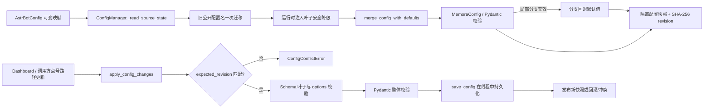

[根级 AGENTS.md](../../AGENTS.md) > [core](../AGENTS.md) > **base**

# `core/base` 模块上下文

**最后更新：** 2026-08-12
**配置 owner：** `core/platform/config/__init__.py`
**遗留入口：** `core/base/__init__.py`、`config_manager.py`、`config_validator.py`

## 职责与边界

配置事务、迁移、所有权和运行时影响分类的唯一 owner 已迁至 `core/platform/config/`；跨 feature 常量、异常与 Adapter 能力归属 `core/shared/`。`core/base/` 目前保留配置模型聚合器，以及实体编辑、排序和额外 LLM 预算等尚未完成测试调用方切换的兼容模块。

当前低层基础契约负责：

- 以 Pydantic v2 描述配置树、默认值、数值范围和跨字段不变量；
- 为每个公开配置分支声明产品分类、唯一责任模块以及保存后的重启/重建影响；
- 将 AstrBot 注入的可变配置映射规范化为隔离快照，并提供带修订号的原子更新；
- 复用 shared 的稳定异常码、记忆注入边界常量和领域无关实体编辑冲突类型；
- 对额外 LLM 调用实施成本模式门控；
- 描述 `memory_evolution` 的安全默认、运行模式、队列/租约和读时扩展预算。

本模块**不负责**业务组件初始化、Dashboard HTTP 映射、存储事务、具体记忆检索或 Prompt 清洗。`ConfigManager` 只管理配置状态；API 层负责把 `ConfigConflictError`、`ConfigValidationError` 等映射为响应。Prompt/输出安全规则见 [`../security/AGENTS.md`](../security/AGENTS.md)，注入格式与预算见 [`../utils/AGENTS.md`](../utils/AGENTS.md)。

## 架构与数据流



### 配置读取

1. `ConfigManager(user_config)` 保留传入 `MutableMapping` 作为唯一外部来源，不再维护第二份 Dashboard JSON 覆盖层。
2. `migrate_legacy_config()` 只在内存深拷贝上把 `cross_encoder` 与旧权重键迁移到 `embedding_similarity` 单一契约；新键优先，运行时不保留旧别名，下一次正常保存会持久化新名称。
3. `_normalize_runtime_injection_config()` 只在内存副本上容忍无效的新注入策略叶子；不会改写源映射。保留天数与行上限分别回退为 `30`、`100_000`；策略组整体无效时回退到安全的手动/`balanced` 配置及 `extra_user_content`。
4. `merge_config_with_defaults()` 以 Pydantic 默认树为底，递归覆盖用户字典。
5. `_validate_with_branch_fallback()` 首先回退报错的顶层分支；仍失败才使用完整默认配置。降级记录通过 `validation_errors` 返回。
6. `get()`、`get_section()`、`get_all()` 和快照 API 对可变值执行深拷贝，禁止调用方绕过 revision 修改内部状态。

### 原子更新

- `get_config_snapshot()` 返回 `(deepcopy(config), revision)`；异步调用方应优先使用会先协调外部变更的 `get_config_snapshot_async()`。
- `apply_config_changes(changes, expected_revision=..., persist=True)` 接收点号叶子路径，在 `_apply_lock` 内协调外部源、执行乐观并发检查、Schema 契约检查和完整 Pydantic 校验。
- 有 `save_config()` 的 AstrBot 配置源必须具备可解析 Schema；否则持久化更新被拒绝。未知叶子及不属于 Schema `options` 的精确 JSON 标量也被拒绝。
- 持久化发生在线程中并由 `asyncio.shield()` 保护。失败时尽力恢复源映射；保存期间外部改写会重新读取并报告冲突，而不是覆盖外部状态。
- `update_runtime_config()` 只是兼容布尔接口，会吞掉三类配置事务异常并记录错误；需要字段错误或 revision 的新调用方必须使用 `apply_config_changes()`。

## 关键文件与接口

| 文件 | 核心接口 | 约束 |
|---|---|---|
| `config_validator.py` | `MemoraConfig`、其余分支模型、`validate_config()`、`get_default_config()`、`merge_config_with_defaults()`、`validate_runtime_config_changes()` | 默认值唯一运行时来源；顶层允许额外字段以兼容旧配置，已声明字段仍受类型/范围约束 |
| `../platform/config/migrations.py` | `migrate_legacy_config()` | 旧公开键只在配置载入边界迁移到当前单一命名；不得在消费者中维护运行时别名 |
| `runtime_feature_config.py` | 运行时功能分支 Pydantic 模型 | 正式功能分支不得退回无类型字典；Hybrid/Graph 融合权重总和必须为 `1.0` |
| `../platform/config/ownership.py` | `CONFIG_SECTION_OWNERSHIP`、`resolve_config_ownership()` | 每个 Schema 叶必须解析为 `runtime/dashboard_only/experimental/deprecated` 和唯一 owner；未知顶层分支不得静默归类 |
| `../platform/config/runtime_effects.py` | `RuntimeConfigEffect`、`classify_config_effects()` | 非空保存保守要求重启；时序/因果图边变更还要求重建图派生数据 |
| `feature_config.py` | `AgentToolsConfig`、`JargonConfig`、`DashboardConfig`、`is_jargon_discovery_enabled()` | 轻量功能开关与 Dashboard 构建配置；黑话发现缺少有效配置时遵循调用方的兼容边界，正常插件运行时默认关闭 |
| `../platform/config/manager.py` | `ConfigManager`、`ConfigApplyResult`、配置事务异常 | revision 是规范化 JSON 的 SHA-256；结果中的 `changed_paths` 排序且不可变；base 路径只保留受包级延迟导出约束的入口 |
| `config_defaults.py` | 默认值维护说明 | 新键必须同步 Pydantic 模型、根级 `_conf_schema.json` 与访问处默认值 |
| `../shared/constants.py` | `MEMORY_INJECTION_HEADER/FOOTER`、`FAKE_TOOL_CALL_NAME/ID_PREFIX` | 边界和伪调用标识同时被格式化器、清理器与测试依赖，不可单边改名 |
| `../shared/errors.py` | `MemoraException` 及 16 个语义子类 | `message` 与稳定 `error_code` 是上层错误映射契约；`core` 根门面保留 8 个常用异常的恒等导出 |
| `entity_editing.py` | `compute_entity_revision()`、编辑异常族 | revision 使用排序、紧凑、禁 NaN 的 JSON；该异常族独立于 `MemoraException` |
| `cost_control.py` | `CostControl`、`build_cost_control_from_config()` | 只接受 `CostControlConfig` 或 `cost_control` 叶子映射，生成不可变功能许可门；不得传入完整配置树 |
| `extra_llm_budget.py` | `ExtraLlmBudget`、`budgeted_extra_llm_call()`、`extra_llm_budget_scope()` | 请求级 reservation 防并发超卖；Provider 成功后 commit，普通失败或取消 release；观测只含固定标量 |
| `__init__.py` | 配置事务类型 | 只保留配置管理迁移期延迟导出，不再转发已迁移的 shared 常量与异常 |

## 配置不变量

- `MemoryEvolutionConfig` 的安全默认是 `enabled=false`、`mode=disabled`；仅设置非 disabled 的 `mode` 不代表启用，运行时 gate 会在 `enabled=false` 时强制归一为 `disabled`。
- `JargonConfig.enabled` 默认 `false`；关闭时初始化器不得创建黑话统计器、存储、查询服务或 Miner，页面 API 也不得惰性重建 Miner。已有词条数据不删除。
- `memory_evolution.mode` 固定为 `disabled / shadow / readonly / active`。`disabled` 不启动 worker；`shadow` 不装配在线 relation/projection 读取器；只有同时显式启用且处于 `readonly` 或 `active` 时才允许装配派生读取器。
- 演化配置同时约束触发阈值、候选/队列上限、lease 与重试、输入字符数、relation/projection 输出数量和查询扩展预算。修改任一叶子必须同步 `_conf_schema.json`，不能只改运行时字典读取的后备值。
- `auto_active_relation_types` 默认只包含 `same_episode`、`supports`、`related`；`require_review_for_high_impact=true` 是关系激活安全边界，不得用配置迁移静默关闭。
- 注入预设等级固定为 `tool_first < low_cost < balanced < quality`；Hybrid 必须满足 `min <= base <= max`。
- `GraphMemoryConfig` 将文档路/图路权重归一化为总和 `1.0`；非正总和回退为 `0.65/0.35`。
- `RecallEngineConfig.top_k=0` 是明确的“跳过自动召回和注入”语义；不要把它强制改成正数。
- 顶层 `debug` 默认关闭，仅用于用户问题报告的隐私安全结构化诊断；它不授权向 Dashboard 或普通日志返回原始异常消息。
- `SecurityConfig.strict_mode` 仅表达策略；严格失败关闭由使用该配置的处理链实现，不是 `ConfigManager` 自动行为。
- 额外 LLM 必须同时通过不可变 `CostControl.allow()` 与当前请求的 `ExtraLlmBudget`；轮次状态只存在于预算对象，不得恢复 `CostControl` 内部可变计数器或另建调用方局部计数。
- 计入请求额度的功能固定为 LLM 查询改写、LLM 重排、Strategy D 第一阶段、persona interpretation 和第 2 个及后续反思批次；基础反思抽取是 canonical 写入主链，不计入额外额度。
- Schema option 比较要求值和类型都相同，避免 Python 中 `True == 1` 导致错误接受。
- 所有权按顶层配置分支声明；同一分支若新增不同生命周期的叶子，应先拆分公开分支，不能在消费者中私设例外。

## 依赖方向

- **向下依赖：** 标准库、`pydantic`、`astrbot.api.logger`，以及已迁移的 `core/shared` / `core/platform/config` 契约。
- **被依赖：** `main.py` 创建 `ConfigManager`；初始化器、处理器、检索器、调度器与 API 读取配置；格式化/清理链依赖注入常量；画像、黑话、社交等管理/API 使用实体编辑冲突契约。
- **禁止方向：** 不得从 `core/base` 反向导入 handlers、storage、retrieval、API 或 Dashboard。

## 安全与维护约束

- 配置输入、Schema 内容和外部源映射都按不可信数据处理；不得绕过 Pydantic 或 Schema 叶子检查直接持久化。
- 不要把非有限浮点数加入 revision 输入；`allow_nan=False` 会拒绝它们。
- 新异常统一定义并从 `core.shared.errors` 导入；不得恢复 `core.base.exceptions` 或 base 包级隐式转发。
- 修改注入边界常量时必须同步格式化器、清理器和兼容测试；这些是协议，不是展示文本。
- 成本控制是策略门而非计费器，不记录 token 或货币成本。
- 预算观测只允许 `feature/allowed/used/remaining/reason_code`；不得记录 query、Prompt、记忆正文、ID、身份或 Provider 连接信息。

## 测试定位与精确验证

| 变更 | 首选测试 |
|---|---|
| shared 常量、异常与根门面 | `tests/test_shared_constants.py tests/test_shared_error_contracts.py tests/test_base.py` |
| Schema 与 Pydantic 默认/范围、Hybrid 顺序、revision、冲突和持久化 | `tests/test_config_contract.py tests/test_engine_runtime_config_contract.py` |
| Memory Evolution 默认、模式和范围契约 | `tests/test_config_contract.py tests/test_memory_evolution_gate.py` |
| 请求级额外 LLM 双门、并发 reservation 与轮次复用 | `tests/test_extra_llm_budget.py tests/test_llm_reranker.py` |
| Dashboard 配置 API 到事务异常的映射 | `tests/test_api_config.py` |
| 实体 revision 与编辑异常 | `tests/test_entity_editing.py` |
| 实体调用链集成 | `tests/test_affection_manager.py tests/test_jargon_admin_service.py tests/test_managers_profile.py tests/test_profile_store.py` |

```bash
python -m pytest -q tests/test_base.py tests/test_config_contract.py tests/test_api_config.py tests/test_entity_editing.py
```

涉及注入常量时追加：

```bash
python -m pytest -q tests/test_cleaners.py tests/test_injection_budget.py tests/integration/test_pipeline_event.py
```

## 变更检查清单

1. 配置键是否同时出现在正确 Pydantic 分支和 `_conf_schema.json`，默认值与范围是否一致？
2. `memory_evolution.enabled=false` 是否仍强制安全关闭，四种 mode 的装配边界是否与初始化器一致？
3. 是否保持点号路径、深拷贝、revision 和乐观并发语义？
4. 持久化失败、取消及外部并发改写是否仍不会遗留候选配置？
5. 新公开符号是否从预期入口导出，调用方是否没有依赖未声明的包级导出？
6. 变更是否越界到 API 映射、业务初始化或安全清洗职责？
