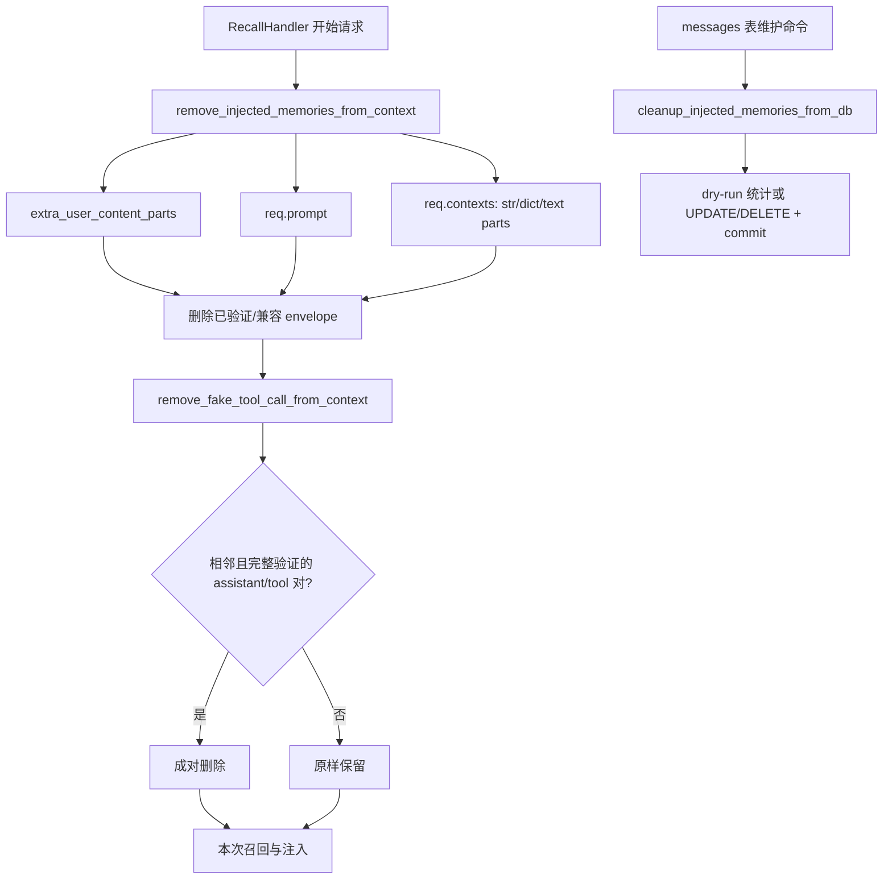

[根级 AGENTS.md](../../AGENTS.md) > [core](../) > **cleaners**

# 记忆注入清洗

**最后更新：** 2026-07-17  
**入口/公开导出：** `InjectionCleaner`

## 职责边界

`core/cleaners/` 只识别并删除 Memora 自己生成的历史注入 envelope 与严格验证的伪工具调用对，避免下一次 LLM 请求重复携带动态记忆。它不生成注入、不判断召回、不清洗普通用户文本，也不修改热路径的 `system_prompt`。生成和原子注入由 `core/injection/` 负责，调用编排见 [`../handlers/AGENTS.md`](../handlers/AGENTS.md)。

## 数据流



## 可识别内容与接口

### `remove_injected_memories_from_context(req, session_id) -> int`

清理以下非 System Prompt 载体：

- `extra_user_content_parts`：含受支持 envelope 的 part 整体移除。
- `req.prompt`：仅替换 envelope，并把 3 个以上连续换行压到 2 个。
- `req.contexts`：支持字符串、`dict(content=str)` 和 `dict(content=list[{type: "text", text: ...}])`；清空后的消息/文本 part 删除。
- `role=tool` 的 context 在此步骤原样保留，交给严格的伪工具对验证。

受支持 envelope：当前 `<memora-untrusted-memory>...</memora-untrusted-memory>`、`[DeepSeekV4-FakeToolCall-Replay]...[/...]`，以及常量定义的兼容注入 header/footer。

**硬约束：此热路径不读取也不修改 `req.system_prompt`。** 动态记忆不应进入 System Prompt；即使出现相似标记，也不能由该方法静默改写系统指令。

### `remove_fake_tool_call_from_context(req, session_id) -> int`

只删除相邻的 assistant/tool 二元组，并要求：

- assistant 只有一个 tool call；ID 精确符合 Memora 前缀和规定的 12/32 位十六进制形状；函数名匹配常量。
- tool 的 `tool_call_id`、`name` 与 call 完全一致。
- 新格式 tool content 含完整受验证 envelope；旧 12 位格式还必须能解析出形状严格的 RAG JSON，并与 arguments 中 query 一致。

任何额外 call、错位消息、相似 ID、错误工具名、缺 envelope 或普通第三方工具消息都必须保留。

### `cleanup_injected_memories_from_db(connection, write_lock, session_id=None, dry_run=False)`

在写锁内筛选 `messages.content`，返回 `scanned/matched/cleaned/deleted/errors`；可选 session 范围。清理后空内容 DELETE，否则 UPDATE；非 dry-run 最后 commit。连接为空返回带 `error/message` 的结果。此入口是维护操作，不属于每次聊天热路径。

## 失败、取消与数据安全

- 两个同步热路径捕获普通异常、记录并返回已完成计数；失败时聊天主链继续，原则是“宁可暂留，也不误删普通上下文”。
- 数据库清理捕获普通异常并置 `errors=1`。当前实现没有显式 rollback；调用方不能把错误统计当作事务成功。
- 异步数据库维护不得吞掉 `asyncio.CancelledError`。新增异常边界时必须显式重抛取消，并保持写锁/连接生命周期由调用方拥有。
- 所有判定基于常量、完整 envelope 和结构验证；禁止扩大为“包含前缀就删”或宽泛 JSON 猜测。
- 修改标记、fake tool ID 或 payload 结构时，必须同时检查 injection executor/adapter 与新旧格式 round-trip 测试。

## 文件、依赖与验证

- `injection_cleaner.py`：正则、兼容 envelope、上下文/DB 清理和伪工具验证。
- `__init__.py`：只导出 `InjectionCleaner`。
- 下游依赖：`core.base.constants`；运行期请求类型仅用于类型检查。
- 直接测试：`tests/test_cleaners.py`，包含真实 executor 输出 round-trip、System Prompt 不可变、DB dry-run/范围、严格 pair 保留/删除。
- 主链测试：`tests/test_handlers.py`。

精确验证命令：

```bash
python -m pytest tests/test_cleaners.py tests/test_handlers.py -q
```

改动数据库路径时应额外关注：写锁被使用、dry-run 不执行写/commit、纯 envelope 行删除、混合正文行更新、所有支持 envelope 都能被扫描。