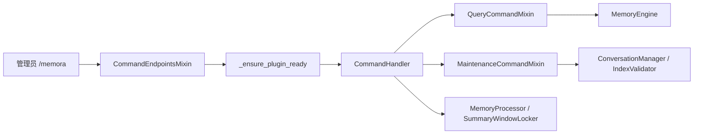

[根级 AGENTS.md](../../AGENTS.md) / core / commands

# `/memora` 管理命令实现

**最后核对：** 2026-07-17  
**组合入口：** `core/command_handler.py::CommandHandler`  
**路由入口：** `core/command_endpoints.py::CommandEndpointsMixin`

## 职责边界

本目录仅实现查询与维护命令的两个 mixin。AstrBot 装饰器、管理员权限和就绪门控在 `CommandEndpointsMixin`；依赖注入、手动总结与真实写保护覆盖在 `CommandHandler`；本目录方法负责业务调用、i18n 文本和 `AsyncGenerator[MessageEventResult, None]` 输出。



## 权限与端点契约

所有 `/memora` 子命令都在 `core/command_endpoints.py` 上使用 `@permission_type(PermissionType.ADMIN)`；不要仅在 handler 文档或提示文本中声称管理员权限。`status`、`webui`、`help` 使用 `wait=False` 的非阻塞就绪快照，其余命令等待初始化。

| 子命令 | 实现 | 行为 |
|---|---|---|
| `status` | `handle_status` | 记忆总数、session 数、最新更新时间、主 DB 大小 |
| `search <query> [k]` | `handle_search` | 以当前 `unified_msg_origin` 检索；`k` 钳制 1–100；显示最终分数和四路评分明细 |
| `forget <doc_id>` | `handle_forget` | 写保护后删除记忆；负 ID 拒绝 |
| `webui` | `handle_webui` | 返回 i18n WebUI 指引 |
| `rebuild-index` | `handle_rebuild_index` | 写保护、检查一致性、必要时重建并报告 partial/vector mode/switched |
| `rebuild-graph` | `handle_rebuild_graph` | 写保护后重建图索引，报告 rebuilt/skipped |
| `reset` | `handle_reset` | 写保护后清除当前 session 的 Memora 会话上下文 |
| `cleanup [preview|exec]` | `handle_cleanup` | 默认 preview 映射 `dry_run=True`；只有大小写不敏感的 `exec` 真正写 AstrBot 历史 |
| `summarize` | `CommandHandler.handle_summarize` | 写保护与会话窗口锁后，处理未总结消息并逐条持久化 |
| `help` | `CommandHandler.handle_help` | 返回 i18n 帮助文本 |

`core/commands/__init__.py` 是空包标记；mixin 由 `CommandHandler` 直接导入，不存在包级公共重导出契约。

## 数据流与持久化语义

### 查询

`status` 和 `search` 要先检查 `memory_engine`。搜索 query 去空白，使用当前 session；展示内容截断到 100 字符，但真实检索结果不在命令层改写。错误通过 `_format_error_message()` 与 i18n suggestions 转为用户消息。

### 维护与清理

`rebuild-index` 仅在 `IndexStatus` 不一致或 `needs_rebuild` 时调用重建。`reset` 清 Memora `ConversationManager` session，不等同于删除 AstrBot 原始对话。

`cleanup` 读取 AstrBot 当前 conversation 的 JSON history，只匹配 `MEMORY_INJECTION_HEADER ... MEMORY_INJECTION_FOOTER`（当前常量为旧 `<RAG-Faiss-Memory>` 边界），删除纯注入消息或保留清理后的内容，并把三行以上空行压成两行。preview 只统计；exec 才调用 `update_conversation()`。

重要限制：自适应执行器使用 `<memora-untrusted-memory>` 与临时用户侧载体，且永不写 System Prompt。此命令当前只清理旧常量边界，不能宣称清理所有现代注入载体或伪工具上下文；通用运行时清理由 `core/cleaners` 负责。

### 手动总结

`handle_summarize()`：

1. 写保护后按 session 尝试 `SummaryWindowLocker`；同 session 已有任务则退出。
2. 从实际消息数与 `last_summarized_index` 计算窗口，少于 2 条不处理。
3. 读取窗口、解析 persona/group，调用 `MemoryProcessor.process_conversation()`。
4. 每条记忆写入 `source_window`（含 `triggered_by=manual`）。
5. 任一写入失败时记录 `pending_summary` 并不推进窗口；全部成功后更新 `last_summarized_index` 并清空 pending。
6. `finally` 释放窗口锁。

这保证“部分写入”不会假装整个窗口已提交，但已成功写入的前缀可能存在，后续补偿逻辑必须尊重 `pending_summary`。

## 写保护与安全边界

- mixin 自带的 `_maintenance_write_guard_message()` 只为独立测试提供无保护默认；生产 `CommandHandler` 必须覆盖它并使用 `_write_guard_cb`。
- 待恢复备份存在时，`forget`、重建、`reset`、`cleanup exec`、`summarize` 均拒绝写入。`cleanup preview` 是只读扫描，允许执行。
- 写保护检查异常采用 fail-closed，向管理员返回维护检查失败；不要回退为允许写入。
- 权限必须保留在装饰器层；输入验证不能代替管理员鉴权。
- 日志可含 session 与错误类别，但不要输出记忆全文、历史 JSON、凭据或 Provider 配置。
- 清理历史时只处理 `content` 为字符串的消息，非字符串结构原样保留；不要用宽泛正则跨消息删除。

## 依赖方向

`command_endpoints` → `CommandHandler` → 本目录 mixin → engine/manager/validator/context。命令不应导入 Page API，也不应直接操作 SQLite。动态注入规则见 [注入模块 AGENTS.md](../injection/AGENTS.md)。

## 测试定位与精确验证

```powershell
python -m pytest tests/test_command_endpoints.py -q
python -m pytest tests/test_command_handler.py tests/test_commands.py -q
```

重点覆盖：管理员端点委托、阻塞/非阻塞就绪检查、cleanup mode 映射、写保护、索引结果、历史 preview/exec、部分总结写入与窗口锁释放。

## 相关上下文

- [根级 AGENTS.md](../../AGENTS.md)
- [注入模块 AGENTS.md](../injection/AGENTS.md)
- `core/command_endpoints.py`
- `core/command_handler.py`
- `core/cleaners/`
