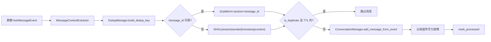

[根级 AGENTS.md](../../AGENTS.md) > [core](../) > **dedup**

# 群聊消息去重缓存

**最后更新：** 2026-07-17  
**入口/公开导出：** `DedupManager`

## 职责边界

`core/dedup/` 为单个 `EventHandler` 实例提供进程内、有限容量、带 TTL 的消息去重。当前真实调用点仅是 `EventHandler.handle_all_group_messages()`：先由 [`../extractors/AGENTS.md`](../extractors/AGENTS.md) 得到内容，再构建 key、检查、成功写入会话后标记。

它不是数据库唯一约束，不跨进程/重启共享，不负责抽取或内容相似度，也不用于 LLM 响应、召回候选或长期记忆去重。

## 数据流



## 接口与键协议

- `DedupManager(max_size=1000, ttl=300)`：内部 `dict[str, float]` 保存插入时间。
- `build_dedup_key(event, session_id, content) -> str | None`：
  - 优先非空 `event.message_obj.message_id`。
  - ID key 的 scope 由 platform 与 session 的非空部分组成；平台优先调用 `get_platform_name()` / `get_platform()`，失败再查 `message_obj.platform/platform_name/adapter_type`。
  - 无 ID 时构造 `session_id|sender_id|timestamp|content` 并取 SHA-1，前缀为 `fallback:`。SHA-1 只作非安全指纹，不用于签名或秘密保护。
- `is_duplicate(key) -> bool`：空 key 为 false；命中后才检查 TTL，过期则惰性删除并返回 false。
- `mark_processed(key) -> None`：空 key 无操作；容量已满时按最小时间戳淘汰一个最旧条目，再写当前时间。

## 主链约束与失败策略

- 必须在会话写入成功后才 `mark_processed`，否则瞬时存储失败会永久吞掉该消息。
- platform + session scope 不可移除：不同平台或群组可能复用同一个 message ID。
- fallback 必须包含 session、sender、timestamp、标准化内容；少任一维度都会扩大误判范围。
- 平台 getter 的普通异常被局部忽略并继续 fallback；构建/缓存接口没有总括异常层，由 `EventHandler` 记录并隔离主链错误。
- 本类方法声明为 async 但内部没有 await；当前 check→write→mark 不是跨任务事务，也没有锁。不要把它描述为并发强一致去重。若未来需要多 worker/多进程一致性，应迁移到带原子写的持久化边界，而不是扩大全局 dict。
- `asyncio.CancelledError` 应由调用它的群聊处理入口传播；不要新增捕获后返回“重复”的逻辑。

## 文件、依赖与验证

- `dedup_manager.py`：key、TTL 与容量淘汰。
- `__init__.py`：只导出 `DedupManager`。
- 仅依赖 Python `hashlib`、`time` 与事件的窄接口。
- 直接测试：`tests/test_dedup.py`，覆盖 scope、确定性 fallback、TTL、容量和端到端状态转换。
- 集成测试：`tests/test_event_handler.py`，覆盖群聊捕获门控与关闭任务。

精确验证命令：

```bash
python -m pytest tests/test_dedup.py tests/test_event_handler.py -q
```

变更键格式是兼容性变更；至少锁定同 ID 跨平台/跨 session 不冲突、空 ID 走 fallback、过期键被删除、满容量只淘汰最旧项，以及失败写入不提前标记。