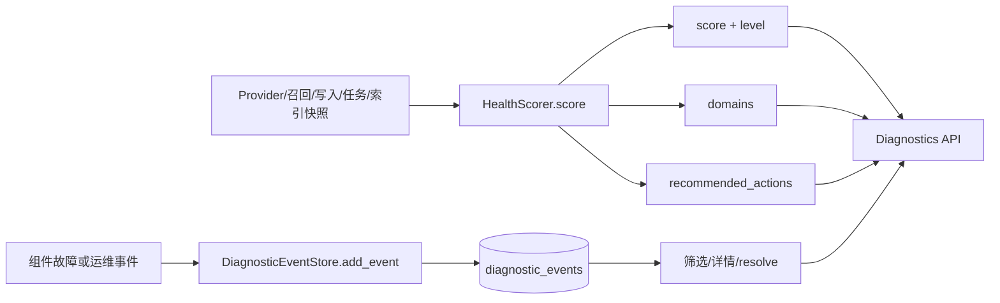

[根目录](../../AGENTS.md) > [core](../AGENTS.md) > **diagnostics**

# 运行时诊断与健康评分模块

**最后更新：** 2026-07-20

## 职责与边界

`core/diagnostics/` 保存结构化诊断事件并把现有运行时快照转换为 0–100 健康分、领域明细和建议。它不采集 Prometheus 指标、不调度恢复任务，也不主动探测 Provider；`core/api/diagnostics_api.py` 负责从插件现有组件组装快照、查询事件和暴露有限恢复动作。

## 架构与数据流



## 关键接口与规则

### `HealthScorer`

- `score(snapshot, previous_write_failures_total=None)` 接受任意值；非字典安全退化为空快照。
- Provider `failed` 扣 35 且总分最多 44；`waiting` 且仍在重试扣 10。
- 召回 `p95_total_ms > 1000` 扣 15。
- 写失败总数相对显式 previous 或实例上次值增长时扣 15。
- 后台失败任务大于 0 扣 10；索引重建错误率大于 10% 扣 10。
- Prometheus 不可用只产生 info domain，不扣分。
- `level_for_score`：`>=85 healthy`、`>=65 watch`、`>=45 degraded`、其余 `critical`。

实例内部保存上一次写失败累计值，因此跨无关环境复用一个 scorer 会污染“增长”判断；需要独立基线时传 `previous_write_failures_total` 或创建新实例。

### `DiagnosticEventStore`

- `initialize()` 创建父目录、`diagnostic_events` 表和按新到旧查询的索引。
- `add_event(event)` 生成或校验诊断关联码与 UTC ISO 时间，并把 domain、severity、source 和 payload 收窄到固定允许列表；`title`、`message` 统一为安全 `reason_code`，不保留调用方自由文本。
- `list_events(limit, domain, severity, include_resolved)` 参数化筛选并稳定排序；非法 limit 回退 50。
- `get_event(event_id)` / `resolve_event(event_id)` 查询与幂等标记解决时间。
- payload 只允许固定文本枚举、安全异常类型、非负有界数值和布尔字段；dict、list、任意嵌套 JSON 与未知字段都会被丢弃。
- 新增写入、列表、详情和 resolve 返回均经过同一 sanitizer；历史 SQLite 行也在读取时重新脱敏，不能因为旧 payload 已落库而原样返回。

## 依赖方向

- 上游：`core/api/diagnostics_api.py`，以及产生诊断事件的运行时组件。
- 本模块两部分彼此独立：`health_scorer.py` 纯内存计算，`event_store.py` 独立 SQLite 存储。
- 下游：`aiosqlite` 与标准库；无 Prometheus 或 AstrBot 导入要求。
- 相关上下文：[监控模块](../monitoring/AGENTS.md)、[API 模块](../api/AGENTS.md)。

## 隐私、安全与修改约束

- `event_id` 只是有界诊断关联码，不得复用用户、群组、会话、消息、记忆、source、revision 或 job ID；非法历史值读取为稳定占位符。
- payload allowlist 是存储与 API 的共同隐私边界。禁止加入 query、Prompt、正文、原始身份、ID/ID 列表、Provider 请求信息、秘密、异常消息、堆栈或绝对路径；新增字段必须先定义低基数类型并补充 canary 测试。
- 异常检测告警使用稳定 reason code `memory_rate_anomaly`，payload 只含 `direction/count/mean_7d/stdev_7d/z_score/window_size` 等标量；不记录记忆正文、身份或路径。
- API 失败只返回稳定错误码，日志只允许固定阶段与异常类型，不得拼接 `str(exc)`、异常 `repr` 或 traceback。
- 事件的 `domain`、`severity`、`source` 是不可信输入，必须继续使用参数化查询，不要拼接 SQL。
- 健康分是启发式运维摘要，不应直接触发破坏性恢复动作；恢复端点必须在 API 层使用白名单，并保留鉴权/审计边界。
- 不要把缺失指标当作故障扣分；当前实现只对明确满足的条件扣分。
- 修改阈值或扣分时必须同步等级边界、推荐动作与回归测试，尤其保持 Provider failed 强制 critical。
- 事件目前没有自动保留/清理策略；新增清理必须显式限定时间与批量，不能在读取路径隐式删除。

## 测试定位与验证

- `tests/test_diagnostics_health_scorer.py`：Provider 状态、延迟、写失败增量、任务/索引、等级映射、事件新增/筛选/resolve 和标量 allowlist。
- `tests/test_api_diagnostics.py`：API 快照组装、事件存储和恢复动作契约。
- `tests/test_p0_observability_privacy.py`：新旧事件读取、嵌套 payload、正文/query/身份/ID/异常 canary 与稳定错误码。

精确验证命令：

```bash
python -m pytest -q tests/test_diagnostics_health_scorer.py tests/test_api_diagnostics.py tests/test_p0_observability_privacy.py
```
