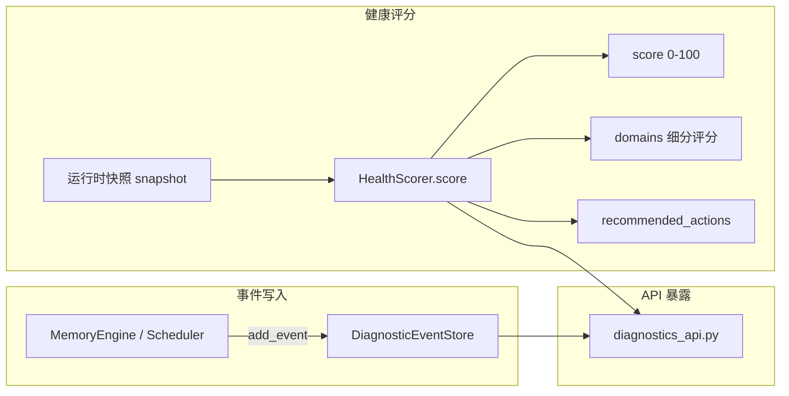

[根目录](../../CLAUDE.md) > [core](../CLAUDE.md) > **diagnostics**

## 模块职责

`core/diagnostics/` 提供运行时诊断事件的持久化存储与系统健康评分引擎。诊断事件涵盖 Provider 状态、召回延迟、写入失败、调度器故障、索引重建错误等关键运维信号，HealthScorer 基于这些信号生成 0-100 的量化健康分和可操作建议。

## 架构图



## 组件详解

### 1. DiagnosticEventStore (`event_store.py`) -- 诊断事件存储

异步 SQLite 事件日志存储，记录系统运行中的诊断事件。

**Schema**: `diagnostic_events` 表

| 字段 | 类型 | 描述 |
|------|------|------|
| `event_id` | `TEXT PK` | 事件 UUID |
| `created_at` | `TEXT` | 创建时间 (ISO-8601) |
| `domain` | `TEXT` | 领域 (provider/recall/write/scheduler/index/...) |
| `severity` | `TEXT` | 严重级别 (info/watch/degraded/critical) |
| `title` | `TEXT` | 事件标题 |
| `message` | `TEXT` | 事件详情 |
| `source` | `TEXT` | 来源组件 |
| `payload` | `TEXT` | JSON 负载 |
| `resolved_at` | `TEXT` | 解决时间 (nullable) |

**关键方法**:

| 方法 | 描述 |
|------|------|
| `initialize()` | 创建表和索引 |
| `add_event(event)` | 插入诊断事件，返回完整事件字典 |
| `list_events(limit, domain, severity, include_resolved)` | 分页查询事件列表 |
| `get_event(event_id)` | 按 ID 查询单个事件 |
| `resolve_event(event_id)` | 标记事件为已解决 |

**索引**: `idx_diagnostic_events_list` 按 `created_at DESC, event_id DESC` 排序

### 2. HealthScorer (`health_scorer.py`) -- 健康评分引擎

接收运行时快照，输出 0-100 的健康分数、各领域子评分和推荐操作。

**评分维度**:

| 维度 | 扣分 | 触发条件 | 级别 |
|------|------|---------|------|
| Provider | -35 | 状态为 "failed" | critical |
| Provider 等待 | -10 | 状态为 "waiting" 且重试活跃 | watch |
| 召回延迟 | -15 | p95 延迟 > 1000ms | degraded |
| 写入失败增长 | -15 | 失败数相比上次增加 | degraded |
| 后台任务失败 | -10 | 失败数 > 0 | watch |
| 索引重建错误 | -10 | 错误率 > 10% | watch |

**健康等级映射**:

| 分数 | 等级 |
|------|------|
| >= 85 | healthy |
| 65-84 | watch |
| 45-64 | degraded |
| < 45 (或 Provider failed) | critical |

**关键方法**:

| 方法 | 描述 |
|------|------|
| `score(snapshot, previous_write_failures_total)` | 计算健康评分，返回 `{score, level, domains, recommended_actions}` |
| `level_for_score(score)` | 分数转等级字符串 |

**快照结构 (snapshot)**:
```python
{
    "provider": {"status": "ready"|"waiting"|"failed", "attempts": 0, "max_attempts": 60, "retry_active": bool},
    "recall": {"p95_total_ms": 350.0},
    "write_coordinator": {"failures_total": 12},
    "background_tasks": {"failed": 0},
    "index": {"last_rebuild_errors": 5, "last_rebuild_total": 1000},
    "prometheus": {"available": True},
}
```

**写失败追踪**: 内部维护 `_last_write_failures_total` 状态，用于跨快照检测写入失败的增长。

## 关键依赖

- `aiosqlite` -- 异步 SQLite 驱动
- `uuid` (stdlib) -- 事件 ID 生成
- `datetime` (stdlib) -- ISO-8601 时间戳

## 常见问题 (FAQ)

**Q: 健康评分的频率是多少？**
A: 评分由调用方驱动，通常通过 diagnostics API 按需触发或定期调用。`HealthScorer` 本身是无状态的（除了写入失败追踪）。

**Q: 诊断事件会自动清理吗？**
A: 目前没有自动清理机制。需要通过维护 API 手动清理或配置定期清理任务。

**Q: Provider failed 时 health score 为什么是 "min(score, 44)"？**
A: Provider 是整个记忆系统的基础设施。Provider 不可用时，无论其他指标如何，系统都应被视为 critical 状态。

## 相关文件清单

| 文件 | 行数 | 描述 |
|------|------|------|
| `__init__.py` | 6 | 模块导出 |
| `event_store.py` | 196 | DiagnosticEventStore 完整实现 |
| `health_scorer.py` | 191 | HealthScorer 评分引擎 |

## 变更记录 (Changelog)

| 日期 | 变更 | 描述 |
|------|------|------|
| 2026-07-07 | 初始文档 | 完整扫描 3 文件，生成诊断架构文档 |
