[根目录](../../AGENTS.md) > [core](../AGENTS.md) > **evaluation**

# 离线检索质量评测模块

**最后更新：** 2026-07-21

## 职责与边界

`core/evaluation/` 加载检索用例，适配 `MemoryEngine` 搜索接口，计算查询级 Recall@K、MRR、二元 nDCG@K 和 P95 延迟，通过隔离只读快照运行有限消融并持久化安全报告。它是离线/运维评测设施，不参与在线召回排序、不训练模型，也不把指标结果自动转成生产配置。正式 Page 默认从 canonical SQLite 读取最近最多 20 条活跃记忆，在请求内构造 `current_memories` 自身召回样本；另可读取 `<data_dir>/evaluation_datasets` 中经 `EvaluationDatasetRepository` 校验的人工标注集。`tests/fixtures/retrieval` 只服务自动化测试，不是运行时数据源。

`session_first_ablation.py` 提供 Session-first 的隔离反事实双跑：基线和精确 Session 分支都必须实际执行，保守证据门只产生 `would_short_circuit` 决定，不改变 `RecallHandler`。实验专用 `session_first.jsonl` 默认不进入标准 `load_fixture_dir`，需显式 `include_experimental=True` 或使用专用 loader；报告只保存固定 reason code、指标、延迟和成本标量。

`derived_metadata_ablation.py` 只构造 process-local source-backed annotation index；`feedback_ranking_ablation.py` 只在内存中应用隔离 aggregate 的 document/graph 权重。`derived_metadata.jsonl` 和 `feedback_ranking.jsonl` 与 Session-first 一样默认排除在标准 fixture 目录之外，三类实验均不注册到 `EvaluationService` 或 Page API。

## Memory Evolution A/B/C 评测

`tests/fixtures/retrieval/memory_evolution.jsonl` 使用 21 条匿名合成样本覆盖 direct/single-hop、multi-hop、noise-negative、revision unchanged/revised、single/multi-source conflict、canonical delete、derived rebuild、scope/privacy/role/validity negative、stale job、retry recovery、temporal consistency、UTC `reference_time`、future/valid window 和 source-backed projection。Projection 用例的相关文档必须是 canonical source IDs，不能为派生摘要伪造独立 `doc_id`；fixture 不能混入真实对话、身份或凭据。

评测服务的 A/B/C 名称继续兼容，但只在隔离快照中表达可证明的读取差异：与 baseline 读取行为等价时标记 `equivalent_to_baseline`；只读快照不能启动 `active` worker；缺少实际 derived reader 时不得把配置变化标记为完成。除 Recall@K、Precision@K、MRR、nDCG 外，报告还可记录 single/multi-hop recall、noise false hit、conflict accuracy、source-supported projection rate 和固定 reason-code 聚合。延迟、回答质量与成本必须按来源使用 `observed_*`、`annotated_*`、`judged_*` 或 `reported_*`；没有对应测量时保持 `null`，指标不可自动写回生产配置。

## 架构与数据流

```mermaid
flowchart LR
    A[JSONL fixtures] --> B[load_jsonl_cases / load_fixture_dir]
    B --> C[EvaluationCase]
    C --> D[make_memory_engine_retriever]
    D --> E[MemoryEngine.search_memories]
    E --> F[evaluate_cases]
    F --> G[EvaluationReport]
    G --> H[baseline 与消融 deltas]
    H --> I[EvaluationReportStore]
    I --> J[评测 API 历史与对比]
```



## 模型、指标与入口

- `EvaluationCase`：用例 ID、查询、相关文档 ID 集合和路由元数据。
- `RetrievedDocument`：评测所需的最小文档 ID、分数与元数据。
- `EvaluationResult`：排序 ID、相关集、三项质量指标、实测延迟、可选标注/外部延迟和元数据。
- `EvaluationReport`：总用例数、K、平均指标、分来源 P50/P95、逐用例结果和数据集分解；没有 Judge 时 `judged_*` 保持 `null`。
- `RetrievalObservation`：检索器显式携带文档和可验证 Provider/token instrumentation 的唯一入口；普通文档序列不产生实测成本。
- `AblationReport` / `VariantComparison`：变体指标快照、报告和相对 baseline 的差值。
- `load_jsonl_cases` / `load_fixture_dir`：严格读取每行 JSON，用文件名作为缺省数据集名。
- `make_memory_engine_retriever(engine)`：把 case 元数据中的 session、persona、user、memory type、emotion 和策略参数传给 `search_memories`。
- `evaluate_cases(cases, retriever, k)`：支持同步或异步 retriever；`expected_no_hit=True` 的空结果按正确负例计分。
- `evaluate_variants` / `compare_reports`：纯函数级变体评估和指标差值。

## Service 与持久化

`EvaluationService` 通过 `RetrievalAblationController` 注册 baseline、A/B/C、chain graph/topic、最终 reranker 和 0/1/2-hop 图邻居变体。固定 hop 消融同时比较 single-hop、multi-hop、noise false hit 和 `observed_*` 墙钟延迟；当前没有一致收益证据，因此 `graph_min_distance` 继续只进入内部 breakdown，不新增生产评分参数。`k` 裁剪到 `1..20`；未知数据集被忽略，baseline 不可运行时返回错误且不保存。每个变体复制会被修改的 config、retriever、optimizer 和 cache，Store/索引只读共享；live engine 的配置、缓存和 canonical metadata 不得改变。普通单变体失败只返回稳定 skipped reason 并继续，`asyncio.CancelledError` 传播。

`EvaluationDatasetRepository` 限制 JSONL 文件名、1 MiB 大小、500 个用例、单用例 50 个相关 ID 与全文件 500 个相关 ID，拒绝重复 case 和跨文件逻辑名称。Page API 在原子写入前确认 `relevant_doc_ids` 是当前数据库中存在的 canonical 整数 ID；`__no_relevant__` 只能单独表示正确负例。相同文件名再次导入会原子替换旧版本。

`evaluation/datasets` 返回 `name/available/reason_code/default_selected` descriptor。结果返回 `capability_status/reason_code/effective_settings`；与 baseline 等价、缺少实际组件、运行时 embedding 无有效文档向量或未真实执行目标策略时不得标记 `completed`。生产配置、实现与检索消融统一使用 `embedding_similarity`，其成本来自 Embedding 调用或本地向量计算，不是 Cross-Encoder 联合推理。

`EvaluationReportStore` 独立于 AstrBot 存储模块，应用 WAL/NORMAL、busy timeout、cache 和 mmap PRAGMA。`evaluation_reports` 保存汇总与完整 payload，`evaluation_cases` 保存逐用例结果并以外键级联；报告 ID 使用毫秒时间与随机后缀。集合和 dataclass 在持久化前转换为稳定 JSON 值。

## 依赖方向

- 上游：`core/api/evaluation_api.py` 构造 Service，使用 initializer 的 `memory_engine`、生产数据集目录和独立报告数据库，并负责导入时的 canonical ID 校验。
- 本模块：`evaluation_service.py -> retrieval_quality.py + report_store.py`。
- 下游：`MemoryEngine` 形状协议、`aiosqlite`、标准库；核心包导入不要求 AstrBot。
- 相关上下文：[召回模块](../retrieval/AGENTS.md)、[存储模块](../storage/AGENTS.md)、[API 模块](../api/AGENTS.md)。

## 隐私、安全与修改约束

- fixture 的查询、用户/session/persona 元数据、相关文档 ID 和逐用例结果会进入评测报告；不要使用未经脱敏的生产对话或把报告数据库公开下载。
- `EvaluationService` 会通过 live engine 的隔离浅快照调用真实只读检索组件；不得清空 live cache、继承 canonical 更新回调或启动后台维护任务。仍禁止在在线请求热路径运行大批评测。
- `EvaluationReportStore` 写入和读取逐用例结果时只保留 case ID 与有限数值 allowlist；query、ranked/relevant ID、session/persona/user、任意 metadata 和秘密字段不得进入报告/API。读取旧报告时也要重新执行该 sanitizer。
- 报告指标是实验观测，不是访问控制或自动发布信号；对小样本和 `expected_no_hit` 数据应保留数据集分解。
- `observed_*_latency_ms` 只来自墙钟测量；fixture 只能写 `annotated_*_latency_ms`，历史无前缀值读取时降级为 `reported_*`，三者不得混算。
- `observed_provider_calls` 与 `observed_token_cost` 只接受 `RetrievalObservation` 的显式 instrumentation；fixture 标注使用 `annotated_*`，历史无前缀值使用 `reported_*`，不得用零值伪装不可用。
- 新增变体必须加入固定支持集合、能力判定、实际组件修改、运行时探针、缓存隔离和测试；不得接受任意客户端配置键或只改变无消费者配置。

## 测试定位与验证

- `tests/evaluation/test_retrieval_quality.py`：fixture 加载、路由元数据、排名指标、正确负例、engine 适配和变体差值。
- `tests/evaluation/test_evaluation_service.py`：无 AstrBot 导入、报告 round-trip、数据集选择、真实配置键、不可用变体、缓存隔离、baseline 失败与历史对比。
- `tests/evaluation/test_retrieval_ablation.py`：snapshot 复制、live 回调隔离、能力 descriptor、等价检测、稳定失败与取消传播。
- `tests/evaluation/test_session_first_ablation.py`：Session-first 场景 loader、双跑、证据门、权限/revision/冲突负测、失败回退、取消传播和报告 canary。
- `tests/evaluation/test_derived_metadata_ablation.py`、`tests/test_derived_metadata_contract.py`：有限派生注解预算、source revalidation、重建和 metadata-dependent 消融。
- `tests/evaluation/test_feedback_ranking_ablation.py`、`tests/test_feedback_signal_*.py`：反馈事件模型、隔离 Store、抗重放聚合、shadow 权重和安全 canary。
- `tests/test_graph_hop_ablation.py`、`tests/test_retrieval_ranking.py`：0/1/2 hop、最小图距离和最终 reranker 真实调用路径。

精确验证命令：

```bash
python -m pytest -q tests/evaluation/test_retrieval_quality.py tests/evaluation/test_evaluation_service.py
python -m pytest -q tests/test_memory_evolution_manager.py tests/test_recall_cost_benchmark.py
```
