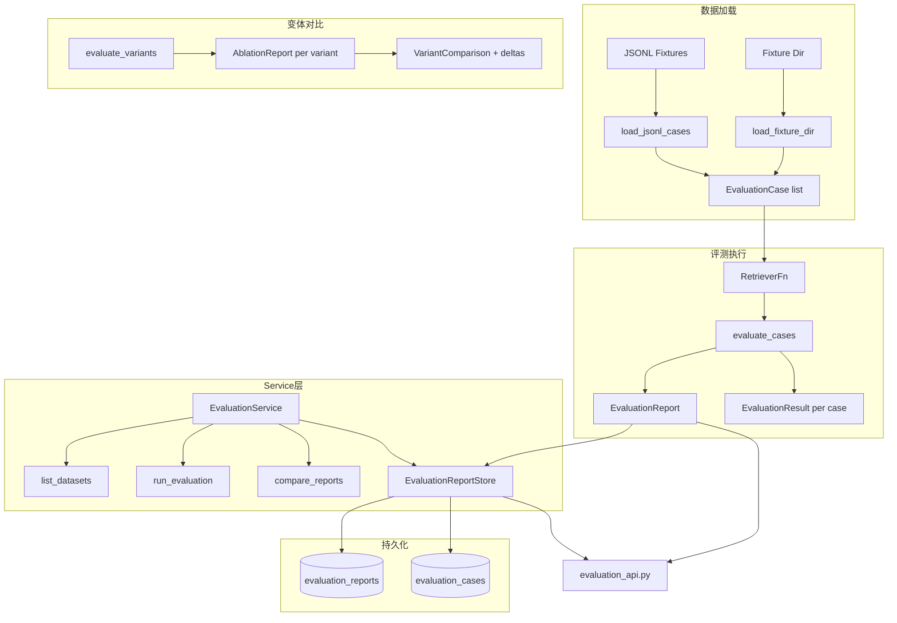

[根目录](../../CLAUDE.md) > [core](../CLAUDE.md) > **evaluation**

## 模块职责

`core/evaluation/` 提供离线检索质量评测系统，支持 JSONL 评测数据集加载、多策略变体（ablations）对比、Recall@K / MRR / nDCG@K / P95 延迟等标准检索指标的自动计算，以及评测报告的持久化存储与历史比较。

## 架构图



## 数据模型

### EvaluationCase -- 评测用例
| 字段 | 类型 | 描述 |
|------|------|------|
| `case_id` | `str` | 用例 ID |
| `query` | `str` | 查询文本 |
| `relevant_doc_ids` | `set[str]` | 相关文档 ID 集合 |
| `metadata` | `dict` | 扩展元数据 (intent, chat_type, dataset, session_id, latency_ms, expected_no_hit...) |

### RetrievedDocument -- 检索结果
| 字段 | 类型 | 默认值 | 描述 |
|------|------|--------|------|
| `doc_id` | `str` | 必填 | 文档 ID |
| `score` | `float` | `0.0` | 检索分数 |
| `metadata` | `dict` | `{}` | 扩展元数据 |

### EvaluationResult -- 单用例评测结果
| 字段 | 类型 | 描述 |
|------|------|------|
| `case_id` | `str` | 用例 ID |
| `query` | `str` | 查询文本 |
| `ranked_doc_ids` | `list[str]` | 排序文档 ID 序列 |
| `relevant_doc_ids` | `set[str]` | 相关文档 ID |
| `recall_at_k` | `float` | Recall@K |
| `reciprocal_rank` | `float` | MRR |
| `ndcg_at_k` | `float` | nDCG@K |
| `latency_ms` | `float` | 检索延迟 (ms) |
| `metadata` | `dict` | 扩展元数据 |

### EvaluationReport -- 聚合评测报告
| 字段 | 类型 | 描述 |
|------|------|------|
| `total_cases` | `int` | 总用例数 |
| `k` | `int` | Top-K 参数 |
| `recall_at_k` | `float` | 平均 Recall@K |
| `mrr` | `float` | 平均 MRR |
| `ndcg_at_k` | `float` | 平均 nDCG@K |
| `p95_latency_ms` | `float\|None` | P95 延迟 |
| `cases` | `list[EvaluationResult]` | 逐用例结果 |
| `dataset_breakdown` | `dict` | 按数据集分组的指标 |

### AblationReport -- 消融指标快照
| 字段 | 类型 | 描述 |
|------|------|------|
| `name` | `str` | 变体名 |
| `recall_at_k` | `float` | Recall@K |
| `mrr` | `float` | MRR |
| `ndcg_at_k` | `float` | nDCG@K |
| `p95_latency_ms` | `float\|None` | P95 延迟 |

### VariantComparison -- 变体对比结果
包含 `baseline` (AblationReport), `variants` (dict[name -> AblationReport]), `deltas` (dict[name -> 指标差值]), `reports` (完整 EvaluationReport 备份)

## 核心函数

### 指标计算函数

| 函数 | 描述 |
|------|------|
| `recall_at_k(ranked_doc_ids, relevant_doc_ids, k)` | 查询级 Recall@K：Top-K 中是否存在相关文档 |
| `reciprocal_rank(ranked_doc_ids, relevant_doc_ids)` | 首个相关文档排名的倒数 (MRR) |
| `ndcg_at_k(ranked_doc_ids, relevant_doc_ids, k)` | 二元相关 nDCG@K (归一化折损累积增益) |

### 评测执行函数

| 函数 | 描述 |
|------|------|
| `evaluate_cases(cases, retriever, k)` | 对一组用例执行检索并计算全部指标 |
| `evaluate_variants(cases, variants, k, baseline_name)` | 评测多个检索变体并输出对比 |

### 加载函数

| 函数 | 描述 |
|------|------|
| `load_jsonl_cases(path)` | 从 JSONL 文件加载评测用例 |
| `load_fixture_dir(path)` | 加载目录中所有 JSONL fixture，按数据集名分组 |
| `make_memory_engine_retriever(engine)` | 将 MemoryEngine 适配为 `RetrieverFn` 协议，支持 session_id/persona_id/user_id/memory_types/emotion_context/recall_strategy 等参数映射 |

### 对比函数

| 函数 | 描述 |
|------|------|
| `compare_reports(baseline, variant)` | 计算两个 AblationReport 的指标差值 |

## EvaluationService (`evaluation_service.py`)

面向 API 的服务层封装，整合数据加载、评测运行、变体对比和报告持久化。

**关键方法**:

| 方法 | 描述 |
|------|------|
| `initialize()` | 初始化 ReportStore (建表) |
| `list_datasets()` | 列出可用评测数据集及其元信息 (intents, chat_types) |
| `run_evaluation(datasets, k, variants, baseline, save_report)` | 执行评测：加载用例 -> 对每个变体（baseline/graph_expansion_off/topic_expansion_off）运行评测 -> 计算 deltas -> 可选持久化 |
| `list_reports(limit)` | 列出历史报告 |
| `get_report(report_id)` | 加载完整报告 |
| `compare_reports(report_id_a, report_id_b)` | 跨时间点报告对比 |

**支持变体** (通过临时修改 engine config 实现):

| 变体名 | 配置 key | 描述 |
|--------|---------|------|
| `baseline` | -- | 默认全功能配置 |
| `graph_expansion_off` | `recall_engine.chain_graph_expansion_enabled = False` | 关闭图路由扩展 |
| `topic_expansion_off` | `recall_engine.chain_topic_expansion_enabled = False` | 关闭话题扩展 |

**缓存隔离**: 每个变体评测前调用 `_clear_evaluation_caches()` 清空检索缓存，确保变体间互不影响。

## EvaluationReportStore (`report_store.py`)

评测报告的 SQLite 持久化存储。

**Schema**:
- `evaluation_reports`: 报告主表 (report_id, created_at, baseline, summary_json, datasets_json, variants_json, payload_json, case_count)
- `evaluation_cases`: 用例结果表 (report_id, case_index, case_id, payload_json)，外键关联 reports 并级联删除

**关键方法**:

| 方法 | 描述 |
|------|------|
| `initialize()` | 建表 + WAL 性能 PRAGMA |
| `save_report(report)` | 持久化报告，返回 report_id |
| `get_report(report_id)` | 加载完整报告 (含 cases) |
| `list_reports(limit)` | 列出报告元信息 (不含 cases) |

**性能配置**: WAL、NORMAL synchronous、64MB cache、256MB mmap

## 关键依赖

- `json`, `math`, `time`, `pathlib` (stdlib)
- `aiosqlite` -- 异步 SQLite
- `dataclasses` (stdlib)

## 常见问题 (FAQ)

**Q: JSONL 评测数据集格式是什么？**
A: 每行一个 JSON 对象，必须包含 `case_id`、`query`、`relevant_doc_ids`（非空数组）。可选 `metadata` 字段支持 intent、chat_type、dataset、session_id、latency_ms、expected_no_hit 等扩展。

**Q: 如何在已有引擎上运行评测？**
A: 使用 `EvaluationService`:
```python
svc = EvaluationService(engine=engine, fixture_dir="tests/fixtures/retrieval", db_path="data/eval.db")
await svc.initialize()
result = await svc.run_evaluation(datasets=["memory_basic"], k=10, save_report=True)
```

**Q: 支持哪些检索指标？**
A: Recall@K、MRR (Mean Reciprocal Rank)、nDCG@K (Normalized Discounted Cumulative Gain)、P95 Latency (ms)。所有指标为二元相关性（相关/不相关）。

**Q: 如何添加新的消融变体？**
A: 在 `_SUPPORTED_VARIANTS` 中添加变体名，在 `_VARIANT_CONFIG_KEYS` 中映射到对应的 config key。

## 相关文件清单

| 文件 | 行数 | 描述 |
|------|------|------|
| `__init__.py` | 40 | 模块公共导出 |
| `retrieval_quality.py` | 489 | 核心评测引擎：数据模型 + 指标计算 + 变体对比 + JSONL 加载 |
| `evaluation_service.py` | 414 | API 服务层：数据集管理 + 评测运行 + 变体切换 + 缓存隔离 |
| `report_store.py` | 293 | 评测报告 SQLite 持久化 |

## 变更记录 (Changelog)

| 日期 | 变更 | 描述 |
|------|------|------|
| 2026-07-07 | 初始文档 | 完整扫描 4 文件，生成评测系统架构文档 |
