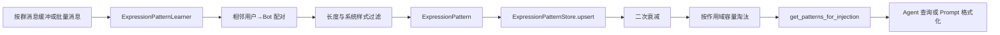

[根目录](../../AGENTS.md) > [core](../AGENTS.md) > **expression**

# 表达模式学习模块

**Last Updated:** 2026-07-17

## 职责与边界

`core/expression/` 用确定性规则从相邻的“用户消息 → Bot 回复”中学习 `(situation, expression)`，按 `(group_id, persona_id, user_id)` 隔离、累计权重、衰减和淘汰，并提供高权重模式查询或 Prompt 文本格式化。该模块不调用 LLM、不生成新回复、不判断消息安全性，也不负责将格式化文本自动注入模型；初始化在 `core/plugin_initializer.py`，控制台浏览在 `core/api/expression_api.py`，Agent 查询在 `core/tools/expression_tools.py`。

## 架构与数据流



## 关键入口与模型

- `process_messages(messages, group_id, persona_id="default", user_id=None)`：抽取、upsert、衰减、容量治理的完整批处理入口。
- `buffer_message(...)` / `maybe_learn(..., min_messages=5)`：按群内存缓冲；达到阈值后复制并清空缓冲，再进入批处理。
- `get_patterns_for_injection(..., limit=10)`：按权重降序读取作用域内模式。
- `format_patterns_for_prompt(..., limit=5)`：输出 `[学习到的表达习惯]` 文本；没有模式时返回空字符串。
- `ExpressionPattern`：截断后的 `situation`（50 字符）、`expression`（100 字符）、三维作用域、权重、使用次数和时间戳。
- `PatternScope`：不可变作用域键；`user_id=None` 明确表示群级模式。
- `GroupState`：群消息缓冲、最近学习时间和阈值计数，仅在进程内存在。

## 学习与存储规则

抽取只接受相邻记录中 `sender_id != bot_id` 且下一条 `sender_id == bot_id` 的组合；空内容、短于 `min_message_length`、以 `[`、`http` 或 `@` 开头的内容被过滤。过滤是格式启发式，不是内容安全净化。

`ExpressionPatternStore` 独立管理 `aiosqlite` 连接并应用共享性能 PRAGMA。`expression_patterns` 以 `(situation, expression, group_id, persona_id, user_id)` 去重；重复模式令 `weight += 1.0`。读取按权重降序。每次处理后按

`decay_factor = min((days_elapsed / decay_days)^2, 1.0)`

衰减；新权重不高于 `0.01` 时清除低权重记录。默认每个作用域最多 300 条，超额时删除最低权重项。

## 依赖方向

- 上游：`core/plugin_initializer.py`、`core/api/expression_api.py`、`core/tools/expression_tools.py`。
- 本模块：`pattern_learner.py -> models.py + pattern_store.py`。
- 下游：`core/storage/base.py` 的 PRAGMA、`aiosqlite`；无 LLM 依赖。
- 相关上下文：[存储模块](../storage/AGENTS.md)、[工具模块](../tools/AGENTS.md)。

## 隐私、安全与修改约束

- 表中保存真实用户消息和 Bot 回复的截断文本，并带群、人设和可选用户作用域；不得把 `user_id=None` 解释成跨群共享，也不得在查询时省略 `group_id` 或 `persona_id`。
- `format_patterns_for_prompt` 会把已存文本直接拼入 Prompt。上层必须在注入前执行自己的提示词保护；本模块的“系统消息”过滤不能防止 Prompt 注入。
- 群缓冲区保存原始消息直到触发学习；新增日志时不得输出缓冲内容或完整模式文本。
- 保持三维唯一性、截断长度、二次衰减和最低权重淘汰语义。若改变 `bot_id`，必须确保事件适配层传入的发送者 ID 与之完全一致。
- 不要在 Store 中加入业务级作用域回退；群级与用户级模式必须显式选择。

## 测试定位与验证

`tests/test_expression_pattern_learner.py` 覆盖模型、相邻配对、消息过滤、去重增权、群/人设/用户隔离、二次衰减、容量淘汰、Prompt 格式、Store CRUD、缓冲触发、截断和边界输入。

精确验证命令：

```bash
python -m pytest -q tests/test_expression_pattern_learner.py
```
