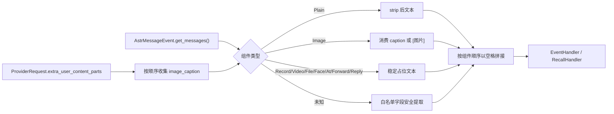

[根级 AGENTS.md](../../AGENTS.md) > [core](../) > **extractors**

# AstrBot 消息内容提取

**最后更新：** 2026-08-13

**入口/公开导出：** `MessageContentExtractor`

## 职责边界

`core/extractors/` 把 AstrBot `AstrMessageEvent` 的异构消息组件按原始顺序展平为稳定纯文本，供群聊捕获、私聊会话写入和召回查询使用。它不做去重、会话持久化、提示词清洗、分词或记忆抽取；这些分别属于 [`../dedup/AGENTS.md`](../dedup/AGENTS.md)、manager、[`../cleaners/AGENTS.md`](../cleaners/AGENTS.md) 和 [`../processors/AGENTS.md`](../processors/AGENTS.md)。

## 数据流



## 接口与映射协议

- `extract_message_content(event, req=None) -> str`：异步接口；迭代 `event.get_messages()`，返回以单空格连接并最终 `strip()` 的文本。
- `get_event_message_str(event) -> str`：读取 `event.get_message_str()`；兼容同步或 coroutine 返回。没有方法时读 `event.message_str`；非字符串返回空串。
- `_safe_unknown_component_text(component) -> str`：只按 `text`、`content`、`message`、`name`、`url` 顺序读取第一个非空字符串；截断到 300 字符，URL 包装为 `[链接: ...]`。不得回退到 `repr(component)` 或序列化整个对象。
- 组件类型只从 AstrBot 4.27.2 的公共模块 `astrbot.api.message_components` 导入；插件生产代码和测试不得依赖 `astrbot.core.message.components`。

| 组件 | 输出 |
|---|---|
| `Plain` | 去首尾空白后的文本；空文本略过 |
| `Image` | `[图片: caption]`，无对应 caption 时 `[图片]` |
| `Record` / `Video` | `[语音]` / `[视频]` |
| `File` | `[文件: name]`，缺名为 `未知文件` |
| `Face` | `[表情:id]` |
| `AtAll` / `At` | `[At:全体成员]` / `[At:qq]`；必须先识别 `AtAll` 语义 |
| `Forward` | `[转发消息]` |
| `Reply` | 有内容时 `[引用: 前30字符]`，否则 `[引用消息]` |
| 未知组件 | 白名单字段值；无安全字段则跳过并仅记录类型 |

图片 caption 从 `req.extra_user_content_parts[*].text` 的 `<image_caption>...</image_caption>` 收集，按出现顺序逐个消费；多余图片不复用 caption，多余 caption 不输出。

## 调用关系与约束

- `EventHandler.handle_all_group_messages()` 使用组件提取结果构建去重键并写群聊用户消息。
- `RecallHandler` 以 `get_event_message_str()` 取得真实查询；私聊写入没有可用 `req.prompt` 时才调用组件提取，并可使用图片 caption。
- 保持文本标记稳定：它们会进入会话、指纹、检索查询和 LLM 抽取，格式变化是跨模块行为变更。
- 展平是有意的：不要在这里引入 BM25 token、Markdown 重排或 Provider 特定消息对象。
- 未知组件处理是信息泄露边界；新组件应显式类型分支并仅选必要字段。

## 失败策略与取消

本模块没有内部重试和普通异常吞并层：事件 API 或组件属性异常由调用方边界处理。`get_event_message_str()` 等待 coroutine 时，`asyncio.CancelledError` 自然向上传播；不得捕获并转为空串，否则会破坏聊天主链关闭语义。非字符串原始消息是合法降级，返回 `""` 让召回处理器决定是否使用历史回退。

## 文件与测试

- `message_content_extractor.py`：全部提取逻辑。
- `__init__.py`：只导出 `MessageContentExtractor`。
- 直接测试：`tests/test_extractors.py`，覆盖所有组件、caption 队列、未知字段安全策略以及同步/异步原始消息方法。
- 链路测试：`tests/test_event_handler.py`、`tests/test_handlers.py`。

精确验证命令：

```bash
python -m pytest tests/test_extractors.py tests/test_event_handler.py tests/test_handlers.py -q
```

新增 AstrBot 组件时至少锁定：组件顺序、空值、长度上限、未知对象不泄露、无 caption 回退，以及取消不被吞并。
