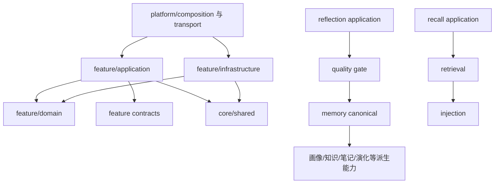

# `core/features` 业务能力总览

**最后核对：** 2026-08-14  
**上级导航：** [项目根级 `AGENTS.md`](../../AGENTS.md) / [`core/AGENTS.md`](../AGENTS.md)

## 职责边界

`core/features/` 按业务能力归属 Memora 的运行时实现。每个功能包可以包含 `domain/`、`application/`、`infrastructure/`，但这些目录只是包内分层，不是跨 feature 的第二套公共入口。

- `domain/` 保存纯模型、枚举、配置和领域异常，原则上不依赖 AstrBot、SQLite 或 Provider。
- `application/` 编排领域行为，通过端口或构造参数调用存储、Provider 和其他能力。
- `infrastructure/` 实现 SQLite、文件、协议适配或外部服务边界。
- 包根 `__init__.py` 只暴露经过确认的公共符号；标明“惰性边界”的包不得因新增导出提前加载重依赖。
- 平台生命周期、配置合并和组件装配属于 `core/platform/`；Page API、命令和 Agent 工具只能调用 feature 的公开应用边界，不能成为领域事实来源。

## 依赖方向

同一 feature 内通常采用 `application -> domain/contracts <- infrastructure`。跨 feature 调用必须指向真实 owner 的公开契约，禁止通过旧兼容模块反向建立新依赖。基础设施不得导入 Page API、命令、插件入口或调度器。

## 关键不变量

1. `features/memory/` 管理 canonical memory、Atom、图派生索引和写可靠性；canonical SQLite 整数 ID 与 revision 始终是权威身份。
2. FTS、FAISS、图、关系、Projection、画像、知识和自动笔记都是可校验或可重建的派生产物，不得创建第二套 canonical memory。
3. scope、privacy、稳定身份、source revision 与 `reference_time` 必须沿调用链传递；不能由下游重新猜测或读取另一份墙钟。
4. Provider 调用必须使用组合根注入的能力与成本门；不得在 feature 内按对象形状重新探测或新建 Provider。
5. 所有后台任务必须有明确所有者、停止路径和取消传播。普通可恢复失败可降级，但 `asyncio.CancelledError` 不得转成成功或空业务结果。
6. query、prompt、正文、身份、source ID/revision、凭据和任意 metadata 不得进入普通日志、指标或诊断事件；观测输出使用固定低基数 allowlist。
7. 旧路径若仍存在，只允许单实现 re-export。新增行为直接落在本目录真实 owner，不再扩展兼容层。

## 直接子模块导航

| 功能包 | 当前职责 | 模块文档 |
|---|---|---|
| `backup/` | 完整快照、manifest、恢复事务与回滚 | [`backup/AGENTS.md`](backup/AGENTS.md) |
| `backfill/` | 旧版混合话题记忆的有界回填 | [`backfill/AGENTS.md`](backfill/AGENTS.md) |
| `cognition/` | 好感度、表达、黑话和社交关系集合 | [`cognition/AGENTS.md`](cognition/AGENTS.md) |
| `conversation/` | 会话、消息、缓存与 AstrBot 事件适配 | [`conversation/AGENTS.md`](conversation/AGENTS.md) |
| `decay/` | 重要性衰减、访问强化与每日调度 | [`decay/AGENTS.md`](decay/AGENTS.md) |
| `diagnostics/` | 健康评分与脱敏诊断事件 | [`diagnostics/AGENTS.md`](diagnostics/AGENTS.md) |
| `evaluation/` | 隔离只读的检索评测与消融 | [`evaluation/AGENTS.md`](evaluation/AGENTS.md) |
| `evolution/` | canonical 写后的关系、Projection 与 worker | [`evolution/AGENTS.md`](evolution/AGENTS.md) |
| `identity/` | 协议稳定身份、名称目录和召回增强 | [`identity/AGENTS.md`](identity/AGENTS.md) |
| `injection/` | 注入路由、选择、执行和决策记录 | [`injection/AGENTS.md`](injection/AGENTS.md) |
| `knowledge/` | 结构化知识及来源约束 proposal | [`knowledge/AGENTS.md`](knowledge/AGENTS.md) |
| `learning/` | 可信反馈聚合、shadow 候选及 CAS 发布 | [`learning/AGENTS.md`](learning/AGENTS.md) |
| `memory/` | MemoryEngine、canonical 存储与写可靠性 | [`memory/AGENTS.md`](memory/AGENTS.md) |
| `notes/` | 版本化人工/派生笔记 | [`notes/AGENTS.md`](notes/AGENTS.md) |
| `observability/` | 指标、局部计时和隐私安全调试事件 | [`observability/AGENTS.md`](observability/AGENTS.md) |
| `profiles/` | 稳定主体画像、标签和偏好 | [`profiles/AGENTS.md`](profiles/AGENTS.md) |
| `quality/` | pre-canonical 隔离与人工复核队列 | [`quality/AGENTS.md`](quality/AGENTS.md) |
| `recall/` | 请求前召回编排及对话结构化处理 | [`recall/AGENTS.md`](recall/AGENTS.md) |
| `reconsolidation/` | revision-CAS 再巩固候选与回滚 | [`reconsolidation/AGENTS.md`](reconsolidation/AGENTS.md) |
| `reflection/` | 响应后反思窗口、批次和候选写入 | [`reflection/AGENTS.md`](reflection/AGENTS.md) |
| `retrieval/` | 多路候选、融合、重排与追踪 | [`retrieval/AGENTS.md`](retrieval/AGENTS.md) |
| `updates/` | 发布包检查、下载、安装和运行时回滚 | [`updates/AGENTS.md`](updates/AGENTS.md) |

不要为 `domain/`、`application/` 或 `infrastructure/` 批量创建空壳 `AGENTS.md`；只有形成独立维护边界时才继续下沉。

## 修改联动

- 移动真实 owner 时，同步包级导出、全部调用方、兼容 re-export、配置 ownership 和 `tests/test_*_feature_contracts.py`。
- 新增 source-backed 派生对象时，同步来源模型、写前/读时 revision 校验、canonical 更新/删除失效、重建顺序和隐私投影。
- 新增 Provider 调用时，同步 adapter 能力、请求级预算、失败/取消语义和 Provider 隐私预过滤。
- 修改状态机时，同步稳定 reason code、CAS/lease 条件、启动恢复、关停收束、Page API 映射及行为测试。
- 修改公开符号时先核对包根 `__all__`、惰性导入契约和旧路径是否仅为恒等 re-export。

## 最窄验证入口

本目录文档变更不运行测试。修改 feature 归属或包边界时，先运行对应的 `tests/test_<feature>_feature_contracts.py`；行为变化再按子模块文档列出的单测扩大范围。跨 feature 的导入边界可定位 `tests/test_plugin_package_imports.py` 与 `tests/test_memory_domain_authority.py`，不要直接从全仓测试起步。
