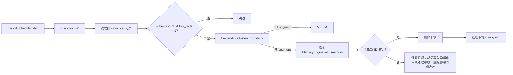

# 旧版记忆话题回填

**最后核对：** 2026-09-20  
**导航：** [项目根级](../../../AGENTS.md) / [`core`](../../AGENTS.md) / [`features`](../AGENTS.md) / `backfill`

## 职责边界

`core/features/backfill/` 只处理旧版混合话题记忆的后台拆分回填。它读取 `schema_version < v3` 且 `key_facts` 多于一项的 canonical 记录，调用 recall processors 的 embedding clustering，再通过 `MemoryEngine.add_memory()` 写新片段；它不处理实时反思、不改变新记忆抽取、不提供跨重启断点续传。

- `application/scheduler.py`：任务 start/status/progress/stop、当前运行 checkpoint、批量读取、片段替换和终态。
- 配置实际来自 reflection 的 `LegacyBackfillConfig`；本包不复制配置模型。
- 话题聚类策略唯一 owner 是 [`recall/processors/AGENTS.md`](../recall/processors/AGENTS.md) 中的 `EmbeddingClusteringStrategy`。

## 回填链



## 关键不变量

1. `start()` 在 disabled 或已有 running job 时抛 `RuntimeError`；每次启动生成运行期 `job_id`、重置 checkpoint，不把内存游标写成跨重启断点。
2. 读取优先真实 `get_documents_after_id(last_id, limit)`，再按能力降级；metadata JSON 损坏按空映射，schema `>=v3` 或单 key fact 跳过。读取本身失败不降级为空批次（空批次等于「没有更多旧版记忆」），异常向上传播并由 `_run()` 置 `failed`。
3. 聚类使用有界 `batch_size`、`max_backfill_per_run` 和策略 max_clusters；Embedding/FAISS/SQLite 不在 scheduler 内创建大事务。
4. 0/1 片段只把旧项 metadata 标为 `schema_version=v3`；多片段必须每项新写 `schema_version=v3`、`backfill_source=旧 doc_id` 和稳定幂等键 `idempotency_key=backfill:<doc_id>:<片段序号>:<正文 SHA-256>`（正文只以摘要参与，不进键、日志与进度）。`backfill_source` 只是审计标记，全仓没有消费方；重跑去重完全依赖 `idempotency_key`，不要把它当作对账入口。
5. 只有 `len(new_ids) == target_count` 才删除旧项。部分新写失败时旧项保留，成功新项也保留；当前 `_backfill_one()` 吸收片段写入异常并正常返回，因此 `errors` 不会因该情况自动增加，任务可能最终为 `completed`。该缺口由幂等键补偿：旧项仍为 `schema_version<v3`，下一轮 `start()` 重置 checkpoint 后会重新选中它，但已成功片段命中 `idempotency_key` 预检复用同一 canonical，`new_ids` 收齐后即删除旧项；删除旧项前崩溃/重启的重跑同理收敛，不会写出重复 canonical。
6. 旧项删除异常尝试写 `backfill_delete_failed/backfill_new_ids` 标记并抛出 `BackfillError`（稳定失败码 `backfill_memory_delete_failed`，异常原文只留在 `__cause__`），进入 `_run()` 的错误计数；取消时清理任务并继续传播，普通项失败不阻塞其他项。这些标记同样只是审计线索，没有消费方，不做自动重试或对账。
7. `processed` 只在 `_backfill_one()` 未抛异常时递增；部分片段写入失败仍会递增，旧项删除失败则不会递增并会计入错误。
8. 进度/API/日志只返回 job 状态、计数、时间和稳定错误摘要，不输出正文、key facts、session/persona 或 embedding。`progress["error"]` 只写稳定失败码（`legacy_batch_read_failed` / `backfill_memory_delete_failed` / `backfill_run_failed`），Page API 只搬运该字段；日志只记 `reason_code=` 与 `error_class=`，异常原文（可能含路径、SQL 或用户数据）绝不进入日志、进度或 API，只能通过 `BackfillError.__cause__` 在进程内排查。

## 依赖方向

scheduler/API → BackfillScheduler → memory engine + recall processor clustering。backfill 不依赖 Page API、reflection handler 或其他 scheduler 父包。

## 修改联动

- 改读取/游标：同步 DocumentStorage 能力探针、分页排序、checkpoint 和日志隐私。
- 改替换语义：同步 add/delete 补偿、旧项失败标记、幂等键派生、稳定失败码、schema/version、MemoryEngine CRUD 与幂等重跑收敛测试。
- 改资源上限：同步 LegacyBackfillConfig、Page API 状态和重复启动/取消测试。
- 改策略：同步 recall processors topic contract，不能在回填包复制 embedding/聚类逻辑。

## 最窄验证入口

```bash
python -m pytest -q tests/test_backfill_scheduler.py tests/test_backfill_revision_cas.py
python -m pytest -q tests/test_managers_memory_crud.py
```
