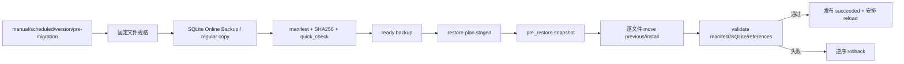

# 备份、恢复与完整性事务

**最后核对：** 2026-08-14  
**导航：** [项目根级](../../../AGENTS.md) / [`core`](../../AGENTS.md) / [`features`](../AGENTS.md) / `backup`

## 职责边界

`core/features/backup/` 负责 canonical/operational/derived 文件的完整快照、manifest 校验、版本变更备份、恢复计划暂存、原子替换、验证、回滚和状态投影。它不决定业务查询、不修改 MemoryEngine 领域逻辑，也不让 scheduler 直接遍历或替换数据目录。

- `domain/models.py`：`BackupType`、`FileRole`、完整性/恢复状态、快照与进度模型。
- `domain/errors.py`：稳定 `BackupOperationError`。
- `application/manager.py`：版本检测、备份创建/列举/删除/恢复编排。
- `application/restore_transaction.py`：可持久化恢复计划、staged/apply/validate/rollback 状态机。
- `infrastructure/snapshot.py`：SQLite Online Backup、regular file copy、SHA-256、原子 JSON 与空间检查。
- `infrastructure/integrity.py`：反馈 DB/HMAC sidecar 配对、quarantine 引用、恢复文件完整性和回滚辅助。

## 备份/恢复链



## 关键不变量

1. `memora.db` 是 canonical；`conversations.db`、状态/队列是 operational；FAISS/graph/index 是 derived。角色决定恢复策略，不能把派生文件当新的权威。
2. SQLite 统一使用 Online Backup API 并执行 quick_check；普通文件复制前后检查 regular file、路径边界和 SHA-256。临时文件必须同目录原子替换。
3. manifest 记录文件角色、大小、digest、quick check 和版本/插件来源；只在全部必需文件验证通过后发布 `ready`，禁止半成品备份进入可选列表。
4. HMAC 方案（含 `feedback_store_metadata` 表）的反馈学习 `feedback_signals.db` 与 `.hmac.key` 必须成对备份/恢复；缺一、权限错误或 fingerprint mismatch 必须 fail closed。HMAC 方案引入前的旧版单库（无 metadata 表、无 key）允许以单库形态备份/恢复，恢复后由反馈 Store 初始化补建 key；孤立 key 始终 fail closed。
5. 恢复计划保存在 `.restore/<operation_id>/restore_plan.json` 等事务目录；只接受固定文件名/模式，拒绝绝对路径、分隔符、`..`、符号链接和未声明文件。
6. 恢复在初始化器发布 provider/engine/page/command 前应用；manifest、checksum、quick_check、quarantine canonical 引用或原子替换任一失败都必须进入失败/回滚状态。
7. 每个文件保存 moved/installed/validated progress；部分安装也能按逆序回滚。rollback 失败时保留 `rollback_pending`，不能伪造成功。
8. `pre_migration` 仅由 schema migration 协调器在 DDL/DML 前创建；scheduler 只调用 `BackupManager`，不得自行应用恢复。
9. 对外 API 只暴露脱敏状态、稳定错误码、文件名/计数等 allowlist；备份内容和 manifest 仍按原数据保密。

## 依赖方向

main/composition/scheduler/Page API → `BackupManager` → snapshot/integrity/restore transaction；infrastructure 不依赖 Page API、handler 或 scheduler。learning 的 sidecar 规则由本模块校验，见 [`learning/AGENTS.md`](../learning/AGENTS.md)。

## 修改联动

- 新增文件：同步 `_BACKUP_FILE_SPECS`/patterns、`FileRole`、manifest、空间和权限校验、恢复回滚。
- 改恢复状态：同步 startup apply、reload lifecycle、Page API status/cancel、诊断 reason code。
- 改 quarantine/feedback 引用：同步 `validate_quarantine_references`、feedback HMAC pair、备份/恢复测试。
- 改迁移快照：同步 SchemaMigrationCoordinator、失败恢复和启动阻断语义。
- 改公开导出：同步 feature root `__all__` 与旧路径删除契约。

## 最窄验证入口

```bash
python -m pytest -q tests/test_backup_feature_contracts.py
python -m pytest -q tests/test_managers_backup_snapshot.py tests/test_managers_backup.py
python -m pytest -q tests/test_managers_backup_feedback_hmac.py
python -m pytest -q tests/test_api_backup.py
```
