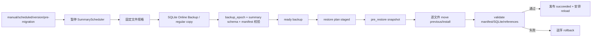

# 备份、恢复与完整性事务

**最后核对：** 2026-08-31
**导航：** [项目根级](../../../AGENTS.md) / [`core`](../../AGENTS.md) / [`features`](../AGENTS.md) / `backup`

## 职责边界

`core/features/backup/` 负责 canonical/operational/derived 文件的完整快照、manifest 校验、版本变更备份、恢复计划暂存、原子替换、验证、回滚和状态投影。它不决定业务查询、不修改 MemoryEngine 领域逻辑，也不让 scheduler 直接遍历或替换数据目录。

- `domain/models.py`：`BackupType`、`FileRole`、完整性/恢复状态、快照与进度模型。
- `domain/errors.py`：稳定 `BackupOperationError`。
- `application/manager.py`：版本检测、备份创建/列举/删除/恢复编排。
- `application/restore_transaction.py`：可持久化恢复计划、staged/apply/validate/rollback 状态机。
- `infrastructure/snapshot.py`：SQLite Online Backup、regular file copy、SHA-256、原子 JSON 与空间检查。
- `infrastructure/integrity.py`：反馈 DB/HMAC sidecar 配对、quarantine 引用、恢复文件完整性和回滚辅助。

## 备份/恢复链


```mermaid
flowchart LR
    A[manual/scheduled/version/pre-migration] --> Q[暂停 SummaryScheduler]
    Q --> B[固定文件规格]
    B --> C[SQLite Online Backup / regular copy]
    C --> D[backup_epoch + summary schema + manifest 校验]
    D --> E[ready backup]
    E --> F[restore plan staged]
    F --> G[pre_restore snapshot]
    G --> H[逐文件 move previous/install]
    H --> I[validate manifest/SQLite/references]
    I -->|通过| J[发布 succeeded + 安排 reload]
    I -->|失败| K[逆序 rollback]
```

## 关键不变量

1. `memora.db` 是 canonical；`conversations.db`、状态/队列是 operational；FAISS/graph/index 是 derived。角色决定恢复策略，不能把派生文件当新的权威。
2. SQLite 统一使用 Online Backup API 并执行 quick_check；普通文件复制前后检查 regular file、路径边界和 SHA-256。临时文件必须同目录原子替换。
3. manifest 记录文件角色、大小、digest、quick check、版本/插件来源、opaque `backup_epoch` 与安全 `summary_state`（`inspect_conversation_database` 的聚合证据：evidence version、schema version、migration id、session/message/job/epoch/candidate 计数、integrity/reason）；只在全部必需文件验证通过后发布 `ready`，禁止半成品备份进入可选列表。
4. 运行时备份必须先暂停 SummaryScheduler 的入队、领取和 worker，快照完成或失败后都恢复启动扫描；startup/pre-migration 尚未发布 scheduler 时保持普通备份路径。反馈学习 `feedback_signals.db` 与 `.hmac.key`、质量闭环 `evaluation_quality_loop.hmac.key` 等 HMAC sidecar 必须按文件规格保留权限并随数据目录备份/恢复；缺失、权限错误或 fingerprint mismatch 必须 fail closed。反馈 HMAC 方案引入前的旧版单库允许以单库形态备份/恢复，孤立 key 始终 fail closed。
5. 恢复计划保存在 `.restore/<operation_id>/restore_plan.json` 等事务目录；只接受固定文件名/模式，拒绝绝对路径、分隔符、`..`、符号链接和未声明文件。
6. 恢复在初始化器发布 provider/engine/page/command 前应用；`stage_restore` 校验 manifest `summary_state` 与备份内 `conversations.db` 一致，安装后 `validate_restored_files` 用同一证据复核 live 文件；manifest、checksum、quick_check、conversation 证据、quarantine canonical 引用或原子替换任一失败都必须进入失败/回滚状态。缺少聚合证据的 v2 清单只按 `legacy_unverified` 处理，不能当作完整跨库证据。`conversations.db` 是可选成员：不在恢复计划内时 live 运营数据保持不动，manifest 的 `summary_state` 必须与实际缺席证据完全一致才算 verified，不一致 fail closed；在计划内时仍必须校验并比对证据。
7. 每个文件保存 moved/installed/validated progress；部分安装也能按逆序回滚。rollback 失败时保留 `rollback_pending`，不能伪造成功。
8. 恢复确认与 runtime 发布门：`runtime_publish_gate_required`（组合根）在存在阻塞恢复事务或 canonical 刚完成真实迁移时要求派生面整套重建成功（`finalize_catalog_lifecycle(required=True)`）。required 下聚合 `success` 不是充分证据——阶段 owner 把「功能被配置关闭」也报告为 `success=True`，因此还必须按阶段复核：indexes 不允许跳过；catalog 只允许带正 generation 且已由 owner 复核的 `catalog_ready` 快路径；其余阶段只接受运行时配置明确关闭的原因码（graph/atoms 关闭、evolution `disabled`、semantic compression 关闭、notes 关闭），失败抛 `runtime_publish_gate_blocked:*`。`main._ensure_runtime_components` 在 runtime 首次成功发布后按 `_restore_confirmation_pending()`（恢复 owner 报告 `validating`，且 `publish_gate_required` 为真正的布尔值：`False`，或 `True` 且 `derived_rebuild_success is True`）标记 `succeeded`，覆盖前台与 Provider 重试两条初始化路径；畸形/半写门结论一律不确认。
9. `pre_migration` 仅由 schema migration 协调器在 DDL/DML 前创建；scheduler 只调用 `BackupManager`，不得自行应用恢复。
10. 对外 API 只暴露脱敏状态、稳定错误码、文件名/计数等 allowlist；备份内容和 manifest 仍按原数据保密。

## 依赖方向

main/composition/scheduler/Page API → `BackupManager` → snapshot/integrity/restore transaction；infrastructure 不依赖 Page API、handler 或 scheduler。learning 的 sidecar 规则由本模块校验，见 [`learning/AGENTS.md`](../learning/AGENTS.md)。

## 修改联动

- 新增文件：同步 `_BACKUP_FILE_SPECS`/patterns、`FileRole`、manifest、空间和权限校验、恢复回滚。
- 改恢复状态：同步 startup apply、reload lifecycle、Page API status/cancel、诊断 reason code。
- 改 quarantine/feedback 引用：同步 `validate_quarantine_references`、feedback HMAC pair、备份/恢复测试。
- 改迁移快照：同步 SchemaMigrationCoordinator、失败恢复和启动阻断语义；`_snapshot_is_ready` 必须验证的是真实清单证据（目录位于 `<data_dir>/backups` 之下且非符号链接、v2 `backup_info.json`、canonical 成员存在且 size/digest/quick_check 一致），而不是 owner 返回的 `status` 字符串。
- 改公开导出：同步 feature root `__all__` 与旧路径删除契约。
- 改跨库聚合证据：同步 `summary_schema.inspect_conversation_database` 字段、manifest `summary_state`、`RestorePlan.conversation_evidence`、`validate_restored_files` 与 `list_backups` 的 integrity/can_restore 投影；canonical-only 备份只有清单声明与实际缺席证据一致、且不存在未声明的 `conversations.db` 时才算 verified；证据读取必须只读打开，不能在备份/payload 目录留下 `-wal`/`-shm`。`list_backups`、恢复暂存/取消/删除和 scheduler prune 属于同步文件 I/O，异步 Page API/调度器必须通过 `asyncio.to_thread` 调用，并复用 `BackupManager._operation_lock` 串行化与创建/恢复/清理的文件操作；启动恢复通过取消安全的线程执行器收束后再传播取消。运行时发布门（必须在跨库验证与 required derived rebuild 都成功后调用 `mark_restore_succeeded`）不由本模块拥有，见 issue #96 的组合根集成点。

## 最窄验证入口

```bash
python -m pytest -q tests/test_backup_feature_contracts.py
python -m pytest -q tests/test_managers_backup.py -k conversation
python -m pytest -q tests/test_managers_backup_snapshot.py tests/test_managers_backup.py
python -m pytest -q tests/test_managers_backup_feedback_hmac.py
python -m pytest -q tests/test_api_backup.py
```
