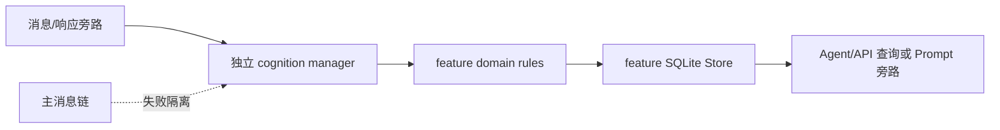

# 认知旁路能力集合

**最后核对：** 2026-08-14  
**导航：** [项目根级](../../../AGENTS.md) / [`core`](../../AGENTS.md) / [`features`](../AGENTS.md) / `cognition`

## 职责边界

`core/features/cognition/` 聚合四个可选、尽力而为的认知旁路：好感度/情绪、表达模式、群组黑话和类型化社交关系。它们不负责消息主链路、长期 canonical memory、召回注入或控制台鉴权；各自的初始化、API、工具与 Store 仍由子包 owner 管理。

直接子模块：

- [`affection/AGENTS.md`](affection/AGENTS.md)：按 `(group_id,user_id)` 好感度、群 Bot 情绪、交互分类和门控。
- [`expression/AGENTS.md`](expression/AGENTS.md)：按 `(group_id,persona_id,user_id)` 学习用户→Bot 表达模式。
- [`jargon/AGENTS.md`](jargon/AGENTS.md)：统计候选、LLM 解释、人工确认和群内查询。
- [`social/AGENTS.md`](social/AGENTS.md)：有方向关系、类型难度、强度和 revision CRUD。

## 共同依赖规则



- 每个子包只在显式配置/组件可用时运行；可选模块失败不能阻断记忆召回、反思和回复。
- 子包必须保留完整 group/persona/user scope；空 group ID 不是全局作用域。
- 人工写入使用字段 allowlist、类型/长度限制和 expected revision；自动旁路不得以陈旧对象覆盖人工编辑。
- Provider/LLM 文本和用户关系数据均不可信且敏感；日志只记录稳定 reason/count，不记录消息、Prompt、标签、关系网或完整候选。
- SQLite 写入使用各自 Store 的事务/锁；取消继续传播，失败事务 rollback。
- 认知结果若要进入 Prompt，必须经上层 prompt protection 和明确注入契约；子包的格式化函数不是安全净化器。

## 修改联动

- 改配置门：同步 composition、默认配置、旁路失败隔离和相关 Page/工具入口。
- 改 scope/模型字段：只在对应子包同步 Store schema、序列化、API/工具和测试；不要在集合根复制模型。
- 改 LLM 分类/推断：同步 fallback、超时/取消、隐私策略和 reason code；关键词 fallback 不是安全分类器。
- 改人工 CRUD：同步 revision 冲突、审计摘要、缓存失效和并发测试。
- 新增认知子包时在本页添加直接链接；不要为 `domain/`、`application/`、`infrastructure/` 批量生成空壳文档。

## 最窄验证入口

按子包选择：

```bash
python -m pytest -q tests/test_affection_manager.py
python -m pytest -q tests/test_style_analyzer.py tests/test_expression_pattern_learner.py
python -m pytest -q tests/test_jargon_statistical_filter.py tests/test_jargon_miner.py tests/test_jargon_admin_service.py
python -m pytest -q tests/test_social_relation.py
```

集合根文档只描述边界；具体接口、不变量和验证以四个子包文档为准。
