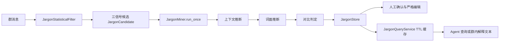

[根目录](../../../../AGENTS.md) > [core](../../../AGENTS.md) > **jargon**

# 群组术语发现与解释模块

**Last Updated:** 2026-07-17

## 职责与边界

`core/jargon/` 实现“统计发现 → LLM 语义推断 → 人工确认/编辑 → 群内查询与解释”的独立术语管线。它面向群组黑话、缩写和俚语，不负责通用关键词检索、消息安全审查或自动授权。组件由 `core/platform/composition/plugin_initializer.py` 初始化；控制台管理经 `core/api/jargon_api.py` 与 `JargonAdminService`，Agent 查询经 `core/tools/jargon_tools.py`。

`jargon.enabled` 默认关闭。关闭时初始化器不创建本模块组件，消息旁路不会累计候选或调用 LLM，页面 API 也不得惰性创建 `JargonMiner`；已有 SQLite 词条数据不删除。

## 架构与数据流



## 关键组件与接口

- `JargonStatisticalFilter.update(text, group_id, sender_id)`：在内存中累计群词频、全局词频、用户集中度、首次出现时间和最多 10 条上下文。
- `get_candidates(group_id, limit=20, exclude_terms=None)`：以跨群 IDF `0.4`、爆发度 `0.3`、用户集中度 `0.3` 组合评分；频次至少 3、综合分至少 `0.35`。
- `get_stats` / `reset_group`：统计摘要与群内存状态清理。
- `JargonMiner.run_once(group_id, limit=5)`：仅在候选频次跨过持久化 `last_inference_count` 之后的下一渐进阈值时触发；同群同词的并发调用在进程内去重，并发运行其他候选的短生命周期推断任务；取消时取消并消费所有子任务，单候选默认 120 秒超时。
- `infer_meaning(candidate)`：上下文推断、仅词面推断、两者对比三步流程；步骤 2 失败时以低置信度保守降级，信息不足时不建记录。
- `JargonQueryService.query`、`get_group_jargon`、`check_and_explain`：查询、列出已确认术语、生成可注入解释；ASCII 词使用单词边界，非 ASCII 使用子串匹配。
- `invalidate_cache` / `invalidate_group`：写后必须清理对应群缓存。
- `JargonAdminService`：限定创建/编辑字段，校验文本和有限浮点数，执行 revision 条件的严格新增、更新、删除与批处理。

## 模型与持久化

- `JargonCandidate`：候选词、群、三信号分、频次、用户数、首次出现和上下文样例。
- `JargonMeaning`：词条、群、含义、置信度、`is_jargon`、人工确认、全局标志、完成标志、次数和推断进度。
- `JargonStats`：群统计摘要。

`JargonStore` 继承共享 `BaseStore`，`jargon_terms` 对 `(term, group_id)` 唯一。上下文样例以 JSON 持久化；搜索使用参数化 `LIKE`。管理员修改采用稳定 payload revision 和显式可写字段。`JargonQueryService` 使用 `TTLCache(maxsize=500, ttl=60)`；缓存仅是加速层，Store 是事实源。

## 依赖方向

- 上游：`core/platform/composition/plugin_initializer.py`、`core/api/jargon_api.py`、`core/tools/jargon_tools.py`。
- 本模块：`statistical_filter.py -> models.py`；`jargon_miner.py -> filter + store + models`；`jargon_query.py` 和 `jargon_admin_service.py -> store`。
- 下游：`jieba`、可选 LLM 客户端、`core/storage/base_store.py`、`core/shared/entity_editing.py`。
- 包入口使用懒加载；新增公共导出必须同步 `__all__` 与 `__getattr__`。
- 相关上下文：[存储模块](../../../storage/AGENTS.md)、[基础领域能力](../../../base/AGENTS.md)。

## 隐私、安全与修改约束

- 统计过滤器在内存保留原始群消息上下文，Store 也会保存上下文样例；Miner 将词条和上下文发送给 LLM。不得把跨群统计、上下文或术语记录泄漏到其他 `group_id`。
- `is_global` 是数据字段，不等于查询可以忽略群作用域；跨群行为必须由明确上层契约决定。
- `check_and_explain` 只读取 `confirmed_only=True` 且 `is_jargon=True` 的群记录；不要让未确认推断直接进入生产 Prompt。
- LLM JSON 经过 `_safe_parse_json`，但其语义仍不可信；置信度和 `is_jargon` 不能替代人工确认或安全审核。
- API 审计只记录安全摘要；日志不得新增完整消息、Prompt、含义载荷或用户标识。
- 修改写路径时必须保持 revision 冲突、缓存失效和批处理逐项结果。统计状态重启会丢失，这是当前边界，不要误写成持久化事实。

## 测试定位与验证

- `tests/test_jargon_statistical_filter.py`：分词过滤、三信号、群隔离、统计与重置。
- `tests/test_jargon_miner.py`：JSON 提取、阈值、三步推断、超时/取消、Store 与查询缓存。
- `tests/test_jargon_admin_service.py`：严格字段、revision、并发写与缓存失效。
- `tests/test_api_jargon.py`：控制台组件解析、初始化并发、失败/取消清理与管理契约。

精确验证命令：

```bash
python -m pytest -q tests/test_jargon_statistical_filter.py tests/test_jargon_miner.py tests/test_jargon_admin_service.py tests/test_api_jargon.py
```
