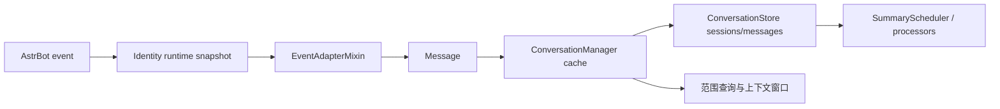

# 会话、消息与事件适配

**最后核对：** 2026-08-14  
**导航：** [项目根级](../../../AGENTS.md) / [`core`](../../AGENTS.md) / [`features`](../AGENTS.md) / `conversation`

## 职责边界

`core/features/conversation/` 保存 session/message 历史，提供有界上下文窗口、LRU 缓存、消息范围/元数据操作、去重与 AstrBot 事件到内部 `Message` 的转换。它不执行反思抽取、不拥有 canonical memory、不解析协议身份；身份由注入的 `IdentityConversationPort`/identity runtime 提供。

- `domain/`：`SessionManagerConfig` 与 shared conversation model 的兼容导出。
- `application/conversation_manager.py`：组合 session lifecycle、cache、message/range、sender/event adapter mixin。
- `application/event_adapter.py`：事件字段、role、group scope 和可信身份 metadata 适配。
- `application/message_content_extractor.py`、`sender_resolver.py`、`dedup_manager.py`：输入标准化、发送者和重复消息边界。
- `infrastructure/conversation_store.py`、`message_store.py`、`message_queries.py`：独立 `conversations.db` SQLite 持久化。

## 事件与存储链



## 关键不变量

1. session ID 使用 AstrBot `unified_msg_origin`，必须保留多 bot/platform 边界；不能用裸 user/group ID 替代。
2. 用户消息遇到 identity `CONFLICT`/`INVALID` 时拒绝写入；trusted 身份使用 canonical user ID/稳定 label，anonymous 只在有 conversation sender evidence 时写入。
3. 群聊判断优先可信 identity scope，再回退 `MessageType.GROUP_MESSAGE`；group_id 必须与当前 scope 一致，不可把空值当全局。
4. `ConversationStore` 连接未初始化时写操作显式失败/安全返回；消息写入、session upsert、计数和 participants 更新在同一事务与 `_write_lock` 内完成。
5. JSON participants/metadata 解析失败不能回显原文；固定来源范围必须按 `message_seq` 连续验证。来源删除只允许经 `trim_if_safe()` 在任务、ledger 和 quarantine 均已收口时执行。
6. LRU cache 受 `_cache_lock` 保护，容量、context window 和 TTL 有界；关闭时不创建新 I/O 或后台任务。
7. conversation feature 不把正文写入日志；消息、sender/group/session/persona、participants 均为敏感数据。
8. `asyncio.CancelledError` 穿透 Store、cache 和事件适配；失败事务必须 rollback，不得留下锁或半提交计数。

## 依赖方向

EventHandler/reflection → ConversationManager → Store；identity runtime 通过 shared port 注入；processors 只消费 `list[Message]`。conversation 不依赖 retrieval、Page API、命令或 Provider。

## 修改联动

- 改 session/message 字段：同步 SQLite schema/index、JSON mapper、迁移、API/导出和范围查询。
- 改身份适配：同步 identity contract、事件 adapter、会话同步、pipeline identity 集成测试。
- 改缓存/窗口：同步 SummaryScheduler、`session_epochs`、trim 规则、TTL/容量配置和并发测试。
- 改事件提取/去重：同步全群捕获、self message 排除、sender/group scope 和 event handler。
- 改公共模型：保持 shared conversation contract 唯一 owner，不能在 feature 内复制 dataclass。

## 最窄验证入口

```bash
python -m pytest -q tests/test_conversation_feature_contracts.py
python -m pytest -q tests/test_conversation_store.py tests/test_message_store.py tests/test_message_queries.py
python -m pytest -q tests/test_managers_conversation.py tests/test_conversation_identity_sync.py
python -m pytest -q tests/test_identity_conversation_port.py tests/test_conversation_formatter.py
```
