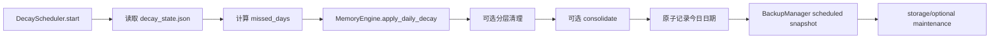

# 记忆重要性衰减与每日调度

**最后核对：** 2026-08-14  
**导航：** [项目根级](../../../AGENTS.md) / [`core`](../../AGENTS.md) / [`features`](../AGENTS.md) / `decay`

## 职责边界

`core/features/decay/` 负责 canonical 文档 metadata 的每日重要性衰减、访问强化，以及拥有后台任务生命周期的每日调度器。具体 canonical 写入仍通过 memory application 的协调事务；备份交给 [`backup/AGENTS.md`](../backup/AGENTS.md) 的 `BackupManager`，回填交给 [`backfill/AGENTS.md`](../backfill/AGENTS.md)。

- `domain/config.py`：`FlashbulbConfig`、`ForgettingAgentConfig`、`ImportanceDecayConfig`。
- `application/operations.py`：`DecayOperationsMixin` 的批量衰减和访问时间更新。
- `application/scheduler.py`：启动补偿、每日循环、状态文件、清理/整合/备份及可选维护。

## 每日链



## 关键不变量

1. `decay_rate <= 0` 或 days 非正时不写；有效速率裁剪到 `0..1`。importance 始终不低于 `0.01`，访问次数按配置乘数衰减。
2. 访问强化按 `active` 与被动路径使用不同增量，并限制 importance/access_count 上限；批量入口按 ID 保序去重。
3. 类型感知衰减只使用固定 `EPISODIC/FACTUAL/PREFERENCE/RELATIONAL` 倍率；flashbulb 高情绪记忆超过阈值跳过衰减。
4. 单个每日日期只执行一次；启动时按缺失完整天数补偿 `missed_days + 1`。`decay_state.json` 采用同目录临时文件 + `replace()` 原子保存，损坏/缺失安全回退。
5. 日期状态在备份、storage maintenance 和可选维护之前写入；后续失败不能让主衰减在同一天重复执行。
6. `start()` 幂等并登记 startup/task；`stop()` 取消并 await 两者，清空引用。普通维护项失败隔离，取消必须传播。
7. 调度器不遍历备份目录、不直接替换恢复文件、不创建超大事务；备份和恢复均委托 BackupManager。
8. 状态、异常和备份结果对外只给稳定 status/reason/count，不输出绝对路径、正文或内部 traceback。

## 依赖方向

composition → `DecayScheduler` → MemoryEngine、BackupManager、可选 profiles/knowledge/learning/notes/evolution/diagnostics 维护。MemoryEngine 可以组合 `DecayOperationsMixin`，但不反向持有 scheduler；feature 不依赖 Page API。

## 修改联动

- 改衰减公式/配置：同步 runtime config 映射、flashbulb/forgetting 默认值、metadata schema 和 managers decay 测试。
- 改每日顺序：同步状态日期时机、备份、语义压缩/异常聚合维护与 shutdown。
- 改 scheduler 状态：同步 API/诊断字段、取消/重复启动和状态文件测试。
- 改访问强化：同步 recall 触发类型、cache invalidation、批量事务和性能边界。

## 最窄验证入口

```bash
python -m pytest -q tests/test_decay_feature_contracts.py
python -m pytest -q tests/test_decay_scheduler.py
python -m pytest -q tests/test_managers_decay.py
```
