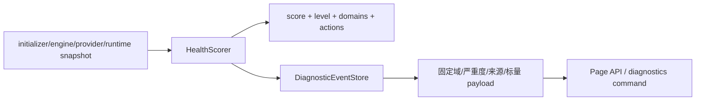

# 运行时诊断与健康评分

**最后核对：** 2026-08-14  
**导航：** [项目根级](../../../AGENTS.md) / [`core`](../../AGENTS.md) / [`features`](../AGENTS.md) / `diagnostics`

## 职责边界

`core/features/diagnostics/` 把 Provider、召回、写协调器、后台任务、索引、异常检测和 Prometheus 可用性快照转换为健康分/等级/建议，并将固定 allowlist 后的诊断事件持久化。它不执行修复、不替代 observability 指标、不保存原始异常或业务正文。

- `application/health_scorer.py`：纯状态到健康摘要的确定性评分器。
- `infrastructure/event_store.py`：诊断事件 SQLite 表、稳定筛选、resolve 与 payload sanitizer。
- 根包只导出 `HealthScorer`、`DiagnosticEventStore`。

## 数据流



## 事实来源与不变量

1. 健康评分只读取快照，不向 Provider、数据库或索引发起修复操作。Provider failed 把整体压到 critical；waiting/retry、p95、写失败增长、后台失败、索引错误率和异常事件按固定扣分。
2. 分级边界固定：`>=85 healthy`、`65..84 watch`、`45..64 degraded`、`<45 critical`；Prometheus 不可用只产生 informational domain，不扣分。
3. 写失败比较基线属于 scorer 实例状态；显式 `previous_write_failures_total` 优先于实例旧值。缺失/畸形快照字段安全退化，不把字符串数字或布尔误当数值。
4. Event Store 只接受固定 domain/severity/source 和 payload 字段。title/message 由 reason code 生成，不能保存调用方自由文本。
5. payload 数值必须有限且在上限内，枚举字段必须在封闭集合；未知字段、嵌套对象、query、正文、异常消息和路径全部丢弃。
6. event_id、created_at、resolved_at 需规范化；重复事件幂等。SQLite 查询参数化并按稳定时间/ID 排序，返回独立副本。
7. 诊断事件可反映部署节奏、组件状态和数据规模，API 仍需授权；不要将诊断库当公开日志。

## 依赖方向

composition/scheduler/observability → diagnostics application/infrastructure；Page API/命令只读调用。diagnostics 可消费安全快照和 reason code，但不反向依赖 handler、memory Store 或 Provider 实例。

## 修改联动

- 改评分阈值/领域：同步健康 API、命令、建议动作和边界测试。
- 改事件 allowlist：同步所有 producer、Store sanitizer、schema/旧数据读取和隐私测试。
- 改持久化字段：同步初始化/migration、分页筛选、resolve 和备份文件规格。
- 新增修复动作时只增加上层显式 command/API；不要把动作执行塞进 scorer。

## 最窄验证入口

```bash
python -m pytest -q tests/test_diagnostics_health_scorer.py
python -m pytest -q tests/test_api_diagnostics.py tests/test_diagnostic_commands.py
python -m pytest -q tests/test_injection_protection_diagnostics.py
```
