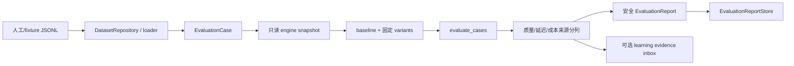

# 隔离只读检索评测

**最后核对：** 2026-08-14  
**导航：** [项目根级](../../../AGENTS.md) / [`core`](../../AGENTS.md) / [`features`](../AGENTS.md) / `evaluation`

## 职责边界

`core/features/evaluation/` 加载受控 JSONL 用例，在隔离的只读 MemoryEngine 快照上计算 Recall@K、MRR、二元 nDCG、延迟与有限高级指标，运行显式消融并保存脱敏报告。它不参与在线排序、不训练模型、不自动写回生产配置，也不启动 active worker。

- `application/retrieval_quality.py`：用例/结果/报告 DTO、fixture loader、指标和 engine adapter。
- `application/retrieval_ablation.py`：只读 snapshot 与固定检索变体。
- `session_first_ablation.py`、`derived_metadata_ablation.py`、`feedback_ranking_ablation.py`：实验专用反事实链。
- `feedback_learning_pipeline.py`：将完成的离线证据投递给 learning 私有 inbox。
- `domain/metric_provenance.py`：observed/annotated/reported/judged 指标来源。
- `infrastructure/evaluation_service.py`：数据集/变体执行与报告编排。
- `dataset_repository.py`：生产人工数据集边界和原子保存。
- `report_store.py`：独立 SQLite 报告及逐用例安全投影。

## 主流程



## 关键不变量

1. 生产数据集文件名限 ASCII allowlist、1 MiB、500 用例、每例 50/全文件 500 relevant IDs；重复 case、跨文件逻辑名冲突和未知结构必须拒绝。Page API 还验证相关 ID 是当前 canonical 整数 ID。
2. `__no_relevant__` 只能单独表示正确负例。实验专用 `session_first/derived_metadata/feedback_ranking` 默认不由标准 `load_fixture_dir()` 加载。
3. snapshot 只复制会被修改的 config/retriever/optimizer/cache，Store/索引只读共享；不得清 live cache、继承 canonical 更新回调、更新 access time 或启动后台维护/active worker。
4. baseline 必须真实执行；普通单变体失败返回 stable skipped reason 并继续。与 baseline 等价、缺少目标组件或策略未实际执行时不能标记 completed。
5. `observed_*` 只来自实际墙钟/Provider instrumentation，fixture 只提供 `annotated_*`，历史无前缀值归入 `reported_*`；缺测量保持 `null`，不能以 0 伪装。
6. Session-first baseline 和精确 session 分支都实际运行；证据门只输出 `would_short_circuit`，不修改生产 `RecallHandler`。
7. 派生 metadata 消融只用进程内 source-backed annotation；反馈排序只用隔离 aggregate，均不得修改 live config/metadata。
8. 报告 Store 对写入和读取（含旧报告）都重新 sanitize：只保留 case ID、有限指标/reason code，不保存 query、ranked/relevant IDs、身份、scope 或任意 metadata。
9. fixture 和报告具有隐私风险，只使用匿名合成或授权标注数据；不能把生产对话直接复制到仓库夹具。
10. 评测结果是观测证据，不是访问控制或自动发布信号。投递 learning 时必须绑定 aggregation/config/evidence/quality gate revision。

## 依赖方向

Page API/脚本 → evaluation infrastructure/application → engine 只读形状与独立 Store；feedback pipeline → learning 私有端口。evaluation 不依赖在线 handler，不调用生产配置 writer，不向 retrieval 注入实验实现。

评测实现与公开导出只存在于本 feature。

## 修改联动

- 改 DTO/指标：同步报告序列化/sanitizer、来源前缀、API 与数据集 breakdown。
- 改 dataset 边界：同步 repository、Page canonical ID 校验、fixture loader 和导入错误码。
- 新增 variant：加入固定支持集合、真实组件 mutation/probe、snapshot 隔离、effective settings 和失败 reason。
- 改报告字段：同步 Store schema/旧 payload sanitizer、Page API 和隐私 canary。
- 改 learning evidence：同步 learning artifact contract、私有 inbox、生成脚本和回归质量门。

## 最窄验证入口

```bash
python -m pytest -q tests/evaluation/test_retrieval_quality.py
python -m pytest -q tests/evaluation/test_retrieval_ablation.py tests/evaluation/test_evaluation_service.py
python -m pytest -q tests/evaluation/test_dataset_repository.py
python -m pytest -q tests/evaluation/test_session_first_ablation.py
python -m pytest -q tests/evaluation/test_feedback_ranking_ablation.py tests/evaluation/test_derived_metadata_ablation.py
```
