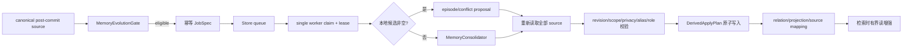

# Canonical 写后记忆演化

**最后核对：** 2026-08-14  
**导航：** [项目根级](../../../AGENTS.md) / [`core`](../../AGENTS.md) / [`features`](../AGENTS.md) / `evolution`

## 职责边界

`core/features/evolution/` 在 canonical memory 成功写入后创建可失效、可重建的 relation/Projection 解释平面。它负责确定性门控、候选/LLM proposal、job/lease worker、计划校验、复核、关系扩展、Projection 附着和语义压缩；它不创建第二套 canonical memory，也无权修改 canonical 正文。

- `domain/models.py`：relation/projection/job/state/source/scope/budget 等纯领域契约。
- `application/memory_evolution_gate.py`：无 I/O 门控与稳定 idempotency key。
- `memory_evolution_candidates.py`、`episode_clusterer.py`、`contradiction_detector.py`：优先本地候选。
- `memory_consolidator.py`：有界 evidence 到经校验 proposal 的 LLM fallback。
- `memory_evolution_manager.py` 及 mixin：排队、worker、lease、retry/dead、计划验证和应用。
- `derived_relation_expander.py`、`projection_reader.py`：检索侧只读增强。
- `semantic_compressor.py`：同 scope/privacy/role 的老旧 canonical 聚类并写 `semantic_summary` Projection。
- `infrastructure/`：job、relation、projection、source mapping、candidate review 的 SQLite 唯一实现。

## 生命周期



## 关键不变量

1. `enabled=false` 强制 mode=`disabled`；disabled 不启动 worker。shadow/readonly/active 可写派生平面，只有 readonly/active 装配读取器；mode 从不授予 canonical 写权限。
2. Gate 要求 revision、scope、occurred_at 和 topic/entity 证据，按 importance、pending cap 与 debounce 生成不含正文/身份的稳定 key。全量 replay 只绕过 pending cap。
3. job 保存创建时所有 source revisions；Store 候选来源先按 scope 过滤再限量，primary 保持首项，其他租户记录不能挤掉同 scope evidence。
4. 单 worker 领取 job 并续租；所有状态转换校验 worker token。失租禁止继续写；取消恢复 pending，普通失败指数退避，超过尝试上限进入 dead。
5. Manager 先用确定性 episode/conflict 候选，非空时不调用 LLM。LLM evidence 有数量/字符/alias 上限，输出经 JSON/领域模型验证。
6. 应用前再次读取全部 canonical source，校验 ID/revision/scope/privacy/role/时间、未知 alias、自关系、重复/环和冲突完整性；任一不满足拒绝整个相关 bundle。
7. canonical 整数 ID/revision 始终权威。Relation/Projection 稳定 ID 派生自 source evidence，不创建文档/向量 ID；canonical 更新/删除使旧映射失效。
8. 高影响 relation (`updates/contradicts/preference_change/supersedes`) 必须保持 candidate，approve/reject/replay 使用派生 revision CAS 并再次验证 canonical；人工 rejected 不被后台 proposal 重开。
9. 在线顺序固定为 direct/graph merge → relation expansion → Projection attachment → reranker → privacy filter。relation 只追加合法 canonical；Projection 只附着命中 primary 的候选，不改 content/doc_id/score/排序/候选数。
10. 模型可见 Projection 仅 `type/summary/confidence`；source mapping、revision、scope/privacy/role、内部 ID/job 不得外泄。
11. 普通 reader 故障回退 canonical baseline；单坏 bundle 隔离，`asyncio.CancelledError` 必须传播。

## 依赖方向

MemoryEngine/Reflection post-commit hook → evolution application → evolution infrastructure；retrieval 只依赖 `DerivedRelationExpander`/`ProjectionReader` 公开读契约。evolution 可依赖 shared canonical contracts 与 memory Store 基类，不依赖 handler、Page API 或 retrieval 编排。

更完整的 canonical 写边界见 [`memory/AGENTS.md`](../memory/AGENTS.md)，在线排序见 [`retrieval/AGENTS.md`](../retrieval/AGENTS.md)。

## 修改联动

- 改领域模型/schema：同步 Store 建表/迁移、row mapper、计划校验、重建与时序测试。
- 改 mode/gate：同步 composition 读取器装配、worker 启动、status reason 和配置模型。
- 改 worker：同步 claim/renew/retry/dead/cancel、关闭顺序、orphan cleanup 和指标。
- 改 relation/Projection：同步 candidate generator、Consolidator schema、apply plan、review CAS、reader 与 formatter allowlist。
- 改 source role/validity：同步 Store mapping、读写双重校验、canonical invalidation、语义压缩和 A/B/C fixtures。
- 改公开导出：保持 domain/application/root 惰性，更新 feature contract 和无循环导入测试。

## 最窄验证入口

```bash
python -m pytest -q tests/test_evolution_feature_contracts.py
python -m pytest -q tests/test_memory_evolution_gate.py tests/test_memory_evolution_models.py
python -m pytest -q tests/test_memory_evolution_manager.py tests/test_memory_evolution_store.py
python -m pytest -q tests/test_derived_relation_expander.py tests/test_projection_reader.py
python -m pytest -q tests/test_semantic_compressor.py tests/test_memory_evolution_review.py
```
