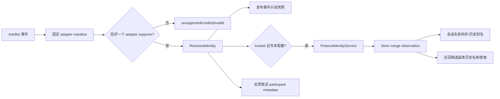

# 协议稳定身份与名称目录

**最后核对：** 2026-08-14  
**导航：** [项目根级](../../../AGENTS.md) / [`core`](../../AGENTS.md) / [`features`](../AGENTS.md) / `identity`

## 职责边界

`core/features/identity/` 把受支持协议事件严格解析为不可变 `ResolvedIdentity`，维护当前昵称/群名片与历史别名，向会话和 canonical memory 写入稳定身份证据，并在召回候选副本上做受限历史名称增强。它不迁移历史业务表、不根据显示名合并用户，也不把 `union_openid` 动态替换为主键。

- `domain/models.py`：trust/name 状态、resolved/stored identity 和 adapter/merger 协议。
- `infrastructure/protocols/`：固定 manifest、唯一 resolver、OneBot 11 与 QQ 官方适配器。
- `application/service.py`：可信名称观察、时间排序和别名生成。
- `application/runtime.py`：事件解析、快照发布、写保护下同步与关闭。
- `application/conversation_sync.py`：身份目录与已有会话名称同步。
- `application/enricher.py`：canonical 身份 metadata 和召回候选临时名称说明。
- `infrastructure/store.py`：独立 SQLite 身份、作用域成员与别名表。
- `contracts.py`：`IDENTITY_SCHEMA_VERSION` 与目录端口。

## 解析与同步链



## 关键不变量

1. Resolver 冻结 adapter 顺序。没有接管为 `UNSUPPORTED`，多 adapter 接管为 `CONFLICT`，adapter 异常/非法返回为 `INVALID`；所有降级结果不携带协议用户数据。
2. OneBot 11 canonical user ID 只能是规范化 QQ 号；QQ 官方使用带平台实例边界的场景 OpenID。`union_openid` 不参与主键，WebSocket/Webhook 共享同一固定适配规则。
3. 名称只是可更新显示数据。nickname 缺失/空/非法保持旧值；群 card 明确空值可按较新观察删除；乱序观察进入历史别名而不覆盖新值。
4. 只有 `TRUSTED` 且 namespace/stable/canonical/scope 完整的观察写目录；anonymous/conflict/invalid/unsupported 零写入。
5. Store 不扫描或回填历史业务表；三张表按 `(namespace, stable_user_id)` 和精确 scope 参数化查询，写入由 `_write_lock` 与事务保护。
6. event 上发布的 resolved snapshot 是不可变对象；Page/Agent 未拿到可信 snapshot 时必须拒绝敏感身份操作，不能重新猜测事件字段。
7. canonical participant metadata 来自可信消息 sender 证据，包含 schema version、canonical IDs、稳定 label、名称快照和协议来源。模型输出不能覆盖这些字段。
8. 召回别名增强深复制候选，只在当前可信 scope 和原 session 内解析；同名多 owner 时拒绝，最多 8 条有限说明，不改 canonical、分数、排序或 ID。
9. 身份表内部 ID、候选列表、查找过程、时间戳和歧义细节不得进入 prompt、日志、指标或 trace。

## 依赖方向

事件/组合根 → `ProtocolIdentityRuntime` → resolver/service/store；conversation 与 recall 通过 contracts/显式 runtime 消费身份。identity 可依赖 shared contracts，但不依赖 handler、Page API 或 MemoryEngine。profiles 只消费 canonical 中已闭合的稳定身份 metadata，见 [`profiles/AGENTS.md`](../profiles/AGENTS.md)。

## 修改联动

- 新增协议：同步固定 manifest、唯一接管规则、canonical key/label、transport 场景测试和隐私说明。
- 改 identity metadata：同步 enricher、processor/grounding、profiles 主体解析、图投影和 schema version。
- 改名称规则：同步 service merge、Store transaction、会话同步、别名增强和乱序/歧义测试。
- 改 Store schema：同步初始化、row mapping、关闭/失败清理和独立数据库备份策略。
- 改公开类型：同步 contracts、根包 `__all__` 与 feature contract 测试。

## 最窄验证入口

```bash
python -m pytest -q tests/test_identity_feature_contracts.py
python -m pytest -q tests/test_protocol_identity_resolver.py tests/test_qq_official_identity_adapter.py
python -m pytest -q tests/test_protocol_identity_service.py tests/test_protocol_identity_store.py
python -m pytest -q tests/test_memory_identity_enricher.py tests/test_conversation_identity_sync.py
python -m pytest -q tests/integration/test_pipeline_identity.py
```
