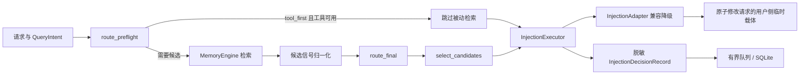

[根级 AGENTS.md](../../../../AGENTS.md) / core / features / injection

# 自适应记忆注入

**最后核对：** 2026-07-17  
**公共入口：** `core/injection/__init__.py`  
**生产调用方：** `core/handlers/recall_handler.py`

## 职责边界

本目录定义稳定模型、不可变预设、纯路由、候选选择、原子执行和脱敏决策记录。检索候选由 `MemoryEngine` 产生；Provider 兼容降级在 `core/utils/injection_adapter.py`；提示词保护在 `core/security/prompt_sanitizer.py`；SQLite 表与查询在 `core/storage/injection_decision_store.py`。



## 稳定公共接口

`core.injection` 公开导出模型枚举与 dataclass、`PRESETS`/`get_preset()`/`resolve_preset()`、`InjectionRoutingConfig`/`InjectionStrategyRouter`、`InjectionExecutionContext`/`InjectionExecutor`、`candidate_utility` 和 `InjectionDecisionRecorder`。新增或重命名导出必须同步包级 `__all__` 与 `tests/test_injection_models.py`。

### 模型与预设

- 路由模式：`manual`、`auto`、`hybrid`。
- 预设按 rank 固定为 `tool_first(0)`、`low_cost(1)`、`balanced(2)`、`quality(3)`。
- `PRESETS` 使用 `MappingProxyType`，预设 dataclass 为 `frozen=True, slots=True`；调用方不得就地修改。
- 高级覆盖仅在显式启用且非 `tool_first` 时生效。字符总预算硬上限分别为 1200/2400/10000，单条记忆上限 2000、元数据上限 500；`FACTS` 强制排除参与者。
- `RequestSignals` 只能承载非敏感能力与聚合信号，不承载查询正文、记忆内容、用户 ID 或 session/persona ID。

### 两阶段路由

- `route_preflight()` 只使用检索前信号。手动 `tool_first` 只有在 Provider 支持工具且当前 ToolSet 中 `recall_long_term_memory` 已启用时才跳过被动召回，否则降到 `low_cost`。
- `route_final()` 使用候选数、最高置信度、分差、冗余、时序冲突、估算载荷和上下文余量。无效信号不抛错，回退 `auto_fallback`。
- `auto`：明确历史意图且余量足够选 `quality`；余量低选 `low_cost`；存在达到阈值的候选选 `balanced`；候选不确定且真实工具可用时选 `tool_first`。
- `hybrid` 先自动推荐，再按预设 rank 钳制到 `[hybrid_min, hybrid_max]`。所有转移以 reason code 解释。
- 路由器必须保持无 I/O、无共享状态、无 Provider 适配副作用。

## 执行与全局预算

`InjectionExecutor.execute(req, decision, context)` 先选择并完整构建载荷，再进行第一次请求变更。有效预算为：

`min(context_headroom_chars, memory_budget_chars + cognitive_budget_chars + prospective_budget_chars)`。

`headroom.py` 遵循 AstrBot 的 Provider 语义：`max_context_tokens <= 0` 或字段缺失表示宿主不限制上下文，而不是零剩余空间；此时只使用 Memora 自身的记忆、认知与前瞻总硬上限 `13000` 字符。只有 Provider 给出正上限时，才按当前请求文本与输出预留做保守扣减。

分层顺序为前瞻计划、普通记忆、认知上下文；包装开销也计入预算。候选按确定性 utility、稳定 ID 和原始顺序排序，并受 `max_memories`、单条估算与总字符预算共同约束。超预算时从最低优先级候选开始移除，不得截断安全边界标签。

### 不可违反的 System Prompt 边界

**动态记忆注入永远不得写入或改动 `req.system_prompt`。** `DeliveryMode` 不包含 `system_prompt`，`InjectionAdapter.resolve()` 对字符串 `system_prompt` 会拒绝。允许的临时载体只有：

- `extra_user_content`：默认；追加 `TextPart(...).mark_as_temp()`；
- `user_message_before` / `user_message_after`：只改当前 user prompt；
- `fake_tool_call`：追加 assistant tool call 与 tool result 上下文；
- `fake_tool_call_deepseek_v4`：追加 user-role replay 上下文。

Gemini 的伪工具方式降级为 `user_message_before`；未知或不支持工具的 Provider 降级为 `extra_user_content`。这条边界由 `tests/test_injection_executor.py::test_executor_never_changes_system_prompt` 和 `tests/test_utils.py::TestInjectionAdapter` 直接锁定。

## 提示词保护与原子性

- 所有动态内容被包在 `<memora-untrusted-memory>` 边界中，内容里的保留边界先转义。
- 启用 `PromptProtectionService` 时必须有非空 `scope_id`；注入后注册 `memory_context` 做出站过滤。注册失败要恢复 `prompt`、`contexts`、`extra_user_content_parts` 并丢弃 scope。
- 格式化失败发生在变更前；赋值失败恢复三个可变字段；`CancelledError` 必须继续传播。
- 执行器只把请求变更为一个完整状态，不允许先写半成品再异步补齐。
- `system_prompt` 不在快照中，因为执行器从不写它；不要借“回滚”名义把它加入动态注入路径。

## 决策记录与持久化

`InjectionDecisionRecord` 只保存 UUID、时间、模式/预设/传输、reason/error code、Provider 类型/模型、候选与预算计数和阶段耗时；不保存 query、memory content、session/persona/user ID。

`InjectionDecisionRecorder.record()` 是非阻塞、无 I/O 的请求路径：默认容量 10000，满时丢最旧并计数；单 worker 默认 50 条或 250ms 批写。失败批次恢复到 retained 列表并指数重试（5 秒封顶），同时继续保持总待处理量有界。清理按保留天数/最大行数执行，另有每日清理和每持久化 1000 行、每小时至多一次的轻量清理。`close(timeout)` 尽量冲刷，超时取消 worker。

Page API 只能返回 allowlist 后的脱敏字段；详见 [API 模块 AGENTS.md](../../../api/AGENTS.md)。

## 依赖方向

`handlers/recall_handler` → 本模块 → `utils.injection_budget`、监控指标；执行期按需调用 formatter。Provider 适配、安全服务、存储通过构造参数或类型边界接入。本模块不能导入 Page API 或命令。

## 测试定位与精确验证

```powershell
python -m pytest tests/test_injection_models.py tests/test_injection_presets.py tests/test_injection_router.py -q
python -m pytest tests/test_injection_executor.py tests/test_injection_budget.py tests/test_utils.py -q
python -m pytest tests/test_injection_decision_recorder.py tests/test_injection_decision_store.py -q
python -m pytest tests/test_handlers.py -q
```

重点覆盖：导出/预设字段锁定、无效信号回退、hybrid 钳制、工具不可用降级、System Prompt 不变、全局预算、保护失败回滚、队列溢出与重试、清理和关闭取消语义。

## 相关上下文

- [根级 AGENTS.md](../../../../AGENTS.md)
- [初始化模块 AGENTS.md](../../../initializer/AGENTS.md)
- [API 模块 AGENTS.md](../../../api/AGENTS.md)
- [工具模块 AGENTS.md](../../../tools/AGENTS.md)
- [处理器模块 AGENTS.md](../../../handlers/AGENTS.md)
- [安全模块 AGENTS.md](../../../platform/security/AGENTS.md)
