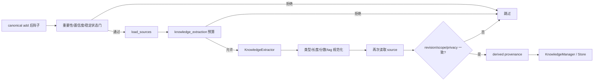

# 来源约束结构化知识

**最后核对：** 2026-08-14  
**导航：** [项目根级](../../../AGENTS.md) / [`core`](../../AGENTS.md) / [`features`](../AGENTS.md) / `knowledge`

## 职责边界

`core/features/knowledge/` 管理人工结构化知识和 canonical memory 写后生成的派生知识。它提供关键词/分类查询、去重合并、过期清理和 source-backed 可见性，但不替代 canonical memory，也不把自动知识加入被动主召回；专用知识检索器由 retrieval feature 调用。

- `domain/models.py`：`KnowledgeEntry`、`KnowledgeType` 与来源约束。
- `application/knowledge_manager.py`：人工/派生写入、去重合并、查询和清理。
- `application/knowledge_proposal_pipeline.py`：质量门、请求级预算、抽取、二次来源校验与 provenance 写入。
- `infrastructure/knowledge_extractor.py`：有限 canonical evidence 的 LLM JSON 转换。
- `infrastructure/knowledge_store.py`：SQLite、固定排序 allowlist、参数化 LIKE 查询和来源可见性。
- `contracts.py`：Store、source reader、extractor 的最小端口。

## 自动 proposal 链



## 关键不变量

1. 自动候选只接受 importance ≥ 0.6、confidence ≥ 0.65、stability ≥ 0.6 且状态 active/current/stable 的 canonical memory；非法/缺失数值安全回退为零。
2. Provider 调用必须取得 `knowledge_extraction` 请求级预算。无预算不调用 Provider，也不生成伪知识 fallback。
3. source evidence 与输出正文均最多 2000 字符；title 100、tag 64 字符、最多 16 个 tag。category 只能是 `fact/concept/rule/event/procedure`，所有模型字段在管线再次验证。
4. 抽取前后必须比较 source revision、scope 和 privacy。变化时不写 derived entry。
5. derived `KnowledgeEntry` 必须携带 `DomainProvenance`，`source_ids` 与来源一致且 provenance 不含正文；manual 条目不需要 canonical source。
6. Store 写入与读时都验证 derived 来源；失效来源条目不可见。人工知识优先，自动 proposal 不覆盖人工条目。
7. 搜索使用参数化 `LIKE`，不是 FTS；排序只允许 `KNOWLEDGE_SORT_COLUMNS`。查询失败不能改成跨 category/全库无界扫描。
8. 自动知识不进入被动召回，也不创建 canonical ID/向量；专用 `KnowledgeRetriever` 的结果仍受上层 scope/权限边界。
9. title/content/tags/source 和查询均为敏感数据，不得进入普通日志、指标或评测报告。

## 依赖方向

MemoryEngine 写后 hook → `KnowledgeProposalPipeline` → `KnowledgeManager` → Store；retrieval/工具/Page API 只读或调用 Manager。knowledge 依赖 shared provenance/contracts 与 memory source 校验，不反向依赖 transport、handler 或 retrieval 实现。

## 修改联动

- 改模型/schema：同步 Store migration、row mapper、revision/排序、API/工具和知识检索器。
- 改质量阈值/抽取：同步 pipeline、cost-control key、extractor 校验与 proposal 测试。
- 改来源语义：同步 canonical invalidation、MemoryEngine hook、Store read filter、重建和 stale pagination。
- 改去重/合并：同步 manual 优先级、provenance 合并、过期语义和并发测试。
- 改公开接口：同步 `contracts.py`、根包导出和 feature contract 测试。

## 最窄验证入口

```bash
python -m pytest -q tests/test_knowledge_feature_contracts.py
python -m pytest -q tests/test_knowledge_proposal_pipeline.py tests/test_knowledge_extractor.py
python -m pytest -q tests/test_knowledge_manager.py tests/test_knowledge_store.py
python -m pytest -q tests/test_knowledge_note_source_integrity.py tests/test_knowledge_api.py
```
