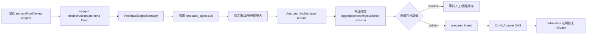

# 可信反馈与自主学习

**最后核对：** 2026-08-14  
**导航：** [项目根级](../../../AGENTS.md) / [`core`](../../AGENTS.md) / [`features`](../AGENTS.md) / `learning`

## 职责边界

`core/features/learning/` 将受控来源的反馈事件聚合为隔离的排序候选，并编排 shadow 候选、配置 revision-CAS 发布、回滚、恢复和保留清理。它是实验/运维闭环，不直接改生产召回权重，不调用 `MemoryEngine.update_memory()`，也不把评测输入当作可信生产事件。

- `domain/`：反馈枚举/策略、可信事件、聚合、候选绑定、证据和安全 view。
- `contracts.py`：Feedback Store、聚合服务、配置 CAS、证据 Provider 端口。
- `application/feedback_signal_manager.py`：适配器注册、作用域/时间/去重/限流、衰减聚合。
- `application/auto_learning.py` 及 mixin：全局候选、状态锁、发布 intent、CAS 发布/回滚、reload、tombstone retention。
- `infrastructure/feedback_signal_store.py`：显式路径隔离的 SQLite 事件/聚合 Store 与安装密钥 HMAC token。
- `infrastructure/auto_learning_state.py`：带 checksum、LKG、CAS 和原子替换的状态 envelope。
- `infrastructure/learning_config_adapter.py`：受控配置快照和权重应用端口。
- evidence inbox/provider 只保存和读取经过校验的离线证据，不接收任意 API payload。

## 闭环



## 关键不变量

1. 只有预注册的内部 `FeedbackAdapterKind` 能产生事件；外部 payload 不能自行注册适配器。事件必须匹配 trusted scope/persona、UTC 时间、未来偏差/保留窗口、窗口和域/全局限流。
2. Store 不连接 `memora.db`；事件表使用 dedupe 唯一约束，聚合是可重建派生数据。反馈正文、query、decision key 和原始身份不得写入安全摘要。
3. 决策/作用域/persona 使用安装密钥 HMAC 生成不透明 token；密钥缺失或指纹不匹配必须 fail closed，不生成新关联。
4. 聚合权重变化有固定 baseline、独立窗口门和最大 delta；没有足够证据时保留 baseline，不能把零值伪装成新观察。
5. `AutoLearningManager` 的状态锁只保护内存状态和状态文件；Config adapter 的外部调用在锁外执行。每个生产动作先持久化 prepared intent，再以 operation ID CAS 收口。
6. 状态文件 envelope 必须通过 schema、深度/大小、opaque ID、checksum 和 revision 校验；主文件损坏或只剩 LKG 时保持 `state_corrupt/recovery_required`，阻止新写入，不能静默覆盖恢复证据。
7. apply/publish 的真实提交未知时不得重复调用 writer；失败要保留恢复记录和旧权重 snapshot。rollback/reload/rebuild/reset 共用状态锁并可重启收口。
8. 反馈学习证据必须绑定 aggregation revision、source config revision、evidence revision 和 quality gate version；不匹配的 artifact 只能 rejected/insufficient evidence。
9. 任何取消必须传播；普通 adapter、Store 或配置故障返回固定 reason code，不影响聊天主链。

## 依赖方向

受控生产 adapter、evaluation pipeline 和 Page API → learning application ports → learning domain/infrastructure。evaluation 只投递隔离 evidence；learning 不反向依赖 retrieval、Page API 或 MemoryEngine。备份若包含 feedback DB，必须同时包含 HMAC sidecar，规则见 [`backup/AGENTS.md`](../backup/AGENTS.md)。

## 修改联动

- 改事件/策略：同步 domain validation、Store schema、token namespace、聚合算法、保留清理和反馈测试。
- 改状态 envelope：同步 checksum、LKG、migration、CAS、启动恢复和备份/恢复文件规格。
- 改发布动作：同步 ConfigAdapter ownership、prepared intent、publication/rollback 状态和插件 reload 生命周期。
- 改证据绑定：同步 evaluation feedback pipeline、artifact 校验、质量门版本和 API 安全 view。
- 改公开导出：同步 application/domain/infrastructure `__all__`、旧路径所有权和 contract 测试。

## 最窄验证入口

```bash
python -m pytest -q tests/test_learning_feature_contracts.py
python -m pytest -q tests/test_learning_closed_loop.py tests/test_auto_learning_production_actions.py
python -m pytest -q tests/test_auto_learning_state_recovery.py tests/test_auto_learning_config_adapter.py
python -m pytest -q tests/test_auto_learning_tombstone_retention.py tests/test_api_learning.py
```
