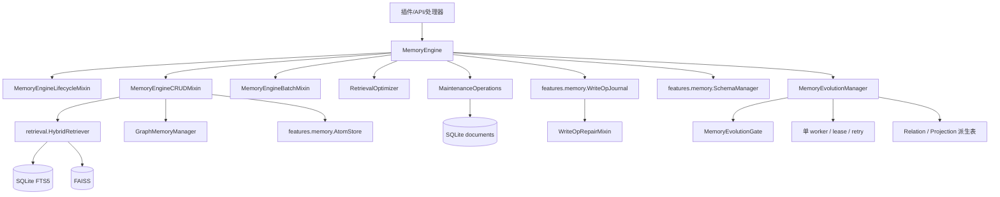
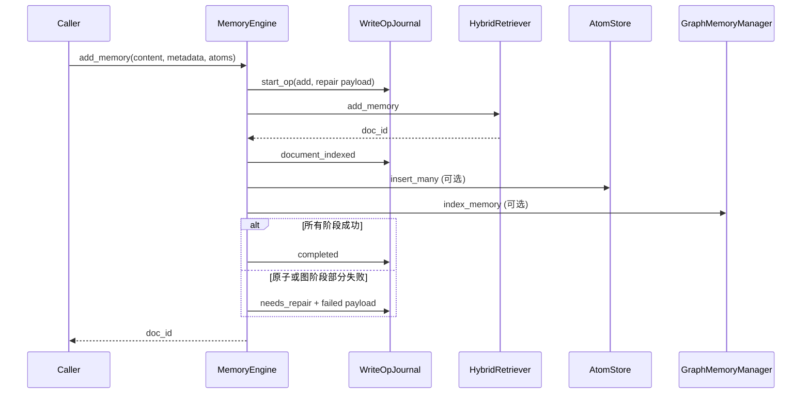

[根级 AGENTS.md](../../../AGENTS.md) > **core/features/memory**

# Memory 模块上下文

**最后更新：** 2026-07-21
**源码范围：** `core/features/memory/`（MemoryEngine 门面、canonical/graph 基础设施与验证器）

## 职责与边界

`core/features/memory/` 是记忆门面的业务生命周期与编排层。它把 SQLite 文档表、BM25、FAISS、记忆原子和图记忆组合成统一的 `MemoryEngine`，并提供会话、备份、导入导出、衰减与写故障恢复。

用户画像的领域服务与 proposal 管线唯一归属 `core/features/profiles/application/`；`core/features/memory/` 只保留 `MemoryEngine` 的画像写后钩子，不再转发画像应用类型。
知识领域服务与 proposal 管线唯一归属 `core/features/knowledge/application/`；`core/features/memory/` 只保留 `MemoryEngine` 的知识写后钩子，不再转发知识应用类型。
笔记领域服务与 proposal 管线唯一归属 `core/features/notes/application/`；`core/features/memory/` 只保留 `MemoryEngine` 的笔记写后钩子，不再转发笔记应用类型。
自主学习与反馈聚合唯一归属 `core/features/learning/`：application 管理可信反馈聚合、shadow 候选和单一 CAS 发布，domain 保存候选与反馈模型，infrastructure 保存隔离事件、状态和配置适配；`core/features/memory/` 只在 `MemoryEngine` 生命周期中装配和持有这些组件，不再转发 Learning 类型。自主学习不得直接修改生产检索权重或调用 `update_memory()`。
Memory Evolution 的 Gate、候选生成、LLM proposal、worker、Projection 应用与语义压缩唯一归属 `core/features/evolution/application/`，Store 唯一归属 `core/features/evolution/infrastructure/`；`core/features/memory/` 只保留 MemoryEngine 写后钩子，不再转发 Evolution 应用类型。

本层负责“何时、按什么顺序、失败后如何补偿”；canonical/graph/索引表 CRUD 位于本 feature infrastructure，候选召回和排序属于 [`features/retrieval`](../retrieval/AGENTS.md)，定时维护由 [`features/decay`](../decay/AGENTS.md) 与 [`features/backfill`](../backfill/AGENTS.md) 触发。Memory Evolution 的关系/Projection 事务与 revision 校验由 evolution feature 编排。



## 关键入口与公开接口

### `MemoryEngine`

`memory_engine.py` 通过 `MemoryEngineLifecycleMixin`、`MemoryEngineEvolutionHooksMixin`、`MemoryEngineCRUDMixin`、`MemoryEngineBatchMixin` 组装主入口；包级 `__init__.py` 还导出 `ConversationManager`、`GraphMemoryManager` 和 `create_conversation_manager`。

| 入口 | 语义 |
|---|---|
| `initialize()` / `close()` | 打开/关闭 SQLite 与图向量库，创建索引组件和可选子系统，追踪并取消后台任务 |
| `add_memory(...) -> int` | 写文档/向量、BM25、原子、图产物并记录可恢复写日志 |
| `search_memories(...)` | 经缓存、双路/混合检索、触发词、情绪/季节和链式扩展返回 `HybridResult` |
| `update_memory(...) -> bool` | 元数据原地更新；内容更新采用“新建后删除旧项”，删除失败则删除新项补偿 |
| `delete_memory(...) -> bool` | 先删文档索引，再清理图和原子；子资源失败进入修复队列 |
| `batch_delete_memories[_detailed]()` | 每 200 个 ID 分批删除并返回计数/失败明细 |
| `apply_daily_decay()` / `cleanup_old_memories()` | 重要性衰减和 `ACTIVE → DORMANT → ARCHIVED → 物理删除` |
| `maintain_storage()` / `rebuild_graph_index()` | 存储维护和图产物重建 |

### 生命周期初始化顺序

`memory_engine_lifecycle.py` 的实际顺序是：

1. `aiosqlite.connect`，设置 `Row` 与共享 PRAGMA；此时尚不注册可重连连接。
2. `SchemaMigrationCoordinator` 只读检查版本；fresh install 直接建当前结构，旧库按 `migration_settings` 决定阻断或先创建 `pre_migration` 快照再迁移，同时创建 `memory_write_ops`。迁移成功后才注册可重连连接。
3. 构建 `TextProcessor → BM25Retriever → VectorRetriever → HybridRetriever`。
4. 仅在 `graph_enabled` 且存在 `graph_vector_db` 时构建 `GraphStore`、`AtomStore`、层级存储、图双路检索和 `GraphMemoryManager`。
5. 可选执行 `WriteOpJournal.repair_incomplete()`。
6. 按配置构建画像、知识、笔记、自动学习、性格追踪、重排序器等；复用工厂注入的 typed `CostControl`，高成本 `llm`/`hybrid` 重排未通过功能门时降级为 `mmr`，成功创建的实例写回 `MemoryEngine.reranker` 并传给图双路检索器。
7. 图路可用时构建 `DualRouteRetriever`，最后创建 `RealtimeSSE`。
8. 若注入了 `projection_reader`，`MemoryEngine` 只把它作为召回阶段的派生注解读取器；它不改变 canonical 写入和整数 `doc_id` 语义。

`close()` 先停原子维护，再保存部分子系统状态、取消 `_pending_tasks`，最后关闭 SQLite 与图向量库。新增后台协程必须走 `_create_tracked_task()`，不得裸建后失去生命周期控制。

## 写入数据链与恢复语义



- 这不是跨 SQLite/FAISS 的单一 ACID 事务。`memory_write_ops` 是跨存储 saga 日志；`repair_incomplete()` 尽力重放 `pending`/`needs_repair` 的 add、delete、batch delete 和 graph reindex。
- `add_memory()` 在 canonical 成功后重新读取 source revision，并为 Atom 绑定 parent revision/scope/privacy；来源读取失败时只进入可修复派生失败，不把未绑定 Atom 写入生产 canonical 库。
- `memory_write_ops` 的 failed atom payload 保留父来源快照；repair 只接受仍匹配当前 revision 的现代载荷，旧载荷最多恢复为不可主动召回的兼容行。
- 原子批量失败后逐条补写，仅仍失败的原子进入修复载荷。图失败不撤销已建文档，而是标记修复。
- 删除先调用 `HybridRetriever.delete_memory()`；随后图或原子清理失败不会把主删除改成失败，但日志保留 `needs_repair`。
- `WriteOpJournal.start_op()` 失败时可能返回 `None`；业务路径仍继续，因此不能把日志存在等同于事务已保证。
- `MemoryEngineProfileHooksMixin` 只在 canonical add 成功后创建受跟踪画像任务；
  `ProfileProposalPipeline` 重新读取 source 并校验稳定身份、revision、scope 和 privacy。
  自动标签/偏好携带 derived provenance，普通失败隔离主写，取消必须传播。画像 Store
  读取时过滤失效来源；偏好是整份 provenance 快照，已有 manual 来源时自动 proposal
整体让位，不能覆盖人工字段。
- `MemoryEngineKnowledgeHooksMixin` 只在 canonical add 成功后创建受跟踪知识任务；
  `KnowledgeProposalPipeline` 先执行重要性/置信度/稳定状态门和 `knowledge_extraction`
  额外预算门，再二次校验 source revision、scope、privacy。知识条目携带不含正文的
  derived provenance，人工条目优先，普通失败隔离主写，取消必须传播；Knowledge Store
  读取时过滤失效来源，自动知识不进入被动召回。
- `MemoryEngineDomainHooksMixin` 统一调度画像、知识和笔记写后任务；其中自动笔记只消费达到
  `notes.auto_create_min_length` 的 canonical source。`NoteProposalPipeline` 在预算允许时调用
  `NoteGenerator`，否则使用确定性 fallback，并在写前二次校验 revision/scope/privacy。
  `NoteStore` 按完整 provenance 事务幂等，人工笔记与版本不被自动重建覆盖；source 失效后
  derived note 不可见但版本历史保留，统一重建的 notes 阶段不调用 Provider。

## Memory Evolution 生命周期与安全边界

`core/features/evolution/application/` 负责 canonical 写入后的派生演化，不替代 `MemoryEngine` 的主写路径：

- `MemoryEvolutionGate` 仅基于 source revision、scope、topic/entity 信号、阈值、去抖桶和待处理上限生成稳定 idempotency key；`enabled=false` 或非法 mode 必须返回 `mode_disabled`。
- `MemoryConsolidator` 只把有界 canonical evidence 转为经过 JSON/Pydantic 校验的 `EvolutionProposal`；临时 alias、输入/输出预算和 Projection 字符上限保持强制约束，解析或预算失败交由 worker 重试/死信，取消继续传播。
- `MemoryEvolutionManager.schedule_consider()` 只在 canonical 写入成功后入队；Store 在 SQL 限流前按同 scope 选择最多 6 条近期 source，并把创建时全部 revision 写入 job provenance，其他 scope 的新记录不能挤掉同 scope 证据。worker 以单任务循环领取 job，持有可续租 lease；领取后先核对 job revision，stale job 进入 invalidated；取消会恢复 pending，普通异常按指数退避重试，超过 `max_attempts` 进入 dead，proposal 规则拒绝进入 rejected。
- `MemoryEngine` 在 canonical add/语义 metadata update 提交后统一重载 source 并调度；`ReflectionHandler` 仍覆盖反思链兼容调度，重复触发由稳定 idempotency key 去重。派生计划写入 `origin_job_id`，启动时先做 orphan/stale cleanup；回滚 job 只能失效自身派生对象，不能删除 canonical。
- 处理 proposal 时先运行本地 `MemoryEvolutionCandidateGenerator`：episode/conflict 候选非空时不调用 LLM，只有确定性候选为空才回退 Consolidator。随后必须再次读取 source 并比较每个 revision；source 缺失、scope 不一致、alias 未知、自关系、重复/成环边、冲突 Projection 少于三类角色均拒绝，不能污染派生表。
- 关系按低/高影响分类：低影响且达到阈值的允许按配置自动 `active`，`updates`/`contradicts`/`preference_change`/`supersedes` 始终是 `candidate`。高影响 relation 的 approve/reject/replay 使用候选 revision CAS；approve/replay 再次验证 canonical source，后台重复 proposal 不得覆盖人工 rejected 状态。Projection 共享 scope，privacy 取所有 source 中最严格值，状态由置信度和冲突类型决定。
- `SemanticCompressor` 只读取达到年龄门槛的 canonical source，按完全相同的 scope/privacy/role 分区并以 topic Jaccard 聚类；摘要通过 `apply_projection_proposal()` 二次核对全部 source revision 后写入 `semantic_summary`，不得调用 canonical add/delete。扫描普通失败只降级当前维护项，取消必须传播。
- Relation/Projection 是 SQLite 中的派生解释平面；稳定 ID 由 source memory ID、revision 和类型计算，但不创建第二套 canonical memory 或向量索引。更新/删除 canonical 后由 Store 的 revision invalidation 隔离旧派生结果。
- `get_status_snapshot()` 只能返回模式、计数、reason code 和延迟桶等 allowlist 标量；不得把 query、prompt、正文、原始身份、source ID 列表或 provider 信息写入日志/指标。

## SQLite、事务与并发约束

- `write_coordinator.py` 的模块级 `asyncio.Lock` 串行化协调写入；锁冲突可指数退避并加随机抖动，连接坏死由 `ConnectionRegistry` 重连。
- `coordinated_transaction()` 使用 `BEGIN IMMEDIATE`，异常必须 rollback，取消也必须继续上抛。
- `SchemaManager` 只对白名单 `doc_id`、`created_at`、`updated_at` 做动态列迁移，并安全引用标识符；动态 SQL 不得接收未白名单化的外部表/列名。
- `SchemaManager` 分离 `inspect_schema()`、`create_fresh_schema()`、`build_migration_plan()`、`migrate_existing_schema()` 与 `validate_schema()`；生产启动只由 `SchemaMigrationCoordinator` 编排。`auto_migrate=false` 遇到旧结构必须以 `schema_migration_required` 停止引擎启动，不能调用兼容 `create_tables()` 偷偷升级。
- 迁移计划使用稳定 `migration_id`，只记录 from/to version、阶段、reason code 和变更计数。启用迁移备份时，`pre_migration` 快照必须先于 `BEGIN`/DDL/DML；失败时关闭启动连接并从已校验快照原子恢复 canonical，恢复失败持久化为 `blocked`，不得继续发布运行时。
- `documents` 是校验与重建的源数据表；BM25、FAISS、图和原子都是需要同步或可修复的派生产物。
- 维护批次和批量删除是有意分块的；不要改成超大事务，也不要在持锁区执行 LLM/Embedding 网络调用。

## 子系统索引

| 区域 | 文件 | 事实边界 |
|---|---|---|
| 会话 | `features/conversation/application/`（`conversation_manager.py` 及 6 个 mixin） | `ConversationStore` 上层 LRU、上下文窗口、事件适配和元数据；缓存由 `_cache_lock` 保护 |
| 图同步 | `graph_memory_manager.py`、`features/memory/graph/infrastructure/` | 删除旧图产物后重建节点/边/条目与图向量；向量 ID 最终回写 SQLite |
| 原子生命周期 | `atom_lifecycle_manager.py`、`features/memory/application/atom_source_binding.py` | 周期过期/遗忘/冷迁移，同批原子 Jaccard 去重；canonical add 后绑定 parent source，后台任务由 `start/stop` 管理 |
| 维护 | `decay_operations.py`、`lifecycle_operations.py`、`stats_operations.py` | 衰减、分层遗忘、统计、存储与图索引维护 |
| 画像 | `features/profiles/application/`、`memory_engine_profile_hooks.py` | 管理员编辑使用修订值冲突检测；canonical 写后自动 proposal 仅绑定唯一可信主体，标签与偏好携带 derived provenance 并走存储层原子事务 |
| 知识/笔记 | `features/knowledge/application/`、`features/notes/application/`、`memory_engine_domain_hooks.py` | 知识与笔记 canonical 写后 proposal、来源约束幂等与失效；自动笔记可无 Provider 重建，人工 CRUD、软删和版本历史保持领域权威 |
| 异常检测 | `anomaly_detector.py`、`stats_operations.py` | 按 UTC 日聚合 canonical 创建量；只用当前日之前的完整窗口计算 3-sigma 基线，待投递告警随状态恢复，同一天只写一条脱敏诊断事件 |
| 记忆再巩固 | `reconsolidation.py`、`reconsolidation_store.py` | 默认关闭；召回只生成 pending 候选；apply 先持久化唯一 intent，再按 source revision CAS 写 canonical 并恢复/失败收口；回滚同样持久化跨 Store 意图并刷新当前 source 的 graph 派生，状态、动作审计与操作清理原子收口；启动恢复不得覆盖后续编辑 |
| 自主学习 | `features/learning/application/`、`features/learning/domain/`、`features/learning/infrastructure/` | 统一 FeedbackSignal 事件只进入隔离 Store；shadow 候选经单一 CAS 写入口发布；生产写入前持久化真实旧权重 intent，最终状态保存失败时保留可重启回滚快照；rebuild/publish/rollback/reset 共用状态锁，不直接修改生产权重 |
| 可靠性 | `write_coordinator.py`、`features/memory/infrastructure/write_op_*`、`memory_engine_write_observability.py` | SQLite 写串行化、重试、跨存储操作日志和崩溃修复；canonical 写入指标与质量采样由独立 mixin 承担 |
| 记忆演化 | `features/evolution/application/`、`features/evolution/infrastructure/` | canonical 写后门控、确定性/LLM proposal、单 worker、lease/retry/dead/cancel、关系与 Projection 计划校验及语义摘要生成 |
| canonical 派生钩子 | `memory_engine_evolution_hooks.py` | source revision 提取、post-commit 调度、relation/projection 失效；不承载 canonical 正文写入 |
| 连续性 | `continuity_tracker.py`、`memory_engine_lifecycle.py` | 使用 `data_dir` 同步恢复/保存，按配置 TTL 和单 session 上限保留话题；关闭时不创建或读写 |
| 文件状态 | `features/learning/infrastructure/auto_learning_state.py` | JSON 状态属于运行数据，不是配置；加载失败通常降级为空状态；状态写入失败必须显式返回/抛出，不能把生产发布报告为成功 |
| 备份 | `features/backup/{domain,application,infrastructure}/` | SQLite 使用 Online Backup API；manifest 保存角色、大小、SHA-256 和 quick check；`pre_migration` 供启动迁移失败恢复，新恢复使用 `.restore/<operation_id>/restore_plan.json`、`payload/`、`previous/` 事务目录；旧 `managers/backup_*` 路径已删除 |
| 插件更新 | `update_manager.py`、`update_installer.py` | `update_manager.py` 检查 GitHub Release，按镜像到官方顺序下载 runtime 与校验清单，并只在 SHA-256 校验通过后写入暂存区；`update_installer.py` 严格校验 ZIP、在 AstrBot 插件目录同卷切换 runtime，安排单插件重载，失败时恢复旧目录并记录安全状态 |
| 导入导出 | `memory_exporter.py` | JSONL/Markdown 包含正文与 metadata；导入按内容 SHA-256 短哈希去重后重新走 `add_memory` |

## 安全与不可泄露数据边界

1. **记忆正文、会话 ID、人设 ID、用户画像、消息、情绪标签和 metadata 均为敏感数据。** 不得写入普通日志、指标标签、异常字符串或对外追踪；当前少数日志含内容前 60 字符，新增代码不得扩大泄露面。
2. `MemoryExporter` 会明文写出完整正文和 metadata，且接受调用方给定路径；调用方必须完成授权、路径约束和文件权限控制。导出文件不可当作无敏感数据的调试附件。
3. `MemoryImporter` 输入不可信：JSON 结构、metadata、importance 和目标 session/persona 必须在调用边界验证；导入失败不得回显完整正文。
4. `BackupManager.validate_backup_name()`、备案目录集合和 `relative_to(backups_root)` 共同阻止路径穿越；备份源、manifest 和恢复 payload 还必须拒绝符号链接、绝对路径、分隔符及白名单外文件。不可绕过这些 API 直接拼接路径。
5. 写日志中的修复载荷和备份目录具有与原始记忆相同的保密级别。不得通过 SSE、诊断 API 或导出默认暴露。
6. LLM 再巩固和高成本重排会把记忆内容送给配置的 provider；只有在用户授权且 provider 数据策略允许时启用。
7. Memory Evolution 的 proposal 输入是受长度限制的不可信 evidence；模型输出先由 feature application 的 Consolidator 结构校验，Manager 再拒绝非 `EvolutionProposal`、超出 `candidate_limit` 或重复 source，并做 source revision、scope/privacy、role 和影响级别校验。任何 source 证据不得进入模型可见的 Projection metadata。

## 异常规则

- `asyncio.CancelledError` 必须重新抛出；普通检索增强、画像排序、可选维护可降级，但持久化主写失败必须显式失败或进入 `needs_repair`。
- 内容为空：`add_memory()` 抛 `ValueError`；未初始化核心检索器：抛/返回失败，不能静默写半套数据。
- 内容更新是新 ID 替换旧 ID，调用方不得假定 `memory_id` 永久不变。
- `cleanup_old_memories()`、可选管理器和状态文件通常采用尽力而为语义；返回 0/空结果不等于数据一致性已验证。
- `BackupManager` 只在 canonical SQLite 快照、manifest 和 quick check 全部成功后发布 `ready` 备份；失败不得发布半成品。`scheduled`、`pre_migration` 与 `pre_restore` 允许按保留期自动 prune，`manual` 和 `version_change` 必须显式删除。

## 测试定位与精确验证

按修改范围选择最小命令；本模块文档初始化不执行测试。

```bash
python -m pytest -q tests/test_managers_memory_engine.py tests/test_managers_memory_lifecycle.py tests/test_managers_memory_crud.py tests/test_managers_memory_batch.py
python -m pytest -q tests/test_managers_write_coordinator.py tests/test_managers_write_journal.py tests/test_managers_write_serial.py
python -m pytest -q tests/test_managers_decay.py tests/test_managers_stats.py tests/test_managers_schema.py
python -m pytest -q tests/test_managers_conversation.py tests/test_managers_message.py tests/test_managers_session.py tests/test_managers_range.py tests/test_managers_event.py tests/test_managers_sender.py
python -m pytest -q tests/test_managers_backup.py tests/test_managers_export.py tests/test_managers_profile.py tests/test_managers_retrieval.py
python -m pytest -q tests/test_memory_evolution_gate.py tests/test_memory_evolution_manager.py
python -m pytest -q tests/integration/test_pipeline_lifecycle.py tests/stress/test_concurrent_writes.py
```

画像、知识、笔记、图、自动学习等子系统各有对应 `tests/test_managers_*.py`；修改单个文件时先运行同名测试，再运行上方主引擎与写可靠性组合。

## 依赖方向与改动守则

- 允许：`managers → models/processors/retrieval/storage/utils/base/api`。
- 禁止让 `storage` 反向依赖领域管理器；当前 `InjectionDecisionStore` 仅在方法内延迟导入通用 `write_transaction`，不要扩展为领域回调。
- `schedulers` 调用 managers，managers 不应反向持有 scheduler。
- 新增存储阶段必须同时更新写日志步骤、修复重放、删除/批删和相关测试；只改 happy path 会留下孤儿数据。
- 新增用户可编辑实体字段时，必须同步修订值计算、验证、原子替换和冲突响应，不能用旧快照覆盖并发更新。
- 不要把可选子系统失败升级成插件启动失败，除非该子系统已成为主数据正确性的必要条件。
- 新增或修改 Memory Evolution 阶段时，必须同时更新 gate reason、lease/retry/dead/cancel 计数、revision invalidation 和 manager 关闭顺序；不能只覆盖 worker 的 happy path。
