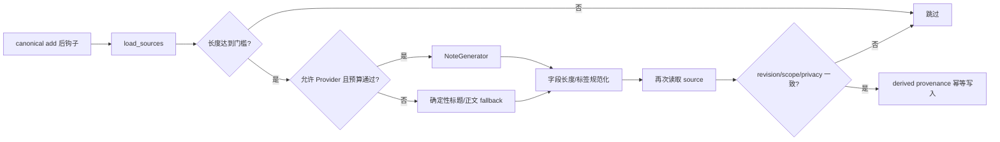

# 版本化人工与派生笔记

**最后核对：** 2026-08-14  
**导航：** [项目根级](../../../AGENTS.md) / [`core`](../../AGENTS.md) / [`features`](../AGENTS.md) / `notes`

## 职责边界

`core/features/notes/` 管理人工笔记、正文版本历史、软删除和基于 canonical source 的自动笔记。它不替代长期记忆，不把笔记写回 canonical，也不直接参与被动召回排序。

- `domain/models.py`：`Note`、`NoteVersion`、`NoteStatus` 和来源约束。
- `application/note_manager.py`：CRUD、版本、自动创建与查询授权。
- `application/note_proposal_pipeline.py`：预算门、生成/fallback、来源复核和幂等写入。
- `infrastructure/note_generator.py`：有限 canonical evidence 到 note dict 的可选 LLM 转换。
- `infrastructure/note_store.py`：`notes`/`note_versions` 的事务、乐观锁、来源可见性与版本裁剪。
- `contracts.py`：Manager/管线消费的 Store、source reader 和 generator 端口。

## 自动创建链



## 关键不变量

1. `Note` 的 manual/derived origin 明确分离；derived 笔记必须有 `DomainProvenance`，`source_memory_ids` 必须与来源序列一致。
2. 自动创建只消费单条达到 `auto_create_min_length` 的 canonical source，正文输入最多 4000 字符；输出 title 80、content 2000、tag 64 字符且数量受配置限制。
3. Provider 调用只在 `note_generation` 额外预算允许时发生。无预算、功能门关闭、生成失败或 `allow_provider=False` 时使用确定性 source fallback，而不是伪造 LLM 结果。
4. 生成前后必须二次校验 source revision、scope 和 privacy；变化时不写 derived note。
5. 自动写入按完整 provenance 幂等，不能更新 manual 笔记或已有版本；重建强制关闭 Provider 并串行处理，避免无界任务和写锁竞争。
6. create 同事务写 `notes` 与 v1；update 使用 `(id, version)` 乐观锁并追加下一版本。`False` 表示冲突/不存在，调用方必须重读。
7. soft delete 只改状态；物理 delete 同事务删除版本。版本裁剪必须保持最新 N 个和唯一 `(note_id, version)`。
8. source 失效后 derived 笔记不可见，但历史版本保留；supporting source 的可见性规则不能改变 primary 权威。
9. user ID、正文、tags 和 provenance 都是敏感数据；工具/API 继续执行当前用户授权。

## 依赖方向

MemoryEngine 写后 hook/维护重建 → `NoteProposalPipeline` → `NoteManager` → `NoteStore`；Page API/Agent 工具调用 Manager。notes 依赖 shared provenance/contracts 和 memory source 校验，不依赖 handler、retrieval 或 transport。

## 修改联动

- 改 Note 字段：同步两表 schema/migration、版本快照、row mapper、API/工具和 contract 测试。
- 改自动生成：同步 cost-control key、fallback、二次来源校验和统一重建阶段。
- 改版本/删除：同步乐观锁、健康检查、分页和并发测试。
- 改来源规则：同步 MemoryEngine 写后钩子、canonical invalidation、备份/重建与 stale pagination。
- 改公开接口：同步 `contracts.py`、根包 `__all__` 和结构端口测试。

## 最窄验证入口

```bash
python -m pytest -q tests/test_notes_feature_contracts.py
python -m pytest -q tests/test_note_proposal_pipeline.py tests/test_note_generator.py
python -m pytest -q tests/test_note_store.py tests/test_knowledge_note_source_integrity.py
python -m pytest -q tests/test_note_api.py tests/test_tools_note.py
```
