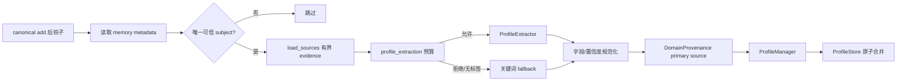

# 用户画像、标签与偏好

**最后核对：** 2026-08-14  
**导航：** [项目根级](../../../AGENTS.md) / [`core`](../../AGENTS.md) / [`features`](../AGENTS.md) / `profiles`

## 职责边界

`core/features/profiles/` 管理稳定用户主体的画像、标签、偏好、统计和标签衰减，并在 canonical memory 成功写入后生成带来源证据的自动 proposal。它不决定协议身份、不从显示名猜主键，也不直接参与消息路由。

- `domain/models.py`：`UserProfile`、`UserTag`、`UserPreferences`、`TagCategory`。
- `application/profile_manager.py`：人工 CRUD、标签/偏好合并、统计与衰减。
- `application/profile_proposal_pipeline.py`：可信主体解析、请求级预算、抽取与 derived provenance 写入。
- `infrastructure/profile_extractor.py`：有限 evidence 的 LLM 抽取与关键词 fallback。
- `infrastructure/profile_store.py` 及辅助模块：SQLite 事务、查询排序、标签与偏好完整性。
- `contracts.py`：application 消费的 Store、source reader、extractor 端口。

## 自动 proposal 链



## 关键不变量

1. 画像主键只能来自 `identity_schema_version`、唯一 `subject_ids`、participant ID/label/name snapshot 和 `participant_identity_sources` 的闭合一致证据。显示名、模型 participants 或多主体记忆不能成为主键。
2. OneBot QQ 稳定 ID/label 还必须满足 namespace 与 canonical QQ 约束；未知协议只接受解析器已经固定的内部证据。
3. 自动抽取 evidence 最多 2000 字符；Provider 调用受 `profile_extraction` 请求级额外预算约束。无预算时只允许本地关键词 fallback。
4. LLM 偏好只接受 `reply_style` 的固定集合，以及去重、有长度/数量上限的 preferred/avoided topics。
5. derived 标签/偏好必须携带 `DomainProvenance`，source 中不保留正文；Store 读时过滤 revision/scope/privacy 已失效来源。
6. 人工偏好权威高于自动 proposal。已有 manual provenance 时，自动整份偏好不得覆盖；人工写入口拒绝伪装成 derived 的 payload。
7. 标签按 category/value 合并，置信度、计数和衰减有界；管理员编辑与删除使用稳定 revision 和 `BEGIN IMMEDIATE` 防止丢失更新。
8. 用户 ID、标签、偏好、活跃时间和来源均为敏感画像数据，不得进入普通日志或跨用户查询。

## 依赖方向

MemoryEngine 写后 hook → `ProfileProposalPipeline` → application ports → profile infrastructure；retrieval 的个性化 ranker只读消费画像。profiles 依赖 shared provenance/contracts 和 memory source 校验，但不得依赖 handler、Page API 或 retrieval 实现。

相关身份事实见 [`identity/AGENTS.md`](../identity/AGENTS.md)，canonical 来源见 [`memory/AGENTS.md`](../memory/AGENTS.md)。

## 修改联动

- 改模型字段：同步 Store schema/migration、row mapper、revision payload、Page API/工具和排序 allowlist。
- 改主体解析：同步 identity metadata 生产方、反思/写后钩子和身份负测。
- 改自动 proposal：同步 cost-control key、extractor、provenance 写/读校验和 source invalidation。
- 改人工/自动优先级：同时覆盖 Manager、Store 原子事务和并发测试。
- 改公开类型：同步 `contracts.py`、根包导出和 feature contract 测试。

## 最窄验证入口

```bash
python -m pytest -q tests/test_profiles_feature_contracts.py
python -m pytest -q tests/test_profile_proposal_pipeline.py tests/test_profile_source_provenance.py
python -m pytest -q tests/test_profile_store.py tests/test_profile_store_concurrency.py
python -m pytest -q tests/test_profile_manual_provenance_boundary.py tests/test_api_profile.py
```
