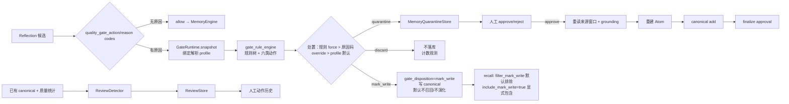

# 记忆质量门与人工处置

**最后核对：** 2026-08-14  
**导航：** [项目根级](../../../AGENTS.md) / [`core`](../../AGENTS.md) / [`features`](../AGENTS.md) / `quality`

## 职责边界

`core/features/quality/` 管理三类明确分离的质量流程：

1. `MemoryQualityGate` 在 canonical 写入前按门禁配置路由候选：`quarantine` 进入隔离状态机，人工批准后重新取证并走正常 `MemoryEngine.add_memory()`；`discard` 不落库；`mark_write` 写 canonical 但默认不参与召回与演化。
2. `ReviewDetector`/`ReviewStore` 扫描已有 canonical 记忆的低置信度、重复、陈旧、敏感、噪声或来源缺失迹象，维护独立人工复核队列。
3. 可配置门禁运行时：`gate_config.py` 定义 `GateConfig`/`GateProfile`/`GateBinding` 域模型与校验；`gate_runtime.py` 的 `GateRuntime` 持有不可变 `GateSnapshot`，热重载为原子替换；`gate_rule_engine.py` 在 profile 内评估 AND/OR/NOT 规则树并应用六类动作；`gate_disposition_filter.py` 默认过滤 mark_write 召回结果。

它不执行结构化抽取、不拥有 canonical 表，也不把检测信号自动当作删除或授权决定。

## 数据流



## 关键不变量

- `route_candidate()` 使用稳定 candidate key 幂等 stage；隔离候选不能进入 canonical、FTS、FAISS、图或 Evolution。
- quarantine 数据库保存候选正文、metadata、session/persona 与来源窗口，保密级别等同原对话；列表/API 必须做授权与字段投影。
- approve 强制 `expected_revision`。可选正文修正有非空和 2000 字符上限，并在写入前从 conversation Store 重读原窗口、重新验证 source evidence。
- 只有重验证通过后才重新分类 Atom 并调用正常 `MemoryEngine.add_memory()`；不能从隔离表直接写 canonical/索引。
- approval token 只持久化 SHA-256 摘要。canonical 可能已提交而 quarantine finalize 失败时抛 `QuarantineApprovalPendingError`，保持 `approving` 供显式 repair；不得自动重试造成重复写入。
- reject/blocked/approved 等状态迁移在 `BEGIN IMMEDIATE` 事务和 revision 条件下执行；取消或异常不得留下虚假终态。
- `ReviewDetector` 是确定性启发式，不是安全分类器。敏感 marker、重复度和陈旧阈值只生成复核项，不直接删改 canonical。
- Review payload 通过 JSON 安全副本隔离可变对象；队列动作和 actor 信息仍属敏感运营数据。
- `GateRuntime` 快照为不可变 `GateSnapshot`；配置热重载是原子替换，同一评估窗口始终引用同一快照实例。reload 校验失败时保留旧快照继续服务。
- profile 解析按绑定顺序首个精确匹配生效（未声明字段视为不约束），未命中回退 `default_profile`；`group_id`/`persona_id` 仅用于解析，不写入 quarantine 以外的业务状态或日志。
- 处置优先级：规则 `force_disposition` > 原因码 override > profile 默认；多原因码取最保守处置（quarantine > discard > mark_write）。`allow` 仅跳过 grounding 失败与低质判定，不绕过 guardrails 与硬校验。
- 规则引擎不接触消息正文之外的敏感字段：候选视图只含 content/summary/key_facts/topics/participants/importance/chat_type；正则必须编译成功且长度受限，动作输出在 `route_candidate` 内 clamp/去重后再写回候选。
- `discard` 处置只返回结果并计数观测（`gate_discard_count`），不写任何存储；dry-run 与诊断不落正文、不回显 `group_id`/`persona_id`。

## 依赖方向

reflection → quality application → 注入的 conversation/memory/processor 能力与 quality infrastructure。Page API 可以构造 review Store/Detector，但 quality 不反向依赖 API。grounding 规则复用 [`recall/processors/AGENTS.md`](../recall/processors/AGENTS.md)，canonical 写契约见 [`memory/AGENTS.md`](../memory/AGENTS.md)。

## 修改联动

- 改 quarantine schema/status：同步迁移、row mapper、revision、repair、备份引用校验和 API。
- 改批准流程：同步来源重验证、Atom 重建、canonical 幂等证据和 durable recovery 测试。
- 改质量 reason code：同步 processor grounding 输出、reflection 计数、Page 文案和诊断 allowlist。
- 改 Review 模型/动作：同步 `ReviewStore` JSON、队列 API、检测器和兼容 `core/review` 导出。
- 改门禁配置模型（`gate_config.py`）：同步 `_conf_schema.json` 的 quality.gate 叶、Pydantic 默认值、`GateRuntime` 快照构建、Page API state/apply、Dashboard 类型/默认值/门禁页、README/CHANGELOG 与 `tests/test_gate_config.py`。
- 改规则引擎动作/谓词：同步 `test_gate_rule_engine.py`、门禁页规则编辑器、原因码与诊断 allowlist。
- 改 mark_write 召回语义：同步 `test_gate_disposition_filter.py`、`/memora search` 契约、记忆列表 API 与演化调度（mark_write 不调度 evolution job）。
- 改包根导出：更新应用/领域/基础设施 owner 契约，禁止在旧 `core/review` 增加新实现。

## 最窄验证入口

```bash
python -m pytest -q tests/test_memory_quarantine.py
python -m pytest -q tests/test_quarantine_durable_recovery.py tests/test_api_quarantine.py
python -m pytest -q tests/test_review_detector.py tests/test_api_quality.py
python -m pytest -q tests/test_memory_quality_pipeline.py
python -m pytest -q tests/test_gate_config.py tests/test_gate_rule_engine.py
python -m pytest -q tests/test_gate_runtime.py tests/test_gate_disposition_filter.py
python -m pytest -q tests/test_memory_quality_gate.py tests/test_memory_evolution_hooks.py
```
