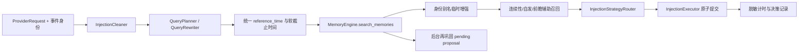

# 请求前召回与对话处理

**最后核对：** 2026-08-14  
**导航：** [项目根级](../../../AGENTS.md) / [`core`](../../AGENTS.md) / [`features`](../AGENTS.md) / `recall`

## 职责边界

`core/features/recall/` 包含两条相邻但不同的链：

- `application/` 在 LLM 请求前清理旧注入、解析查询与时序、执行主/辅助召回、应用身份与连续性增强，再委托 injection feature 原子修改请求。
- `processors/` 在反思链中把会话消息转换为有来源证据的结构化记忆候选；详细契约见 [`processors/AGENTS.md`](processors/AGENTS.md)。

recall 不拥有 canonical Store、检索索引或注入决策持久化；这些分别属于 memory、retrieval 和 injection。

## 请求前主链



## 关键入口

- `application/recall_handler.py` · `RecallHandler`：生产编排器；显式接收 `ConfigManager`、conversation、memory、identity、prompt protection、cost control 和 injection recorder。
- `injection_cleaner.py` · `InjectionCleaner`：只清除可验证的 Memora 标签、临时片段和本插件伪工具调用。
- `recall_observability.py` · `RecallTimingContext`：从请求起点传播单调时钟软截止时间与安全标量。
- `auxiliary_recall.py` · `AuxiliaryRecall`：只用主召回剩余预算执行低优先级自发/前瞻查询。
- `continuity.py` · `build_continuity_context()`：按 session 读取临时连续性提示，失败返回空。
- `reconsolidation_dispatch.py`：只为最高分记忆登记 pending proposal，不阻塞请求关键路径。
- `domain/config.py`：召回过滤、类人增强、注入 preset 与软预算等配置模型。

包根当前只惰性导出 `build_continuity_context`；`RecallHandler` 等生产类型从明确 application 模块导入，不要擅自扩大根入口。

## 关键不变量

1. 动态记忆永远不得写 `req.system_prompt`；允许的传输和回滚契约由 [`injection/AGENTS.md`](../injection/AGENTS.md) 定义。
2. 清理器只能删除边界、call ID、tool name 与 payload 形状均可证明属于 Memora 的历史注入；不能按模糊文本删除用户上下文。
3. query rewrite 输出是不可信路由提示。`reference_time` 在入口解析一次，并传给检索、关系扩展、Projection、缓存和时序过滤。
4. scope/persona/session/stable user/chat type 和 privacy 过滤不可省略；Provider 重排前后继续执行各自的隐私边界。
5. 软截止时间使用单调时钟。主召回保留优先级，辅助召回只能消费剩余时间并在超时后空降级。
6. 连续性和历史名称只附加到候选副本；不得修改 canonical metadata、ID、分数或持久化别名说明。
7. 再巩固只生成待审候选；不得在请求前路径修改被召回正文。
8. 注入先完整构建再原子应用；Prompt protection 注册或请求变更失败必须恢复原状态。
9. 计时、trace 与日志只含 allowlist 标量和随机关联码，不得含 query、正文、身份、source ID 或 metadata。
10. 所有普通增强失败回退安全 baseline；`asyncio.CancelledError` 始终传播。

## 依赖方向

事件处理器 → recall application → conversation/identity/retrieval/injection/observability；reflection → recall processors。recall 不反向依赖事件处理器、Page API 或命令，不直接创建 Store/Provider。

## 修改联动

- 改请求顺序或输入：同步 `EventHandler`、readiness、Prompt protection scope 与请求回滚测试。
- 改时序/缓存参数：同步 query rewriter、retrieval cache key、Evolution readers 和时序测试。
- 改注入清理/传输：同步 injection 模型、adapter、executor 及 DeepSeek V4 replay 契约。
- 改辅助召回：同步软预算、Atom scope/privacy 和 benchmark。
- 改 processors：按子文档同步 reflection、quality gate、grounding 和 storage builder。
- 改包级导出：保持惰性并更新 `tests/test_recall_feature_contracts.py`。

## 最窄验证入口

```bash
python -m pytest -q tests/test_recall_feature_contracts.py
python -m pytest -q tests/test_recall_readiness.py tests/test_recall_observability.py
python -m pytest -q tests/test_auxiliary_recall.py tests/test_recall_projection_metadata.py
python -m pytest -q tests/test_handlers.py -k recall
```

处理器验证命令见 [`processors/AGENTS.md`](processors/AGENTS.md)。
