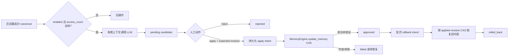

# 记忆再巩固候选

**最后核对：** 2026-08-14  
**导航：** [项目根级](../../../AGENTS.md) / [`core`](../../AGENTS.md) / [`features`](../AGENTS.md) / `reconsolidation`

## 职责边界

`core/features/reconsolidation/` 把高频召回记忆的 LLM 轻量修订保存为可审阅候选，并以 source revision CAS 执行显式 apply、reject 和 rollback。它默认关闭；召回侧只能生成 `pending` proposal，不能直接修改 canonical memory。

- `application/reconsolidation.py`：候选生成、apply/rollback 编排、启动恢复和派生刷新。
- `infrastructure/reconsolidation_store.py`：候选、动作、apply intent 与 rollback intent 的 SQLite 状态机。
- `infrastructure/reconsolidation_schema.py`：表结构与迁移初始化。
- `domain/errors.py`：候选不存在和状态/revision 冲突的稳定异常。

## 状态与数据流



## 关键不变量

1. `maybe_propose()` 只接受 canonical 整数 ID；功能关闭、来源缺失、访问次数不足、上下文为空、revision 缺失、LLM 失败或正文未变化时不建候选。
2. query/context 只用于当前 LLM 提示，不持久化。候选保存旧正文、旧 metadata、source revision、提案正文和有限摘要，保密级别等同 canonical memory。
3. 同 memory/revision/proposed content 的 pending proposal 幂等复用；不能靠重复任务制造多个可应用候选。
4. apply 在 canonical 写入前持久化唯一 intent，并把 `expected_revision` 传给 `MemoryEngine.update_memory()`。CAS 失败不能覆盖后续人工编辑。
5. canonical 已提交但 Store 收口失败属于未知/待恢复状态，不能简单重试写入。启动恢复只在当前正文、metadata 和 revision 可证明时补收口或重放一次。
6. rollback 同样先持久化 intent，并以 apply 后 revision CAS；只允许恢复该候选自己的旧内容。
7. apply/rollback 成功后刷新当前 canonical 的图等派生产物；刷新失败必须显式报告，不能伪造事务完全成功。
8. 动作审计保存固定 action、reason code 与时间，不保存 query/context；取消必须传播并保留可恢复 intent。

## 依赖方向

recall application → `ReconsolidationManager` → 注入的 canonical get/update/derived-refresh 回调与 `ReconsolidationStore`。Store 只依赖 domain/SQLite，不导入 MemoryEngine、handler 或 Page API；旧 `core/managers` 与 `core/storage` re-export 已删除。

相关召回派发边界见 [`recall/AGENTS.md`](../recall/AGENTS.md)，canonical revision 语义见 [`memory/AGENTS.md`](../memory/AGENTS.md)。

## 修改联动

- 修改候选字段或状态：同步 schema 初始化/迁移、row mapper、动作表、Page API 与恢复逻辑。
- 修改 apply/rollback：同时覆盖 intent 创建、CAS 写入、提交验证、启动恢复和派生刷新，不能只改 happy path。
- 修改 LLM 输入：同步长度限制、Prompt protection/Provider 数据边界和“上下文不落盘”测试。
- 修改公开符号：同步 feature 包根导出与直接调用方契约。

## 最窄验证入口

```bash
python -m pytest -q tests/test_reconsolidation_feature_contracts.py
python -m pytest -q tests/test_reconsolidation_closed_loop.py
python -m pytest -q tests/test_reconsolidation_revision_safety.py tests/test_reconsolidation_store_atomicity.py
python -m pytest -q tests/test_api_reconsolidation_review.py
```
