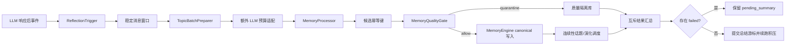

# 响应后记忆反思

**最后核对：** 2026-08-14  
**导航：** [项目根级](../../../AGENTS.md) / [`core`](../../AGENTS.md) / [`features`](../AGENTS.md) / `reflection`

## 职责边界

`core/features/reflection/` 在 LLM 响应后计算稳定反思窗口，按话题和额外 LLM 预算准备批次，把结构化候选交给质量门与 `MemoryEngine`，并提交或保留会话总结进度。它不解析平台协议身份、不实现候选抽取算法、不直接写 SQLite 表，也不拥有 canonical 存储。

- `application/reflection_handler.py` 是生产编排器；由顶层事件处理链构造并持有。
- `reflection_trigger.py` 计算 `start_index/end_index/drain_end_index` 和 retry 窗口。
- `topic_batch_preparer.py` 只处理 C/D 预分批；A/B/Hybrid 后置分段属于 [`recall/processors/AGENTS.md`](../recall/processors/AGENTS.md)。
- `llm_budget.py` 保证一个基础批次，并用请求级 `ExtraLlmBudget` 约束额外批次。
- `candidate_writer.py` 执行幂等候选写入、质量路由和受限并发。
- `reflection_metadata.py` 负责总结游标与 `pending_summary` 的持久化收口。
- `domain/storage_outcomes.py` 定义互斥写入终态与汇总计数。

## 处理链



## 关键不变量

1. 反思窗口使用消息索引而非缓存长度猜测；同一会话由一个有所有者的后台任务串行排空，窗口大小与续跑次数必须有界。
2. 基础反思不消耗“额外批次”额度。超出额度的批次合并回最后一个允许批次，消息不能因预算不足被丢弃。
3. 每条候选终态只能是 `canonical`、`quarantined`、`failed` 或 `skipped_idempotent`。quarantine 不得计作 canonical 成功，failed 不得写入已完成幂等键。
4. 幂等键绑定 session、窗口索引、批次/候选序号和内容摘要；重试同一窗口不得重复写 canonical。
5. 只有通过质量门的候选调用 `MemoryEngine.add_memory()`；隔离候选留在 quality feature，不能提前生成可召回 Atom。
6. canonical 写入成功后才能记录连续性话题并安排 Memory Evolution；演化调度失败不回滚 canonical。
7. 任一真实存储失败必须保留可重试 `pending_summary`，不能推进窗口或把 `/memora summarize` 报告成完全成功。
8. Prompt protection scope、可信稳定身份和 source evidence 必须从事件链传入；日志与观测只能记录计数、阶段和 reason code。
9. `asyncio.CancelledError` 穿透批次、写入和关闭流程；`close()` 必须等待或取消所有已登记任务。

## 依赖方向

`event_handler` → reflection application → conversation、recall processors、quality、memory、observability 与 shared cost control。reflection 不应依赖 Page API、命令或具体 SQLite Store；质量门和写端口通过构造注入。

## 修改联动

- 修改窗口/游标语义：同步 conversation metadata 原子接口、积压续跑、pending 恢复和 `tests/test_ambient_reflection_trigger.py`。
- 修改话题策略：同步 reflection 配置模型、`TopicBatchPreparer`、processors 中对应策略与生产 wiring。
- 修改候选终态或计数：同步命令结果、观测字段、pending 提交规则和 storage outcome 测试。
- 修改质量路由：同步 [`quality/AGENTS.md`](../quality/AGENTS.md)、quarantine 恢复与 candidate writer。
- 修改公开导出：保持根包惰性，并更新 `tests/test_reflection_feature_contracts.py`。

## 最窄验证入口

```bash
python -m pytest -q tests/test_reflection_feature_contracts.py
python -m pytest -q tests/test_ambient_reflection_trigger.py tests/test_reflection_metadata_persistence.py
python -m pytest -q tests/test_reflection_candidate_writer.py tests/test_reflection_storage_outcomes.py
python -m pytest -q tests/test_handlers.py -k reflection
```

先按改动选择单行；只有跨越事件处理器、处理管道和写入门时才运行最后一条。
