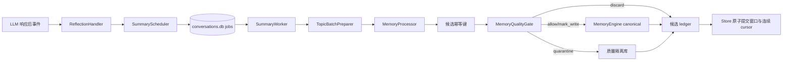

# 响应后记忆反思

**最后核对：** 2026-08-31
**导航：** [项目根级](../../../AGENTS.md) / [`core`](../../AGENTS.md) / [`features`](../AGENTS.md) / `reflection`

## 职责边界

`core/features/reflection/` 在 LLM 响应后解析稳定反思窗口，并把自动总结、手动总结、pending 恢复和启动扫描统一交给持久化 `SummaryScheduler`。它不解析平台协议身份、不实现候选抽取算法、不直接写 SQLite 表，也不拥有 canonical 存储。

- `application/reflection_handler.py` 是事件清洗与自动入队适配器；由顶层事件处理链构造并持有。
- `application/summary_scheduler.py` 负责固定窗口调度、round-robin claim、worker 生命周期与失败恢复。
- `application/summary_worker.py` 只读取 claim 固化来源，调用现有 Processor/质量门，并返回 `WindowOutcome`。
- `topic_batch_preparer.py` 只处理 C/D 预分批；A/B/Hybrid 后置分段属于 [`recall/processors/AGENTS.md`](../recall/processors/AGENTS.md)。
- 后台任务不继承 `ExtraLlmBudget`；物理 Provider attempt 统一由 Processor 的共享 `SummaryLlmLimiter` 限流。
- `candidate_writer.py` 执行幂等候选写入和质量路由；`MemoryEngine` 是 canonical 写后演化唯一 owner。
- `domain/summary_models.py` 与 `summary_ports.py` 定义不可变任务 DTO、闭集状态、安全投影和 Store 窄端口。


## 处理链



## 关键不变量

1. 反思窗口使用稳定 `message_seq` 和持久化 job；同一会话按连续完成前缀推进，跨会话由 `SummaryScheduler` 有界并发且公平领取。
2. 基础反思不消耗在线请求的“额外批次”额度；后台恢复任务只执行固定基础批次。
3. 每条候选终态只能是 `canonical`、`quarantined`、`discard`、`mark_write`、`failed` 或 `skipped_idempotent`；未知结果进入 `unknown`。
4. 幂等键绑定 session、窗口索引、批次/候选序号和内容摘要；重试同一窗口不得重复写 canonical。
5. 只有通过质量门的候选调用 `MemoryEngine.add_memory()`；隔离候选留在 quality feature，不能提前生成可召回 Atom。
6. canonical 写入成功后才能安排 Memory Evolution；演化调度失败不回滚 canonical。
7. 任一来源缺失、digest 不符、claim/epoch 失效或真实存储失败都不得推进 cursor；失败任务保留可恢复状态。
8. Prompt protection scope、可信稳定身份、GateSnapshot 和 source evidence 必须从事件链传入；日志与观测只能记录计数、阶段和 reason code。
9. `asyncio.CancelledError` 穿透批次、写入和关闭流程；组合根负责停止调度器并等待或回收所有已登记 worker。

## 依赖方向

`event_handler` → reflection application → conversation、recall processors、quality、memory、observability 与 shared cost control。reflection 不应依赖 Page API、命令或具体 SQLite Store；质量门和写端口通过构造注入。

## 修改联动

- 修改窗口/游标语义：同步 SummaryJobStorePort 的 message_seq、epoch、frontier、pending projection、恢复和 trim 原子接口。
- 修改话题策略：同步 reflection 配置模型、`TopicBatchPreparer`、processors 中对应策略与生产 wiring。
- 修改候选终态或计数：同步命令 ack、诊断累计字段、任务 pending projection 和 storage outcome 测试。
- 修改质量路由：同步 [`quality/AGENTS.md`](../quality/AGENTS.md)、quarantine 恢复与 candidate writer。
- 修改公开导出：保持根包惰性，并更新 `tests/test_reflection_feature_contracts.py`。

## 最窄验证入口

```bash
python -m pytest -q tests/test_reflection_feature_contracts.py
python -m pytest -q tests/test_summary_enqueue_entry.py tests/test_reflection_feature_contracts.py
python -m pytest -q tests/test_reflection_candidate_writer.py tests/test_reflection_storage_outcomes.py
python -m pytest -q tests/test_handlers.py -k reflection
```

先按改动选择单行；只有跨越事件处理器、处理管道和写入门时才运行最后一条。
