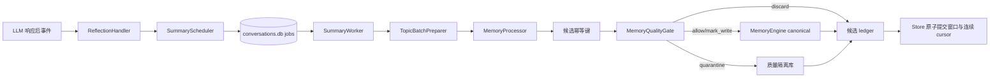

# 响应后记忆反思

**最后核对：** 2026-08-31
**导航：** [项目根级](../../../AGENTS.md) / [`core`](../../AGENTS.md) / [`features`](../AGENTS.md) / `reflection`

## 职责边界

`core/features/reflection/` 在 LLM 响应后解析稳定反思窗口，并把自动总结、手动总结、pending 恢复和启动扫描统一交给持久化 `SummaryScheduler`。它不解析平台协议身份、不实现候选抽取算法、不直接写 SQLite 表，也不拥有 canonical 存储。

- `application/reflection_handler.py` 是事件清洗与自动入队适配器；由顶层事件处理链构造并持有。
- `application/summary_scheduler.py` 负责固定窗口调度、round-robin claim、worker 生命周期与失败恢复。
- `application/summary_worker.py` 只读取 claim 固化来源，调用现有 Processor/质量门，并返回 `WindowOutcome`。
- `topic_batch_preparer.py` 只处理 C/D 预分批；A/B/Hybrid 后置分段属于 [`recall/processors/AGENTS.md`](../recall/processors/AGENTS.md)。
- 后台任务不继承 `ExtraLlmBudget`；物理 Provider attempt 统一由 Processor 的共享 `SummaryLlmLimiter` 限流。
- `candidate_writer.py` 执行幂等候选写入和质量路由；质量门通过、canonical 插入之前按需调用近重复合并协调器（`memory_dedup`，默认关闭），命中时返回 `merged` 终态并跳过插入；可选指标记录端口由组合根经 `SummaryWorker` 注入协调器，缺省为 no-op，记录异常不得影响写入终态；`MemoryEngine` 是 canonical 写后演化唯一 owner。
- 候选写入异常统一由 `classify_store_failure` 归约为稳定原因码：`claim_lost`/`epoch_fenced`/`generation_fenced`/`summary_source_fenced`/`summary_epoch_fenced` 属按设计 fail-closed 的预期跳过，记 WARN 与 `MEMORY_WRITE_FAILURES_TOTAL{stage="candidate_fenced"}`（`claim_lost`/`epoch_fenced`/`generation_fenced` 不改既有语义：不复核 canonical owner，终态仍是 `failed`）；其余稳定标识符或无法识别（回落 `canonical_write_failed`）记 ERROR 与 `stage="candidate_write"`。异常原文、正文、ID、scope、revision 一律不进日志、指标与返回值。
- `domain/summary_models.py` 与 `summary_ports.py` 定义不可变任务 DTO、闭集状态、安全投影和 Store 窄端口。


## 处理链



## 关键不变量

1. 反思窗口使用稳定 `message_seq` 和持久化 job；同一会话按连续完成前缀推进，跨会话由 `SummaryScheduler` 有界并发且公平领取。
2. 基础反思不消耗在线请求的“额外批次”额度；后台恢复任务只执行固定基础批次。
3. 每条候选终态只能是 `canonical`、`quarantined`、`discard`、`mark_write`、`merged`、`failed` 或 `skipped_idempotent`；未知结果进入 `unknown`。`merged` 表示候选已并入同 scope 的既有 canonical（不新增 canonical），在 ledger 中与 `canonical` 同槽消费。
4. 幂等键绑定 session、窗口索引、批次/候选序号和内容摘要；重试同一窗口不得重复写 canonical。
5. 只有通过质量门的候选调用 `MemoryEngine.add_memory()`；隔离候选留在 quality feature，不能提前生成可召回 Atom。
6. canonical 写入成功后才能安排 Memory Evolution；演化调度失败不回滚 canonical。
7. 任一来源缺失、digest 不符、claim/epoch 失效或真实存储失败都不得推进 cursor；失败任务保留可恢复状态。
8. Prompt protection scope、可信稳定身份、GateSnapshot 和 source evidence 必须从事件链传入；日志与观测只能记录计数、阶段和 reason code。`SummaryWorker` 把 `SourceWindow.message_seqs` 一并交给 Processor，使来源证据带稳定窗口序号；证据缺失或角色不支持时由质量门隔离，不落 canonical。
9. `asyncio.CancelledError` 穿透批次、写入和关闭流程；组合根负责停止调度器并等待或回收所有已登记 worker。
10. 响应对投递边界由 `probe_host_response_boundary()` 只读判定：宿主已发布 `STREAMING_RESULT`/`STREAMING_FINISH` 时保护无法先于首个可见分片，记录 `reply_streaming_precheck_unavailable`；事件形状无法验证投递边界时记录 `reply_precheck_unverified`。两种情况都不发送占位文本、不伪造送达回执、不改宿主投递路径。无可持久化文本按 `reply_non_text_content`、`reply_empty_after_send_operation`、`reply_empty_provider`、`empty_response_after_sanitization` 区分；工具中间步、已由工具发送与多模态回复不得记为最终空失败。

## Topic candidate contract

反思候选契约由 `reflection/domain` 持有：`CanonicalScopeResolver` 的结果必须作为不可变 scope snapshot 传入总结任务；缺失或冲突的 `scope_key`、`chat_type`、`privacy_level` 或 resolver revision 统一为 `scope_unavailable`，不得由 `session_id`、`persona_id` 或 `group_id` 猜测。`TopicCandidateLabel` 只有明确的 `source_provenance_complete=True` 才能进入未来生产 Prompt；缺失/不完整证据不得被推断为完整，也不执行 topic 字符串身份替换。

`CandidateReuseConfig` 是 reflection domain 的 typed 配置，默认 `observe`，并强制 `fixed_k <= max_full_topics`、`activation_threshold <= max_full_topics`、`overfetch_factor == 3`；在平台 schema/runtime/API 完成同步前不得挂入根配置或启用生产 selector。候选 DTO 的安全投影只能包含固定模式、状态、reason 和非负计数，禁止携带 query、正文、scope、canonical ID、revision 或身份查找细节。`BucketOverride` 允许按规模桶（tiny/small/medium/large/xlarge/huge）覆盖全局 mode 和 fixed_k；`CandidateReuseConfig.get_bucket_config(bucket)` 返回有效的 (mode, k) 配置，优先使用桶覆盖，回落全局配置。

## 依赖方向

`event_handler` → reflection application → conversation、recall processors、quality、memory、observability 与 shared cost control。reflection 不应依赖 Page API、命令或具体 SQLite Store；质量门和写端口通过构造注入。

## 修改联动

- 修改窗口/游标语义：同步 SummaryJobStorePort 的 message_seq、epoch、frontier、pending projection、恢复和 trim 原子接口。
- 修改话题策略：同步 reflection 配置模型、`TopicBatchPreparer`、processors 中对应策略与生产 wiring。
- 修改候选终态或计数：同步命令 ack、诊断累计字段、任务 pending projection 和 storage outcome 测试。
- 修改质量路由：同步 [`quality/AGENTS.md`](../quality/AGENTS.md)、quarantine 恢复与 candidate writer。
- 修改公开导出：保持根包惰性，并更新 `tests/test_reflection_feature_contracts.py`。

## 最窄验证入口

```bash
python -m pytest -q tests/test_reflection_feature_contracts.py
python -m pytest -q tests/test_host_response_boundary.py tests/test_reflection_reply_reasons.py
python -m pytest -q tests/test_summary_enqueue_entry.py tests/test_reflection_feature_contracts.py
python -m pytest -q tests/test_reflection_candidate_writer.py tests/test_reflection_storage_outcomes.py
python -m pytest -q tests/test_handlers.py -k reflection
```

先按改动选择单行；只有跨越事件处理器、处理管道和写入门时才运行最后一条。
