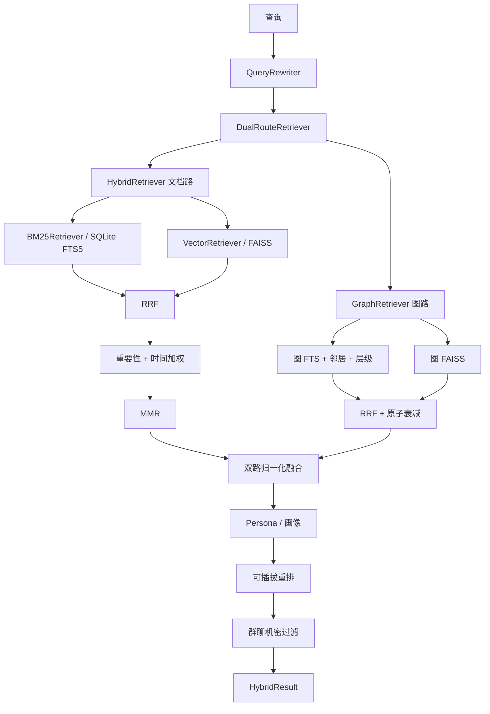
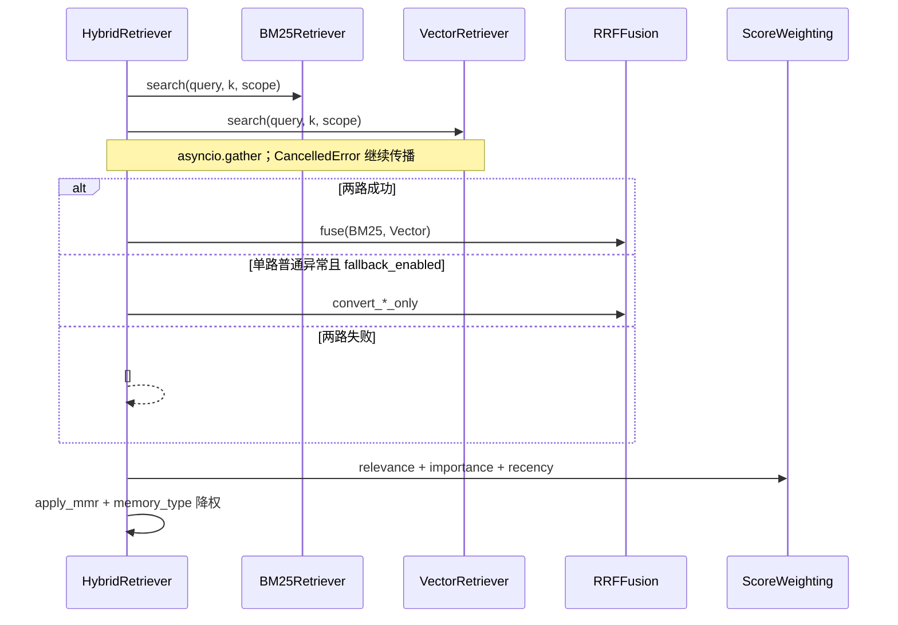

[根级 AGENTS.md](../../../../../../AGENTS.md) / core / features / retrieval

# Retrieval 模块上下文

**最后更新：** 2026-07-20
**源码范围：** `core/features/retrieval/*.py`

## 职责与边界

`core/features/retrieval/` 负责从文档、FAISS、图、原子和知识库生成候选，执行 RRF、时间/重要性加权、MMR/可插拔重排、个性化与隐私过滤，并生成有界、脱敏的召回追踪。canonical 与图持久化属于 [`features/memory`](../memory/AGENTS.md)，派生关系扩展与 Projection 读取由 [`features/evolution`](../evolution/AGENTS.md) 唯一持有，本模块只消费其公开读取契约。

## Memory Evolution 召回顺序

`DualRouteRetriever` 的在线顺序固定为：direct/graph candidate merge → Evolution application 的 `DerivedRelationExpander` → `ProjectionReader` attachment → reranker → privacy filter。只有 `enabled=true` 且 mode 为 `readonly`/`active` 时才调用 relation/projection reader；`disabled` 与 `shadow` 必须保持 baseline，不能因派生表存在而读取。旧 `core/retrieval` 包已删除。

- relation expansion 只增加有 scope/隐私证据的 canonical candidate，并受 per-seed/global expansion budget 限制。
- ProjectionReader 只把通过 active、类型开关、validity、scope、privacy、source revision、role 和统一 `reference_time` 校验的 projection metadata 附着到已有 primary canonical candidate；supporting/conflict source 只用于证据校验，不能单独生成 candidate。普通非冲突 Projection 可在 supporting mapping 已由 Store 移除且 primary 仍有效时保留；`semantic_summary` 合成自全部来源，任一 mapping/revision 失效都必须整条失效。检测到 stale/越权 source 或缺少 conflict side 时整体不附着。
- 附着不得改变 canonical `doc_id`、content、score、排序或 reranker candidate 数量；普通异常回退 baseline，单条坏 projection 隔离，`asyncio.CancelledError` 必须传播。
- 下游 formatter 只能看到 `type/summary/confidence`，不得把 projection ID、source ID、revision、scope、privacy、role 或 job 信息交给模型。



## 公共入口

包级 `__init__.py` 导出 `BM25Retriever`、`VectorRetriever`、`HybridRetriever`、三种图检索器、`DualRouteRetriever`、`RRFFusion` 及结果 DTO。

| 入口 | 作用 |
|---|---|
| `HybridRetriever.search()` | 并行 BM25 + 主向量检索，单路失败可降级，随后 RRF、加权和 MMR |
| `DualRouteRetriever.search()` | 文档路 + 图路协调、动态权重、缺失文档回填、个性化、重排和隐私过滤 |
| `BM25Retriever` | SQLite FTS5 `memora_memories_fts` 的建索引、查询、更新、删除 |
| `VectorRetriever` | AstrBot `FaissVecDB` 的插入、查询、metadata 更新和删除 |
| `GraphRetriever` | 图关键词与图向量路融合，并加入 importance/recency/atom decay |
| `AtomRetriever` | `AtomStore` FTS 结果乘以 temporal score |
| `KnowledgeRetriever` | 知识条目的关键词 + 可选向量混合检索 |
| `capture_explainable_recall()` | 执行带 debug trace 的召回，生成并可持久化安全 DTO |

检索器和 Store 通过不可变 `AdapterCapabilityContract` 区分 `native`、`caller_enforced` 与 `unsupported`。未知 adapter 默认关闭全部能力；BM25 的 scope 过滤、固定 AstrBot FAISS 的返回侧精确过滤以及 reference-time 上层校验属于调用方保证。Vector scoped search 遇到显式 unsupported filter 时不得调用底层无过滤查询；派生 reader 不支持 `reference_time` 时跳过注解并保留 canonical baseline。

## 文档路数据流



- `BM25Retriever` 只允许 `memora_memories_fts` 和 `documents` 两个内部表名；标识符先走白名单，再进入 SQL。查询值参数化。
- 中文等文本先由 `TextProcessor` 处理；FTS 命中后分数归一化。scope 过滤可能扩大 fetch 数再后过滤。
- `VectorRetriever` 把过长正文压缩到 embedding 字符预算，保留头尾并插入截断标记；底层 FAISS 与 DocumentStorage 的内部 UUID/整数 ID 映射通过有界缓存解析。
- `RRFFusion` 按排名而非原始量纲融合；默认 $k=60$。`ScoreWeighting` 使用加权和，结合 RRF、importance 和基于 `max(create_time,last_access_time)` 的 recency。
- `apply_mmr()` 使用词袋 Jaccard 代理，不做额外 embedding；`mmr_lambda` 越高越偏相关性。

## 图路与双路融合

- `GraphKeywordRetriever` 组合图 entry FTS、节点 token、0..2 hop 邻居扩展和可选 `EntityHierarchyStore` 层级展开，最终聚合到 `source_memory_id`。direct/matched-node 的内部距离为 0，一跳为 1，二跳为 2，层级路径为未知；多路径命中保留最小已知距离。
- `GraphVectorRetriever` 查询独立图 FAISS；结果 metadata 必须映射回源记忆 ID；SQLite graph store 归属 `core/features/memory/graph/infrastructure/`。
- `GraphRetriever` 并行两条图路并 RRF 融合，再组合 RRF、importance、recency 与 `compute_decay_score(atom)`；关键词路最小距离只进入内部 `score_breakdown.graph_min_distance`，不进入 metadata，也暂不改变默认评分。
- `DualRouteRetriever` 只编排路由执行、派生扩展、重排、隐私过滤和反馈；`dual_route_fusion.py` 负责缺失 canonical 回填、文档/图/Atom 分数融合、解释字段与权重选择，依赖方向保持为 Retriever → Fusion。
- 双路默认文档/图权重为 `0.65/0.35`，双路同 ID 额外 `cross_route_bonus=0.08`；显式 `RecallStrategy` 优先，其次 `QueryIntent`，最后关键词规则。
- 缺正文或 metadata 的候选通过 `memory_loader` 并发回填；加载异常或 `None` 的候选被跳过。
- 图路为空时直接使用文档路；当前实现先 await 文档任务再 await 图任务，协程对象已创建但不是 `create_task()`，修改计时/并发语义时须以测试为准。

## 查询改写、个性化与重排

### 查询改写

`QueryRewriter.rewrite()` 可把 query 与 recent context 交给生产注入的单次 LLM caller，解析 `QueryIntent`（intent、实体、时间引用、可选 UTC `reference_time`、改写查询、memory types）；功能门或请求额度拒绝、Provider 失败及解析失败均回退 `intent_keywords.py`。LLM 返回只作为路由提示，不能直接用作 SQL/路径/工具输入。`reference_time` 必须从 MemoryEngine 贯穿 DualRoute、relation/projection reader 和链式扩展，并进入 retrieval/session cache key；下游不得各自读取墙钟。

### 个性化

`PersonalizedRanker` 对内容/metadata 中匹配的画像 tag 加分，封顶 `+0.3`；preferred topics 加分，avoided topics 减分。画像读取失败不会中断召回。

### 重排

| 策略 | 实现 | 失败语义 |
|---|---|---|
| `mmr` | 词袋 Jaccard | 同步、无外部调用 |
| `embedding_similarity` | query/doc Embedding 余弦相似度与原始分数加权，不执行 Cross-Encoder 联合推理 | 生产路径 FAISS/向量不可用回退 MMR；可信消融使用严格运行时探针 |
| `llm` | 通过请求级双门后，把 query 与最多 `2 * batch_size` 个正文预览交给 LLM 评分 | 额度拒绝、解析或调用失败保持输入顺序和分数不变；普通失败释放 reservation |
| `hybrid` | Embedding 相似度窄化后 LLM 精排 | 组合两者语义 |

`create_reranker()` 是 async 工厂；只有显式 `vector_access`/`sync_text_generation` 能力满足时才构造对应外部重排器，否则在工厂阶段返回带稳定原因码的 MMR。`DualRouteRetriever._apply_reranker()` 通过 `provider_privacy_prefilter` 兼容同步/异步返回，并在普通异常或返回非 list 时恢复安全候选的原始分数排序。注意 `HybridReranker.rerank()` 当前是同步方法但可能返回 LLM coroutine，调用方负责 await。

## 隐私与不可泄露数据边界

1. **任何非 MMR 重排都先经过 `ProviderPrivacyPrefilter`。** 预过滤按当前 chat type、scope、稳定用户和候选 role/privacy 约束正文；群聊 `confidential`、跨 scope、私聊稳定身份不匹配和非法 role 候选不得进入 Provider。
2. 预过滤普通故障时，`security.strict_mode=true` 跳过外部重排并保持基础顺序；兼容模式只执行本地 MMR。`asyncio.CancelledError` 必须传播，两种模式都不得把未过滤候选交给 Provider。
3. **最终群聊过滤继续保留在重排之后。** `chat_type == "group"` 时丢弃 `metadata.privacy_level == "confidential"`；缺字段按 `shared`，用于防止中间组件错误恢复候选。任何绕过 `DualRouteRetriever` 的直接检索调用都不具备完整双层保护。
4. `QueryRewriter` 会向 LLM 发送 query/recent context；`LLMReranker` 只发送 query、匿名局部索引和每项前 200 字符。不得把凭据、系统提示或未授权私密会话传入外部 provider。
5. `HybridResult.content`、metadata、graph provenance、query、session/user/persona ID 都是敏感数据。禁止进入普通指标标签或未授权 API。
6. FTS、FAISS 与图路返回的 metadata 不可信；预过滤必须校验字段类型和值，不能把 metadata 字段当成未经验证的授权证明。

## 可解释召回与追踪

`capture_explainable_recall()` 调用 `engine.search_memories(trace_debug=True)`，内部可使用候选 ID、正文预览和请求上下文计算路由信号，但 `RecallTrace.to_dict()` 在保存与返回前统一调用 `sanitize_trace_payload()`。内部调试模型不是持久化或 API 契约。

- 安全 DTO 只保留 trace 关联码、总耗时、已知阶段及其耗时/计数/路由枚举、无 canonical ID 的 rank/score、受限贡献标量、有限 memory type/status/source type，以及无候选 ID 的过滤原因/阶段/分数。
- query、prompt、正文/preview/summary、canonical `doc_id`、图路径、贡献 explanation、request metadata、session/persona/user ID、source mapping、revision、scope/privacy/role/job 信息和任意 metadata 都不得持久化或返回。
- `RecallTraceStore` 使用内存 `OrderedDict` 和可选 SQLite，按 `retention_count` 裁剪；新写入、缓存载入、列表与详情读取都重新执行 sanitizer，因此旧数据库 payload 也不能绕过当前 allowlist。
- API 普通失败只返回稳定错误码并记录异常类型；`asyncio.CancelledError` 仍按协程取消语义传播。
- `debug_trace_available` 只说明本次是否产生候选评分贡献；问题报告总开关由独立的 `debug_reporting_enabled` 安全布尔值表示，二者不得混用。

## 生命周期与异常语义

`MemoryLifecycleManager` 负责文档路三存储同步：

- 添加：先向量/DocumentStorage 取得 `doc_id`，再写 BM25；BM25 失败时尝试删除向量回滚。
- metadata 更新：向量层负责同步 DocumentStorage，并推进 `documents.updated_at` 作为 source revision，随后 BM25 更新；失败返回 `False`。
- 上层提供 `expected_revision` 时，metadata 更新在 DocumentStorage 的 `BEGIN IMMEDIATE` 写锁内比较当前 revision；比较失败不得写入。缺省参数保持既有二参数调用形状。
- 删除：按 BM25 → 向量/DocumentStorage 删除；后续失败时尝试恢复 BM25。

这仍不是跨文件 ACID 事务；上层 `WriteOpJournal` 才负责更完整的跨存储恢复。

普通单路检索异常可降级为空/另一条路；`asyncio.CancelledError` 必须传播。不要把 provider、SQLite 或 FAISS 故障转换成伪造高分结果。

## 评分不变量

- RRF 以排名融合，不比较 BM25 与向量原始分数。
- 双路融合先按各路最大分归一化，再按路权重相加并加 cross-route bonus，最终上限 1.0。
- `memory_types` 当前是未匹配候选乘 `0.1` 的软降权，不是硬过滤。
- persona boost、画像 boost 和重排会原地修改 `HybridResult.final_score`；缓存结果必须复制，避免跨请求串分。
- 情绪与季节加权位于 managers 的 `RetrievalOptimizer`；不要在 retrieval 再加第二套相同增强。

## 测试定位与精确验证

```bash
python -m pytest -q tests/test_bm25_retriever.py tests/test_vector_retriever.py tests/test_hybrid_retriever.py tests/test_rrf_fusion.py tests/test_score_weighting.py tests/test_mmr_reranker.py
python -m pytest -q tests/test_graph_keyword_retriever.py tests/test_graph_vector_retriever.py tests/test_graph_retriever.py tests/test_dual_route_retriever.py
python -m pytest -q tests/test_derived_relation_expander.py tests/test_projection_reader.py
python -m pytest -q tests/test_adapter_capabilities.py tests/test_reranker_factory.py
python -m pytest -q tests/test_query_rewriter.py tests/test_intent_keywords.py tests/test_personalized_ranker.py tests/test_reranker_factory.py tests/test_embedding_similarity_reranker.py tests/test_llm_reranker.py
python -m pytest -q tests/test_atom_retriever.py tests/test_knowledge_retriever.py tests/test_memory_lifecycle.py
python -m pytest -q tests/test_api_recall_trace.py tests/test_p0_observability_privacy.py tests/test_recall_cost_benchmark.py
python -m pytest -q tests/test_emotion_scorer.py tests/test_seasonal_recall.py
```

隐私、路由或重排改动至少运行 `test_dual_route_retriever.py`、相应重排测试、`test_api_recall_trace.py` 和 `test_p0_observability_privacy.py`。

## 依赖方向与改动守则

- 允许：`retrieval → models/processors/storage/utils/base`，以及 `DualRouteRetriever → features/evolution` 的只读契约；`managers → retrieval`。
- 禁止 `retrieval` 直接调用 handler/page API 或启动 scheduler。
- 新检索路必须定义：ID 空间、scope 过滤、失败降级、分数归一化、删除/更新同步和敏感数据边界。
- 新增 trace 字段必须先进入显式低基数允许列表；绝不直接持久化原始 metadata、任意文本、业务 ID 或列表。
- 更改评分公式时同步更新 `score_breakdown`、路由测试和 benchmark；不要只改最终排序。
- 新增外部 provider 调用必须接入成本控制，并明确哪些用户数据离开本地边界。
