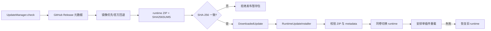

# 插件运行时更新

**最后核对：** 2026-08-14  
**导航：** [项目根级](../../../AGENTS.md) / [`core`](../../AGENTS.md) / [`features`](../AGENTS.md) / `updates`

## 职责边界

`core/features/updates/` 负责检查 GitHub Release、选择镜像或官方来源、下载并校验 runtime ZIP，以及在 AstrBot 插件目录中安装、安排单插件重载和失败回滚。它不管理 Python 依赖环境、不修改用户数据目录，也不替代备份或数据库迁移。

- `domain/`：`UpdateSettings`、`UpdateRelease`、`DownloadedUpdate`、`UpdateError`、`RuntimeUpdateError`。
- `application/manager.py`：发布元数据读取、版本比较、SHA-256 清单解析、下载暂存与安全状态。
- `application/installer.py`：ZIP 验证、runtime 目录切换、重载调度、回滚和公开状态投影。
- 包根是惰性入口；导入 `core.features.updates` 不应提前加载 application/domain。

## 真实流程



## 事实来源与不变量

- 仓库固定为 `INSide-734/astrbot_plugin_memora`；版本事实由 `core/platform/resources/version.py`/`metadata.yaml` 提供，不能从下载文件名猜测。
- 下载前后都执行大小上限；校验清单只接受 64 位十六进制 SHA-256 和目标 runtime 文件名。
- 镜像是可选下载前缀，失败后可回退官方地址；任何来源都必须通过同一 checksum。
- 安装器拒绝绝对路径、`..`、符号链接、特殊文件、过多成员和超大解压体积；不能用 `extractall()` 绕过逐项校验。
- runtime 切换只覆盖插件代码/资源清单，不应触碰 `data_dir`。旧目录与新目录必须在同一插件存储边界内完成可回滚切换。
- 重载调度成功不等于新 runtime 已启动；安装状态必须保留 `reload_scheduled`/回滚等真实阶段，不能提前报告完成。
- 对外状态只返回 `_PUBLIC_STATE_FIELDS` 允许的低敏字段，不暴露绝对路径、下载响应、请求头或内部异常。
- 同一时刻只允许一个活动安装状态；取消与普通失败必须区分，未验证包不得进入安装阶段。

用户操作说明见 [`website/docs/operations/update.md`](../../../website/docs/operations/update.md)。

## 依赖方向

`main.py`、更新 Page API 和命令 → `updates.application` → `updates.domain`；HTTP、文件和 AstrBot 重载能力停留在 application 边界。

## 修改联动

- 修改版本/资产命名：同步 Release 打包脚本、checksum 文件规则、`metadata.yaml` 和更新契约测试。
- 修改安装内容：同步 `_RUNTIME_ROOT_FILES`、页面/i18n 完整性检查、ZIP 安全上限和回滚覆盖面。
- 修改状态字段或 reason code：同步 Update API、命令响应、公开字段 allowlist 和安装恢复测试。
- 修改 `UpdateSettings`：同步根配置聚合、`_conf_schema.json`、配置 ownership 与文档站配置说明。
- 修改重载路径：同步 `core/platform/composition/reload_lifecycle.py`，并覆盖调度不可用、调度失败和回滚失败。

## 最窄验证入口

```bash
python -m pytest -q tests/test_updates_feature_contracts.py
python -m pytest -q tests/test_update_manager.py
python -m pytest -q tests/test_update_installer.py tests/test_update_api.py
```

包边界只跑第一条；下载/校验改动跑第二条；安装、重载或状态契约改动跑第三条。
