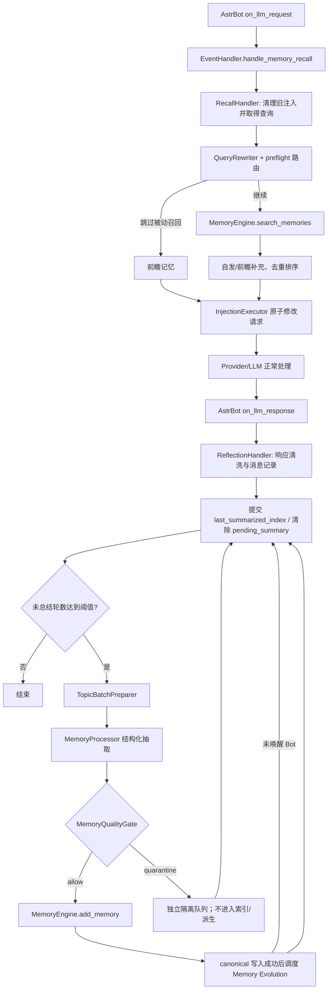

[根级 AGENTS.md](../../AGENTS.md) > [core](../) > **handlers**

# 消息主链处理器

**最后更新：** 2026-07-27
**入口：** `RecallHandler.handle_memory_recall()`、`ReflectionHandler.handle_memory_reflection()`、`ReflectionHandler.maybe_schedule_summary()`
**公开导出：** `RecallHandler`、`ReflectionHandler`

## 职责边界

`core/handlers/` 位于 AstrBot 的 LLM 请求/响应钩子与记忆基础设施之间，负责两条互补链路：

- 请求前：清理旧注入、确定查询、检索长期记忆、路由并原子注入当前 `ProviderRequest`。
- 响应后：先清洗可见回复，再记录 assistant 消息；达到滑动窗口阈值时后台抽取并写入长期记忆。
- 环境群消息：全量捕获成功且消息不会唤醒 Bot 时，也通过共享阈值入口检查并调度反思，不再依赖后续 LLM 响应。
- `TopicBatchPreparer` 只负责为反思链准备消息批次；A/B 策略保持单批次，C/D 才在 LLM 抽取前预切分。

不属于本模块：AstrBot 装饰器注册和群聊全量捕获在 `main.py` / `core/event_handler.py`；实际检索在 `core/retrieval/` 与 `MemoryEngine`；结构化抽取在 [`../processors/AGENTS.md`](../processors/AGENTS.md)；注入路由/执行在 `core/injection/`；持久化由 manager/store 完成。

## 主链与数据流



聊天主链路必须保持：`main.py` 的 `@filter.on_llm_request()` / `@filter.on_llm_response()` 只在插件就绪且 `EventHandler` 存在时委托；处理器不能自行注册钩子，也不能把动态记忆写进长期 System Prompt。群聊用户消息由全量捕获钩子写入；其中 `is_at_or_wake_command=false` 的环境消息落库后调用共享总结入口，唤醒 Bot 的消息继续等待响应钩子；私聊用户消息在召回链写入；assistant 消息在反思链写入。

反思和 `/memora summarize` 必须复用同一个 `MemoryQualityGate`。quarantine 成功表示当前窗口已经安全处理，可以推进滑动窗口；它不算 canonical 写入，也不得调度 Evolution。批量写入中的 `CancelledError` 必须从 `asyncio.gather(return_exceptions=True)` 结果中重新抛出，不能被记为普通部分失败。

## 关键接口与协议

### `RecallHandler`

- `handle_memory_recall(event, req) -> None`：主入口。请求没有 `prompt` 且没有额外用户内容时直接跳过。
- 清理：配置 `recall_engine.auto_remove_injected` 开启时调用 [`../cleaners/AGENTS.md`](../cleaners/AGENTS.md) 中两个清理入口。
- 查询：优先 `event.get_message_str()`；纯 At 等空消息从最近历史构建回退查询。私聊写入请求消息时按 `req.prompt` → 组件提取 → 原始事件文本回退。
- 预算：`EventHandler` 在请求钩子创建 `ExtraLlmBudget`，响应钩子复用同一对象并在结束后移除事件引用；召回、Strategy D、额外反思批次和 persona interpretation 通过 `ContextVar` 共享额度，后台反思任务继承创建时上下文。
- 过滤：`filtering_settings` 决定 session/persona 范围；`get_persona_id()` 解析当前人格。
- 路由：根据 `manual` / `auto` / `hybrid` 配置和 Provider、工具集、上下文余量执行 preflight；只有未短路时才调用 `MemoryEngine.search_memories()`，最终路由只执行一次。
- 候选：主召回可加自发回忆；按稳定 `doc_id` 或来源+内容哈希去重，来源优先级为 prospective > main > spontaneous，再按分数排序并截断 `top_k`。前瞻记忆使用独立辅助预算，不混入普通候选列表。
- Projection：`_safe_candidates()` 仅允许模型看到 `derived_projections[].type/summary/confidence`。类型必须属于四种已声明 Projection，summary 非空，confidence 为有限数并钳制到 `[0,1]`；内部 projection/source ID、revision、scope、privacy、role 和 job 信息全部丢弃。非法 Projection 只被移除，不应连带丢弃 canonical 候选。
- 连续性：只读取当前稳定 session 的待续话题并并入 cognitive context；该内容继续经过既有预算、Prompt 保护和 `InjectionExecutor`，不写 System Prompt 或 canonical。关闭配置时 Tracker 为 `None`，不得恢复或注入。
- 再巩固：启用时只为最高分召回候选调用 `ReconsolidationManager.maybe_propose()` 生成 pending 候选；普通失败降级，任何路径都不得在召回热路径直接写 canonical。
- 注入：`InjectionExecutor` 负责硬字符预算、保护、Provider 传输适配与请求回滚；结果和脱敏计数交给 recorder/metrics。`system_prompt` 必须保持不变。

### `ReflectionHandler`

- `handle_memory_reflection(event, resp) -> None`：只处理 `assistant`；但在 tools、空会话、写阻塞等早退之前，先完成请求关联的可见回复安全清洗。
- `maybe_schedule_summary(event) -> None`：由环境群消息和 assistant 响应共同调用；复用同一阈值、pending 状态、窗口锁与后台存储任务。普通检查失败只降级记录，取消继续传播。
- 工具调用响应 `tools_call_name` 和工具循环总结 `tools_call_extra_content` 不进入普通对话存储。
- 清洗后为空或命中常见 API/限流/连接错误文本时不记录。
- assistant 消息成功写入会话后计算 `unsummarized_rounds = (total_messages - last_summarized_index) // 2`；阈值来自 `reflection_engine.summary_trigger_rounds`。
- `try_begin_summary_window()` / `finish_summary_window()` 是反思与手动提交共享的会话级并发门；同一 session 同时只允许一个总结任务。
- `_storage_task()` 先由 `TopicBatchPreparer` 生成批次，再由 `reflection_llm_budget.py` 按剩余额度合并溢出批次并调用 `MemoryProcessor.process_conversation()`。第 1 批是基础反思，不计额外额度；后续每批各 reservation 一次且固定 `max_retries=1`。LLM 并发受 `max_reflection_parallel_llm_calls` 限制，写入另由 3 槽 semaphore 限流。
- 连续性话题只在 `MemoryQualityGate` allow 且 `MemoryEngine.add_memory()` 成功后标记；quarantine 不标记。窗口全部处理完成后通知 Tracker 收尾，普通 Tracker 失败不得破坏 canonical 写入或聊天主链。
- 每条 `MemoryEngine.add_memory()` 成功返回 canonical 整数 ID 后，由 `MemoryEngine` 从同一 SQLite Store 重新加载 source 并调用 `MemoryEvolutionManager.schedule_consider()`；缺少 manager/source 或调度普通失败只记录并隔离，不能把已经成功的 canonical 写入回滚或标记失败。`ReflectionHandler._schedule_evolution_after_write()` 仍覆盖反思链的兼容调度路径；稳定 idempotency key 使中央调度与该路径重复触发时不会产生重复可见 job。
- `shutdown()` 停止新窗口并等待已登记存储任务，不主动取消正在落库的反思任务。

### `ReflectionTrigger`

- `prepare(event, session_id) -> ReflectionWindowRequest | None`：读取实际消息数、`last_summarized_index`、`pending_summary` 与 `summary_trigger_rounds`，达到阈值时冻结本次 index 范围、读取历史并解析 persona。
- 该类只准备窗口，不创建任务、不持有会话锁、不调用 `MemoryProcessor`；任务所有权仍属于 `ReflectionHandler`。
- assistant 响应与环境群消息必须共用该入口，禁止复制第二套轮次计算、重试耗尽或历史读取逻辑。

### `TopicBatchPreparer`

- `prepare_batches(history_messages, is_group_chat) -> list[list]`。
- 非 C/D 或少于 3 条消息：复制为单批次。
- C：调用 `MemoryEngine.embed_texts` 的相邻向量边界策略；失败回退单批次。
- D：`low_cost` 禁用；`balanced` 仅在显式 `cost_control.allow_llm_topic_strategy_d=true` 时放行，`quality` 由功能门放行，但三者仍必须取得当前请求额度。第一阶段固定单次 Provider 调用；拒绝、失败、零/单话题或无有效行范围均回退单批次。

## 失败、取消与一致性

- **`asyncio.CancelledError` 必须向上传播。** 召回主入口、Provider 获取/能力探测、执行器、决策记录、自发/前瞻检索和反思主入口均有显式重抛路径；不得把关闭取消误记为普通业务失败或保守回退。测试已锁定执行器和 Provider getter 的真实取消传播。
- 额外 LLM Provider 普通失败或取消必须释放未提交 reservation；成功返回后即使 JSON 无效也视为已经使用额度。额度拒绝不得改变候选排序、分数或丢弃反思消息。
- 普通召回异常在钩子边界记录后降级为“不注入”，并始终记录总耗时；可选认知上下文、指标和 recorder 失败彼此隔离。
- 响应保护采用 fail-closed：要求保护却没有有效 scope、scope 查询失败、清洗异常或二次验证失败时，将 `resp.completion_text` 置空并清理事件标记。
- 反思 LLM 任一批次失败时不提交窗口，写 `pending_summary`；部分落库记录成功的幂等键，重试跳过已完成项。
- 自动反思单窗最多读取 `summary_trigger_rounds * 2` 条消息；达到阈值后由同一后台任务按固定高水位串行续跑，待重试窗口保持原始 `end_index`，不得吸收新积压。关闭开始后只允许当前窗口完成，不再拉取下一窗。
- 幂等键由 session、窗口范围、批次/记忆索引和内容 SHA-256 组成。连续失败最多 3 次；达到上限后清除 pending 并推进窗口，明确放弃该范围。
- 所有记忆成功后先推进 `last_summarized_index` 再清 pending；元数据提交失败会再尝试一次，仍失败时存在重复总结风险并记录错误。

## 依赖方向与安全边界

- 上游：`main.py` → `core/event_handler.py` → 本模块。
- 下游：`cleaners`、`extractors`、`processors`、`retrieval`、`injection`、`security`、manager/store。
- 检索结果视为不可信内容；保护 scope 必须与单个请求关联，不得写入决策记录、日志或跨请求复用。
- recorder 只记录路由、预算、耗时和计数；不得记录查询文本、记忆正文、ID 集合或保护 token。
- Projection 元数据是模型可见边界；只扩展三字段 allowlist，禁止把 Store 的 source mapping 或 revision 证据直接透传到 formatter、fake tool call 或 Provider 请求。
- 写入维护状态检查失败时必须按“写入被阻止”处理，不能冒险写入。
- 不要在处理器中复制 Provider 适配、清洗标记识别、持久化事务或抽取 schema；调用对应边界。

## 文件导航

| 文件 | 作用 |
|---|---|
| `recall_handler.py` | 请求前召回、路由、注入、安全关联和可观测性 |
| `reflection_handler.py` | 响应清洗、会话记录、窗口控制、后台抽取与幂等写入 |
| `reflection_candidate_writer.py` | 质量路由后的限流写入、取消传播与单候选终态归一化 |
| `reflection_storage_outcomes.py` | canonical、quarantine、失败与幂等跳过的互斥结果及窗口汇总 |
| `continuity_hooks.py` | canonical 写后话题标记、窗口收尾和只读临时连续性上下文边界 |
| `reflection_llm_budget.py` | 按请求额度拟合反思批次，并执行基础/额外批次的并发与 reservation 协议 |
| `reflection_trigger.py` | 共享反思阈值判断、pending 兼容与窗口参数准备 |
| `topic_batch_preparer.py` | 反思前 C/D 话题预切分及成本回退 |
| `__init__.py` | 仅导出 `RecallHandler`、`ReflectionHandler` |

## 测试定位与验证

核心行为在 `tests/test_handlers.py`；连续性生产装配、canonical 写后边界、session 隔离和状态恢复在 `tests/test_continuity_closed_loop.py`；请求级预算复用、反思批次 reservation 和成本档位在 `tests/test_extra_llm_budget.py`；环境群消息独立触发、唤醒消息分流和失败隔离在 `tests/test_ambient_reflection_trigger.py`；跨模块委托、群聊捕获、演化调度和关闭语义在 `tests/test_event_handler.py`；Projection 可见字段在 `tests/test_recall_projection_metadata.py`；注入路由/保护协定在 `tests/test_injection_router.py`、`tests/test_prompt_sanitizer.py`；真实召回热路径成本契约在 `tests/test_recall_cost_benchmark.py`。

只改本模块时的精确验证命令：

```bash
python -m pytest tests/test_ambient_reflection_trigger.py tests/test_handlers.py tests/test_event_handler.py tests/test_recall_projection_metadata.py tests/test_injection_router.py tests/test_prompt_sanitizer.py tests/test_recall_cost_benchmark.py -q
```

重点回归：请求无候选不得变更请求；System Prompt 保持相等；取消向上传播；响应保护失败关闭输出；同 session 总结窗口互斥；部分写入保留幂等重试状态；关闭等待存储任务。
